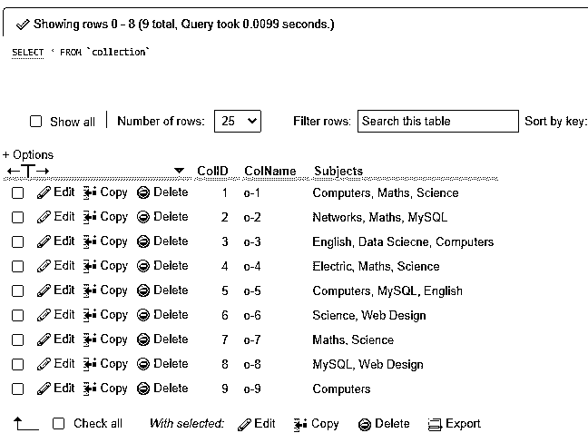
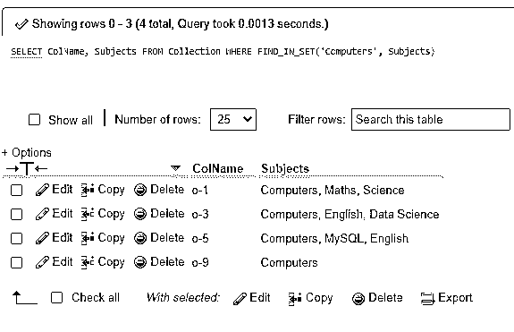
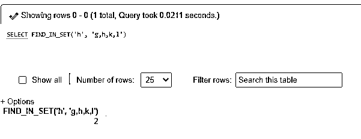
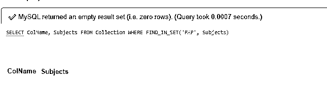
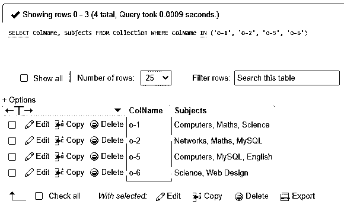
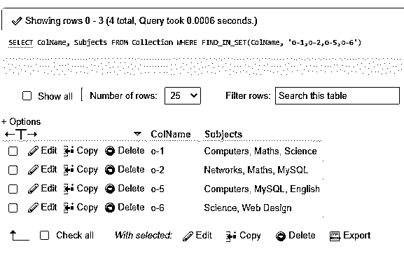

# MySQL FIND_IN_SET()

> 原文：<https://www.educba.com/mysql-find_in_set/>

## MySQL FIND_IN_SET()简介

MySQL FIND_IN_SET()函数是一个内置的 MySQL 字符串函数，它负责发现由逗号分隔的字符串列表中给定的特定字符串的位置。FIND_IN_SET()函数接受两个参数，这两个参数允许第一个值与第二个值匹配，第二个值包含以逗号分隔的子字符串形式的值列表。

一般来说，FIND_IN_SET()函数适用于数据库表中的任何字段，这些字段具有由逗号分隔的值序列。这是因为用户希望将这些值与特定的单个值进行比较。因此，它返回列表中匹配字符串的索引。

<small>Hadoop、数据科学、统计学&其他</small>

### 句法

以下是说明在 MySQL 服务器中使用 FIND_IN_SET()函数的语法结构:

`FIND_IN_SET(string1, stringlist);`

让我们描述 FIND_IN_SET()函数接受的两个给定参数:

*   名为 string1 的初始参数定义了您需要查找的字符串。
*   下一个名为 stringlist 的参数表示要检查的由逗号分隔的字符串列表。

根据函数参数的值，MySQL FIND_IN_SET()将返回值为整数或空值:

*   如果函数的任一参数(即 string1 或 stringlist)的值为空，则函数的结果值为空。
*   如果参数 stringlist 包含一个空字符串，或者 string1 参数不在 stringlist 中，则该函数返回零作为输出值。
*   如果 stringlist 中有 string1 参数，则该函数返回一个正整数值。

但是请注意，如果 string1 由逗号(，)组成，那么 FIND_IN_SET()函数在执行时将无法正常运行。此外，如果 string1 参数是常量字符串，而另一个参数 stringlist 表示类型集列，则 MySQL 服务器实现位算术优化。

### FIND_IN_SET()函数在 MySQL 中是如何工作的？

MySQL 由许多数据库组成，而数据库又由不同的表组成。这些表以不同 MySQL 支持的数据类型的形式保存数据，其中最常用的是整数和字符串。

当一个 MySQL 用户想知道一个特定的字符串是否存在于由逗号(，)符号分隔的特定字符串序列中时，可以使用内置的 MySQL 字符串函数 FIND_IN_SET()。

该函数根据搜索结果提供所需的值。例如，假设我们正在说明下面的查询，以显示该函数在 MySQL 中是如何工作的:

我们将使用下面的语句在字符串列表中搜索子字符串 h，

`SELECT FIND_IN_SET(“h”, “g,h,k,l”);`

这里，我们使用带有 FIND_IN_SET()函数的 SELECT 语句来计算和显示返回值。上述查询的结果为真，因为第一个参数“h”作为第二个参数出现在列表中。因此，函数在执行时将输出正整数 2，因为 FIND_IN_SET()函数的第一个值是在函数的第二个参数中的值列表的第二个索引中找到的，例如“h，k，l”。

类似地，如果我们采用下面的查询，那么该函数返回 0 作为输出值，因为该值不在列表中:

`SELECT FIND_IN_SET(“b”, “g,h,k,l”);`

此外，当我们如下定义查询时，输出为 NULL，因为第二个参数为 NULL:

`SELECT FIND_IN_SET(“h”, NULL);`

因此，我们可以在数据库表提供的特定子字符串列表中定义字符串的位置。

另一方面，MySQL IN 操作符接受任意数量的参数来显示一个值是否与集合中的任意值匹配。

### MySQL FIND_IN_SET()示例

让我们使用 MySQL FIND_IN_SET()来演示一些示例，如下所示:

#### 示例#1

通过 MySQL FIND_IN_SET()函数从表中获取数据的示例:

假设我们使用下面的查询在数据库中创建了一个名为 collection 的表:

`CREATE TABLE IF NOT EXISTS Collection (ColID INT AUTO_INCREMENT PRIMARY KEY, ColName VARCHAR(255) NOT NULL, Subjects VARCHAR(255) NOT NULL);`

另外，让我们在创建的收集表中输入几行记录:

`INSERT INTO Collection (ColName, Subjects) VALUES('o-1','Computers, Maths, Science'),('o-2','Networks, Maths, MySQL'),('o-3',' Computers, English, Data Science'),('o-4','Electric, Maths, Science'),('o-5','Computers, MySQL, English'),('o-6','Science, Web Design'),('o-7','Maths, Science'),('o-8','MySQL, Web Design'),('o-9','Computers');`

显示表格的内容如下:

`SELECT * FROM Collection;`

**输出:**

现在，我们将使用 MySQL 函数 FIND_IN_SET()查找接受数学科目的集合，如下所示:

`SELECT ColName, Subjects FROM Collection WHERE FIND_IN_SET('Computers', Subjects);`

**输出:**

正如您在上面的输出中所看到的，该查询已经从表列 Subjects 的值列表中搜索了字符串 Maths。
寻找一个简单的例子，其输出如下:

`SELECT FIND_IN_SET('h', 'g,h,k,l');`

**输出:**

FIND_IN_SET()函数提供在值序列中找到的第一个参数“h”的位置，作为函数的第二个参数。

#### 实施例 2

MySQL FIND_IN_SET()函数的否定性示例:

考虑到前面的表，如果在列表值中没有找到子串作为第二个参数，当 MySQL 返回 false 时，我们将函数的结果值显示为空。因此，为了否定 MySQL 函数 FIND_IN_SET()，我们将应用 MySQL NOT 运算符。最后，我们将使用 FIND_IN_SET()函数来说明查询示例，该函数还使用 NOT 运算符来搜索与表值中的 PHP 主题不匹配的集合:

`SELECT ColName, Subjects FROM Collection WHERE FIND_IN_SET('PHP', Subjects);`

**输出:**

正如您所看到的，由于在来自列 Subjects 的值列表中，FIND_IN_SET()函数没有找到第一个参数中给出的任何匹配的子字符串，所以没有产生作为集合的输出。

#### 实施例 3

IN 运算符和 FIND_IN_SET()的区别:

IN 运算符定义子字符串是否匹配任何子字符串集合或列表，并且可以接受由逗号分隔的任意数量的参数，如下所示:

`SELECT ColName, Subjects FROM Collection WHERE ColName IN ('o-1', 'o-2', 'o-5', 'o-6');`

**输出:**

类似地，使用 FIND_IN_SET()将产生与查询中相同的输出，但只需要两个参数来显示值与逗号分隔的值列表的匹配:

`SELECT ColName, Subjects FROM Collection WHERE FIND_IN_SET(ColName, 'o-1,o-2,o-5,o-6');`

**输出:**

### 结论

MySQL FIND_IN_SET()函数允许服务器用来检查作为第一个参数的子串是否出现在由第二个参数中的子串组成的值列表中，子串之间用逗号隔开。

当值被搜索时，该函数返回基于这些值的结果，作为 position(如果值存在于列表中)、zero(如果值未被找到)或 NULL(如果任何参数为 NULL)，这对于管理员级别的 MySQL 操作很有帮助。

### 推荐文章

这是 MySQL FIND_IN_SET()的指南。这里我们讨论 FIND_IN_SET()函数在 MySQL 中是如何工作的，以及输出的例子。您也可以看看以下文章，了解更多信息–

1.  [MySQL 列表用户](https://www.educba.com/mysql-list-user/)
2.  [MySQL 位](https://www.educba.com/mysql-bit/)
3.  [MySQL CURDATE](https://www.educba.com/mysql-curdate/)
4.  [MySQL 展示](https://www.educba.com/mysql-show/)

