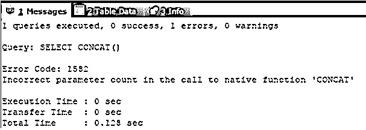
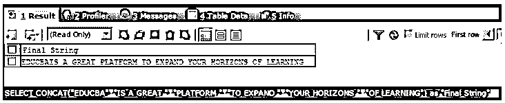
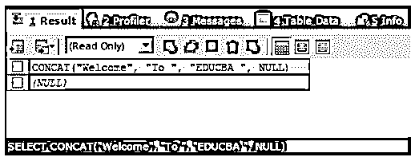
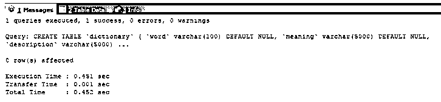
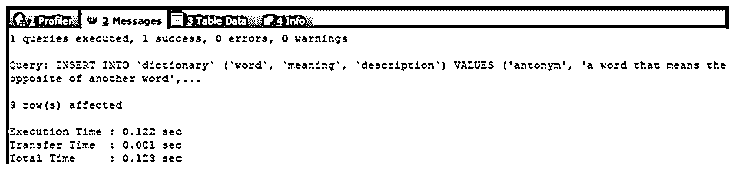
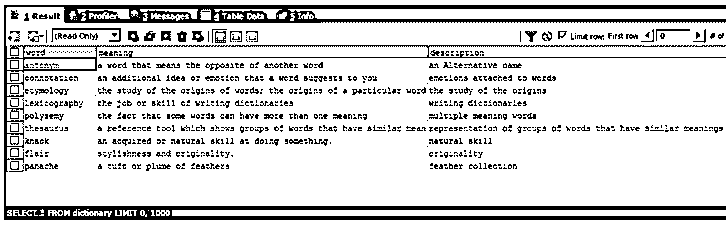
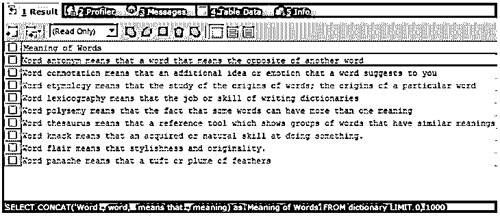
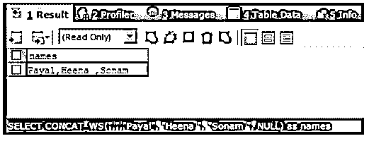

# MySQL Concat

> 原文：<https://www.educba.com/mysql-concat/>

## MySQL Concat 简介

MySQL Concat 函数用于处理数据库中的任意格式的字符串、列值、变量或字符串中的文字值，这有助于将两个或更多这样的字符串值附加到彼此，以创建由该函数返回的新字符串值，该新字符串值是由以附加格式传递给它的所有字符串值组成的结果值，并形成一个大字符串。在本文中，我们将学习如何使用 MySQL Concat 函数连接两个或多个字符串值，研究它的语法和工作原理，并实现几个示例来演示 MySQL 中 Concat 函数的用法。

**Concat 函数的语法和工作方式:**

<small>Hadoop、数据科学、统计学&其他</small>

MySQL 中 Concat 函数的语法定义如下:

`CONCAT(string_expression1,string_expression2, ... );`

我们可以使用 Concat 函数提供我们想要连接的任意多的参数。字符串表达式可以是任何常量或文字字符串值、具有字符串值的变量、存储数据类型为 varchar 的字符串值的列，或者在单引号或双引号中指定的任何字符串值。如果在未指定任何参数值的情况下使用 Concat 函数，将会导致错误。使用 Concat 函数必须至少有一个参数。将任何参数中的空值传递给 Concat 函数都会给出空值本身的结果，而不管还有什么其他值作为参数传递。

### MySQL Concat 示例

让我们首先尝试在不传递任何参数的情况下执行 MySQL Concat 函数，并查看产生的输出。我们将执行以下查询语句

`SELECT CONCAT();`

上述查询语句的执行给出了以下输出–

我们可以从输出中观察到，出现了一个错误，指出向 Concat 函数提供的参数数量不正确。

现在，我们将使用 MySQL 中的 Concat 函数连接字符串值“EDUCBA”、“IS A GREAT”、“PLATFORM”、“TO EXPAND”、“YOUR HORIZONS”和“OF LEARNING”。为此，我们将使用以下查询语句

`SELECT CONCAT("EDUCBA", "IS A GREAT ", "PLATFORM ", "TO EXPAND ", "YOUR HORIZONS ", "OF LEARNING") AS "Final String";`

上述查询语句的执行给出了以下输出:

让我们尝试在 Concat 函数中将 NULL 值作为参数之一的字符串连接起来。我们将尝试使用以下查询连接“Welcome”、“To”、“EDUCBA”和空参数

`SELECT CONCAT("Welcome", "To ", "EDUCBA ", NULL);`

执行上述查询语句会给出以下 NULL 输出，因为即使是单个 NULL 参数也会导致输出字符串为 NULL:

我们甚至可以连接存储在变量和列值中的值。让我们在名为 dictionary 的表上创建一个包含三列的表，即单词、描述和含义。我们将使用下表来创建表格:

`CREATE TABLE `dictionary` (
`word` varchar(100) DEFAULT NULL,
`meaning` varchar(5000) DEFAULT NULL,
`description` varchar(5000) DEFAULT NULL
) ENGINE=InnoDB DEFAULT CHARSET=latin1;`

上述查询语句的执行给出了以下输出:

让我们使用以下查询语句在表中插入一些记录:

`INSERT INTO `dictionary` (`word`, `meaning`, `description`) VALUES
('antonym', 'a word that means the opposite of another word', 'an Alternative name'),
('connotation', 'an additional idea or emotion that a word suggests to you', 'emotions attached to words' ),
('etymology', 'the study of the origins of words; the origins of a particular word', 'the study of the origins'),
('lexicography', 'the job or skill of writing dictionaries', 'writing dictionaries'),
('polysemy','the fact that some words can have more than one meaning', 'multiple meaning words'),
('thesaurus', 'a reference tool which shows groups of words that have similar meanings', 'representation of groups of words that have similar meanings'),
('knack', 'an acquired or natural skill at doing something.', 'natural skill'),
('flair', 'stylishness and originality.', 'originality'),
('panache', 'a tuft or plume of feathers', 'feather collection');`

上述查询语句的执行给出了以下输出:

让我们检索插入的记录:

`SELECT * FROM dictionary;`

给出以下输出:

现在，我们必须连接列值，这样得到的字符串将具有格式单词“单词列字符串”中的字符串，意味着“含义字符串”。我们可以在下面的查询语句中使用 Concat 函数来实现这一点:

`SELECT CONCAT('Word ', word, ' means that ', meaning) AS 'Meaning of Words' FROM dictionary;`

上述查询语句的执行给出了包含预期字符串的以下输出:

**MySQL 中连接字符串的另一种方式:**

MySQL 提供了一个非常简单的工具来连接字符串，指定用单引号或双引号括起来并由空格分隔的字符串，这将自动导致输出成为一个单独的集合字符串，它附加了我们指定的由空格分隔的所有字符串。考虑一个简单的例子，我们想要连接字符串值“GOOD”、“MORNING！”、“有”、“过得好”和“一天！”.为此，我们可以使用简单的 SELECT 语句来检索连接的字符串。我们将使用以下查询语句连接 MySQL 中的字符串:

`SELECT "GOOD"" MORNING!"" HAVE""A NICE"" DAY!";`

上述查询语句的执行会在执行后给出以下输出:

concat_ws 是 MySQL 中提供的函数，可以作为 concat 和普通 select 语句的替代。concat_ws 函数为我们提供了指定分隔符的工具，如果作为参数传递，将忽略空值。语法与 concat 函数相同，第一个参数是分隔符。考虑例子——

`SELECT CONCAT_WS(",","Payal", "Heena ", "Sonam ", NULL) AS NAMES;`

其中逗号是给出以下输出的分隔符:

### 结论

我们可以在 MySQL 中使用简单的 SELECT 语句或 MySQL 中可用的 CONCAT 和 CONCAT_WS 函数来连接字符串。我们需要为 Concat 函数指定至少一个参数，并且注意参数中不能有空值。

### 推荐文章

这是一个 MySQL Concat 的指南。在这里，我们讨论了 Concat 函数的介绍、语法和工作方式，以及不同的示例和它的代码实现。您也可以看看以下文章，了解更多信息–

1.  [MySQL DDL](https://www.educba.com/mysql-ddl/)
2.  [MySQL 案例语句](https://www.educba.com/mysql-case-statement/)
3.  [MySQL 重命名列](https://www.educba.com/mysql-rename-column/)
4.  [授予 MySQL 特权](https://www.educba.com/grant-privileges-mysql/)

