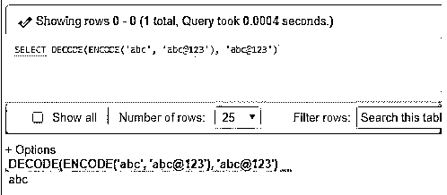
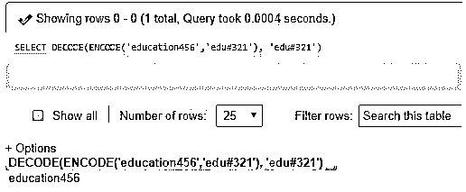
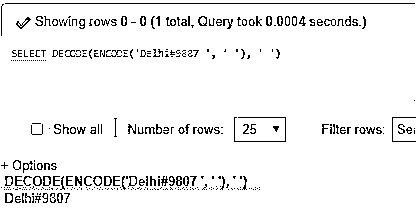
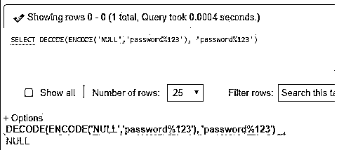
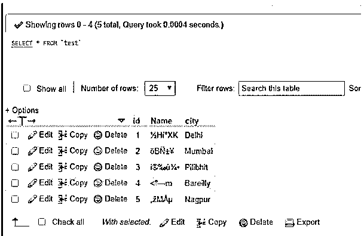
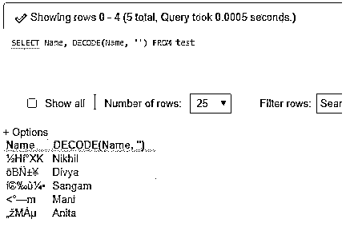

# MySQL 解码()

> 原文：<https://www.educba.com/mysql-decode/>

## MySQL DECODE()简介

众所周知，MySQL DECODE()函数是数据库中用于数据解释的解密类型的函数。这个 MySQL DECODE 函数负责从记录值中解码出加密的字符串部分，然后返回原来的值。此外，如果 DECODE()函数的输入是一个空的编码字符串，那么 MySQL 处理的结果将是空字符串本身。否则，使用 DECODE()函数，我们可以恢复原始字符串，出于安全目的，现在可以使用编码形式。MySQL 中的 DECODE()函数允许对 MySQL 查询补充 if-then-else 语句逻辑。

### 句法

找到下面用于 DECODE()函数的 MySQL 语法:

<small>Hadoop、数据科学、统计学&其他</small>

`DECODE(EncryptedString, PasswordString);`

**说明:**从上面 MySQL DECODE()函数的排列，我们可以说该函数接收两个参数作为实参在 MySQL 数据库上执行解码过程。第一个参数“EncryptedString”定义要解码的编码值字符串，第二个参数即“PasswordString”是用于解码输入以产生输出字符串的密码字符串。这个函数的返回值是编码后存储在数据库记录中的原始字符串。我们使用 DECODE 函数和 SELECT MySQL 语句来执行查询。

### MySQL 中 DECODE()函数是如何工作的？

按照 DECODE()函数语法，函数中使用了两个参数来解码编码值并生成输出。初始参数是要搜索或比较的字符串值，它以加密形式存在，最后一个参数是解码编码字符串的密钥，即密码。

此函数用于逐行比较指定的参数表达式和每个搜索值。在这个过程中，如果发现参数与搜索相同，那么 MySQL 数据库将显示等效的结果。如果不存在匹配，则函数返回默认值。如果缺省值偶然被忽略，那么 MySQL 服务器输出 NULL。

#### DECODE()函数参数

DECODE()函数参数可以如下所示:

*   **数值形式:**在这种类型的参数值中，我们可以包括一个数字，Binary_Float，或者 Binary_Double。如果函数中的第一对搜索结果是 number，那么 MySQL 将匹配所有搜索结果值和初始参数值，以找到其最大的 numeric antecedence，还会隐式地将剩余的参数转换为相同的数据类型，并且以指定的数据类型生成结果。
*   **字符形式:**在这种形式中，搜索和其他参数在字符类型中被提及，其中 MySQL 解码函数借助于非填充的评估语义进行匹配。该表单可以包括任何数据类型的输入，如 VARCHAR2、VARCHAR、NCHAR、CHAR 或 NVARCHAR2。无论第一个搜索参数的数据类型是什么，结果数据类型字符数据类型将与它相似。
*   当第一个数据类型参数为 CHAR 形式或 NULL 值时，服务器结果会将输出值更改为 VARCHAR2 数据类型。
*   因为 DECODE 函数遵循 if-the-else 类型的逻辑循环技术，所以它使用一系列简短的评估，就像在将搜索值与参数进行相对匹配而不是与所有搜索结果进行匹配之前检查搜索值一样。假设，如果前面的搜索与参数相同，则执行完成。
*   根据第一个搜索值，参数的数据类型将被转换，结果也将以相同的数据类型显示在 MySQL DECODE()函数中。
*   DECODE()函数最多可以包含 255 个成分。

### 实现 MySQL DECODE()的示例

我们现在将讨论它在编码数据部分是如何工作的:

#### 示例#1

使用字符串执行 MySQL DECODE()函数

**代码:**

`SELECT DECODE(ENCODE('abc','abc@123'),'abc@123')`

**输出:**

#### 实施例 2

使用字符和数字的组合来执行

**代码:**

`SELECT DECODE(ENCODE('education456','edu#321'), 'edu#321');`

**输出:**

**代码:**

`SELECT DECODE(ENCODE('Delhi#9807',''), '');`

**输出:**

**解释:**当我们在 WAMP phpMyAdmin 上工作时，如果密码为空或未设置，并且如果我们在本地或在线数据库服务器上设置，则我们也可以将 DECODE()函数中的第二个参数设置为空，然后我们需要添加密码字符串。

#### 实施例 3

使用空字符串值执行，该值在压缩过程后返回相同字符串的长度

**代码:**

`SELECT DECODE (ENCODE('NULL','password%123'),' password%123');`

**输出:**

**解释:**在上面的例子中，很明显，我们函数 ENCODE 已经使用当时指定的密码对参数进行了加密，使用 MySQL DECODE()函数，我们现在能够在同一个密码的帮助下接收原始字符串或函数的第一个参数。如果字符串通过函数传递，则函数返回字符数据类型结果。在组合字符和数字的情况下，结果也是相同的格式。同样，对于空输入，解码函数本身产生空值。

#### 实施例 4

带有表列的 MySQL DECODE()函数

让我们把一个样本表看作是“Test ”,它有 ID、Name 和 City 字段，其中 Name 列有编码值。我们在其中插入了一些数据行。我们有如下的表格视图:

要在该表列中执行 DECODE()函数，就像假设 Name then 一样，DECODE()函数查询语句带参数说明如下:

**代码:**

`SELECT Name, DECODE(Name,'') FROM test;`

**输出:**

**解释:**从上面的代码中，我们知道 DECODE()函数应用于表的列“Name ”,结果，查询从数据库中的编码“Name”中检索到了解密的数据行。

### 结论

因此，如果 DECODE()函数在执行时找到匹配项，则获取原始字符串，但如果没有匹配项，则输出 default，但如果不存在 default，则在 MySQL 中提供 NULL 值作为结果。这个 DECODE()函数有助于在需要时撤销加密的公式并接收原始数据。

### 推荐文章

这是 MySQL DECODE()的指南。在这里，我们讨论 MySQL DECODE()函数的介绍，以及适当的语法、工作原理和示例，以便更好地理解。您也可以浏览我们的其他相关文章，了解更多信息——

1.  [MySQL 中的运算符](https://www.educba.com/mysql-in-operator/)
2.  [MySQL 中的汇总](https://www.educba.com/rollup-in-mysql/)
3.  [MySQL 约束](https://www.educba.com/mysql-constraints/)
4.  [MySQL 中的任何一个](https://www.educba.com/any-in-mysql/)

