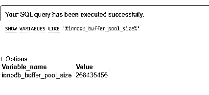

# MySQL innodb_buffer_pool_size

> 原文：<https://www.educba.com/mysql-innodb_buffer_pool_size/>

## MySQL Innodb_buffer_pool_size 简介

MySQL innodb_buffer_pool_size 被称为调优的必要变量之一，尤其是在 innodb 表中。与 MyISAM 表相比，Innodb 表对缓冲区大小更敏感。这里，Innodb_buffer_pool 表示内存空间，它由几个内存中的 Innodb 数据结构、缓冲区、索引、缓存和行数据组成。

通常，我们可以说 MySQL innodb_buffer_pool_size 表示 MySQL 中的配置参数，它表示 MySQL 分配给 innodb_buffer_pool 的内存量。这个设置被认为是 MySQL 服务器中基本的主机配置之一，应该根据可用的系统 RAM 来组织。

<small>Hadoop、数据科学、统计学&其他</small>

### 句法

我们可以通过查询命令显示 MySQL innodb_buffer_pool_size 变量，语法如下:

`SELECT @@innodb_buffer_pool_size;`

在主流服务器中，用户可以通过以下命令查询查看 MySQL innodb_buffer_pool_size 的默认值:

`SHOW VARIABLES LIKE ‘%innodb_buffer_pool_size%’;`

建议缓冲池应该能够容纳整个数据库，但是当我们研究实际场景时，这可能并不总是可能的。因此，将现有服务器总内存的 75-80%分配给 innodb_buffer_pool_size 也是更好的选择。

我们还可以通过以下代码设置 innodb_buffer_pool_size 变量的值，该变量可以在 MySQL 5.7 中进行在线配置:

`SET GLOBAL innodb_buffer_pool_size = (value(in bytes));`

请注意，在进行任何更改之前，应该注意在线设置上述变量的值。因为如果重新启动服务器，该配置值可能会丢失。因此，您可以跟踪这些更改，如果服务器恢复运行，那么可以在名为 my.cnf 的配置文件中设置该值。

在 MySQL 5.7 之前的版本中，配置可以离线完成。也可以通过编辑配置文件 my.cnf 来修改变量值。为此，打开该文件，然后编辑代码部分[mysqld]下的以下代码行，并保存该文件:

`Innodb_buffer_pool_size = X G;`

现在，您可以重新启动服务器 MySQL，运行以下命令来检查新配置集的值:

`SHOW VARIABLES LIKE ‘%innodb_buffer_pool-size%’;`

对于在线流程使用:

`SET GLOBAL innodb_buffer_pool_size = 26843545600;`

对于离线流程使用:

`innodb_buffer_pool_size = 26G`

***** 对于这两个过程，都需要重启服务器。

### MySQL 中的 innodb_buffer_pool_size 函数是如何工作的？

1.  一般来说，缓存是计算的一个重要部分，因为大部分内存都用于访问计算机最常用的数据。但这取决于要访问的数据量；在磁盘上检索数据可能要慢 100 到 100，000 倍。
2.  MyISAM 使用操作系统文件系统缓存来缓存数据库数据，其中的查询被反复读取。另一方面，Innodb 实现了一个完全不同的概念。在这种情况下，Innodb 不再信任操作系统来执行正确的操作，而是在 Innodb_buffer_pool 中自行缓存。
3.  对于大数据集，MyISAM 可以使用默认的 key_buffer_size 来执行 OK，但随后将使用默认的 innodb_buffer_size 来对其进行爬网。Innodb 缓冲池存储索引页和数据；因此，您不需要为操作系统缓存留出空闲空间，因此高达 70-80%的内存值经常成为 Innodb 纯数据库安装的逻辑。
4.  这里应用了与 key_buffer 相同的规则——当有一个小的数据集，并且它不会剧烈增长时，那么就没有必要增大变量 innodb_buffer_size，所以最好实现内存存在。
5.  我们了解到，MySQL innodb_buffer_pool 不仅仅是一个缓存，它实际上还能帮助进行下面列出的多种判断:

*   它的大部分用于“数据缓存”过程。
*   它共享一个类似的缓冲池，用于“索引缓存”
*   修改或 sat 脏数据在刷新之前驻留在“缓冲”中。
*   InnoDB 缓冲池还存储内部结构，如行锁或散列索引。

### MySQL innodb_buffer_pool_size 示例

由于 MySQL innodb_buffer_pool_size 表示服务器中的总缓存，因此为了根据系统 RAM 大小设置该系统变量值，我们将介绍以下两种策略，并说明每种策略的优缺点:

**战术 1:经验法则法**

它定义了将变量 innodb_buffer_pool_size 的值设置为可用系统 RAM 空间的 70-80%的常见做法。这种方法在许多情况下性能更好，但并不是在所有配置中都是最佳的，因为它不能完全控制大容量 RAM 或将其用于缓存。

**战术 2:更细致入微的方法**

在这里，我们将了解 InnoDB 缓冲池及其协作的内部情况，甚至在名为《高性能 MySQL》的书中也有定义。

以下是计算 MySQL innodb_buffer_pool_size 变量的方法:

*   最初，从内存总量开始。
*   减去所有操作系统要求的适当数量。
*   减去所有 MySQL 需求的适当数量，比如许多 MySQL 缓冲区、连接池、复制链接缓冲区和临时表。
*   将输出除以 150%是调节缓冲池本身所需的上述估计值。

让我们讨论一些使用 MySQL innodb_buffer_pool_size 变量查询的演示及其在 MySQL server 中的使用:

您可以在服务器的 information_schema 数据库中运行以下代码来查看 innodb_buffer_pool_size 值:

`SELECT @@innodb_buffer_pool_size;`

**输出:**

要在现有服务器中显示默认的 innodb_buffer_pool_size 值:

`SHOW VARIABLES LIKE '%innodb_buffer_pool_size%';`

**输出:**

### 结论

MySQL innodb_buffer_pool_size 是整个 MySQL 服务器的一个重要变量，它在过去几年中为 innodb 存储引擎结构带来了根本性的发展。Oracle 收购 MySQL 后，Innodb 存储引擎的地位比 MyISAM 提高了几倍。由于其酸性服从属性，尽管 MySQL 维护其他各种可插拔存储引擎是很重要的。MySQL 5.7 中最新的增强功能名为 online innodb_buffer_pool_size 的配置，这使得它非常灵活，有助于获得最佳性能，并且不会导致长时间停机。

### 推荐文章

这是一个 MySQL innodb_buffer_pool_size 的指南。这里我们用例子讨论 innodb_buffer_pool_size 函数在 MySQL 中是如何工作的。您也可以看看以下文章，了解更多信息–

1.  [MySQL Hour()](https://www.educba.com/mysql-hour/)
2.  [MySQL 行](https://www.educba.com/mysql-row/)
3.  [MySQL 基数](https://www.educba.com/mysql-cardinality/)
4.  [MySQL 位](https://www.educba.com/mysql-bit/)

