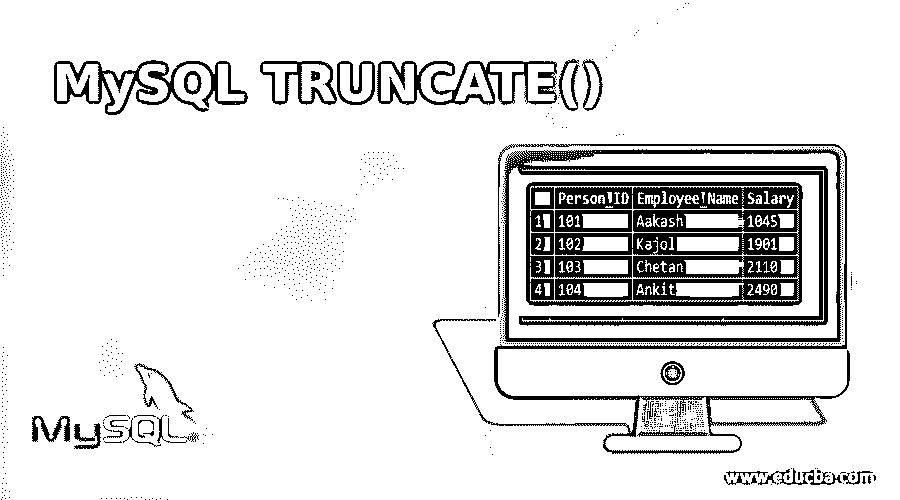
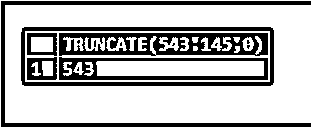
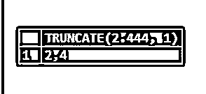
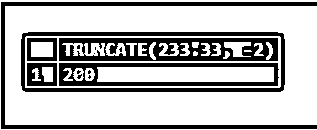
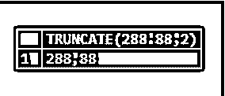
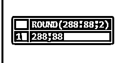
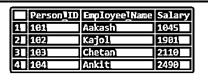
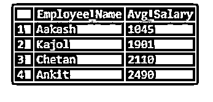

# MySQL TRUNCATE()

> 原文：<https://www.educba.com/mysql-truncate/>

## MySQL TRUNCATE()的定义

MySQL TRUNCATE()函数被指定为在将一个文字数字修剪到查询中提到的特定小数位数后返回该数字。要截断的数字和小数位数表示为 TRUNCATE()函数的变量或参数。对于这个函数，我们使用两个组件:一个是数值表达式，它将被截断到 TRUNCATE()函数中给出的第二个参数所定义的数字，另一个是一个数字，它指示第一个数字将被截断到多少个小数位。为了执行基于 TRUNCATE()函数的 SQL 语句，我们需要添加两个参数。

**语法:**

<small>Hadoop、数据科学、统计学&其他</small>

MySQL 中指定了以下语法来找出 TRUNCATE()函数的结果数。

`TRUNCATE(Any_Number,Decimal_Value)`

上述函数语法中使用的参数简述如下:

*   **Any_Number:** 表示用于截断功能的数字。
*   **Decimal_Value:** 表示截断 Any_Number 参数所需的小数位数。

如果函数的第二个参数 Decimal_Value 为负，则该函数会使 Any_Number 小数点左边的 Decimal_Value 位数为零。因此，一旦 Decimal _ Valueis 为零，则结果值中没有小数部分。

### MySQL 中 TRUNCATE()函数是如何工作的？

假设我们有一个描述 TRUNCATE()函数的 SQL 语句，如下所示:

`SELECT TRUNCATE(543.145,0);`

返回的值是截断为 0 个小数位的数值表达式。MySQL 支持这个 MySQL TRUNCATE()函数，它负责将一个数字修剪到特定的小数位数。

而对于 Oracle 和 PostgreSQL，我们必须使用 TRUNC()函数来提供与 TRUNCATE()函数相同的功能。但是，对于 SQL Server，ROUND()函数与函数中定义截断过程的第三个参数一起使用。语法表示为 ROUND(Num，Dec，f)。如果 f 参数不为零，则 ROUND()函数执行小数点后的 Dec 数，并在执行时舍入 Num 数以返回所需的值。

### 在 MySQL 中实现 TRUNCATE()的示例

让我们通过使用 MySQL 中的 TRUNCATE()函数来考虑以下示例:

#### 1.具有正小数位数的 MySQL TRUNCATE()函数

假设我们使用下面的查询语句来执行 TRUNCATE()函数:

`SELECT TRUNCATE(2.444, 1);`

这里，我们看到由于第二个参数(即小数位数)是 1，所以 TRUNCATE()函数生成的值只有一个小数点。

#### 2.具有负小数位数的 MySQL TRUNCATE()函数

下面的 SQL 语句显示了如何添加 TRUNCATE()函数具有负数的小数位数。

SQL 查询是:

`SELECT TRUNCATE(233.33, -2);`

这里，从上面的语句中，我们可以明确 TRUNCATE()函数导致了文字数 233.33 的小数点左边的负数位数，使得变为零。因此，当(-2)部分为 0 时，结果值没有小数部分。

#### 3.MySQL TRUNCATE()函数和 ROUND()函数的比较

我们选择了两个 SQL 语句来应用 TRUNCATE() & ROUND()MySQL 函数，并显示了两个函数结果之间的差异。

让我们考虑如下例子:

`SELECT TRUNCATE(288.88,2);`

`SELECT ROUND(288.88,2);`

我们现在可以认为 ROUND()函数表示被舍入的返回值，TRUNCATE()函数表示被修整到小数位的返回值，如上面的 SQL 查询中所提到的。

#### 4.表列中使用的 MySQL TRUNCATE()函数

TRUNCATE()函数显示添加了 SQL 语句以及 SELECT、GROUP BY、ORDER BY 子句和 INNER JOIN like SQL 关键字时列值的修整值。

让我们考虑下面的语句来创建两个表作为样本表，以便进一步处理:

**人员表查询:**

`CREATE TABLE Person(Person_ID INT NOT NULL PRIMARY KEY, Person_Name varchar(255)NOT NULL, Person_Address varchar(255)NOT NULL);`

**员工表查询:**

`CREATE TABLE Employee (Person_ID INT NOT NULL PRIMARY KEY, Employee_Name varchar(255)NOT NULL, Salary INT NOT NULL);`

之后，让我们用下面的 SQL 查询在两个表中插入一些值:

`INSERT INTO Person (Person_ID, Person_Name, Person_Address) VALUES
('101', 'Aakash', 'Delhi'),
('102', 'Kajol', 'Mumbai'),
('103', 'Chetan', 'Pune'),
('104', 'Ankit', 'Goa');
INSERT INTO Employee (Person_ID, Employee_Name, Salary) VALUES
('101', 'Aakash', '1045.234'),
('102', 'Kajol', '1901.123'),
('103', 'Chetan', '2110.456'),
('104', 'Ankit', '2490.246');
select * from Employee;`

`select * from Person;`

在输入了几条记录之后，让我们转向与 TRUNCATE()函数的执行相关的查询。

下面是 SQL 查询:

`SELECT Employee_Name, TRUNCATE(AVG (Salary),0)Avg_Salary FROM Employee a
INNER JOIN Person b ON b.Person_ID = a.Person_ID GROUP BY Person_Name ORDER BY Avg_Salary;`

在上图中，我们使用了 TRUNCATE()函数从表的 average salary 列中删除小数点后的所有数字。

因此，当我们需要将数据库表的特定列中的数值截断为某个小数数值时，TRUNCATE()可能有助于生成结果集。它为我们提供整数作为回报，以获取所需的行。

#### 5.MySQL 截断和其他一些例子

我们还有一些例子来解释 TRUNCATE()函数及其在 MySQL 中修剪数字的特定小数位数的重要性。

`SELECT TRUNCATE(251.315, -2);`

上面的 MySQL 语句通过将 251.315 截断到小数点后 1 位来返回值。

`SELECT TRUNCATE(-251.315, 0);`

`SELECT TRUNCATE(478.231, 0);`

因此，TRUNCATE()函数返回截断到给定小数位的数字。如果 TRUNCATE()函数的小数位值或参数被跳过，那么要截断的数字将被修剪为 0 个分数。记住 TRUNCATE()函数的第二个参数应该是正整数或负整数。

### 结论

如果我们注意到 TRUNCATE()函数的工作方式类似于 MySQL ROUND()函数，只是减少了小数位数。但是这个函数不负责像 ROUND()函数那样执行任何类型的舍入结果。为了清楚起见，我们可以得出结论，MySQL TRUNACATE()有助于修整小数位数，但 ROUND()函数执行舍入过程。

### 推荐文章

这是 MySQL TRUNCATE()的指南。这里我们也讨论一下 truncate()函数在 mysql 中的定义和工作原理？以及不同的示例及其代码实现。您也可以看看以下文章，了解更多信息–

1.  [MySQL 中的运算符](https://www.educba.com/mysql-in-operator/)
2.  [MySQL 中的唯一键](https://www.educba.com/unique-key-in-mysql/)
3.  [MySQL 子查询](https://www.educba.com/mysql-subquery/)
4.  [MySQL 中的汇总](https://www.educba.com/rollup-in-mysql/)

