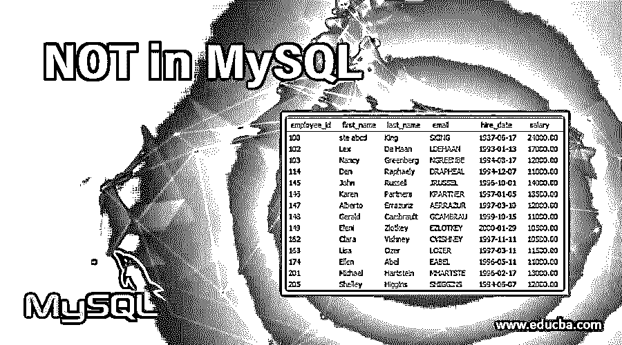
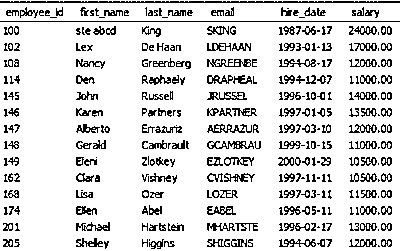
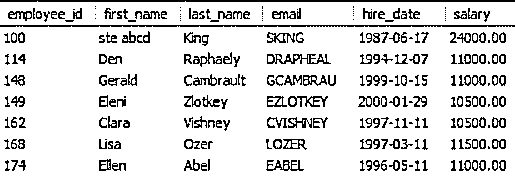
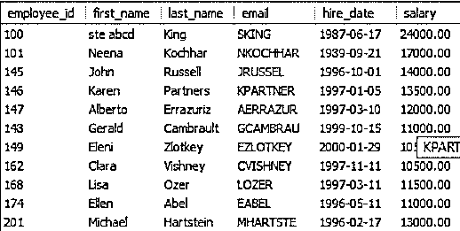
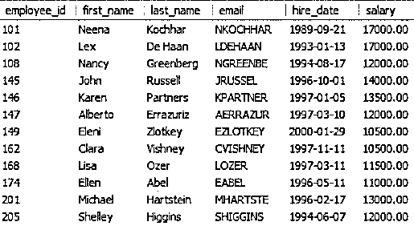
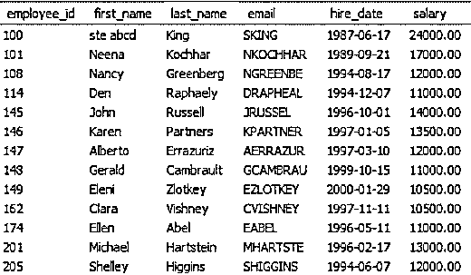

# 不在 MySQL 中

> 原文：<https://www.educba.com/not-in-mysql/>

## 不在 MySQL 中概述

' NOT '是 MySQL 中的一个运算符，多与数据查询语言一起使用。这种语言包括从数据库中获取记录的 SELECT 命令以及许多子句，如 WHERE、BETWEEN、like、IN 等。这些子句用于定义许多条件或条件值范围，以过滤出我们需要的记录。下面是每个操作符的描述和语法。

| **操作员** | **描述** | **语法** |
| **其中** | 用于给出检索记录的条件。 | SELECT employee _ id FROM employee
WHERE name = ' Stella '； |
| **之间** | 该运算符选择给定范围内的记录。我们通常在想要指定日期范围时使用它。 | SELECT emp_id FROM employee
其中 emp_id 介于 EN 1 和 10 之间； |
| SELECT * FROM employee
WHERE join _ date 介于“2007-01-01”和“2008-01-01”之间； |
| 中的 | 这个操作符允许我们在 WHERE 子句中指定多个值。 | SELECT * FROM employee
其中 employee_id IN (1001，1004，1008，1012)； |
| **喜欢** | 该运算符与 WHERE 子句一起使用，在包含字符串的列中搜索指定的模式。

<small>Hadoop、数据科学、统计学&其他</small>

*   **[a%]-** The string starts with a
*   **' & a'-** ends with a
*   **'% a%'-** A will be in the string
*   The second letter here between **' _ a%'-** will be a

 | 从表
中选择名字，其中名字类似于“A %”； |

### MySQL 中 NOT 的语法

与所有其他运算符“NOT”。

**语法#1:**

`SELECT employee_id FROM employee
WHERE name IS NOT ‘stella’;`

运筹学

`SELECT employee_id FROM employee
WHERE name **<>** ‘stella’;`

在这里，它将获取除名称为“stella”的记录之外的所有记录。

**语法#2:**

`SELECT emp_id FROM employee
WHERE emp_id NOT BETWEEN 1 AND 10;`

这里，它将获取 id 不在 1 到 10 之间的所有 emp_id

**语法#3:**

`SELECT * FROM employee
WHERE employee_id NOT IN (1001,1004,1008,1012);`

在这里，它将获取除 1001、1004、1008 和 1012 之外的所有 employee_id。

**语法#4:**

`SELECT * FROM employee
WHERE first_name NOT LIKE ‘A%’;`

它将获取名字的第一个字母不是以 a 开头的记录。

### MySQL 中的 NOT 条件是如何工作的？

下面我们将讨论一些小例子来说明这个 NOT 操作符在 MySQL 中是如何工作的。

让我们创建一个具有以下属性的水果表。

| **产品名称** | **价格** |
| **苹果** | Twenty |
| **橙色** | Twenty-five |
| **葡萄** | Thirty |
| **香蕉** | Twenty-two |
| **石榴** | Twenty-eight |
| **番石榴** | Thirty-five |
| **猕猴桃** | Fifty |

#### 1.With WHERE 子句

**查询:**

`SELECT * FROM fruit
WHERE product_name IS NOT ‘Apple;`

**输出:**

| **产品名称** | **价格** |
| **橙色** | Twenty-five |
| **葡萄** | Thirty |
| **香蕉** | Twenty-two |
| **石榴** | Twenty-eight |
| **番石榴** | Thirty-five |
| **猕猴桃** | Fifty |

#### 2.With BETWEEN 运算符

**查询:**

`SELECT * FROM fruit
WHERE Price NOT BETWEEN 20 AND 30;`

它将在表中查找那些价格不在 20 到 30 之间的特定记录。如前所述，运营商之间的这种情况是一种包容性的情况，它不会同时包括 20 和 30。

**输出:**

| **产品名称** | **价格** |
| **番石榴** | Thirty-five |
| **猕猴桃** | Fifty |

#### 3.在运算符内

**查询:**

`SELECT * FROM fruit
WHERE price NOT IN (25,30,50);`

**输出:**

| **产品名称** | **价格** |
| **苹果** | Twenty |
| **香蕉** | Twenty-two |
| **石榴** | Twenty-eight |
| **番石榴** | Thirty-five |

#### 4.使用相似运算符

**查询:**

`SELECT * FROM fruit
WHERE product_name NOT LIKE ‘G%’;`

**输出:**

| **产品名称** | **价格** |
| **苹果** | Twenty |
| **橙色** | Twenty-five |
| **香蕉** | Twenty-two |
| **石榴** | Twenty-eight |
| **猕猴桃** | Fifty |

### 在 MySQL 中实现 NOT 条件的例子

在这里，我们将创建另一个具有以下属性的表“employee”。

| **员工 id** | **名字** | **姓氏** | **电子邮件** | **雇佣日期** | **工资** |
| **100** | seabcd | 国王 | 滑雪 | 1987-06-17 | Twenty-four thousand |
| **101** | 妮娜 | 科赫哈尔 | 恩科奇哈尔 | 1989-09-21 | Seventeen thousand |
| **102** | 法律 | 德哈恩 | 德哈安 | 1993-01-13 | Seventeen thousand |
| **108** | 南茜 | 格林伯格 | 绿色床 | 1994-08-17 | Twelve thousand |
| **114** | 那个人 | 拉斐尔 | 德拉菲尔 | 1994-12-07 | Eleven thousand |
| **145** | 约翰 | 罗素 | 布鲁塞尔 | 1996-10-01 | Fourteen thousand |
| **146** | 克伦人 | 伙伴 | 合作伙伴 | 1997-01-05 | Thirteen thousand five hundred |
| **147** | 【男性名字】阿尔佩托 | 埃拉苏里兹 | 阿尔拉祖尔 | 1997-03-10 | Twelve thousand |
| **148** | 杰拉尔德(男子名ˌ义为勇敢的战士) | 坎布劳 | GCAMBRAU | 1999-10-15 | Eleven thousand |
| **149** | 埃莱妮 | 兹洛特基 | EZLOTKEY | 2000-01-29 | Ten thousand five hundred |
| **162** | [人名]克莱拉 | 维什尼 | CVISHNEY | 1997-11-11 | Ten thousand five hundred |
| **168** | elizabeth 的昵称 | 奥兹国 | 失败者 | 1997-03-11 | Eleven thousand five hundred |
| **174** | 埃伦 | 亚伯 | 标签 | 1996-05-11 | Eleven thousand |
| **201** | 迈克尔 | 哈蒂斯廷 | 艺术家 | 1996-02-17 | Thirteen thousand |
| **205** | 雪莱 | [人名]希金斯 | 希金斯 | 1994-06-07 | Twelve thousand |

#### 示例#1

它将获取除名字为 Neena 的记录之外的记录。

**查询:**

`SELECT * FROM employees
WHERE first_name <> 'Neena';`

**输出:**

#### 实施例 2

这样会排除工资在 12000 到 20000 之间的记录。

**查询:**

`SELECT * FROM employee
WHERE salary NOT BETWEEN 12000 AND 20000;`

**输出:**

#### 实施例 3

这将排除雇用日期在 1992-1-1 到 1995-1-1 之间的记录。

**查询:**

`SELECT * FROM employee
WHERE hire_date NOT BETWEEN ‘1992-1-1’ AND ‘1995-1-1’;`

**输出:**

#### 实施例 4

**查询:**

`SELECT * FROM employees
WHERE employee_id NOT IN (100,114,148);`

**输出:**

#### 实施例 5

**查询:**

`SELECT * FROM employee
WHERE first_name NOT LIKE ‘L%’;`

**输出:**

### 结论

这个操作符基本上否定了 SELECT、INSERT、UPDATE 和 DELETE 语句中的条件。这个条件要求必须满足与条件相反的条件。当我们用 SELECT 命令执行这些示例时，以同样的方式，我们可以将这个操作符用于其他 SQL 命令。INSERT 用于插入新行，UPDATE 用于更新表，DELETE 用于从表中删除行。

### 推荐文章

这是一个不在 MySQL 中的指南。这里我们讨论在 MySQL 中实现 NOT 条件的语法、工作原理和各种例子。您也可以阅读以下文章，了解更多信息——

1.  [MySQL 查询的类型](https://www.educba.com/mysql-queries/)
2.  [不同 SQL 关键字的列表](https://www.educba.com/sql-keywords/)
3.  【MySQL 与 SQLite 的区别
4.  [PostgreSQL WHERE 子句|前 9 个运算符](https://www.educba.com/postgresql-where-clause/)

