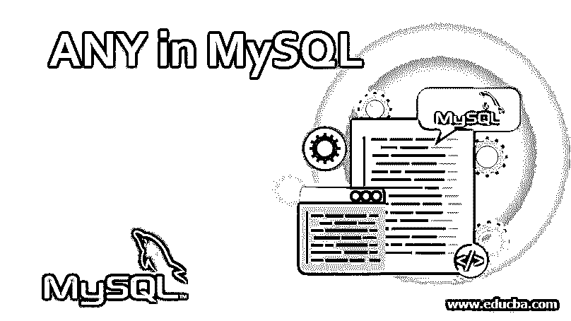
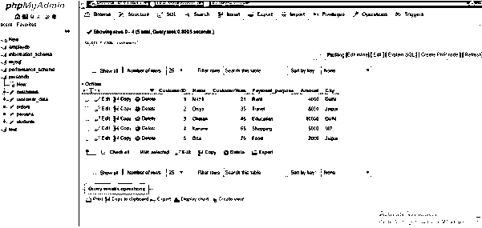
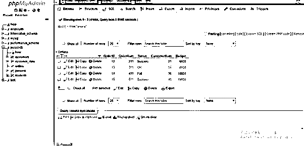
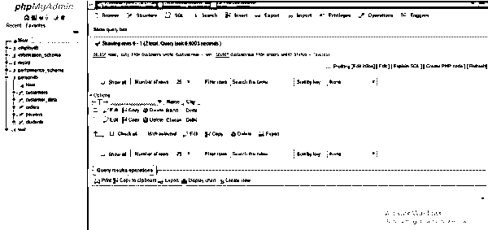
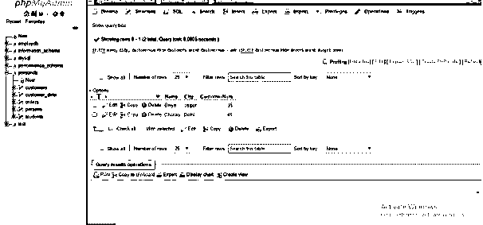

# MySQL 中的任何

> 原文：<https://www.educba.com/any-in-mysql/>

## MySQL 中的 ANY 简介

ANY 是一个 MySQL 运算符，如果在执行 SQL 查询时满足 MySQL 中的任何子查询条件，它将返回 true 值。但是，所有 SQL 操作符都与任何操作符相关，但是如果 MySQL 中的条件满足所有子查询值，则返回 true。基本上，MySQL 引入了一些特殊的字符或单词来帮助执行特定的操作或更多操作。我们可以使用 SQL 操作符和操作数来生成 SQL 语句代码，以包含特定的条件或执行特定的操作。因此，像其他操作符一样，MySQL 中的 ANY 操作符也用于管理 SQL 语句查询中的临时表达式，以满足基准并提供具有真值的结果集。

### 句法

*   以下是 MySQL 中使用的 ANY 运算符的基本语法:

`SELECT Column1 [Column2,..] FROM TableA WHERE Column2 Operator ANY (SELECT Column2 FROM TableB WHERE condition);`

<small>Hadoop、数据科学、统计学&其他</small>

*   我们可以在下面的查询中使用 All SQL 运算符:

`SELECT Column1 [Column2,..] FROM TableA WHERE Column2 Operator ALL (SELECT Column2 FROM TableB WHERE condition);`

*   请记住，这里使用的 SQL 操作符应该是 MySQL 中常用的比较操作符的典型代表，如、=、！=，<>，<=, > =。

### MySQL 中的任何操作符都是如何工作的？

通常，在带有 ANY 和比较运算符的 MySQL 操作中，我们有以下语法:

`Operand ComparisonOperator ANY (Subquery);`

*   因为如果条件为 true，则任何运算符都应返回 true，所以 ANY SQL 关键字应跟踪比较运算符，以及子查询结果在列中提供的任何值的比较是否有效。
*   为了说明，让我们考虑下面的陈述:

`SELECT K1 FROM Q1 WHERE K1 > ANY (SELECT K1 FROM Q2);`

*   假设 Q1 表中存在一个值为(11)的字段行，如果 Q2 表中存在比 11 至少小一的值，例如(30，12，8)，则 ANY 运算符将从表达式中返回 TRUE。在这里，条件将被满足，因为在 Q2，值 8 是可用的，它比在 Q1 的 11 小，所以 ANY 关键字将产生 TRUE 值。
*   但是假设 Q2 包括(30，12，31)，那么子查询的值都不会小于 Q1 值，因此 ANY 运算符将显示 FALSE，因为不满足条件表达式。此外，如果 Q2 持有空值，如(NULL，NULL，NULL)，那么表达式将是未知的*。*
*   MySQL 中的关键字 IN 与 query 语句中的子查询一起使用时，用作= ANY 的代号(别名)。因此，我们可以说下面两条 SQL 语句在 MySQL 中是相同的；

**代码:**

`SELECT K1 FROM Q1 WHERE K1 = ANY (SELECT K1 FROM Q2);
SELECT K1 FROM Q1 WHERE K1 IN (SELECT K1 FROM Q2);`

*   但是当我们使用表达式列表时，我们不能说在 SQL 中 operator 和= ANY operator 关键字是同义词，因为 IN 接受表达式列表，而= ANY 不能。
*   同样，NOT IN 不能是任何操作员的别名或指定名称，但可以用于所有操作员。
*   MySQL 中的关键字 SOME 是任何关键字的别名，因此 SQL 代码的两个声明是等效的:

**代码:**

`SELECT K1 FROM Q1 WHERE K1 <> ANY (SELECT K1 FROM Q2);
SELECT K1 FROM Q1 WHERE K1 <> SOME (SELECT K1 FROM Q2);`

*   我们可以在标量中使用表查询，任何，某些子查询的条件是给出的表只包含一列。理解如果上表中的 Q2 只有一列，那么上面的 SQL 语句可以重写如下:

**代码:**

`SELECT K1 FROM Q1 WHERE K1 > ANY (Table Q2);`

**//(从 Q2 选择 K1)替换为表 Q2**

**代码:**

`SELECT K1 FROM Q1 WHERE K1 = ANY (Table Q2);
SELECT K1 FROM Q1 WHERE K1 IN (Table Q2);
SELECT K1 FROM Q1 WHERE K1 <> ANY (Table Q2);
SELECT K1 FROM Q1 WHERE K1 <> SOME (Table Q2);`

*   记住<>操作符定义了 SQL 语法的真正含义，表明几乎有一些值不等于条件，但不是所有的值。

### 在 MySQL 中实现 ANY 的示例

让我们展示一些示例，并以一些名为“Customers”和“Orders”的表为例，使用任何关键字执行 SQL 查询:

#### 1.客户表

#### 2.订单表

1.  **ANY with = operator**

**代码:**

`SELECT Name, City FROM Customers WHERE CustomerNum = ANY (SELECT CustomerNum FROM Orders WHERE STATUS = 'Success');`

**输出:**

2.  **任何带有>的操作符**

**代码:**

`SELECT Name, City, CustomerNum FROM Customers WHERE CustomerNum = ANY (SELECT CustomerNum FROM Orders WHERE Budget>8000);`

**输出:**

### 在 MySQL 中使用任何操作符的优势

*   ANY 是 MySQL 中的一种逻辑运算符，它返回布尔值作为 SQL 查询的结果。它用于选择 select 语句的任何或某些元组。
*   ANY 运算符允许将表的值与子查询条件提供的结果列表或行中的每个值进行比较。在这之后，ANY 关键字如果找到与内部查询的至少一个值或行匹配的任何值，那么它给出 TRUE 作为结果。
*   因此，在 MySQL 中，ANY 运算符前面应该有比较运算符。因此，如果执行任何内部查询来满足条件，ANY 运算符将返回 TRUE。
*   ANY 关键字可用于提供结果，该结果是一个表中与另一个表中的任何记录相匹配或具有任何记录的不同列值。
*   您可以使用带有 SELECT 和 WHERE 关键字以及 out 条件的任何运算符来执行许多不同类型的比较，以匹配两个表的组合并提供所需的结果。
*   如果一个表中存在满足特定条件的任何值，那么获得结果是很有帮助的，该特定条件显示匹配的值。

### 结论

MySQL 中的 ANY 运算符用于从 SQL 语法中过滤结果集，前提是任何值满足条件，否则显示 false。与 MySQL 中的其他不同操作符一样，ANY 关键字也是一个与比较操作符一起使用的操作符，通过比较 SQL 表达式中的子查询结果和操作数，可以得到不同的结果。我希望你喜欢这篇文章，并学到了一些新的观点。

### 推荐文章

这是一个指南，任何在 MySQL。在这里，我们讨论语法，它是如何工作的例子，以实现正确的代码和输出以及使用的优势。您也可以浏览我们的其他相关文章，了解更多信息——

1.  [MySQL 外部连接](https://www.educba.com/mysql-outer-join/)
2.  [MySQL 中的 ORDER BY](https://www.educba.com/order-by-in-mysql/)
3.  [MySQL 子查询|类型和示例](https://www.educba.com/mysql-subquery/)
4.  MySQL 时间戳|如何工作？
5.  [MySQL 中 IF 语句指南](https://www.educba.com/if-statement-in-mysql/)

