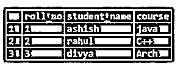
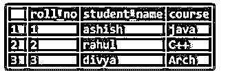
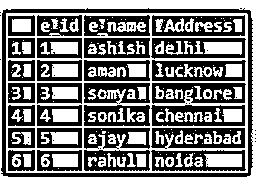
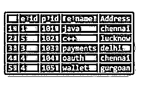
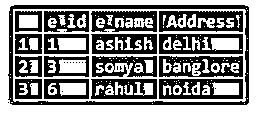
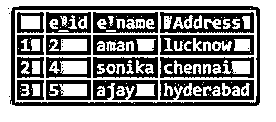
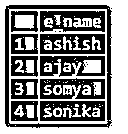
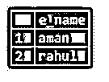

# MySQL 不在

> 原文：<https://www.educba.com/mysql-not-in/>

## MySQL 简介不在

MySQL NOT IN function 用作子查询语句，保证给定的表达式不包含任何作为参数在函数中传递的值。MySQL NOT IN 子句用于从表中选择与 NOT IN 函数中传递的值不匹配的所有记录或行。它基本上消除了包含与函数中传递的值相匹配的值的所有记录或行，只打印那些不匹配的记录。

**语法:**

<small>Hadoop、数据科学、统计学&其他</small>

`Expression NOT IN (value1, value2, value3……valuen)`

### 在 WHERE 子句中使用 MySQL NOT IN 关键字

当 where 子句与 MySQL 语句中的 NOT IN 关键字一起使用时，它不会影响与作为参数提供给 NOT IN 函数的值不匹配的行。

### MySQL 的例子不在

为了了解 mysql 函数中没有的概念，我们将创建名为“学生”的表。

以下是 create 语句的查询:

**代码:**

`create table students (roll_no int, student_name varchar (150), course varchar (150));`

在创建了表 students 之后，现在是时候向表中插入值了。一旦创建了表，我们现在可以向其中插入值。

下面是 insert 语句的查询:

**代码:**

`Insert into students values (1,'ashish','java');
Insert into students values (2,'rahul','C++');
Insert into students values (3,'divya','Arch');
Select * from students;`

**输出:**

#### 示例#1

下面是 mysql IN function with where 子句的查询，它只选择其值与 mysql IN function 中传递的值相匹配的行或记录作为参数。

**代码:**

`Select * from students where roll_no IN (1, 2, 3);`

上述查询将从学生表中选择所有记录，其中学生的 roll_no 为 1、2 或 3。

**输出:**

#### 实施例 2

NOT IN 关键字的作用与 IN 子句正好相反。因为 in 子句将选择包含或匹配 IN 函数中传递的值的所有记录。NOT IN 将只排除与函数中传递的值相匹配的所有记录，并选择不存在于函数值中的所有记录。

下面是 mysql NOT IN with where 子句的查询:

**代码:**

`Select * from students where roll_no NOT IN (1, 2);`

**输出:**

上面的查询将从学生表中选择所有行，其中学生的 roll_no 既不是 1 也不是 2。

函数中的 MySQL 和非函数中的 MySQL 都使用多列策略。

#### 实施例 3

为了解释 MySQL IN 和 NOT IN 函数，我们将采用另一个名为 employee 和 project 的表。

**代码:**

`create table employee(e_id int primary key,e_name varchar(150),Address varchar(150));
insert into employee values(1,'ashish','delhi');
insert into employee values(2,'aman','lucknow');
insert into employee values(3,'somya','banglore');
insert into employee values(4,'sonika','chennai');
insert into employee values(5,'ajay','hyderabad');
insert into employee values(6,'rahul','noida');
select * from employee;`

**输出:**

**代码:**

`create table project(e_id int not null,p_id int primary key,e_name varchar(150),Address varchar(150));
insert into project values(1,101,'java','chennai');
insert into project values(5,102,'c++','lucknow');
insert into project values(3,103,'payments','delhi');
insert into project values(4,104,'oauth','chennai');
insert into project values(4,105, 'wallet', 'gurgoan');
select * from project;`

**输出:**

查找地址为德里、邦洛尔或诺伊达员工的详细信息。

**代码:**

`Select * from employee where address IN('delhi','banglore','noida');`

上述查询将从 employee 表中选择所有记录，其中雇员的地址是 delhi 或 banglore 或 Noida。

**输出:**

**代码:**

`Select * from employee where address NOT IN('delhi','banglore','noida');`

上述查询将排除所有雇员地址为 delhi 或 banglore 或 Noida 的记录，并打印除这 3 个地址为 delhi 或 banglore 或 Noida 的记录之外的所有记录。

**输出:**

### 在子查询中使用 IN 和 NOT IN 关键字

查找参与某个项目的员工的姓名。

**代码:**

`Select e_name from employee where e_id IN(Select distinct e_id from project);`

上述查询将首先从项目表中选择具有不同雇员 id 的行，并从雇员表中选择与项目表的雇员 id 相匹配的雇员姓名。

**输出:**

**代码:**

`Select e_name from employee where e_id NOT IN (Select distinct e_id from project);`

上面的查询将首先从项目表中选择没有独特雇员 id 的行，然后从雇员表中选择与项目表中所选雇员 id 相匹配的雇员姓名。

**输出:**

因此，这将只选择 2 个员工姓名，即 aman 和 Rahul 作为输出。

### 结论

在这篇文章中，我们看到了关于 MySQL 不在关键字。我们还看到了在带有 where 子句的 select 语句的主查询中的 about NOT IN 子句，以及如何在子查询语句中使用它。我们还看到了 MySQL IN 子句，这有助于我们以更简单的方式理解 NOT IN 查询。本文还包含一些简单的例子以及输出的截图，这有助于读者正确理解。

### 推荐文章

这是一个 MySQL 的指南，不在。在这里我们讨论的介绍，使用 MySQL NOT IN 关键字与 WHERE 子句，例子，在子查询中使用 IN 和 NOT IN 关键字。您也可以看看以下文章，了解更多信息–

1.  [MySQL CTE](https://www.educba.com/mysql-cte/)
2.  [MySQL 检查约束](https://www.educba.com/mysql-check-constraint/)
3.  [MySQL Datetime](https://www.educba.com/mysql-datetime/)
4.  [MySQL DATE_SUB()](https://www.educba.com/mysql-date_sub/)

