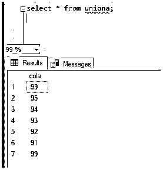
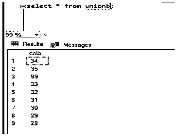
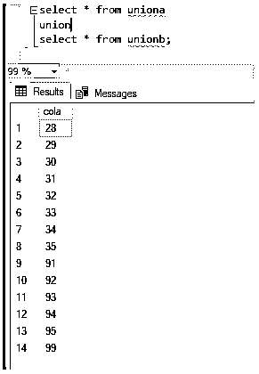
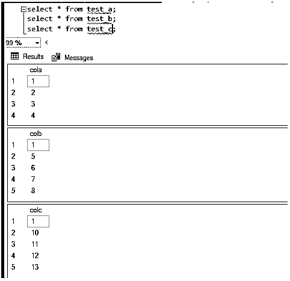
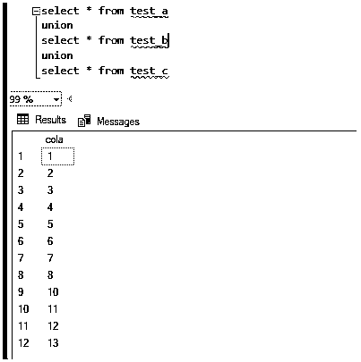
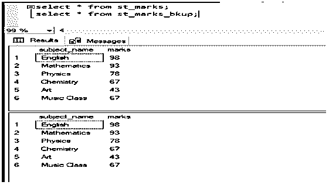
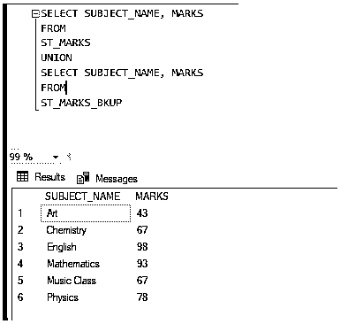

# MySQL 联盟

> 原文：<https://www.educba.com/mysql-union/>

## MySQL 联盟简介

MySQL Union 用于组合两个或多个“SELECT”语句的输出。“UNION”的输出将没有重复的行。表中字段的数量应该相同，列的数据类型也应该相同。如果不想忽略重复的行，我们可以使用“UNION ALL”来实现。在联合表的结果集中，列名将与第一个 select 语句的列名相同。在这节课中，让我们了解更多关于联合的用法，并看看它的例子:-

### 句法

现在让我们看看语法:

<small>Hadoop、数据科学、统计学&其他</small>

`SELECT column_1, column_2,...column_n
FROM First_tables
[WHERE conditions] UNION [DISTINCT] SELECT column_1, column_2,...column_n
FROM Second_tables
[WHERE conditions];`

### MySQL Union 是如何工作的？

现在让我们创建一个样本表，看看 union 是如何工作的:

`Table1
create table uniona
(
cola INT
);`

`Table2
create table unionb
(
colb INT
);`

将数据插入以下表格:–以下是“uniona”表格。

`insert into uniona values (99);
insert into uniona values (95);
insert into uniona values (94);
insert into uniona values (93);
insert into uniona values (92);
insert into uniona values (91);
insert into uniona values (99);`

选择表格“uniona”的项目:–

`select * from uniona;`

让我们看看相同的截图:–

将数据插入以下表格:–以下是“unionb”表格。

`insert into unionb values (99);
insert into unionb values (34);
insert into unionb values (35);
insert into unionb values (33);
insert into unionb values (32);
insert into unionb values (31);
insert into unionb values (30);
insert into unionb values (29);
insert into unionb values (28);`

选择表格“工会”的项目:–

`select * from unionb;`

让我们看看相同的截图:–

现在让我们对上面的表执行 union 操作:-

`select * from uniona
union
select * from unionb;`

选择表格“uniona”和“unionb”的项目，并执行 union:–

让我们看看相同的截图:–

**举例:**

现在让我们对下面三个表执行 UNION 操作:-

`--Table1: -
create table TEST_A
(
cola INT
);
--Table2: -
create table TEST_B
(
colb INT
);
--Table3: -
create table TEST_C
(
colc INT
);`

将数据插入上表:-

`insert into test_a values (1);
insert into test_a values (2);
insert into test_a values (3);
insert into test_a values (4);`

让我们看看表格的各栏:—

`select * from test_a;`

**输出**:

`insert into test_b values (1);
insert into test_b values (5);
insert into test_b values (6);
insert into test_b values (7);
insert into test_b values (8);`

让我们看看表格的各栏:—

**输出**:

`insert into test_c values (1);
insert into test_c values (10);
insert into test_c values (11);
insert into test_c values (12);
insert into test_c values (13);`

让我们看看表格的各栏:—

**输出**:

以上截图:–

`select * from test_a
union
select * from test_b
union
select * from test_c`

**输出:**

在上面的输出中，我们需要检查两件事

*   结果集的列名是第一个“select”语句的列名。这里是“可乐”。
*   第二件事是，我们可以看到在所有值为“1”的表中都有一个重复的行。但是在结果集中，UNION 忽略了重复项，因此我们只有一行数据“1”。

相同的截图:–

### MySQL 联合的例子

现在让我们看另一个实时的例子。这里我们有“圣马克”和“圣马克 bkup”。“st_marks_bkup”是一个备份表，其中有一些数据。现在，让我们考虑备份表，并检查是否所有的行都已插入到表“st_marks”中。正如我们所知道的，UNION 不会给我们副本，表的输出应该是只有一个表的行:-

`Actual Table:-
create table St_marks
(
subject_name varchar(20),
marks int
);
insert into st_marks values ('English', 98);
insert into st_marks values ('Mathematics', 93);
insert into st_marks values ('Physics', 78);
insert into st_marks values ('Chemistry', 67);
insert into st_marks values ('Art', 43);
insert into st_marks values ('Music Class', 67);
select * from st_marks;
Output:-
Backup table:-
create table St_marks_bkup
(
subject_name varchar(20),
marks int
);
insert into st_marks_bkup values ('English', 98);
insert into st_marks_bkup values ('Mathematics', 93);
insert into st_marks_bkup values ('Physics', 78);
insert into st_marks_bkup values ('Chemistry', 67);
insert into st_marks_bkup values ('Art', 43);
insert into st_marks_bkup values ('Music Class', 67);
select * from st_marks_bkup;`

**输出:**

以上截图如下:–

`SELECT SUBJECT_NAME, MARKS
FROM
ST_MARKS
UNION
SELECT SUBJECT_NAME, MARKS
FROM
ST_MARKS_BKUP;`

**输出:**

截图也是一样的:–

### 结论

需要记住的事情如下:-

*   MySQL Union 用于组合两个或多个“SELECT”语句的输出。“UNION”的输出将没有重复的行。
*   表中字段的数量应该相同，列的数据类型也应该相同。如果不想忽略重复的行，我们可以使用“UNION ALL”来实现。
*   在联合表的结果集中，列名将与第一个 select 语句的列名相同。

### 推荐文章

这是一个 MySQL 联盟的指南。为了更好地理解，我们将通过示例表和相应的查询示例来讨论 MySQL Union 是如何工作的。您也可以看看以下文章，了解更多信息–

1.  [MySQL 索引](https://www.educba.com/mysql-index/)
2.  [MySQL Datetime](https://www.educba.com/mysql-datetime/)
3.  [MySQL count()](https://www.educba.com/mysql-count/)
4.  [MySQL 根目录](https://www.educba.com/mysql-root/)

