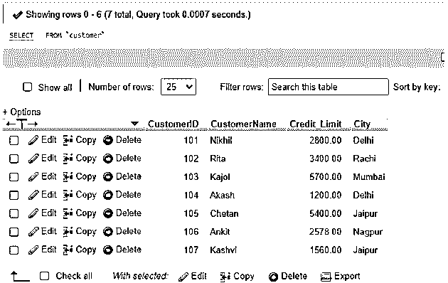
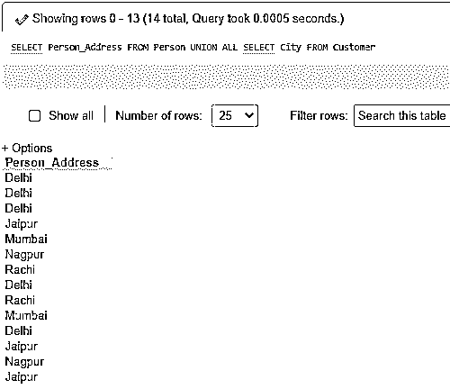
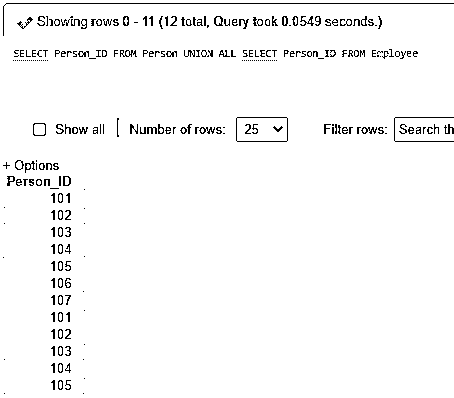
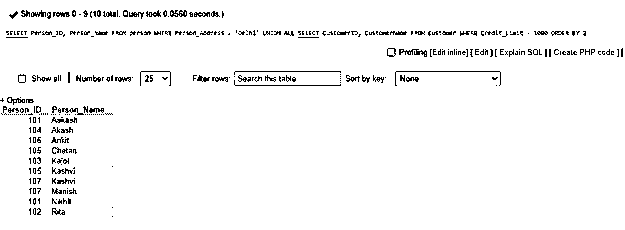

# MySQL 联盟所有

> 原文：<https://www.educba.com/mysql-union-all/>

## MySQL UNION ALL 简介

*   MySQL UNION ALL 操作符是一个联合查询命令，它将多个 SELECT 语句的结果聚合到一个结果行中。
*   像 MySQL UNION 操作符一样，它也是 MySQL 数据库中一个有用的命令，可以组合使用 SELECT 查询提供的两个以上的输出集。但是他们的工作略有不同，这使得他们在 MySQL 中使用两个不同的命令来实现各自的目的。
*   MySQL UNION 操作符执行以在 SELECT 语句的结果行的联合之后在结果中给出 set 的独特值，而 MySQL UNION ALL 操作符允许 UNION 从 SELECT 语句产生结果集，该结果集在从应用它的数据库表中提取的记录中具有副本值。

### 句法

以下是使用 MySQL UNION ALL 运算符和 SELECT 语句的基本语法代码，用于显示具有相似字段和数据类型的表值的组合:

`SELECT Col_expr1, Col_expr2,…,Col_exprN FROM TableName_A
[WHERE option condition] UNION ALL
SELECT Col_expr1, Col_expr2,…,Col_exprN FROM TableName_B
[WHERE option condition];`

<small>Hadoop、数据科学、统计学&其他</small>

这里，让我们解释一下上面列出的参数:

*   Col_expr1，Col_expr2，…，Col_exprN 是需要从两个或多个表(如 TableName_A 或 TableName_B)中提取的表达式列值。
*   WHERE condition 是可选的匹配表达式，用于所提供的表中的 SELECT 语句字段。
*   对于包含的每个 SELECT 查询，列字段的数量必须相同，并且语句必须至少包含一个用 FROM 子句提到的表。

### 在 MySQL 中 UNION ALL 操作符是如何工作的？

*   正如我们所知，MySQL UNION ALL 操作符允许组合多个 SELECT 查询的结果行。因此，它从两个表中提取行，其中每个带有 SELECT 关键字命令的语句必须包括相同数量的列字段以及匹配的数据类型。
*   这是因为要确保结果行不会不匹配，不会产生任何 MySQL 代码错误。如果 UNION ALL 查询语句中的所有内容都正确，那么将检索结果行，但它包含在命令中使用的几个 SELECT 语句之间的重复行值，以生成数据库表的联合集。

### 实现 MySQL UNION ALL 的示例

让我们评估和说明一些示例，这些示例显示了数据库中 MySQL UNION ALL 操作符在相关表上的工作和结果:

#### 例子

让我们考虑使用两个操作符实现查询语句的两个表。首先，我们将创建具有字段 Person_ID、Person_Name、Person_Address 的表 Person，并再次创建具有字段 CustomerID、CustomerName、Credit_Limit、City 的第二个表 Customer。我们将执行以下 SQL 查询来创建数据库表，以演示示例:

**代码:**

`CREATE TABLE Person(Person_ID INT PRIMARY KEY AUTO_INCREMENT, Person_Name VARCHAR(255) NOT NULL, Person_Address VARCHAR(255) NOT NULL);
CREATE TABLE Customer(CustomerID INT PRIMARY KEY AUTO_INCREMENT, CustomerName VARCHAR(255) NOT NULL, Credit_Limit DECIMAL(10,2) NOT NULL, City VARCHAR(255) NOT NULL);`

假设，我们借助下面的 MySQL 查询语句分别为表 Person 和 Customer 输入了一些记录作为样本:

**代码:**

`INSERT INTO Person(`Person_ID`, `Person_Name`, `Person_Address`) VALUES ('101','Akash','Delhi');
INSERT INTO Customer(`CustomerID`, `CustomerName`, `Credit_Limit`, `City`) VALUES ('101','Nikhil','2800.00','Delhi');`

我们可以查看如下记录:

**代码:**

`SELECT * FROM Person;`

**输出:**

`SELECT * FROM Customer;`

**输出:**

#### 1.UNION ALL 运算符与 UNION 运算符

我们正在编写以下代码，执行 UNION 运算符从两个表中提取城市地址值，这两个表在结果组合集中是不同的行:

**代码:**

`SELECT Person_Address FROM Person
UNION
SELECT City FROM Customer;`

**输出:**

此外，让我们使用 UNION ALL 运算符执行上面的查询，该运算符提供包含两个表中的列值组合的结果表:

**代码:**

`SELECT Person_Address FROM Person
UNION ALL
SELECT City FROM Customer;`

**输出:**

从结果中可以清楚地看出，使用 UNION 运算符时，我们得到了离散值，而使用 UNION ALL 运算符时，我们得到的值具有相同的行。这里，我们同时使用了来自 Person 和 Customer 表的 Person_Address 和 City 列的类似值。

#### 2.UNION ALL 运算符提取单个字段的示例

对于这个示例，让我们再次创建一个名为 Employee as Person 的类似表，该表有一个具有相同数据类型的公共字段，也是为了执行 UNION ALL 查询。

`CREATE TABLE Employee(Person_ID INT PRIMARY KEY AUTO_INCREMENT, Employee_Name VARCHAR(255) NOT NULL, Salary INT NOT NULL, JoinDate DATE NOT NULL);`

向其中插入一些值:

**代码:**

`INSERT INTO Employee(`Person_ID`, `Employee_Name`, `Salary`, `JoinDate`) VALUES ('101','Akash,'1045','2020-05-01');`

现在，我们有 UNION ALL 运算符查询，如下所示:

**代码:**

`SELECT Person_ID FROM Person
UNION ALL
SELECT Person_ID FROM Employee;`

**输出:**

#### 3.带有 ORDER BY 子句和 WHERE 选项的 UNION ALL 运算符示例

在这里，我们将在查询中应用 ORDER BY 子句和 WHERE 选项以及 UNION ALL 运算符，以便对具有以下字段值之一的组合表的结果行进行排序:

**代码:**

`SELECT Person_ID, Person_Name FROM person WHERE Person_Address = 'Delhi'
UNION ALL
SELECT CustomerID, CustomerName FROM Customer WHERE Credit_Limit> 1000 ORDER BY 2;`

**输出:**

这里，ORDER BY 2 选项将 Person _ Name | customername columns 放在输出集中的位置。

### 优势

*   由于该操作符不会从结果集中删除任何重复项，而是从符合查询要素的相关表中提取每一行的值，以合并到一个表中，因此，MySQL UNION ALL 操作符的工作速度比 MySQL UNION 操作符快得多。
*   在数据库服务器中开发报告时，结果中不需要重复，但是如果应用了联合，服务器需要执行额外的操作来避免重复。因此，如果可能的话，UNION ALL 可能是一个更好的选择。
*   在某些情况下，这个阻塞操作符可能有助于找出 MySQL 数据库中相关表之间的重复。
*   它有助于以耗时的方式合并多个表的记录，以产生具有特定字段的表，但是对于 UNION 来说，提供不同的行需要比较，这需要时间。

### 结论

*   如果我们在查询中使用 MySQL UNION ALL 操作符，并使用不同的 SELECT 语句(这些语句在结构上是兼容的)将结果集关联在一起，那么我们将收到重复的表值。
*   与 UNION 运算符不同，在 UNION ALL 运算符查询中，不会对结果值进行筛选，以忽略不同的 UNION 集合作为输出。

### 推荐文章

这是一个 MySQL 联盟的所有指南。在这里，我们讨论一个介绍，语法，它是如何工作的例子，以实现正确的编码。您也可以浏览我们的其他相关文章，了解更多信息——

1.  [就像 MySQL 中的](https://www.educba.com/like-in-mysql/?source=leftnav)
2.  [MySQL 中的任何一个](https://www.educba.com/any-in-mysql/?source=leftnav)
3.  [MySQL 中的光标](https://www.educba.com/cursor-in-mysql/?source=leftnav)
4.  MySQL 中的[表](https://www.educba.com/table-in-mysql/?source=leftnav)

