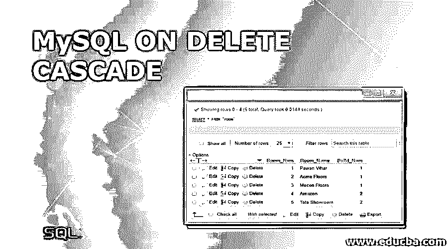
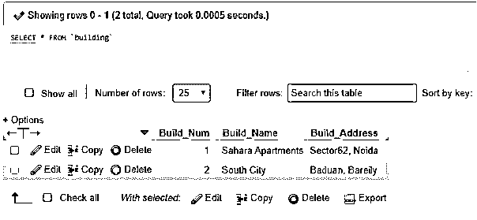
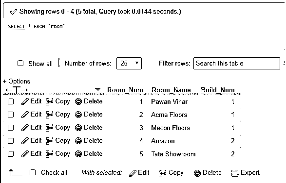
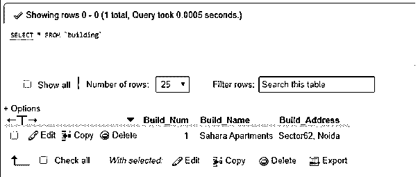
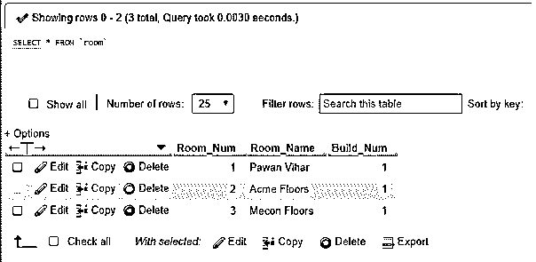
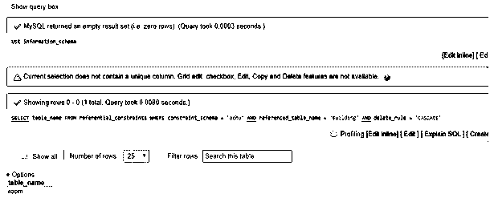

# 删除级联上的 MySQL

> 原文：<https://www.educba.com/mysql-on-delete-cascade/>

## MySQL 关于删除级联的介绍

MySQL ON DELETE CASCADE 是 MySQLforeign key 的一个 MySQL 引用动作，它允许在删除主父表数据时自动从子表中删除记录。

这个 MySQL ON CASCADE 语句查询负责显示引用方法，其中与具有主键和外键的父表相关的子表数据执行处理查询，以从两个相关的表中删除数据。

<small>Hadoop、数据科学、统计学&其他</small>

这意味着，如果我们删除父表中的任何数据或列值，那么通过引用操作，子表中具有外键的相关数据或列值也将被自动删除。

**语法**

我们使用 CREATE TABLE 对 MySQL 上的 DELETE CASCADEfor 外键使用以下语法:

`CREATE TABLE ChildTable_Name(Col1 Data_Type [NOT NULL | PRIMARY KEY | AUTO_INCREMENT],.., ColNDate_Type [NOT NULL | NULL] FOREIGN KEY (Col1_Child, …, ColN_Child)
REFERENCES ParentTable_Name (Col1_Parent, …., ColN_Parent)
ON DELETE CASCADE);`

这里，使用的术语解释如下:

*   在使用 MySQL CREATE TABLE 或 MySQL ALTER TABLE 语句的帮助下，可以生成 MySQL ON DELETE CASCADE 的**外键**。
*   **ChildTable_Name** :表示与父表相关的子表的名称。
*   **Col1，..，ColN** :这些是我们希望用表中相应的数据类型创建的列名。当我们不提供任何数据类型，但我们需要添加一些数据类型以正确执行查询(NULL 或 NOT NULL)时，它的默认值为 NULL。
*   **Col1_Child，…，ColN_Child:** 这些是引用父表中主键的子表的列。
*   **ParentTable_Name:** 这是要在查询语句中使用的父表的名称，该查询语句的主键被链接到子表中使用。
*   Col1_Parent，…..，ColN_Parent: 这些是父表列，包含外键将与之关联的主键
*   **ON DELETE CASCADE:** 这个 MySQL 关键字负责在父表受到影响时对子表进行更改。
*   **级联**:表示当父数据受到影响时，子数据也会发生相应的变化，因为它在聚合中被用于删除或更新。

### MySQL 中的删除级联是如何工作的？

*   在 MySQL 中，父表由表中的原始键值组成，而子表被定义为链接表，它引用数据库中父表中的主键值。
*   假设我们已经创建了两个 MySQL 表 person(ID，姓名，地址)和 Employee(EmpID，ID，Profile，Contact)。在 MySQL 数据库结构模型中，每个人占用一个或多个员工档案。但是，在表关系中，每个员工配置文件只属于一个人。缺少一个人，员工档案就不存在。
*   因此，我们可以得出结论，person 和 employee 表之间的关系对于 variable 是不同的，即(1:N)
*   同样，假设当您取消 person 表中的一行时，您还希望从 employee 表中删除与 person 表中的主键记录相关联的行。
*   例如，如果您删除 id 为 1 的人，引用该 id 的员工概要文件也需要删除，因此，在这种情况下，我们将使用 DELETE 语句对外键应用 MySQL ON DELETE CASCADE。
*   需要注意的重要一点是，MySQL ON DELETE CASCADE 可以与支持外键的存储引擎(如 InnoDB)一起工作，但它可能无法在 MyISAM 类型的引擎中工作。

### MySQL 在删除级联上的例子

让我们考虑下面的例子来演示 MySQL 在 DELETE cascade for foreign key 上使用 CREATE，SELECT like Table 语句进行引用工作:

#### 示例# 1–创建父表

我们使用下面的查询创建一个带有主键的主表:

`CREATE TABLE Building (Build_Num int AUTO_INCREMENT PRIMARY KEY, Build_Name varchar(255) NOT NULL, Build_Address varchar(255) NOT NULL)ENGINE = InnoDB;`

#### 示例 2–创建子表

我们还将为外键引用操作创建一个子表，并使用下面的 CREATE TABLE 语句实现 MySQL ON DELETE CASCADE:

`CREATE TABLE Room (Room_Num int AUTO_INCREMENT PRIMARY KEY, Room_Name varchar(255) NOT NULL, Build_Num int NOT NULL,
FOREIGN KEY (Build_Num)
REFERENCES Building (Build_Num)
ON DELETE CASCADE) ENGINE = InnoDB;`

#### 示例 3–在上面创建的表格中输入一些信息

`INSERT INTO Building(Build_Name, Build_Address) VALUES('Sahara Apartments','Sector62, Noida'), ('South City','Baduan, Bareily');`

要查看建筑表中的数据:

`SELECT * FROM Building;`

**输出:**

**对于房间表:**

`INSERT INTO Room(Room_Name, Build_Num) VALUES('PawanVihar','1'), ('Acme Floors','1'),('Mecon Floors','1') ,('Amazon','2'),('Tata Showroom','2');
Display records:
SELECT * FROM Room;`

**输出:**

#### 示例# 4–从 Building 表中删除 Build_Num 2

`DELETE FROM Building WHERE Build_Num=2;
SELECT * FROM Building;`

**输出:**

#### 示例 5–从房间表中查询行

`SELECT * FROM Room;`

**输出:**

最初，3 个房间与 1 号建筑相关联，2 个房间与 2 号建筑相关联。因此，现在通过删除父表中的 Build_Num 2，我们可以看到 Room 表中外键 Build_Num 引用的房间也同时被自动删除。

#### 示例 6–在 MySQL 中查找受删除级联影响的表

如果我们想知道当我们从相关表中删除数据时，MYSQL 在删除级联时对旧引用操作的外键的级联影响表，那么我们需要在 phpMyAdmin 或 database 面板中的 information_schema 数据库中应用查询，语法如下:

**SQL 查询:**

`USE information_schema;
SELECT Table_Name FROM referential_constraints
WHERE
constraint_schema = 'achu'
AND referenced_Table_Name = 'Building'
AND delete_rule = 'CASCADE'`

**输出:**

### 结论

使用这种类型的 MySQL delete 语句有助于在我们删除父表中的数据时自动删除相关的表数据，从而节省时间，轻松管理表记录，获取更新的行并组织数据库大小，以及改进外键引用操作的使用。

### 推荐文章

这是一个关于 MySQL 的删除级联指南。在这里，我们将讨论 ondeletescade 如何在 MySQL 中工作，并给出编程示例。您也可以看看以下文章，了解更多信息–

1.  [MySQL 子查询教程及示例](https://www.educba.com/mysql-subquery/)
2.  [MySQL avg()| avg 函数如何工作](https://www.educba.com/mysql-avg/)
3.  [在 MySQL 中插入|插入命令如何工作](https://www.educba.com/sql-instr/)
4.  [MySQL 中的 IF 语句如何工作](https://www.educba.com/if-statement-in-mysql/)

