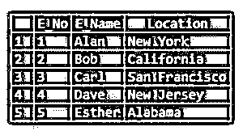
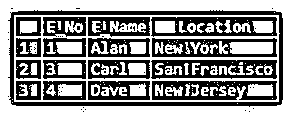
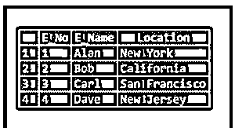
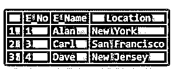

# MySQL REGEXP

> 原文：<https://www.educba.com/mysql-regexp/>

## MySQL REGEXP 简介

以下文章提供了 MySQL REGEXP 的概要。正则表达式与选择查询一起使用，在数据库中搜索模式，通常是字符串。我们可以把正则表达式看作一个容易理解的搜索工具。这个操作类似于“LIKE …%”操作符，它也进行模式匹配。REGEXP 可以与键盘上的几乎所有操作符结合使用。正则表达式操作符(REGEXP)可以看作是一组独立的语言。

**语法:**

<small>Hadoop、数据科学、统计学&其他</small>

REGEXP 函数的语法如下:

`expression REGEXP pattern`

这里,“表达式”代表要从数据库中查找的列名或表达式。术语“模式”代表要在数据库中搜索的字符串。

在实际查询中使用时，正则表达式如下:

`SELECT * from table_name where expression REGEXP pattern;`

该模式将用单引号引起来。

### RANK()在 MySQL 中是如何工作的？

考虑表 emp 如下:

**代码:**

`select * from emp;`

**输出:**

#### 示例#1

这里，我们需要获得姓名中包含字符“a”的雇员的详细信息。

**代码:**

`select * from emp where E_Name REGEXP 'a';`

**输出:**

现在为了分析该查询，我们描述了从表“emp”中选择所有细节的查询，该表的 E_Name 字段中有字符“a”。当我们查看输出时，我们可以了解到，在 5 名员工中，有 3 名员工的姓名中包含字符“a ”,他们是 Alan、Carl 和 Dave。

因此，我们编写了查询来选择包含字符串的详细信息。这里我们只是提到用一个字符来选择数据。指定的字符可能在单词中的任何位置。

#### 实施例 2

这里我们看到如何选择姓名以特定字符开头的雇员的详细信息。

**代码:**

`select * from emp where E_Name REGEXP '^a';`

**输出:**

这里，我们使用了操作符'^'和要搜索的模式，从而获得了姓名以字符“a”开头的雇员的详细信息。

到目前为止，被视为模式的字符或字符串是不区分大小写的。

#### 实施例 3

在这里，我们通过区分大小写使它更加具体。

**代码:**

`select * from emp where E_Name REGEXP BINARY '^a';`

**输出:**

因为我们在查询中指定了小写字符“a ”,所以没有要检索的结果。

#### 实施例 4

在这里，让我们把它变成大写字母，并尝试检索输出。

**代码:**

`select * from emp where E_Name REGEXP BINARY '^E';`

**输出:**

这里我们得到了开头大写字母为“E”的雇员的详细信息。

#### 实施例 5

在这里，我们也可以搜索单词的一部分。

**代码:**

`select * from emp where Location REGEXP BINARY '^New';`

**输出:**

该查询要求选择 location 字段以单词“New”开头的条目。从示例表中，我们得到了满足条件的两行，即 New York 和 New Jersey。此外，因为查询中提到了二元函数，所以它也会检查大小写。

#### 实施例 6

这里我们看到了如何搜索一个结束字符/单词/单词的一部分。

**代码:**

`select * from emp where Location REGEXP 'a$';`

**输出:**

如果我们检查查询，它指定从 employee 表中选择 location 字段以字符' a '结尾的条目。输出清楚地从表中选择了两个条目，在位置的最后一个字符处有字符“a ”,即加利福尼亚和阿拉巴马。到目前为止，我们已经讨论了搜索单个字符、单词或单词的一部分。

#### 实施例 7

在这里，我们可以看到如何搜索一组字符和一系列字符。

例如，假设我们需要用 E_Name 列中的任何字符“a”、“b”和“c”来标识 employee 表中的行。我们可以用两种方式来表达同样的要求，第一种方式是将所有三个字符作为一个数组，第二种方式是将字符的范围从“a”提到“c”。

**代码:**

`select * from emp where E_Name REGEXP '[abc]';`

**输出:**

#### 实施例 8

**代码:**

`select * from emp where E_Name REGEXP '[a-c]';`

**输出:**

查询 7 和 8 将给出相同的输出。查询 7 挑选那些在'[..]'，位于 E_Name 列下。我们在方括号中提到了字符‘a’、‘b’和‘c’。因此将选择显示这四行。在这里，请注意，方括号内的字符“没有”逗号运算符。
查询 8 将挑选那些字符在方括号“[…”内指定的范围内的行。]'.因此，包含从“a”到“c”的任何字符的员工姓名将被挑选和显示。

#### 实施例 9

在这里，让我们用 MySQL 中的‘OR’操作符“|”编写一个查询。

**代码:**

`select * from emp where Location REGEXP 'new|san';`

**输出:**

该查询用于搜索单词中带有“new”或“san”的位置。这里我们得到了三个输出，其中任何一个单词都在引号中。通常与 REGEXP 一起使用的另一个操作符是单词中的字符数。假设我们必须搜索正好包含四个字符的雇员姓名，那么我们需要指定四个“.”实例在开始和结束字符串之间，分别是'^'和“$”。

#### 实施例#10

在这里，让我们编写查询来识别具有四个字符的名称。

**代码:**

`select * from emp where E_Name REGEXP '^....$';`

**输出:**

### 结论——MySQL 正则表达式

在本文中，我们看到了 REGEXP 操作符，它用于搜索表中的字符或模式。我们现在已经熟悉了多个字符串操作符，它们通常与 REGEXP 操作符以及它们各自的语法一起使用。我们可以在 MySQL 中使用几乎所有的字符串操作符和 REGEXP 操作符。

### 推荐文章

这是一个 MySQL 正则表达式的指南。在这里，我们讨论 MySQL REGEXP 的介绍以及 RANK()如何处理相应的查询。您也可以看看下面的文章来了解更多信息

1.  [MySQL 中的运算符](https://www.educba.com/mysql-in-operator/)
2.  [MySQL 子查询](https://www.educba.com/mysql-subquery/)
3.  [MySQL 中的任何一个](https://www.educba.com/any-in-mysql/)
4.  [MySQL 中的唯一键](https://www.educba.com/unique-key-in-mysql/)

