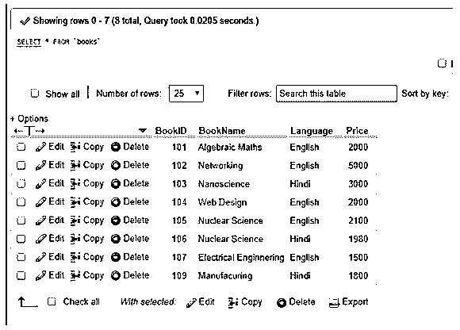
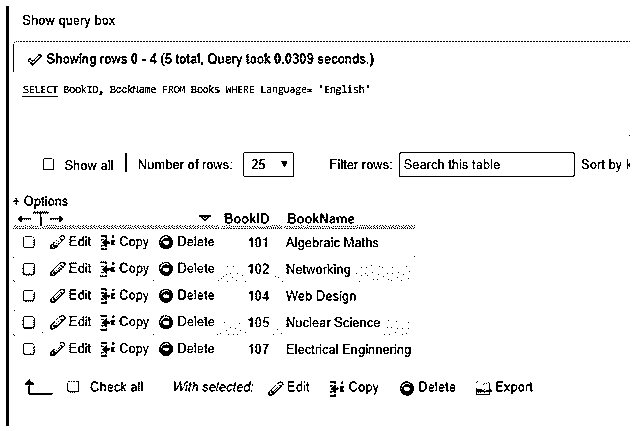
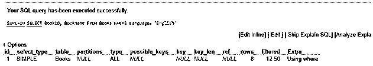
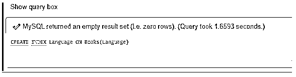
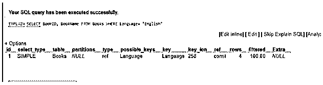
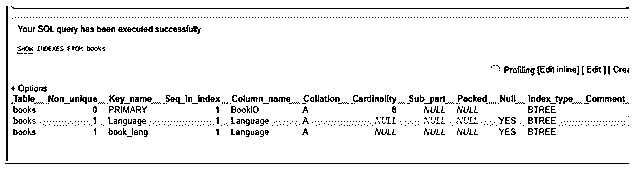
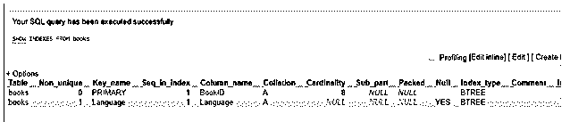
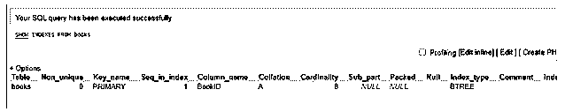

# MySQL 索引

> 原文：<https://www.educba.com/mysql-index/>

## MySQL 索引的定义

MySQL 索引可以说是数据库表中的数据组织，有助于提高 MySQL 中发生的若干操作的速度，并有助于优化数据库。我们在 MySQL 中实现了 INDEX，使用表数据库中的一列或多列创建索引，以快速访问数据，并以特定的适当方式组织数据值，从而提高性能。

MySQL INDEX 表示在数据库上构建索引的索引过程，它提供了快速随意查找和熟练排序的基础，以便使用 phpMyAdmin 正确地获取使用索引的行。实际上，Indexes 包含主键或索引字段，以及指向实际数据库表中每一行的指针。因此，我们可以得出结论，索引是一种表。

<small>Hadoop、数据科学、统计学&其他</small>

### 索引在 MySQL 中是如何工作的？

通常，MySQL 索引可以通过 phpMyAdmin 在本地服务器上轻松生成，如 WAMP、XAMPP 或 cPanel 上的 live server。MySQL 的大多数索引，如惟一、主键、全文、索引都存储在 B 树中。b 树可以被定义为一种自平衡的数据排列树，它以排序的方式存储数据，并允许基于对数时间的顺序访问、搜索、插入和删除。这对于读写信息块所涉及的文件系统和数据库是有利的。

在 MySQL 中，INDEX 执行以下工作:

*   它有助于在数据库或表中快速定位索引信息。
*   在这里，MySQL 中的索引将创建一个由 MySQL 服务存储的最内层目录。它使用表格行的目录，因为它可以用最少的努力在小数时间内指示。
*   它首先对数据进行排序，然后为表中的每一行分配标识。
*   索引支持非常快速地检查对应于具有特定列值的 WHERE 子句的行，因此如果索引不能正常工作，那么我们必须使用 REINDEX 命令来操作和重建表列的索引，以继续访问数据。
*   通过选择性方法索引，消除了在多个索引之间进行选择时对行的担心，因此也支持重新索引。
*   这些索引一起放在表的顶部来执行，所以 MySQL 中的索引也可以被称为一个包含记录排列技术的表。
*   当正确执行连接和查询时，索引还允许从 RDBMS 中的其他相关表中提取行。

### 如何在 MySQL 中创建索引？

我们使用下面的简单语法来补充 MySQL 数据库表中的 MySQL 索引:

`CREATE INDEX [Index_Name] ON [TableName] ([ColumnName of the TableName]);`

这里，给出的参数解释如下:

*   Index_Name 是索引的名称
*   TableName 是特定表的名称
*   ColumnName 定义了上面提到的表中要进行索引的列。

我们可以在表上建立一个唯一的索引，这样就不会有两个记录有相同的索引值。语法是:

`CREATE UNIQUE INDEX [Index_Name] ON [TableName] ([ColumnName of the TableName]);`

为了查看 MySQL 索引，我们使用以下语法:

`SHOW INDEXES FROM TableName IN DatabaseName;`

为了使用 MySQL INDEX，让我们首先在表上创建特定的索引，并解释它们以便简单了解这个主题。最初，我们在数据库中取了一个名为 Books 的表，表中有 BookID、BookName、Language&Price 字段。它包含如下几个数据:

现在，下面的查询将使用 WHERE 在语言列中找到语言为英语的图书:

`SELECT BookID, BookName FROM Books WHERE Language= ‘English’;`

如果您想知道 MySQL 是如何在内部执行这个查询的，那么我们将解释查询应用到前面查询的开头，如下所示:

`EXPLAIN SELECT BookID, BookName FROM Books WHERE Language= 'English';`

这里，服务器必须测试包含 8 行的整个表来执行查询。

现在让我们通过下面的语句为语言列添加一个索引:

`CREATE INDEX Language ON Books(Language);`

运行查询后，再次使用 EXPLAIN 语句查看结果。

结果很清楚，现在使用创建的索引只扫描了 4 行，而不是 key 列中显示的整个表。

例如，让我们使用下面的查询来查看在表 Books 上创建的索引:

`SHOW INDEXES FROM Books;`

因此，索引可以使事情变得容易处理，因为一个表中可能有数百万条记录，如果没有索引，数据访问可能是一个耗时的过程。

### 如何在 MySQL 中改变索引？

请注意，我们可以在以后为一个表定义索引，即使该表已经用 MySQL ALTER query 在数据库中创建:

我们可以使用以下四个语句来编写索引:

*   ALTER Table TableName 添加主键(ColumName)；
*   ALTER Table TableName ADD UNIQUE Index _ Name(ColumName)；
*   ALTER Table TableName ADD INDEX INDEX _ Name(ColumName)；
*   ALTER Table TableName ADD full text Index _ Name(ColumName)；

举个例子，

`ALTER TABLEBooks ADD INDEX book_lang (Language);`

### 如何在 MySQL 中删除索引？

同样，为了删除索引，我们应用以下 SQL 语句:

`DROP INDEX [Index_Name] ON [TableName] ([ColumnName of the TableName]);`

这个删除索引的命令已经删除了给定表上已定义的索引。比如，

`DROP INDEX Book_lang ON Books;`

要删除任何索引，我们还可以同时使用 ALTER 和 DROP 命令，如下所示:

`ALTER TABLE Books DROP INDEX Language;`

要验证这些更改以确认它们是否应用到表中，我们可以使用上面的 SHOW INDEXES 查询。

### 结论

普通用户看不到 MySQL 索引，因为这些索引只是用来加快 MYSQL 语句的速度，并且还使用数据库搜索引擎非常快速地发现表记录。数据库中有索引的表在使用插入和更新查询时会花费更多时间，但是当我们在表上使用选择查询时会更快。这是因为当我们插入或更新任何记录时，我们也需要插入或更新索引的值。

### 推荐文章

这是一个 MySQL 索引的指南。在这里，我们还将讨论索引的定义以及它在 mysql 中是如何工作的？以及不同的示例及其代码实现。您也可以看看以下文章，了解更多信息–

1.  [MySQL 时间戳](https://www.educba.com/mysql-timestamp/)
2.  [MySQL 中的唯一键](https://www.educba.com/unique-key-in-mysql/)
3.  [MySQL 子查询](https://www.educba.com/mysql-subquery/)
4.  [MySQL 中的任何一个](https://www.educba.com/any-in-mysql/)

