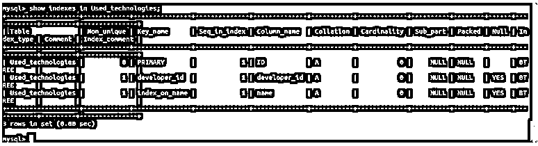

# MySQL 添加索引

> 原文：<https://www.educba.com/mysql-add-index/>

## MySQL 添加索引简介

我们可以在表上创建索引，帮助优化表中记录的搜索，同时使用 SQL 查询检索特定的结果。如果该表上没有定义任何索引，Mysql 必须逐个扫描所有的行来搜索特定的记录。如果我们在 where 子句中对列指定的限制在同一列上定义了索引，那么 MySQL 就没有必要搜索表中的所有记录。

在 Mysql 中我们有两种类型的索引。与数据一起存储在同一表中的主索引。每当我们在表中创建主键或唯一键时，就会自动创建带有主键的索引。主索引也称为聚集索引。聚集索引确保根据定义该聚集键或主键的列的内容来维护数据存储的顺序。除了主索引之外，表中定义的所有其他索引都称为辅助索引或非聚集索引。

<small>Hadoop、数据科学、统计学&其他</small>

在本文中，我们将了解索引、它们的用法、检索优化和索引导致的存储开销，以及如何在创建表时，甚至在表已经存在且需要添加索引及其语法和示例时，向 MySQL 中的表添加索引。

### MySQL 中的索引

让我们通过考虑一个字典的简单例子来理解索引的使用。每当我们必须在字典中搜索一个词，比如 knack，我们首先考虑这个词的第一个字符，因为字典是按字母顺序排列的，所以我们很容易搜索以 k 开头的词，然后进一步搜索其中的 knack 词。类似地，当用名称和它们的含义存储表中的记录时，如果我们查询 knack word 的含义，那么我们必须搜索表中的所有记录。

但是，如果在表中的列名上定义了索引，那么在检索其含义时，只会扫描一条带有 knack word 的记录。因此，在定义表中的索引时，我们应该首先分析哪些列的限制将应用于将来要执行的查询的 where 子句中。比如，在我们的例子中，查询将使用 name 列上指定的值来触发，以便从字典表中检索它的含义。

让我们创建一个名为 dictionary 的表

`CREATE TABLE dictionary(
name VARCHAR(100),
meaning varchar(5000)
);`

这将产生以下输出–

让我们使用下面的查询语句插入一些记录-

`INSERT INTO
dictionary(name,meaning)
VALUES
('antonym','a word that means the opposite of another word'),
('connotation','an additional idea or emotion that a word suggests to you, in addition to its literal or main meaning'),
('etymology','he study of the origins of words; the origins of a particular word'),
('lexicography','the job or skill of writing dictionaries'),
('polysemy','the fact that some words can have more than one meaning'),
('thesaurus','a reference tool which shows groups of words that have similar meanings'),
('knack','an acquired or natural skill at doing something.'),
('flair','stylishness and originality.'),
('panache','a tuft or plume of feathers');`

这将产生以下输出–

让我们寻找诀窍这个词的意思

`explain select meaning from dictionary where name = 'knack';`

这给出了以下输出–

我们可以看到，为了检索记录，需要扫描 9 行。

让我们在 name 列上添加索引，并再次解释这个查询。

`CREATE INDEX on_name ON dictionary(name);`

这给出了以下输出–

`explain select meaning from dictionary where name = 'knack';`

这给出了以下输出–

现在，我们可以看到，只扫描了一行来检索相同的输出。这就是使用索引的好处。

索引使选择操作变得很快，但是更新和插入操作变得很慢，因为随着记录被插入或更新，表上的索引也在写入操作时受到影响和修改。

### 创建表时添加索引

我们可以使用以下语法在创建表时指定索引，主索引和辅助索引

`CREATE TABLE table_name(
column1 datatype PRIMARY KEY,
column2 datatype,
column3 datatype,
column4 datatype, ...
INDEX (column2,column3)
);`

在上面的语法中，我们可以看到在名为 column1 的列的主键上定义了一个主索引，在 column2 和 column3 列中定义了其他辅助索引。

让我们举一个例子，创建一个名为 educba_learning 的表，其中包含 topic_id、stream、subject、sessions 和 expert_name 列。在创建表时，我们将创建两个索引，一个是 topic_id 列的主索引，另一个是 subject 列的辅助索引。我们的查询语句如下

`CREATE TABLE educba_learning(
topic_id int PRIMARY KEY,
stream varchar(50),
subject varchar(100),
sessions int,
expert_name varchar(100),
INDEX (subject)
);`

这将产生以下输出–

要检查我们的索引是否被正确添加，请执行以下命令

`show indexes in educba_learning;`

这给出了以下输出–

现在让我们看看如何使用 CREATE INDEX 语句在现有表上添加索引。

**语法—**

`CREATE INDEX name_of_index ON name_of_table (list_of_columns);`

我们可以通过在 name_of_index 中指定名称来为正在创建的索引命名。此外，我们需要指定要创建索引的表的名称，以及要定义索引的列的名称列表。

考虑一个名为 Used_technologies 的现有表，当使用以下查询进行描述时，该表显示以下结构

`desc Used_technologies;`

现在，要在名称列上添加索引名称为 index_on_name 的索引，我们可以按以下方式使用 CREATE INDEX 语句

`CREATE INDEX index_on_name ON Used_technologies (name);`

这给出了以下输出–

使用以下查询，我们可以看到 Used_technologies 表上定义的所有键

`show indexes in Used_technologies;`

这将产生以下输出–

我们可以看到，名为 index_on_name 的索引已成功创建。

### 结论

在 Mysql 中，我们可以在创建表的同时或者之后使用 create index 语句在表上创建主索引或辅助索引。当要扫描大量记录时，索引会极大地影响获取时间，并且索引是在我们的选择查询中对其应用了检索限制的列上定义的。

### 推荐文章

这是一个 MySQL 添加索引的指南。在这里，我们讨论索引、使用、检索优化、索引带来的存储开销，以及如何将索引添加到 MySQL 的表中。您也可以阅读以下文章，了解更多信息——

1.  [MySQL 子查询](https://www.educba.com/mysql-subquery/)
2.  [MySQL 中的任何一个](https://www.educba.com/any-in-mysql/)
3.  [SQL 案例语句](https://www.educba.com/sql-case-statement/)
4.  [PostgreSQL 日志](https://www.educba.com/postgresql-log/)

