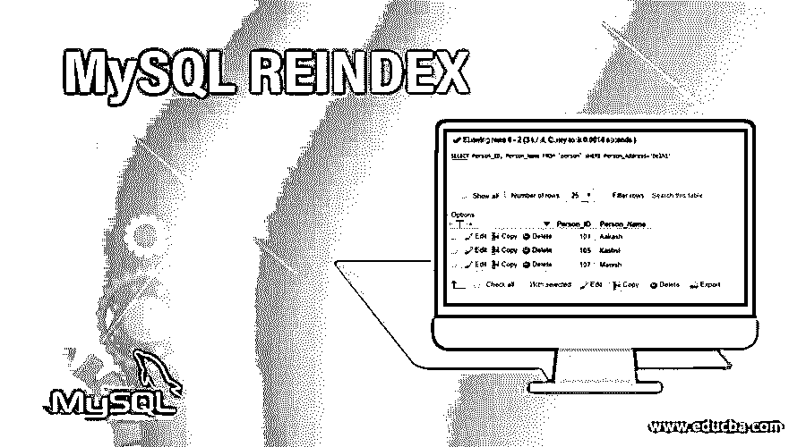
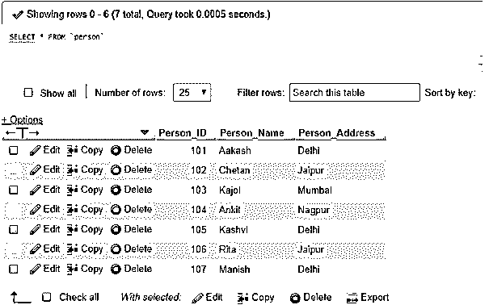
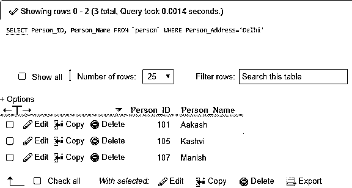
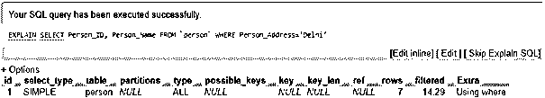
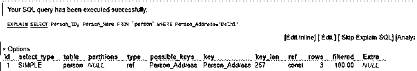
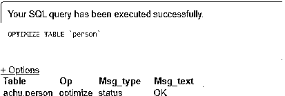

# MySQL 重新索引

> 原文：<https://www.educba.com/mysql-reindex/>

## MySQL REINDEX 简介

MySQL REINDEX 也是数据库表中的一个数据结构，它是一个好的数据库维护方法的重要组成部分，负责重新组织和管理索引，恢复快速检索。因为 MYSQL 索引也被定义为一种数据结构，它有助于优化数据库并提高 MySQL 在表中的操作速度。我们在 MySQL 中使用 REINDEX 来重建索引，使用表数据库中的一列或多列来快速访问数据并提高性能。MySQL REINDEX 表示重新建立索引的过程，以便在数据库损坏或需要修复时，使用 phpMyAdmin 使用索引正确地优化表和获取行。

### 句法

一般来说，我们可以应用 MySQL 的 REINDEX 或者在本地服务器如 WAMP、XAMPP 或 cPanel 上的 live 服务器上通过 phpMyAdmin 很容易地形成索引。大多数 MySQL 的索引过程，如主键、唯一、索引、全文和索引都存储在 B 树中。

<small>Hadoop、数据科学、统计学&其他</small>

b 树可以被定义为自平衡数据结构树，它以排序的方式存储数据，并允许基于对数时间的顺序访问、搜索、插入和删除。这对于读写大量信息的文件系统和数据库是有益的。

除了一些像:

*   对于空间数据，类型索引存储在 R 树中
*   内存表使用散列索引
*   InnoDB 支持全文索引类型的反向列表。

我们使用下面的简单语法在表中添加 MySQL 索引:

`CREATE INDEX [Index_Name] ON [TableName] ([ColumnName of the TableName]);`

现在，由于某种原因，您遇到了表中某个索引的损坏，那么您只需使用下面的基本语法重建该索引或表或列中的所有索引，甚至重建表和数据库来修复特定的数据库索引。

`REINDEX INDEX [Index_Name];
REINDEX TABLE [TableName]; or,
REINDEX TABLE [TableName]([ColumnName of the TableName]);
REINDEX DATABASE [DatabaseName];`

给出的参数解释如下:

*   据说 Index_Name 是索引的名称。
*   TableName 是特定表的名称。
*   ColumnName 定义了上面提到的表中要进行索引的列。
*   DatabaseName 表示我们需要在 MySQL 中应用 REINDEX 的数据库的名称。

这里，REINDEX 为单个索引、表索引和数据库索引重新创建指定的索引。

### MySQL REINDEX 如何工作？

在 MySQL 中，REINDEX 执行以下工作:

*   它有助于在数据库或表中快速重新定位索引信息。
*   这里，在 MySQL 中重新索引或简单地索引将创建一个由 MySQL 服务存储的内部目录。
*   它使用表行的目录，因为它可以用最少的努力在小数时间内指示。
*   重新索引表重新定义了一个数据库结构，它以一个或一组列的特定方式重新排列值。
*   它首先对数据进行排序，然后为表中的每一行分配标识。
*   索引放在表的顶部，执行 SELECT、DELETE 和 UPDATE 等 SQL 语句，以便在数据量巨大时更快地部署。MySQL 中的 REINDEX 或 INDEX 也可以称为一个表，它由记录排列技术组成。
*   索引有助于非常快速地搜索与具有特定列值的 WHERE 子句相对应的行，因此如果索引不能正常工作，那么我们必须使用 REINDEX 命令来操作和重建表列的索引，以继续访问数据。
*   如果通过选择性方法索引可以在多个索引之间进行选择，则不必担心行，因此也支持重新索引。
*   索引和重新索引还允许在正确执行连接时从其他表中提取行。

### 实现 MySQL REINDEX 的示例

为了使用 MySQL REINDEX，让我们首先在表上创建一些索引，并对它们进行解释，以简要了解主题:

最初，我们在数据库中取了一个名为 Person 的表，其中包含字段 Person_ID、Person_Name &Person_Address。它包含如下几条记录:

**代码:**

`SELECT * FROM Person`

**输出:**

#### 示例#1

现在，以下查询将使用 WHERE 在 address 列中查找位置为 Delhi 的人:

**代码#1**

`SELECT Person_ID, Person_Name FROM Person WHERE Person_Address= ‘Delhi’;`

**输出:**

**代码#2**

如果您想查看 MySQL 如何在内部执行该查询，请使用 EXPLAIN 来解释前面的查询，如下所示:

`EXPLAIN SELECT Person_ID, Person_Name FROM Person WHERE Person_Address = ‘Delhi’;`

**输出:**

这里，服务器必须测试包含 7 行的整个表来执行查询。

#### 实施例 2

现在让我们通过下面的语句为地址列添加一个索引:

**代码#1**

`CREATE INDEX Person_Address ON Person(Person_Address);`

**输出:**

运行查询后，再次使用 EXPLAIN 查看结果。

**代码#2**

`EXPLAIN SELECT Person_ID, Person_Name FROM Person WHERE Person_Address = ‘Delhi’;`

**输出:**

结果很清楚，现在使用创建的索引只扫描了 3 行，而不是 key 列中显示的整个表。

如果要查看索引，请按如下方式使用 SHOW query:

**代码#3**

`SHOW INDEXES FROM Person;`

**输出:**

现在，假设我们有任何损坏的索引，或者如果您由于任何实际原因而不再获得有效数据，但在理论上可能是不可能的，如软件病毒或硬件故障，那么 MySQL REINDEX 将负责恢复过程，以修复表或数据库并重建索引，以保持数据库内的性能和优化以及快速操作。

#### 实施例 3

我们可以使用重组、修复、优化表语句来重建损坏的表和相关的索引，以减少内存空间和提高 I/O 效率。

**代码#1**

`REINDEX TABLE ‘Person’;`

**或者，**

`OPTIMIZE TABLE ‘Person’;`

**输出:**

MySQL 重建索引后，索引将被重建，我们可以在这里看到输出:

**代码#2**

`SHOW INDEXES FROM Person;`

**输出:**

### 结论

MYSQL REINDEX 语句可以删除一个组中的所有索引，或者从头开始重新创建它们，这可能会导致包含大量数据或大量索引的组的开销很大。当我们需要从数据库中索引的损坏中恢复时，或者当排序结构的描述改变时，重新索引是很有帮助的。因此，REINDEX 支持在 MySQL 数据库表中重新获得更快的访问和平滑操作的性能和效用。

### 推荐文章

这是一个 MySQL 的索引指南。在这里，我们将讨论 MySQL REINDEX 的介绍，以及相应的语法和编程示例。您也可以浏览我们的其他相关文章，了解更多信息——

1.  [什么是 MySQL 模式](https://www.educba.com/what-is-a-mysql-schema/)
2.  [MySQL 子查询](https://www.educba.com/mysql-subquery/)
3.  [MySQL MAX()函数](https://www.educba.com/mysql-max-function/)
4.  [MySQL 中的 MIN()](https://www.educba.com/min-in-mysql/)

