# 改变表 MySQL

> 原文：<https://www.educba.com/alter-table-mysql/>

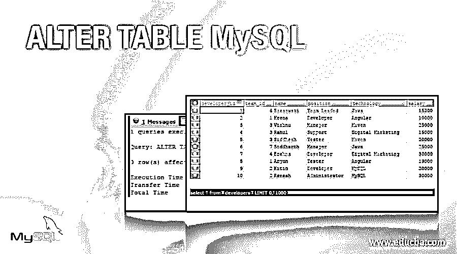

## Alter Table Mysql 简介

在 MySQL 中，ALTER TABLE 命令用于更改表名或重命名表中的一列或多列，添加新列，删除现有列，修改一列或多列的数据类型、长度和索引，我们还可以重命名表名。该命令通常与 ADD、DROP 和 MODIFY 语句一起使用，具体取决于您希望对表、其列或索引执行的操作。我们甚至可以使用 ALTER TABLE 命令改变表中列的顺序。在本文中，我们将借助示例学习 ALTER TABLE 命令以及 ADD、DROP 或 MODIFY 语句的语法和用法。

### 实现 ALTER TABLE MySQL 的示例

下面是提到的例子:

<small>Hadoop、数据科学、统计学&其他</small>

#### 1.使用 ADD 命令更改 TABLE 语句

我们可以通过使用带有 add 命令的 ALTER TABLE 语句向现有表中添加一列或多列。使用 ALTER 语句添加列的语法如下

**语法**

`ALTER TABLE name_of_table
ADD name_of_new_column details_of_column
[ FIRST | AFTER name_of_existing_column ];`

**参数**

*   **name_of_table** :这是我们希望使用 ALTER query 在其中添加新列的现有表的名称。
*   **name_of_new_column** :这是我们添加到表中的新列的名称。
*   **details_of_column:** 这有助于指定我们正在添加的新列的详细信息和定义，包括列的数据类型和其他详细信息，如 NULL 或 NOT NULL、UNIQUE 等。
*   **name_of_existing_column** :我们可以通过使用 FIRST 和 AFTER 关键字来指定要添加的列相对于 name_of_table 表中列的现有位置的位置。FIRST 表示新列将放在开头，AFTER 表示新列在表中 name_of_existing_column 命名列之后的位置。添加新列的默认位置是最后。

让我们考虑一个名为 developers 的现有表。执行以下选择命令后-

**代码#1**

`SELECT * FROM `developers`;`

**输出:**

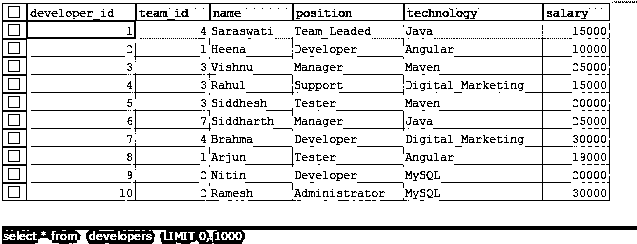

现在，我们需要再添加一个名为 experience 的列，它的数据类型是 integer，因为它将存储年值。为此，我们可以使用带有 ADD 命令的 ALTER TABLE 语句，查询如下所示

**代码#2**

`ALTER TABLE developers
ADD experience INTEGER NOT NULL DEFAULT 0;`

**输出:**

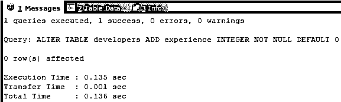

让我们通过使用以下查询选择它来检查记录

**代码#3**

`SELECT * FROM `developers`;`

**输出:**

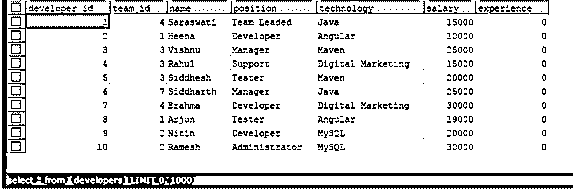

**Note:** That the value of the newly added experience column is set to 0 as we have mentioned it in the column definition.

我们甚至可以在单个查询语句中添加多个列。假设，我们想再添加三个名为 joiningDate、age 和 address 的列。我们可以通过执行以下 ALTER TABLE 命令来做到这一点

**代码#4**

`ALTER TABLE developers
ADD joiningDate DATE
FIRST ,
ADD age INT NOT NULL
AFTER NAME,
ADD address VARCHAR(100) NOT NULL
AFTER experience;`

**输出:**

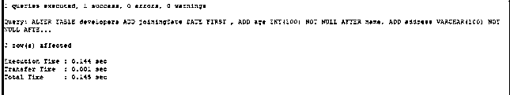

现在，让我们通过执行以下 select 查询，从 developers 表中检索记录，以查看我们的更改

**代码#5**

`SELECT * FROM `developers`;`

**输出:**

正如我们所看到的，所有新列都被添加到它们各自的位置，并根据它们的数据类型初始化为默认值。整数数据类型列的默认值为 0，varchar，即字符串为空，日期为空。

#### 2.使用 MODIFY 命令更改 TABLE 语句

我们可以通过使用带 modify 命令的 ALTER TABLE 语句更改列的定义和位置来修改列。修改列的语法类似于添加列，如下所示

`ALTER TABLE name_of_table
MODIFY name_of_column_to_modify details_of_column
[ FIRST | AFTER name_of_existing_column ];`

其中，除了 name_of_column_to_modify 代表需要修改的现有列的名称之外，所有使用的名称都与 ADD 命令相同。

让我们通过将默认值设置为“2020-05-01”来更改加入日期列。为此，我们将通过以下方式使用下面的 ALTER TABLE 查询 with MODIFY 子句

**代码#1**

`ALTER TABLE developers
MODIFY joiningDate DATE DEFAULT "2020-05-01";`

**输出:**

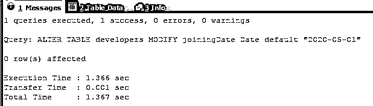

让我们在插入一条记录后检查开发人员表中的记录

**代码#2**

`INSERT INTO `developers` (`joiningDate`, `developer_id`, `team_id`, `name`, `age`, `position`, `technology`, `salary`, `experience`, `address`) VALUES(DEFAULT,'11','2','Suresh','0','Designer','MySQL','20000','0','');`

**代码#3**

`ALTER TABLE developers
MODIFY joiningDate DATE DEFAULT "2020-05-01";`

现在，让我们使用下面的查询检索 developers 表的记录并检查 Suresh 的 joiningDate 列

**代码#4**

`SELECT * FROM `developers`;`

**输出:**

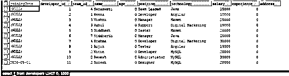

以类似的方式，我们可以使用带有 modify 子句的单个 ALTER TABLE 查询来修改特定表的多个列。

#### 3.使用 DROPcommand 更改 TABLE 语句

我们可以通过使用带 drop 命令的 ALTER TABLE 语句指定列名来删除或丢弃该列。删除列的语法如下

`ALTER TABLE name_of_table
DROP COLUMN name_of_column_to_drop;`

假设，我们想删除 developers 表的 address 列。为此，我们可以通过以下方式使用带 DROP 子句的 ALTER TABLE 命令

**代码#1**

`ALTER TABLE  developers
DROP COLUMN address;`

**输出:**

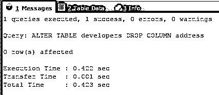

现在，让我们通过使用相同的 select 查询检索 developers 表的所有记录来进行验证，该查询给出以下输出

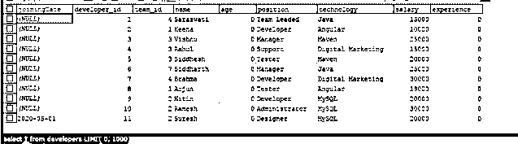

因此，我们可以得出结论，我们的地址列被完全删除，包括它的结构和所有记录的列值。

#### 4.使用 CHANGE 命令更改 TABLE 语句以重命名列名

我们可以通过使用带有 change 命令的 ALTER TABLE 语句来更改列名并对其进行重命名。重命名列的语法类似于修改列，如下所示

`ALTER TABLE name_of_table
CHANGECOLUMN old_name_of_column new_name_of_column details_of_column
[ FIRST | AFTER name_of_existing_column ];`

其中，除了代表需要重命名的现有列的名称的 old_name_of_column 和指定该列应该拥有的新名称的 new_name_of_column 之外，所有使用的名称都与 ADD 命令相同。

**代码#1**

让我们将 developer_id 列的名称改为 developers 表的 id。我们的 alter 命令如下所示

`ALTER TABLE developers
CHANGE COLUMN developer_id  id INTEGER NOT NULL ;`

**输出:**

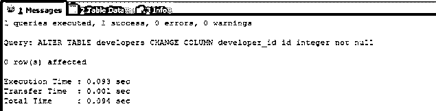

**输出:**

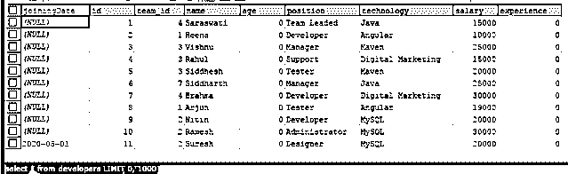

#### 5.ALTER TABLE 语句重命名表

我们甚至可以使用 ALTER TABLE 命令更改表的名称，我们需要遵循以下语法

**代码#1**

`ALTER TABLE new_table_name
RENAME TO new_table_name;`

假设，在我的例子中，我必须将表 developers 重命名为 workers。在这种情况下，我们将使用下面的 ALTER 查询–

**代码#2**

`ALTER TABLE developers
RENAME TO workers;`

**输出:**

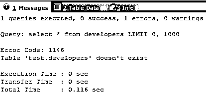

test 是我的数据库名，它显示 developers 表已经不存在了。

**代码#3**

`SELECT * FROM workers;`

**输出:**

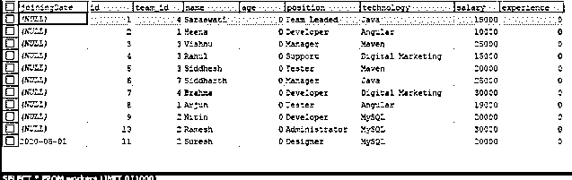

### 结论

我们可以使用 ALTER TABLE 命令来添加、修改和删除表中的列，还可以重命名列和表名。

### 推荐文章

这是一个指南，以改变表 MySQL。在这里，我们讨论一个关于 ALTER TABLE MySQL 的介绍，语法，如何使用 ALTER TABLE 进行不同的查询示例。您也可以浏览我们的其他相关文章，了解更多信息——

1.  [MySQL 中的自然连接](https://www.educba.com/natural-join-in-mysql/)
2.  [MySQL 中的唯一键](https://www.educba.com/unique-key-in-mysql/)
3.  [MySQL 自我加入](https://www.educba.com/mysql-self-join/)
4.  [MySQL 中的光标](https://www.educba.com/cursor-in-mysql/)

