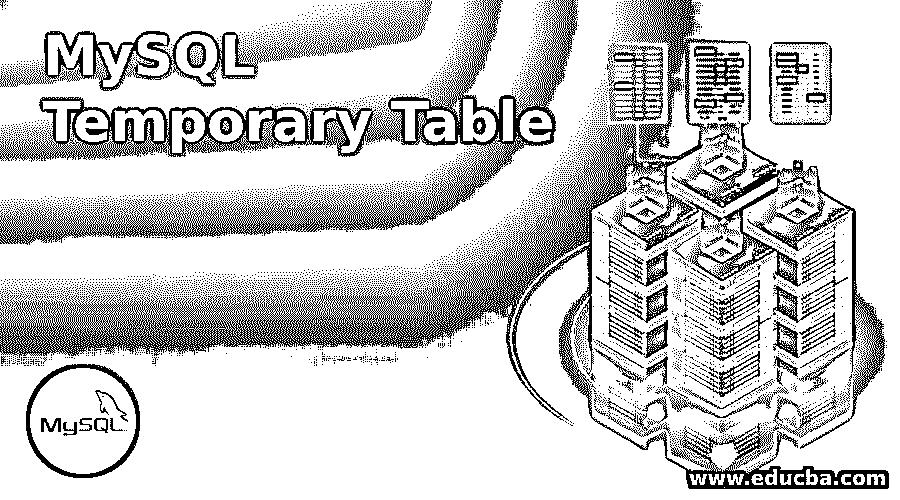
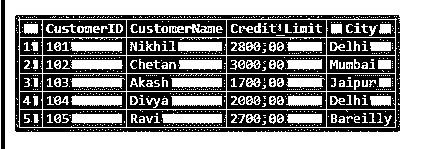
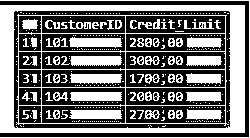
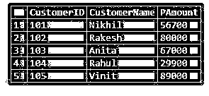
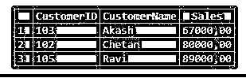
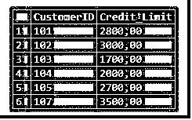

# MySQL 临时表

> 原文：<https://www.educba.com/mysql-temporary-table/>

## MySQL 临时表介绍

MySQL 临时表是一种在数据库中创建的临时表，用于获取结果行并短期存储，这样我们就可以在一个会话中多次使用它。基本上，当我们发现用只有 SELECT 关键字语句和 JOIN MySQL 子句的 SQL 查询获取数据很困难或代价很高时，临时表是非常容易管理的。因此，在这种情况下，我们可以选择设计一个临时表来保存即时数据结果集，然后应用另一个 SQL 查询来执行它。

### 句法

基本语法类似于表 Create 语句。简而言之，使用 CREATE TEMPORARY TABLE 查询生成一个临时表，并添加一个新的关键字 Temporary。

<small>Hadoop、数据科学、统计学&其他</small>

临时表的 MySQL 语句语法是:

`CREATE TEMPORARY TABLE TableA(Col1_Definition, Col2_Definition, …… , TableConstaints);`

但是要创建一个与现有表具有相同结构的表，我们不能使用 CREATE TEMPORARY TABLE… LIKE 查询语句。为此，让我们为临时表引入一种不同的语法:

`CREATE TEMPORARY TABLE Temporary_TableName
SELECT * FROM Original_TableLIMIT 0;`

### MySQL 中的临时表是如何工作的？

MySQL 临时表的特点是具有以下特殊功能:

我们可以发出一个类似于普通表的临时表名，但是在它生成之后，现有的主表将不可访问。如果您对该表执行任何查询，它现在将应用于临时表。但是当你删除了临时表，永久表就可以访问和管理了。通常，不建议对临时表和永久表使用相同的名称，因为这可能会产生任何误解，并可能导致数据库表中的任何数据在不知不觉中或突然丢失。

此外，例如，在会话期间，如果您与 MySQL 服务器的连接失败，那么假设过一会儿您再次连接到服务器。现在，在会话的这种情况下，您无法区分临时表和真实表。然后，您可能需要查询 DROP table 语句来删除表，这将删除原始表，而不是临时表，这将导致异常情况。但是，只需使用 DROP TEMPORARY Table query 语句删除临时表，就可以避免这种关键情况。

### 如何创建 MySQL 临时表？

我们将学习创建 MySQL 临时表的一些步骤。此外，首先让我们使用以下 SQL 语句创建一个永久表 Customer，它将作为下面示例的示例数据库表:

`CREATE TABLE Customer(CustomerID INT NOT NULL , CustomerName VARCHAR(255), Credit_Limit DEC(10,2), City VARCHAR (255), PRIMARY KEY (CustomerID));`

并通过以下查询将一些数据值插入到客户表中:

**代码:**

`INSERT INTO Customer(CustomerID, CustomerName, Credit_Limit, City) VALUES ('101','Nikhil','2800','Delhi'),
('102','Chetan','3000','Mumbai'),
('103','Akash','1700','Jaipur'),
('104','Divya','2000','Delhi'),
('105','Ravi','2700','Bareilly');`

**输出:**

#### 示例# 1–创建一个简单的临时表

让我们首先使用以下 SQL 语句创建一个名为 customer having credits 的新临时表:

`CREATE TEMPORARY TABLE Credit(CustomerIDINT PRIMARY KEY, Credit_Limit DEC(10,2));`

现在，我们将把原始客户表中的一些记录插入到临时信用表中。SQL 语句是这样的:

**代码:**

`INSERT INTO Credit(CustomerID, Credit_Limit)
SELECT CustomerID, Credit_Limit FROM Customer WHERE Credit_Limit >0;`

**输出:**

#### 示例 2——基于查询示例创建临时表

我们将在这里生成一个临时表，保存收入最高的 3 个客户的数据。但是首先，让我们用下面的 MySQL 语句创建另一个表支付:

`CREATE TABLE Payment(CustomerID INT NOT NULL, CustomerName VARCHAR (255),PAmount INT, PRIMARY KEY(CustomerID));`

使用下面的查询将一些记录插入为进一步处理而创建的上表中:

**代码:**

`INSERT INTO Payment(CustomerID, CustomerName, PAmount) VALUES
('101', 'Nikhil', '56700'),
('102', 'Rakesh', '80000'),
('103', 'Anita', '67000'),
('104', 'Rahul', '29900'),
('105', 'Vinit', '89000');`

**输出:**

#### 示例 3–从 SELECT SQL 语句派生的临时表的结构

**代码:**

`CREATE TEMPORARY TABLE TopCustomer
SELECT i.CustomerID, n.CustomerName, ROUND (SUM(i.PAmount),2)Sales
FROM Payments17 i INNER JOIN Customers17 n ON
n.CustomerID = i.CustomerID GROUP BY i.CustomerID ORDER BY Sales DESC LIMIT 3;`

现在，为了查看 top customer 临时表中的数据，我们可以使用与永久表相同的查询来获取数据。这是 SQL 查询:

`SELECT CustomerID, CustomerName, Sales FROM TopCustomer ORDER BY Sales;`

**输出:**

### 如何在 MySQL 临时表中插入数据？

根据上面的查询，我们创建了一个名为 Credit 的临时表，其中包含字段(CustomerID，Credit_Limit)。这里，让我们在同一个表中输入一些行来显示记录和插入过程。我们将在 MySQL 中使用以下查询语句来输入值:

**代码:**

`INSERT INTO Credit(CustomerID,Credit_Limit) VALUES ('107', '3500');`

这种结构类似于我们通常在 MySQL 中执行的将行插入永久表的操作。结果如下:

**输出:**

### 如何删除 MySQL 临时表？

我们需要使用后续的 DROP TABLE SQL 语句从数据库中删除一个临时表，而不是永久表:

`DROP TEMPORARY TABLE TableName;`

因此，在创建短期表时添加临时关键字是一个很好的做法。这种方法将有助于避免对原始表进行任何更改的风险，例如当我们为两个表指定相同的名称时，错误地处理查询或删除它。

例如，如果我们将此查询应用于上面创建的临时表，那么我们将得到如下结果:

**代码:**

`DROP TEMPORARY TABLE TopCustomer;`

**解释:**如果假设无论何时您想使用 SQL drop temporary 语句删除原始表，您都会收到一个错误或警告，说明该表未知是否要删除。

### 结论

当会话结束或出现任何终止的连接问题时，MYSQL 负责自动删除 MySQL 临时表。创建临时表的用户拥有特权视图，可以在会话期间访问该表。两个不同的用户可以在两个不同的会话中使用他们自己创建的同名临时表，而不会对彼此的会话造成任何影响。但是我们不能在同一个会话中创建两个同名的临时表。

### 推荐文章

这是一个 MySQL 临时表的指南。这里我们讨论一个 MySQL 临时表的介绍，它是如何工作的，如何创建，插入数据和删除表。您也可以浏览我们的其他相关文章，了解更多信息——

1.  MySQL 中的[表](https://www.educba.com/table-in-mysql/)
2.  [MySQL 子查询](https://www.educba.com/mysql-subquery/)
3.  [MySQL 中的光标](https://www.educba.com/cursor-in-mysql/)
4.  [MySQL 触发器](https://www.educba.com/mysql-trigger/)

