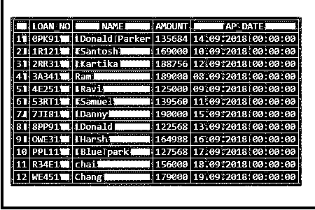
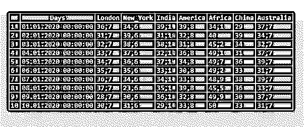

# MySQL 修复表

> 原文：<https://www.educba.com/mysql-repair-table/>

## MySQL 修复表介绍

MySQL 修复表就是修复损坏的表。此维修表并不适用于所有存储引擎。正常情况下，我们可能永远不会使用“修复表”，但是当灾难发生时，我们会从“MyISAM”表中取回数据。我们需要一些特权，比如表的 SELECT 和 INSERT。它仅适用于“MyISAM”存储引擎，不适用于“InnoDB”存储引擎。所以我们需要将存储引擎改为“MyISAM”。在执行“修复表”之前备份表总是一个好办法，因为这可能会导致数据丢失。我们有快速、扩展和使用 _FRM 选项，它们在语法级别上适用和定义。在本节中，让我们讨论“可修复的”以及示例。

### 句法

下面是 MySQL 修复表的语法

<small>Hadoop、数据科学、统计学&其他</small>

`REPAIR[NO_WRITE_TO_BINLOG|LOCAL] TABLEtable_name1[,table_name2]... [table_nameN] [QUICK][EXTENDED][USE_FRM]`

### MySQL 修复表是如何工作的？

让我们看看 MySQL 是如何修复表的

**代码:**

`REPAIR[NO_WRITE_TO_BINLOG|LOCAL] TABLEtable_name1[,table_name2]... [table_nameN] [QUICK][EXTENDED][USE_FRM]`

在这里，如果我们考虑每个选项及其用途:

**NO _ WRITE _ TO _ BINLOG | LOCAL:**默认情况下，二进制日志是服务器为复制从机写“修复表”的地方。为了抑制日志记录，我们指定选项“NO_WRITE_TO_BINLOG”或 Local。

**QUICK:** 如果我们指定了“QUICK”选项，这意味着我们试图只修复“索引”文件，而不是数据文件。基本上是由[**myisamchk——recover——quick**](https://dev.mysql.com/doc/refman/8.0/en/myisamchk.html)完成的。

**扩展:**用排序一次创建一个索引，而不是逐行创建。可以通过[**myisamchk-safe-recover**](https://dev.mysql.com/doc/refman/8.0/en/myisamchk.html)**完成。**

**使用 _FRM:** 如果。MYI 索引文件丢失或文件头损坏。此选项告诉不要信任。MYI 信息，并从数据字典中重新创建信息。myisamchk 做不到。

现在让我们创建这个表，改变存储引擎，并创建一个“修复表”。

**代码:**

`CREATE TABLE LOAN_TABLE(
LOAN_NO VARCHAR(25)PRIMARY KEY,
NAME VARCHAR(25),
AMOUNT INTEGER(10),
AP_DATE DATE
);`

将数据插入 loan_table 表:

**代码:**

`INSERT INTO LOAN_TABLE VALUES ('3A341','Ram', 189000,'2018-09-08');
INSERT INTO LOAN_TABLE VALUES ('4E251',' Ravi', 125000,'2018-09-09');
INSERT INTO LOAN_TABLE VALUES ('1R121',' Santosh', 169000,'2018-09-10');
INSERT INTO LOAN_TABLE VALUES ('53RT1',' Samuel', 139560,'2018-09-11');
INSERT INTO LOAN_TABLE VALUES ('2RR31',' Kartika', 188756,'2018-09-12');
INSERT INTO LOAN_TABLE VALUES ('8PP91',' Donald', 122568,'2018-09-13');
INSERT INTO LOAN_TABLE VALUES ('0PK91',' Donald Parker', 135684,'2018-09-14');
INSERT INTO LOAN_TABLE VALUES ('7JI81',' Danny', 190000,'2018-09-15');
INSERT INTO LOAN_TABLE VALUES ('OWE31',' Harsh', 164988,'2018-09-16');
INSERT INTO LOAN_TABLE VALUES ('PPL11',' Blue park', 127568,'2018-09-17');
INSERT INTO LOAN_TABLE VALUES ('R34E1','chai', 156000,'2018-09-18');
INSERT INTO LOAN_TABLE VALUES ('WE451','Chang',179000,'2018-09-19');`

现在让我们选择表格:

`select * from LOAN_TABLE;`

**输出:**

下面的查询用于检查指定表的存储引擎。

**代码:**

`select table_name, engine from information_schema.tables where table_name='loan_table';`

**输出:**

这里是“InnoDB”。因此，当我们为此存储引擎表创建修复表时，它会抛出一个错误:

**代码:**

`REPAIR TABLE LOAN_TABLE;`

**输出:**

将表存储引擎改为“MyISAM”，然后尝试创建“修复表”。

**代码:**

`ALTER TABLE LOAN_TABLE ENGINE='MyISAM';
Now let us create the “repair table” for the loan_table;
REPAIR TABLE LOAN_TABLE;`

**输出:**

从这里的输出中，我们可以看到它有四列 Table、Op、Msg_type 和 Msg_text。

| **列名** | **描述** |
| 桌子 | 它指定了表的名称 |
| 外科手术 | 总是“修理” |
| 消息类型 | 它可以是状态、错误、信息或警告 |
| 消息 _ 文本 | 它由消息组成 |

### 实现 MySQL 修复表的例子

现在让我们创建另一个表:

#### 示例#1

**代码:**

`create table Weather_temperature
(
Days date,
London Float (5,2),
New_York Float (5,2),
India Float (5,2),
America Float (5,2),
Africa Float (5,2),
China Float (5,2),
Australia Float (5,2)
)ENGINE=MyISAM;  /* -- Storage engine as “MyISAM” instead of default one “InnoDB” -*/`

现在让我们将数据插入下表:

**代码:**

`insert into weather_temperature values ('2020-01-01', 36.7, 34.6, 39.1, 39.8, 34.1, 29.0, 37.7 );
insert into weather_temperature values ('2020-01-02', 31.7, 39.6, 31.1, 32.8, 40.0, 39.0, 34.7 );
insert into weather_temperature values ('2020-01-03', 32.7, 38.6, 38.1, 31.8, 45.2, 34.0, 32.7 );
insert into weather_temperature values ('2020-01-04', 33.7, 37.6, 32.1, 36.8, 49.1, 31.0, 37.7 );
insert into weather_temperature values ('2020-01-05', 34.7, 36.6, 37.1, 34.8, 49.7, 36.0, 39.7 );
insert into weather_temperature values ('2020-01-06', 35.7, 35.6, 33.1, 30.8, 49.2, 33.0, 31.7 );
insert into weather_temperature values ('2020-01-07', 36.7, 34.6, 34.1, 33.8, 48.9, 38.0, 39.7 );
insert into weather_temperature values ('2020-01-08', 37.7, 23.6, 35.1, 39.8, 45.5, 36.0, 33.7 );
insert into weather_temperature values ('2020-01-09', 28.7, 30.6, 36.1, 32.8, 49.9, 30.0, 37.7 );
insert into weather_temperature values ('2020-01-10', 30.7, 31.6, 29.1, 33.8, 50.0, 33.0, 31.7 );`

现在让我们选择该表并查看输出:

`SELECT * FROM WEATHER_TEMPERATURE;`

**输出:**

#### 实施例 2

在这里，我们创建了存储引擎为“MyISAM”的表。因此修复表将被正确执行:

**代码:**

`REPAIR TABLE WEATHER_TEMPERATURE_DATA QUICK extended;`

**输出:**

### 结论

MySQL 修复表用于修复损坏的表。此维修表并不适用于所有存储引擎。它仅适用于“MyISAM”存储引擎，不适用于“InnoDB”存储引擎。所以我们需要将存储引擎改为“MyISAM”。在执行“修复表”之前备份表总是一个好办法，因为这可能会导致数据丢失。我们有快速、扩展和使用 _FRM 选项，它们在语法级别上适用和定义。

### 推荐文章

这是一个 MySQL 修复表的指南。这里我们讨论一个介绍 MySQL 修复表，语法，它是如何工作的查询例子。您也可以浏览我们的其他相关文章，了解更多信息——

1.  [MySQL 管理](https://www.educba.com/mysql-administration/)
2.  [MySQL 数据库修复](https://www.educba.com/mysql-database-repair/)
3.  [MySQL 服务器](https://www.educba.com/mysql-server/)
4.  [MySQL 时间戳](https://www.educba.com/mysql-timestamp/)

