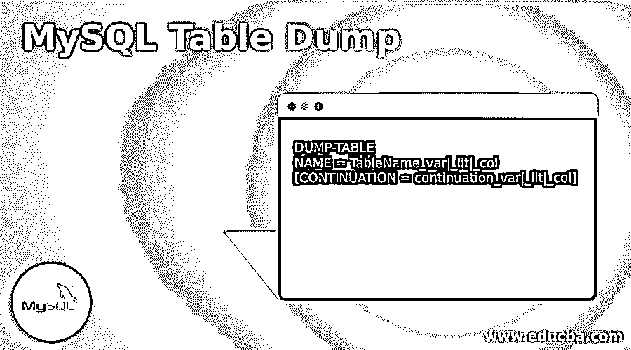

# MySQL 表转储

> 原文：<https://www.educba.com/mysql-table-dump/>

## MySQL 表转储简介

MySQL 表转储是一种负责转储由 MySQL 服务器组织的不同数据库的技术。数据库转储是一种文本文件，包括数据库表结构的记录或/和通常在 SQL 语句列表中排列的数据。通常，实现 MySQL 表转储是为了备份服务器中可用的一个或多个数据库，以便在发生任何数据丢失时可以更新它们的数据内容。使用转储分析，通常可以恢复损坏的数据库。这种数据库转储通常由任何允许分叉或重用该数据库的自由软件或内容项目发布。

### MySQL 表转储的语法

MySQL 表转储的功能是将整个表的内容转储到一个 SPF 文件中。

<small>Hadoop、数据科学、统计学&其他</small>

对于这个 MySQL 表转储，我们将使用如下语法:

`DUMP-TABLE
NAME = TableName_var|_lit|_col
[CONTINUATION = continuation_var|_lit|_col]`

让我们看看上面使用的参数和关键字:

*   **NAME:** 表示由 CREATE_TABLE 创建的表名。
*   **CONTINUATION:** 表示表内容是否是前面 DUMP_TABLE 查询命令的持久化，如果存在，则有效值可以是 YES 或 no，缺省值为 NO。

**语法描述:**

MySQL 转储表可以应用于除 BEGIN-DOCUMENT、BEGIN-SETUP 和 BEGIN-SQL 之外的任何部分。此外，转储到 SPF 文件中的数据信息以一种格式存在，增强的 HTML 或通用驱动程序可以使用这种格式来生成一致的结果，如 BQD、CSV 和 XML。

**例如:**

`DUMP_TABLE
Name=’Employees’
Continuation=’Yes’`

mysqldump 工具位于 MySQL 安装文件夹的 bin/根目录或文件夹中。要访问 mysqldump 工具，用户需要导航到 bin/根目录，并且应该使用命令 mysqldump，该命令具有常见的后续选项:

*   **Add-drop-table:** 包含对每个数据库表的 DROP TABLE 查询。
*   **Add-locks:** 由每次插入查询前后的锁表和解锁表查询组成。因此，它提高了从转储文件恢复数据的速度。
*   **All-databases:** 在服务器中建立所有 MySQL 数据库的转储。
*   **Create-options:** 包含每个表的 CREATE TABLE 查询中的字符集和引擎选项。
*   **数据库:**创建多个数据库的转储。
*   **Disable-keys:** 在为 MyISAM 数据库表加载数据时，启动 MySQL 来停用索引更新。因此，加载由 mysqldump 完成，MySQL 将创建索引来提高更新速度。
*   **扩展插入:**将单行插入查询关联到一个插入多个表行的查询中。
*   **刷新日志:**在转储数据库数据之前，会刷新服务器日志。
*   **Lock-tables:** 在转储过程中，为确保快照一致，mysqldump 会锁定所有数据库表。
*   **No-data:** 创建一个包含 SQL 语句的转储文件，只重新创建数据库结构而不创建数据。
*   **Opt:** mysqldump opt 启用之前或之后描述的所有其他选项。如果我们想禁用，则应用 skip- <选项名>。
*   **Quick:** 命令 mysqldump 在写入文件之前不要在内存中缓冲表。
*   **结果文件:**提供输出转储文件的方法。
*   **Set-charset:** 标识数据库的字符集，如 latin1 或 utf8。
*   **表:**转储多个表。
*   **Where:** 转储满足 Where 子句中条件的表行。

### MySQL 中的表转储是如何工作的？

在 MySQL 中，实现了 mysqldump 查询命令来转储由 MySQL 完成的数据库。

让我们看看 MySQL 中数据库转储的三个主要案例，如下所示:

1.整个 MySQL 数据库转储中最幼稚的案例。

**MySQL dump–u 用户名–p 密码数据库名>the _ entire _ database _ dump . SQL**

2.有时，可能需要转储特定的数据库表，这样用户就可以用后续的方法来处理它。

**MySQL dump–u user _ name–p password databasename tablename>detail _ table _ dump . SQL**

在这里，用户还可以定义由空格分隔的各种其他表，以便只将这些表转储到数据库中。

3.如果用户只需要转储符合特定条件的表行，那么您需要在 mysqldump 查询命令中添加 WHERE 关键字选项。

假设，我们有一个如下的图示来显示转储 join_date 是明天的特定行。

**MySQL dump–u user _ name–p password databasename tablename–WHERE = " join _ date " = ' 2020-09-20 '**

Mysqldump 通常不会在现代硬件上消耗大量的 CPU 资源，因为默认情况下 mysqldump 只应用一个线程。因此，这个过程对于一个负载过重的服务器来说是不错的。

### MySQL 表转储示例

我们实现了 mysqldump 查询工具，在服务器上建立 MySQL 数据库的备份。

让我们使用 mysqldump 来说明流程和命令执行，如下所示:

#### 示例#1

用 mysqldump 工具制作数据库备份。

以下命令仅备份 MySQL 服务器中一个数据库的数据:

**代码:**

`mysqldump -- user=<username> -- password=<password> -- resultfile=<backup_file_path> -- databases <databasename>`

这里，

*   用户名定义了登录 MySQL 服务器的用户帐户。
*   密码表示用户名使用的密码。如果没有密码，请留空。
*   备份文件路径定义了备份文件的路径。
*   –databases 表示引导 mysqldump query 创建特定数据库转储的选项。
*   databasename 定义了用户想要备份的特定数据库的名称。

假设，下面的查询将数据库“test”备份到备份文件夹中的文件 c:\backup\test.sql:

**代码:**

`Mysqldump –user=root –password=   --resultfile=c:\backup\test.sql –databases test.sql –databases test`

#### 实施例 2

用 mysqldump 工具备份多个数据库。

以下命令通过在–database 选项后列出 MySQL 数据库名称，从 MySQL 服务器备份多个数据库的数据:

**代码:**

`mysqldump -- user=<username> -- password=<password> -- resultfile=<backup_file_path> -- databases <databasename1>[, < databasename2>,< databasename3>,…]`

**例如:**

要备份两个数据库:

**代码:**

`Mysqldump –user=root –password=   --resultfile=c:\backup\testall.sql –databases test.sql –databases test achu`

#### 实施例 3

不同数据库表的备份。

我们将使用以下查询:

**代码:**

`mysqldump -- user=<username> -- password=<password> -- resultfile=<backup_file_path> -- databases <databasename> <tablename>`

或者，我们可以在上面的语法中添加多个表名，如下所示:

`mysqldump -- user=<username> -- password=<password> -- resultfile=<backup_file_path> -- databases <databasename> <tablename1> <tablename2> <tablename3>`

假设我们从测试数据库中备份 Books 表，如下所示:

**代码:**

`Mysqldump –user=root –password=   --resultfile=c:\backup\books.sql –databases test.sql –databases test books`

### 结论

MySQL 表转储是一个查询工具，它允许用户通过生成一个包含 SQL 命令的文本文件来备份单个或多个数据库，该文本文件能够从头开始恢复服务器中以前的数据库。这类似于执行逻辑备份的客户端实用程序，在执行时会再现数据库和表数据的原始对象定义。即使这样，它也可以转储数据库进行备份或转移到其他 MySQL 服务器。

### 推荐文章

这是一个 MySQL 表转储的指南。这里我们讨论一下引言，表转储在 MySQL 中是如何工作的？并分别举例说明。您也可以看看以下文章，了解更多信息–

1.  [MySQL 删除连接](https://www.educba.com/mysql-delete-join/)
2.  [MySQL 数学函数](https://www.educba.com/mysql-math-functions/)
3.  [MySQL 列表用户](https://www.educba.com/mysql-list-user/)
4.  [mysql_real_escape_string](https://www.educba.com/mysql_real_escape_string/)

