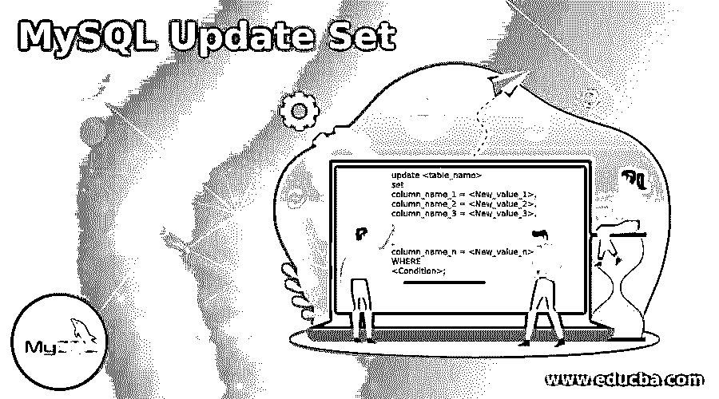
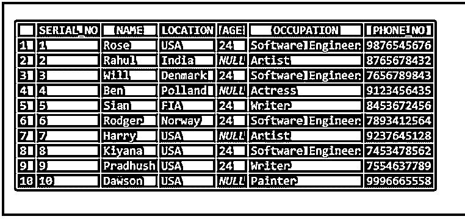
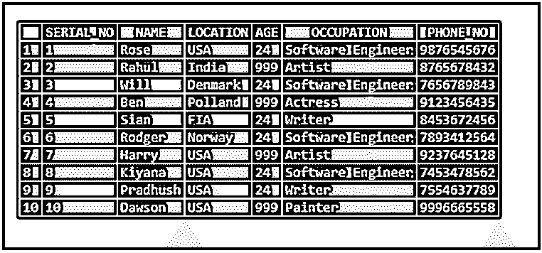
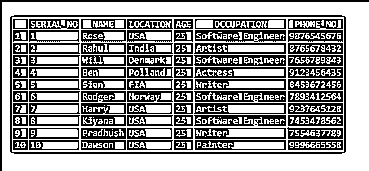
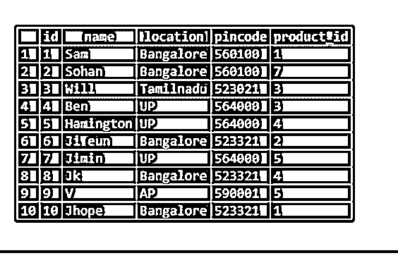
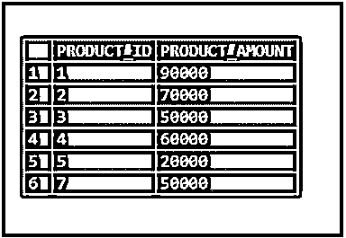
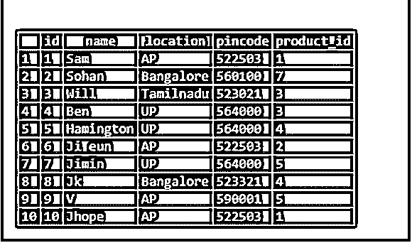

# MySQL 更新集

> 原文：<https://www.educba.com/mysql-update-set/>

## MySQL 更新集的定义

Update 用于修改表中的现有数据。更新集将根据“WHERE”子句中指定的条件修改单行值或多行值。满足“Where”子句条件的行将被修改，其余的保持不变。我们使用“SET”子句传递值。如果我们省略' where '子句，那么' Update '将设置表中的所有行。在本节中，我们将通过示例进一步了解更新集如何在有条件和无条件的表上工作:-

**语法:**

<small>Hadoop、数据科学、统计学&其他</small>

以下是更新集的语法:–

`update <table_name>
set
column_name_1 = <New_value_1>,
column_name_2 = <New_value_2>,
column_name_3 = <New_value_3>,
.
.
.
column_name_n = <New_value_n>
WHERE
<Condition>;`

### MySQL 更新集是如何工作的？

现在让我们看看更新集是如何在表上工作的:–

让我们考虑下表，其中包含以下值。让我们尝试根据某些条件更新表中的表值。

`CREATE TABLE test_update
(
SERIAL_NO INT
, NAME VARCHAR(20)
, LOCATION VARCHAR(20)
, AGE INT
, OCCUPATION VARCHAR(20)
, PHONE_NO VARCHAR(10)
);`

现在让我们将数据插入表中:–

`INSERT INTO TEST_UPDATE VALUES (1, 'Rose', 'USA', 24, 'Software Engineer', '9876545676' );
INSERT INTO TEST_UPDATE VALUES (2, 'Rahul', 'India', NULL , 'Artist', '8765678432' );
INSERT INTO TEST_UPDATE VALUES (3, 'Will', 'Denmark', 24, 'Software Engineer', '7656789843' );
INSERT INTO TEST_UPDATE VALUES (4, 'Ben', 'Polland', NULL , 'Actress', '9123456435' );
INSERT INTO TEST_UPDATE VALUES (5, 'Sian', 'FIA', 24, 'Writer', '8453672456' );
INSERT INTO TEST_UPDATE VALUES (6, 'Rodger', 'Norway', 24, 'Software Engineer', '7893412564' );
INSERT INTO TEST_UPDATE VALUES (7, 'Harry', 'USA', NULL, 'Artist', '9237645128' );
INSERT INTO TEST_UPDATE VALUES (8, 'Kiyana', 'USA', 24, 'Software Engineer', '7453478562' );
INSERT INTO TEST_UPDATE VALUES (9, 'Pradhush', 'USA', 24, 'Writer', '7554637789' );
INSERT INTO TEST_UPDATE VALUES (10, 'Dawson', 'USA', NULL, 'Painter', '9996665558' );`

现在让我们看看表格中的数据

`Select * from test_update;`

现在让我们将成员的表“年龄”更新为“999”，其中“年龄”为“空”。下面是相同的声明:—

`UPDATE TEST_UPDATE
SET AGE = 999
WHERE AGE IS NULL;`

上述语句根据条件“年龄为空”将行“年龄”更新为“999”。让我们看看表格数据。

`SELECT * FROM TEST_UPDATE;`

现在让我们尝试在表上使用“update set ”,而不在“where”子句上指定条件。

`UPDATE TEST_UPDATE
SET AGE = 25;`

这里我们没有指定任何条件作为“Where”子句。如前所述，如果我们省略' where '子句，那么 update 语句将更新表中的所有行。在这里，基于上面的更新语句，表‘TEST _ UPDATE’中的所有行将被更新为‘25’。

现在让我们看一下表格，检查“年龄”是否更新为“25”。因为我们省略了“where”子句，所以表中的所有行将被更新，并且“Age”列的值将被设置为 25。

`SELECT * FROM TEST_UPDATE;`

### MySQL 更新集的示例

现在，让我们考虑另一个表，并对该表应用“更新:–

`create table UPDATE_PEOPLE
(
id int,
name varchar(20),
location varchar(20),
pincode int,
product_id int
);`

将以下各行插入表格，如下所示:–

`insert into UPDATE_PEOPLE values (1, 'Sam', 'Bangalore', 560100,1);
insert into UPDATE_PEOPLE values (2, 'Sohan', 'Bangalore', 560100,7);
insert into UPDATE_PEOPLE values (3, 'Will', 'Tamilnadu', 523021,3);
insert into UPDATE_PEOPLE values (4, 'Ben', 'UP', 564000,3);
insert into UPDATE_PEOPLE values (5, 'Hamington', 'UP', 564000,4);
insert into UPDATE_PEOPLE values (6, 'Ji eun', 'Bangalore', 523321,2);
insert into UPDATE_PEOPLE values (7, 'Jimin', 'UP', 564000,5);
insert into UPDATE_PEOPLE values (8, 'Jk', 'Bangalore', 523321,4);
insert into UPDATE_PEOPLE values (9, 'V', 'AP', 590001,5);
insert into UPDATE_PEOPLE values (10, 'Jhope', 'Bangalore', 523321,1);`

现在让我们从表中选择数据:–

`SELECT * FROM UPDATE_PEOPLE;`

另一个表格如下:–

`CREATE TABLE PRODUCT
(
PRODUCT_ID INT,
PRODUCT_AMOUNT INT
);`

将数据插入如下表格:–

`INSERT INTO PRODUCT VALUES ( 1, '90000');
INSERT INTO PRODUCT VALUES ( 2, '70000');
INSERT INTO PRODUCT VALUES ( 3, '50000');
INSERT INTO PRODUCT VALUES ( 4, '60000');
INSERT INTO PRODUCT VALUES ( 5, '20000');
INSERT INTO PRODUCT VALUES ( 7, '50000');
Select * from PRODUCT;`

外部查询将根据子查询的输入更新值。

我们也可以根据子查询值更新表中的行。下面是同样的例子:–

`UPDATE UPDATE_PEOPLE
SET LOCATION = 'AP',
PINCODE = 522503`

where PRODUCT_ID IN(从产品中选择 PRODUCT_ID，其中 PRODUCT _ AMOUNT > 60000)；

`Select * from UPDATE_PEOPLE;`

在这里，如果我们讨论上面的查询，首先执行子查询并返回值。这里的值试图将位置值更新为“AP ”,并将密码更新为 522503。如果该值已经是请求值，将其更改为类似值不会损害数据。

`select PRODUCT_ID from PRODUCT WHERE PRODUCT_AMOUNT>60000;`

在这里，上面的查询执行并根据条件“WHERE PRODUCT_AMOUNT>60000”返回“PRODUCT_ID”值。

### 结论

*   Update 用于修改表中的现有数据。更新集将根据“WHERE”子句中指定的条件修改单行值或多行值。
*   满足“Where”子句条件的行将被修改，其余的保持不变。我们使用“SET”子句传递值。如果我们省略' where '子句，那么' Update '将设置表中的所有行。

### 推荐文章

这是一个 MySQL 更新集的指南。在这里，我们还将讨论 mysql 更新集的定义和工作原理。以及不同的示例及其代码实现。您也可以看看以下文章，了解更多信息–

1.  [MySQL 拥有](https://www.educba.com/mysql-having/)
2.  [MySQL BLOB](https://www.educba.com/mysql-blob/)
3.  [MySQL today()](https://www.educba.com/mysql-today/)
4.  [MySQL 创建函数](https://www.educba.com/mysql-create-function/)

