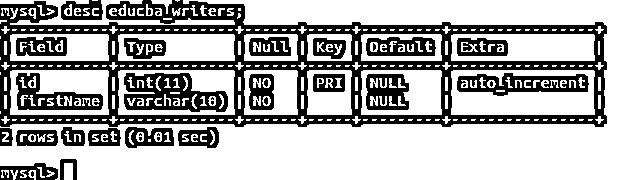
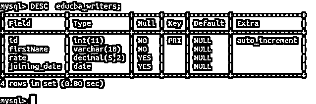
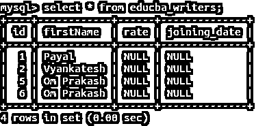
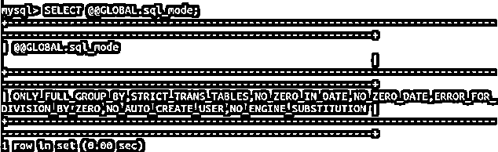
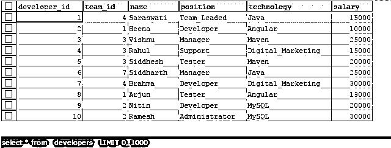
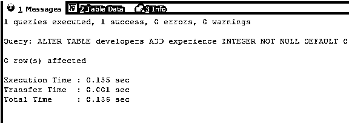
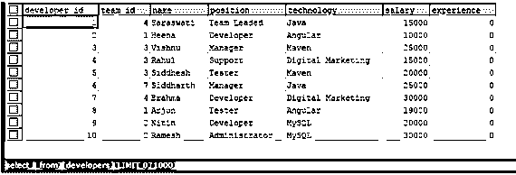
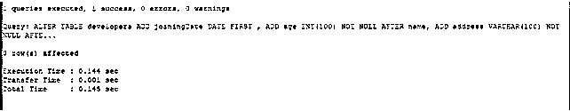
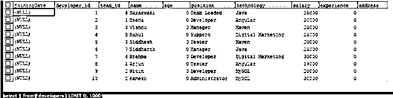
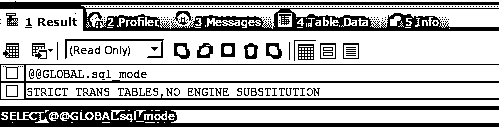

# MySQL ALTER TABLE 添加列

> 原文：<https://www.educba.com/mysql-alter-table-add-column/>

## MySQL ALTER TABLE 添加列简介

在 MySQL 中，ALTER TABLE 命令用于更改表名或重命名表中的一列或多列，添加新列，删除现有列，修改一列或多列的数据类型、长度和索引，我们还可以重命名表名。该命令通常与 ADD、DROP 和 MODIFY 语句一起使用，具体取决于您希望对表、其列或索引执行的操作。我们甚至可以使用 ALTER TABLE 命令改变表中列的顺序。在本文中，我们将借助示例学习 ALTER TABLE 命令语句的语法和用法，以便将列添加到表中。

**用 ADD 命令改变表语句-**

<small>Hadoop、数据科学、统计学&其他</small>

我们可以通过使用带有 add 命令的 ALTER TABLE 语句在现有表中添加一列或多列。使用 ALTER 语句添加列的语法如下

`ALTER TABLE name_of_table
ADD name_of_new_column details_of_column
[ FIRST | AFTER name_of_existing_column ];`

*   **name _ of _ table**–这是我们希望使用 ALTER query 在其中添加新列的现有表的名称。
*   **name _ of _ new _ column**–这是我们添加到表格中的新列的名称。
*   **details _ of _ column**–这有助于指定我们正在添加的新列的详细信息和定义，包括列的数据类型和其他详细信息，如 NULL 或 NOT NULL、UNIQUE 等。
*   **name _ of _ existing _ column**–我们可以通过使用第一个和第二个关键字来指定要添加的列相对于 name_of_table 表中列的现有位置的位置。FIRST 表示新列将放在开头，AFTER 表示新列在表中 name_of_existing_column 命名列之后的位置。添加新列的默认位置是最后。

### 使用命令行的示例

考虑一个名为 educab_writers 的表，当我们使用

`DESC educba_writers;`

**命令:**

现在，我们想使用 ALTER TABLE 命令向 educba_writers 表添加两个名为 rate 和 joining_date 的列。rate 的数据类型将是小数，精度和小数位数为(5，2)，joining_date 的数据类型应为 date。我们可以编写包含 ADD 语句的 ALTER TABLE 查询，以如下方式添加两列

`ALTER TABLE educba_writers
ADD rate DECIMAL(5,2),
ADD joining_date DATE;`

执行上述查询语句会在命令行上产生以下输出–

让我们使用以下查询语句再次描述 educba_writers 表，以检查我们的列是否添加成功

`DESC educba_writers;`

这将产生以下输出–

让我们检索 educab_writers 表中的记录，并查看现有记录的添加列的值

`select * from educba_writers;`

这将产生以下输出–

所有列值的默认值都为 NULL。

新添加的列的默认值取决于 SQL 模式的值。可以通过执行以下查询来检查该值–

`SELECT @@GLOBAL.sql_mode;`

这在我上面使用的命令行数据库服务器上给出了以下输出

**使用 SQLYog 客户端工具的示例**–

让我们考虑一个名为 developers 的现有表。执行以下选择命令后-

`SELECT * FROM `developers`;`

它给出了以下输出–

现在，我们想再添加一个名为 experience 的列，它的数据类型是 integer，因为它将存储年值。为此，我们可以使用带有 ADD 命令的 ALTER TABLE 语句，查询如下所示

`ALTER TABLE developers
ADD experience INTEGER NOT NULL DEFAULT 0;`

执行上述查询将得到以下结果

让我们通过使用以下查询选择它来检查记录

`SELECT * FROM `developers`;`

这将产生以下输出–

注意，新添加的经验列的值被设置为 0，正如我们在列定义中提到的。

我们甚至可以在单个查询语句中添加多个列。假设，我们想再添加三个名为 joiningDate、age 和 address 的列。我们可以通过执行以下 ALTER TABLE 命令来做到这一点

`ALTER TABLE developers
ADD joiningDate DATE
FIRST,
ADD age INT NOT NULL
AFTER NAME,
ADD address VARCHAR(100) NOT NULL
AFTER experience;`

这给出了以下输出–

现在，让我们通过执行以下 select 查询，从 developers 表中检索记录，以查看我们的更改

`SELECT * FROM `developers`;`

这将产生以下输出–

正如我们所看到的，所有新列都被添加到它们各自的位置，并根据它们的数据类型初始化为默认值。整数数据类型列的默认值为 0，varchar，即字符串为空，日期为空。新添加的列的默认值取决于 SQL 模式的值。可以通过执行以下查询来检查该值–

`SELECT @@GLOBAL.sql_mode;`

这在我的远程服务器上给出了以下输出，我们使用了上面使用的名为 SQL yog 的客户端工具

### 结论:MySQL ALTER TABLE 添加列

我们可以使用 ALTER TABLE 命令来添加、修改和删除表中的列，还可以重命名列和表名。当我们将 ADD 语句与 ALTER TABLE 命令一起使用时，我们可以将单个或多个列添加到现有的表中，并使用 ALTER TABLE 命令定义约束和限制以及要添加的新列的数据类型。

如果没有为新添加的列指定默认值，则 MYSQL 会将默认值赋给该列为 NULL，或者根据为该列定义的数据类型(如 string，即 VARCHAR 数据类型将具有""值作为默认值，INT 或 INTEGER 数据类型的列将具有 0(零)值作为默认值，依此类推，这取决于严格 SQL 模式的值，并且 SQL 的其他变量具有分配给它们的适当值。

### 推荐文章

这是一个 MySQL 的 ALTER TABLE 添加列的指南。在这里，我们讨论介绍、语法、描述以及使用命令行和代码实现的例子。您也可以浏览我们的其他相关文章，了解更多信息——

1.  [MySQL 拥有](https://www.educba.com/mysql-having/)
2.  [MySQL BLOB](https://www.educba.com/mysql-blob/)
3.  [MySQL encode()](https://www.educba.com/mysql-encode/)
4.  [MySQL today()](https://www.educba.com/mysql-today/)

