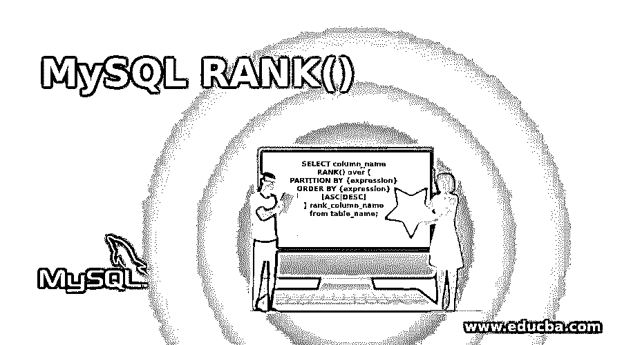
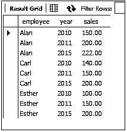
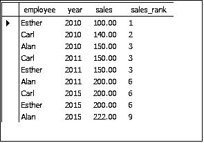
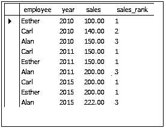
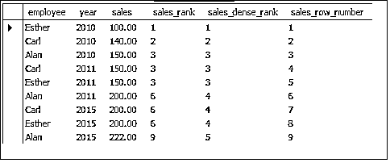

# MySQL 排名()

> 原文：<https://www.educba.com/mysql-rank/>

## MySQL RANK()简介

MySQL 中的 RANK()函数会显示一行的排名。行的这一等级将在其分区内定义，并且这一等级之间将有间隙。假设有一组具有不同值的行，如商品的价格、学生的分数等等。按升序排序时，如果我们需要得到某个分数的学生的排名，用 rank()函数很容易捕捉到。RANK()函数与 ROW_NUMBER()函数和 DESE_RANK()函数有相似之处。

### 句法

RANK()函数与“over”子句、“partition by”子句和“order by”子句一起使用。但是' partition by '子句是可选的。RANK()函数可以对整个结果集的小部分执行，也可以按原样对整个结果集执行。如果要考虑结果集的小集合，那么“partition by”子句是必须的。请注意，当跨越分区边界时，该函数将被重新初始化。

<small>Hadoop、数据科学、统计学&其他</small>

RANK()函数的语法如下:

`SELECT column_name
RANK() over (
PARTITION BY {expression}
ORDER BY {expression} [ASC|DESC] ) rank_column_name
from table_name;`

*   RANK()在 SELECT 查询中使用，从所考虑的表中返回所需的行等级作为输出。
*   RANK()over(…)rank_column_name–查询的这一部分将返回 RANK()函数的结果，输出将列保存为 RANK _ column _ name
*   PARTITION BY { expression }-这部分查询将根据子句中提供的表达式进行分区(如果需要)。这是 RANK()中的可选子句
*   ORDER BY { expression }[ASC | desc]–这部分查询将按升序或降序对结果集进行排序。必须对结果进行排序，才能将等级分配给行。一旦按顺序排列，只有这样，我们才能确定价值观中是否有联系。

### RANK()在 MySQL 中是如何工作的？

如前所述，RANK()函数返回特定分区下的行的等级，这些行按照升序或降序排列。此函数将列中的相同值视为平局，并跳过分配连续的等级，而是将相同的等级分配给平局的行。这就造成了排名的差距或漏洞。

让我们用一个例子来详细探讨这一点。

使用上面给出的语法，让我们编写一个带有 RANK 函数的查询。(不使用 partition 子句)。作为参考，我们可以考虑员工表。

该表保存了每个雇员每年的销售额数据。现在我们可以对行进行排序并获得输出。

**查询:**

`select employee, year, sales,
RANK() over (
order by salesasc
)sales_rank
from sales;`

**输出:**

让我们来理解一下查询和输出。

该查询要求显示列 employee、year、sales 和 RANK()，其中 RANK 列的标题为 sales_rank。此外，还有一个 ORDER BY 子句，它指定按 sales 列的升序对数据进行排序。因此，首先，数据按照销售数量的升序排序，然后将等级分配给每一行并显示数据。

现在，考虑输出。我们可以看到，等级的分配是有差距的。例如，当 sales 列中出现平局时，Alan、Carl 和 Esther 的销售额为 150(尽管是在不同的年份)，所有三行都被分配相同的等级“3”。还要注意，在三次分配等级“3”之后，分配的下一个等级是“6 ”,因为由于 sales 列中的平局，可以具有等级“4”和“5”的行已经获得了等级“3”。因此，等级“4”和“5”被省略，等级“6”被分配给第 6 行。现在，等级“6”又重复了两次，因此等级“7”和“8”由于在值 200 的销售列中的联系而被省略。等级“9”被分配给第 9 行行。

因此，我们看到 RANK()函数中的差距是由于值列中的联系造成的。

让我们将 partition by 子句也包含在上面的查询中，并查看结果。

**查询:**

`select employee, year, sales,
RANK() over (
partition by year
order by salesasc
)sales_rank
from sales;`

**输出:**

该查询可以解释如下-

*   选择并显示 employee、year、sales 和 RANK()，其中 RANK 列的标题为 sales_rank。
*   根据年份对数据进行分区——因此数据应该显示 2010 年、2011 年和 2015 年每个员工的销售额。
*   现在根据每个员工的销售数量对内容进行排序。
*   因此，在 2010 年，Esther 完成的最少销售额是 100，然后是 Carl 的 140，最后是 Alan 的 150。其他员工也是如此。

对于 2010 年，输出可以被解释为在销售列中没有联系，因此等级以升序排列。但是在 2011 年，在 Carl 和 Esther 之间有一个值为 150 的平局，这使得两者的等级都是“1”，而 Alan 的等级是“3”。2015 年也是如此。

这里需要注意的重要一点是，当使用 partition by 子句时，将在每个分区重新初始化等级。

我们可以用 DENSE RANK()重写查询，来理解没有间隙的排名。在这里，所有的行都以连续的顺序提供了等级值，没有间隔，即使在 sales 列中也是如此。row_number()函数将只显示行号，而不考虑任何绑定的值。

**查询:**

`select employee, year, sales,
RANK() over (
order by salesasc
)sales_rank,
DENSE_RANK() over (
order by salesasc
)sales_dense_rank,
row_number() over (
order by salesasc
)sales_row_number
from sales;`

**输出:**

提供这个示例只是为了理解 RANK()和 DENSE_RANK()以及 row_number()函数之间的区别。

### 结论

因此，RANK()函数将分配并返回结果表的一个分区或完整集中的每一行的等级。该函数共享具有相同值的行的等级，因此在等级集中留下了漏洞。

### 推荐文章

这是 MySQL RANK()的指南。在这里，我们将讨论 RANK()在 MySQL 中是如何工作的，以及语法、查询示例和解释。您也可以看看以下文章，了解更多信息–

1.  [MySQL 子查询](https://www.educba.com/mysql-subquery/)
2.  [MySQL 中的汇总](https://www.educba.com/rollup-in-mysql/)
3.  [MySQL 自我加入](https://www.educba.com/mysql-self-join/)
4.  [MySQL 外部连接](https://www.educba.com/mysql-outer-join/)

