# MySQL 提取()

> 原文：<https://www.educba.com/mysql-extract/>

## MySQL EXTRACT()函数介绍

MySQL EXTRACT()函数是日期和日期时间相关的函数之一，它从指定的日期或日期时间值中提取一部分。这个 MySQL EXTRACT()函数不实现日期计算，而只是向我们提供函数参数中给出的日期或日期时间值的一部分。此外，像 DATE_ADD()和 DATE_SUB()这样具有单元标识符的函数可以与 MySQL 中的 EXTRACT()函数一起工作。使用，提取()年、日或月部分等。可以提取起始日期值。同样，你可以去掉秒、分、小时或微秒等部分。从日期时间时间部分组件。

### 句法

我们有以下 MySQL EXTRACT()函数的语法代码:

<small>Hadoop、数据科学、统计学&其他</small>

`EXTRACT(Unit_Value FROM DATE_Value)`

语法中作为 EXTRACT()函数的参数提供的术语描述如下:

**DATE_Value:** 表示函数运行时负责提取日期部分的 DATE 或 DateTime 的必需值。

**Unit_Value:** 它定义了我们想要从日期值中取出的间隔。这可以是以下任何有效间隔之一:

*   第二
*   分钟
*   微秒
*   秒微秒
*   小时
*   周
*   天
*   月
*   年
*   四分之一
*   分钟秒
*   分钟微秒
*   小时 _ 秒
*   小时微秒
*   小时分钟
*   天 _ 秒
*   日微秒
*   日时
*   日分钟
*   年 _ 月

### MySQL EXTRACT()函数是如何工作的？

当我们在提取函数中传递参数值时，那么根据给定的日期或日期时间值，我们可以生成我们想要的一部分。我们还使用 MySQL SELECT 语句命令来执行 EXTRACT()函数。我们甚至可以对数据库中数据类型为 DATE 或 DATETIME 的表的列应用 EXTRACT()操作。

假设，我们想使用以下查询语句从日期中提取月份部分:

`SELECT EXTRACT(MONTH FROM ‘2020-05-17’);`

上述查询将输出结果作为 06 或 6 执行，这表示从为函数设置的日期值中提取的月份。

同样，让我们从函数 EXTRACT()参数的 DateTime 部分接收时间部分。SQL 语句如下所示:

`SELECT EXTRACT(HOUR FROM ‘2020-05-17 08:30:25’);`

因此，函数的结果是 8 提供时间值“08:30:25”中的小时部分。

### MySQL 中实现 EXTRACT()函数的例子

让我们考虑一些与 MySQL EXTRACT()函数相关的示例，并使用不同的时间间隔来探索该函数在 MySQL 中的用法:

#### 1.使用 MySQL EXTRACT()提取日

**代码:**

`SELECT EXTRACT(DAY FROM '2020-05-10') DAY;`

**输出:**

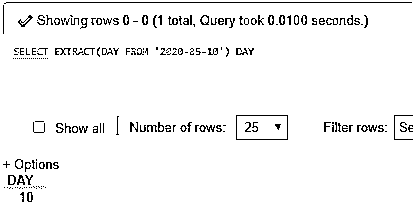

**说明:**上述查询提取的结果是天。

#### 2.使用 EXTRACT()提取 DAY_HOUR

**代码:**

`SELECT EXTRACT(DAY_HOUR FROM '2020-05-10 06:20:45') DAYHOUR;`

**输出:**

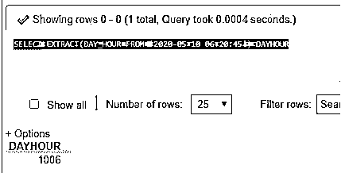

#### 3.使用 EXTRACT()提取 DAY _ 微秒

**代码:**

`SELECT EXTRACT(DAY_MICROSECOND FROM '2020-05-10 06:20:45') DayMicrosecond`

**输出:**

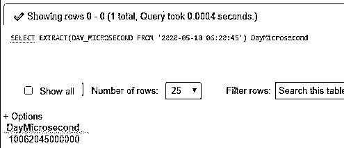

#### 4.使用 EXTRACT()提取 DAY_MINUTE

**代码:**

`SELECT EXTRACT(DAY_MINUTE FROM '2020-05-10 06:20:45') DAYMINUTE;`

**输出:**

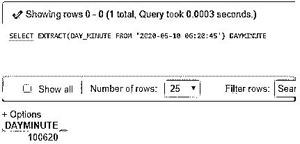

#### 5.使用 EXTRACT()提取 DAY_SECOND

**代码:**

`SELECT EXTRACT(DAY_SECOND FROM '2020-05-10 06:20:45') DAYSECOND;`

**输出:**

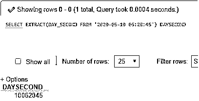

#### 6.使用 EXTRACT()提取小时

**代码:**

`SELECT EXTRACT(HOUR FROM '2020-05-10 06:20:45') HOUR;`

**输出:**

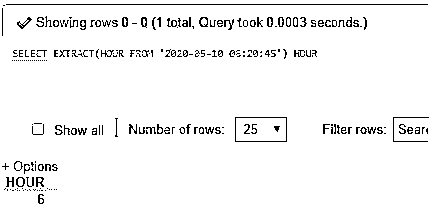

#### 7.使用 EXTRACT()提取 HOUR _ 微秒

**代码:**

`SELECT EXTRACT(HOUR_MICROSECOND FROM '2020-05-10 06:20:45') HOURMICROSECOND;`

**输出:**

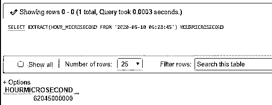

#### 8.使用 EXTRACT()提取 HOUR_MINUTE

**代码:**

`SELECT EXTRACT(HOUR_MINUTE FROM '2020-05-10 06:20:45') HOURMINUTE;`

**输出:**

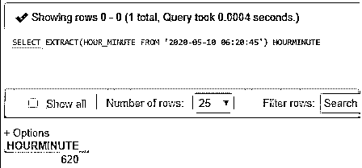

#### 9.使用 EXTRACT()提取 HOUR_SECOND

**代码:**

`SELECT EXTRACT(HOUR_SECOND FROM '2020-05-10 06:20:45') HOURSECOND;`

**输出:**

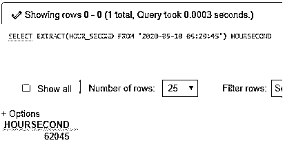

#### 10.使用 EXTRACT()提取微秒

**代码:**

`SELECT EXTRACT(MICROSECOND FROM '2020-05-10 06:20:45') MICROSECOND;`

**输出:**

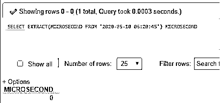

#### 11.使用 EXTRACT()提取会议纪要

**代码:**

`SELECT EXTRACT(MINUTE FROM '2020-05-10 06:20:45') MINUTE;`

**输出:**

#### 12.使用 EXTRACT()提取 MINUTE _ 微秒

**代码:**

`SELECT EXTRACT(MINUTE_MICROSECOND FROM '2020-05-10 06:20:45') MINUTEMICROSECOND;`

**输出:**

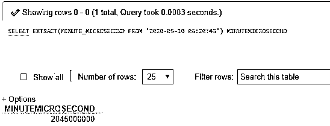

#### 13.使用 EXTRACT()提取分钟秒

**代码:**

`SELECT EXTRACT(SECOND FROM '2020-05-10 06:20:45') SECOND;`

**输出:**

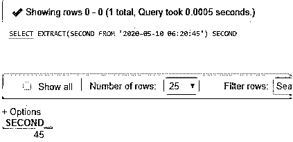

#### 14.使用 EXTRACT()提取月份

**代码:**

`SELECT EXTRACT(MONTH FROM '2020-05-10') MONTH;`

**输出:**

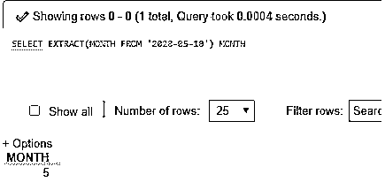

#### 15.使用 EXTRACT()提取季度

**代码:**

`SELECT EXTRACT(QUARTER FROM '2020-05-10 06:20:45') QUARTER;`

**输出:**

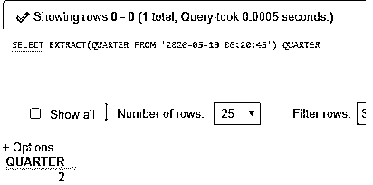

#### 16.使用 EXTRACT()提取秒微秒

**代码:**

`SELECT EXTRACT(SECOND_MICROSECOND FROM '2020-05-10 06:20:45') SECONDMICROSECOND;`

**输出:**

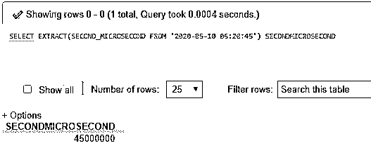

#### 17.使用 EXTRACT()提取周

**代码:**

`SELECT EXTRACT(WEEK FROM '2020-05-10') WEEK;`

**输出:**

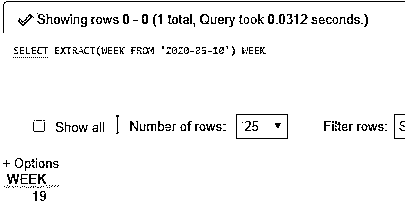

#### 18.使用 EXTRACT()提取年份

**代码:**

`SELECT EXTRACT(YEAR FROM '2020-05-10 06:20:45') YEAR;`

**输出:**

#### 19.使用 EXTRACT()提取 YEAR_MONTH

**代码:**

`SELECT EXTRACT(YEAR_MONTH FROM '2020-05-10 06:20:45') YEARMONTH;`

**输出:**

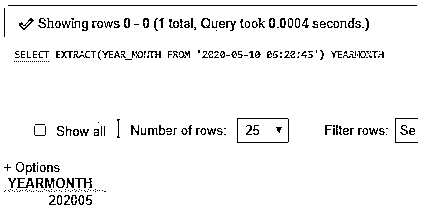

#### 20.使用 EXTRACT()提取 HOUR _ 微秒

**代码:**

`SELECT EXTRACT(HOUR_MICROSECOND FROM '2020-05-10 06:20:45.000001') HOURMICROSECOND;`

**输出:**

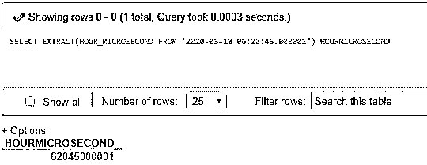

#### 21.使用 EXTRACT()结合单位说明符提取日期部分

**代码:**

`SET @date = '2020-05-10 06:20:45';
SELECT EXTRACT(DAY FROM @date) AS Date;`

**输出:**

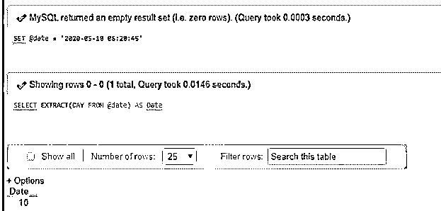

**解释:**在上面的查询中，我们使用了一个单元说明符，设置了日期，并从该说明符中提取了零件。

#### 22.使用 EXTRACT()和当前日期/时间函数提取月份部分

在查询执行中使用 CURDATE()获取当前日期和时间后，从当前日期和时间值获取日期部分的 SQL 查询:

**代码:**

`SELECTCURDATE(),
EXTRACT(MONTH FROM CURDATE());`

**输出:**

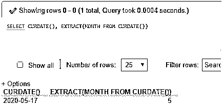

#### 23.使用数据库列的 EXTRACT()提取年和月部分

数据库中存在日期列的 SQL 查询，用于提取年份和月份以及 functionEXRACT() **:**

**代码:**

`SELECT JoinDate AS 'Date',
EXTRACT(YEAR_MONTH FROM JoinDate) AS 'Year/Month'
FROM Employee WHERE Person_ID = 101;`

**输出:**

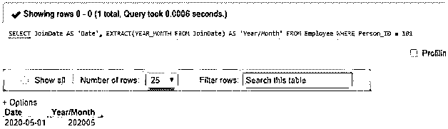

**解释:**这里，我们取了一个名为‘Employee’的数据库表，其中的字段是 Person_ID、Employee_Name、Salary 和 join date。JoinDatecolumn 的数据类型为 date，因此我们将实现 EXTRACT()函数来访问日期部分。此外，使用 WHERE 子句应用一个条件来获取表中特定列值的日期部分。

### 结论

MySQL EXTRACT()函数需要两个参数来产生指定的日期或日期时间部分。一个参数是单位和下一个日期，如上面的语法所示。该函数有助于通过查询执行从 MySQL 中检索所需的日期和时间间隔的唯一部分。

### 推荐文章

这是 MySQL EXTRACT()的指南。这里我们讨论一个 MySQL EXTRACT()的介绍，语法，它是如何工作的，例子来更好的理解。您也可以浏览我们的其他相关文章，了解更多信息——

1.  MySQL 中的 IF 语句
2.  [MySQL 时间戳](https://www.educba.com/mysql-timestamp/)
3.  [MySQL 中的汇总](https://www.educba.com/rollup-in-mysql/)
4.  [MySQL 自我加入](https://www.educba.com/mysql-self-join/)

