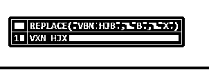
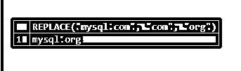
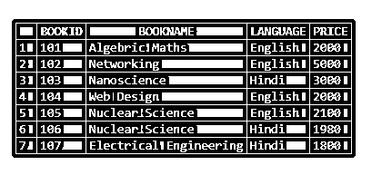
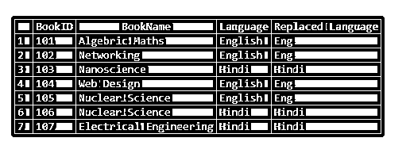
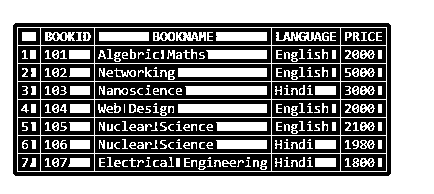
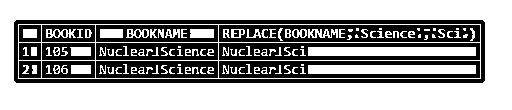
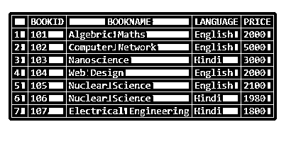
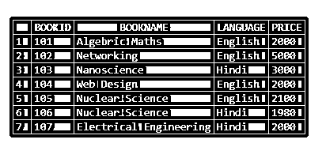

# MySQL 替换

> 原文：<https://www.educba.com/mysql-replace/>

## MySQL 替换简介

MySQL 的 REPLACE 函数是 string 函数之一，用于替换主字符串中所有存在的子字符串，得到一个新的子字符串。

在这个 MySQL REPLACE 函数中，包含了三个参数，其中一个表示要进行替换的主字符串，另外两个字符串用作支持用另一个字符串替换第一个字符串的参数。

<small>Hadoop、数据科学、统计学&其他</small>

MySQL 中的这个任务在字符串替换过程中实现了区分大小写的函数。

因此，MySQL 允许我们在数据库表的一列中用新字符串替换旧字符串，这样我们就可以在表中执行任何方便的搜索，并用现有的一个记录值替换所需的字符串。

### 句法

MySQL 替换函数使用以下语法:

`REPLACE(Original_String, Substring1, Subtring2)`

上述语法中给出的术语解释如下:

*   **Original_String** :该术语表示主字符串，其中旧字符串被新字符串替换。
*   **Substring1** :这是原始字符串中需要替换的子字符串出现的次数。
*   **Substring2** :这是必需的子串，在它的帮助下，可以用新的子串替换旧的子串。

### MySQL 中的 REPLACE 函数是如何工作的？

让我们首先检查一个简单的基本示例，以了解 MySQL 中 REPLACEfunction 的实现。该查询编写如下，其中原始字符串是 VB，VBN 中的子字符串 B 将被新字符串 X 替换:

`SELECT REPLACE("VBN HJB", "B", "X");`

**结果:**

根据上面的查询，我们看到指定了有效的表达式来执行主字符串中从旧字符串到新字符串的替换。执行该函数，使用所需的新参数替换指定字符串中第二个参数的所有匹配项。

因此，使用 MySQL 中的替换功能，我们可以处理在列中发现的任何拼写错误，或者如果我们想要搜索可能不正确或错误的单词，然后想要用有效的字符替换一些字符，以便我们获得更新的记录。

这样，对于列值替换，让我们采用如下语句:

`UPDATE Person SET Person_Address = REPLACE(Person_Address,’Jaiput’,’Jaipur’);`

这有助于在 person 表的 address 列中找到所有出现的拼写错误，并用正确的来更新它。对于该函数，第一个参数定义了不带引号的指定列名，另外两个参数表示负责相互替换以生成新字符串的子字符串。

我们应该知道，如果我们在函数' Person_Address '中对字段列应用引号，那么，作为结果，该列的值将由这个' Person_Address '更新。这将导致表中该列的数据突然丢失。

请注意，MySQL REPLACE 函数只有在表数据库中存在主键或唯一键时才有逻辑意义，因此该函数可以确定新行，而无需重复使用表的索引进行替换，否则它将对应于 INSERT 语句。

另外，要知道这个函数并不维护正则表达式。这意味着，如果我们想使用某种模式替换任何文本字符串，那么我们需要使用用户定义的 MySQL 函数，即来自外部库的 UDF。

### MySQL 替换的例子

我们将执行以下查询，展示在数据库表中使用 MySQL 替换字符串函数的各种方法:

#### 1.用“mysql.org”替换子字符串“mysql.com”

让我们举一个使用 MySQL 替换函数的基本例子:

**代码:**

`SELECT REPLACE("mysql.com", "com", "org");`

**输出:**

#### 2.更正单词中的无效字符串

我们正在替换单词“Learnint ”,并用“g”子串纠正它的拼写错误，并删除“t”。

**代码:**

`SELECT REPLACE("Learnint","t", "g");`

**输出:**

#### 3.替换包含数字的子字符串

让我们假设下面的查询替换某个数字串:

**代码:**

`SELECT REPLACE("477", "7", "9");`

**输出:**

#### 4.使用表的列名和 SELECT 语句替换字符串

考虑一个名为 Books 的示例表，我们将在查询中使用 MySQL REPLACE 函数来显示包含子字符串的列值的字符串交换。

**代码:**

`select * from Books;`

例如，如下所示执行查询以显示结果:

**代码:**

`SELECT BookID,BookName,Language, REPLACE(Language, 'English', 'Eng') AS `Replaced Language` FROM books;`

**输出:**

#### 5.用 SELECT & WHERE 语句替换字符串示例

我们现在使用 MySQL REPLACE 函数，使用 SELECT 语句对图书表的一列进行替换，并将值中包含子字符串的图书名称列字符串交换为新的子字符串应用搜索。餐桌书籍:

**代码:**

`select * from Books;`

查询如下:

**代码:**

`SELECT BOOKID, BOOKNAME, REPLACE(BOOKNAME,'Science','Sci') FROM Books2 WHERE BOOKNAME = 'Nuclear Science';`

**输出:**

#### 6.用 UPDATE 语句替换 MySQL 函数

下面是应用 MySQL 替换函数和更新查询的语法:

**代码:**

`UPDATE TableName SET ColumnName = REPLACE(ColumnName, Substring1, Substring2) WHERE CondExpr;//condExprs: Conditional expression`

例如，以示例表 Person 为例，我们执行以下查询:

**代码:**

`UPDATE Books2 SET BOOKNAME = REPLACE(BOOKNAME,'Networking','Computer Network');
select * from Books2;`

**输出:**

**代码:**

`update Books set PRICE = '2000' where BOOKID = 107;
select * from Books;`

**输出:**

#### 7.区分大小写的错误

如果我们在 MySQL 中执行下面的 like 查询，那么结果将如下:

**代码:**

`SELECT REPLACE('APPLE', 'e', 'g');`

**输出:**

这样，MySQL REPLACE 函数支持对要交换的字符串进行区分大小写的搜索，并形成新的结果。因此，我们必须使用指定有效的字符串表达式来执行搜索和替换，否则结果将与原始结果相同。

### 结论

在本文中，我们学习了 MySQL 的 REPLACE 函数，以及如何使用它来用新字符串替换旧字符串。

因此，MySQL 替换功能有助于替换表格列中的文本，以完成诸如交换过时链接、修复数据库记录中的任何拼写错误等任务。

### 推荐文章

这是一个 MySQL 替换指南。这里我们讨论如何使用 MySQL 替换以及查询示例，以便更好地理解。您也可以看看以下文章，了解更多信息–

1.  [MySQL 间](https://www.educba.com/mysql-between/)
2.  [在 MySQL 中选择](https://www.educba.com/select-in-mysql/)
3.  [插入 MySQL](https://www.educba.com/insert-in-mysql/)
4.  [MySQL 操作符](https://www.educba.com/mysql-operators/)

