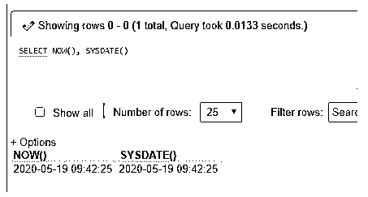
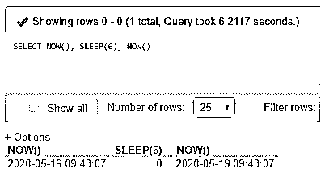
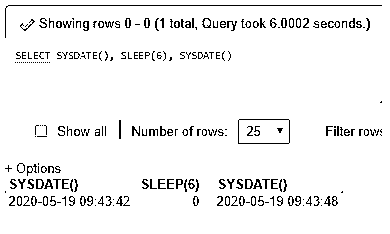
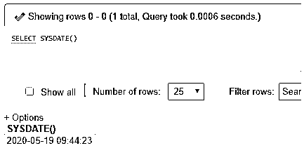
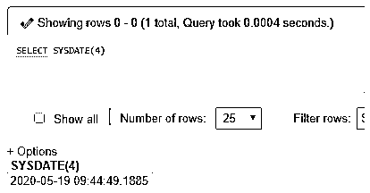
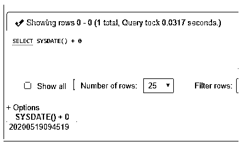

# MySQL 系统日期()

> 原文：<https://www.educba.com/mysql-sysdate/>

## MySQL SYSDATE()简介

在 MySQL 中，我们可以找到一系列日期和时间函数，从中我们可以选择一个来访问最新的日期/时间值。这些日期和时间函数中的大多数都是同义词。其中，MySQL SYSDATE()函数负责在执行时提供当前的日期/时间值。

然而，MySQL SYSDATE()函数和 MySQL NOW()函数给出当前日期/时间的结果看似相似，但它们的行为略有不同。MySQL SYSDATE()函数在服务器上执行时返回严格的日期和时间，但 MySQL NOW()函数允许提供持久的日期和时间，表示查询或过程开始执行的时间值。

<small>Hadoop、数据科学、统计学&其他</small>

**语法**

MySQL 中 SYSDATE()函数的基本简单语法结构如下:

`SELECT SYSDATE();`

虽然它是一个函数，但我们不需要为函数定义任何参数。但是，我们仍然可以添加一个可选参数“fsp ”,该参数被函数接受，该函数检查输出是否应该包含从 0 到 6 排列的秒精度的小数部分。如同

`SELECT SYSDATE(fsp);`

但是如果在不同的上下文中使用，其结果输出的格式会有所不同。假设，

*   如果上下文是一个字符串，SYSDATE()函数将以–YYYY-MM-DD HH:MM:SS 格式返回现有日期。
*   如果上下文是数字，SYSDATE()函数将以–yyyymmdd hhmmss 格式返回现有日期。

### MySQL SYSDATE()函数如何工作？

SYSDATE()函数对于生成当前日期和时间很有用，但是在我们使用它之前，它也有一些需要注意的地方，因为它提供了执行周期的时间值。

在 MySQL 中，SYSDATE()和 NOW()函数的结果都取决于查询语句开始和执行的时间。这使得 MySQL 中的两个日期函数略有不同。

这两种功能之间的区别可以通过下面的例子来说明:

假设，我们有 SYSDATE()和 NOW()查询，结果如下:

`SELECT NOW(), SYSDATE();`

**输出:**

从上面的输出来看，两者的结果值似乎是相同的，这表示其执行的当前日期和时间，即没有区别。

但是，同样，如果我们在查询执行之间提供一个间隙，那么结果可能会受到影响。为此，让我们使用 SLEEP()函数，它将暂停查询语句的执行时间，以秒为单位，如参数中所指定的。

`SELECT NOW(), SLEEP(6), NOW();`

**输出:**

这里，在上面的示例中，NOW()在运行时暂停了一段时间，即 6s，但是由于 NOW()显示了命令开始时的稳定时间，因此时间不会产生影响。

现在，让我们遵循同样的 for SYSDATE()函数，并使用如下查询来观察不同之处:

`SELECT SYSDATE(), SLEEP(6), SYSDATE();`

**输出:**

从上面显示的 SYSDATE()函数的输出可以清楚地看出，在执行期间，系统休眠或暂停 6s 后，SYSDATE()函数将占用当前执行的时间。在同一个语句中，SYSDATE()显示不同时间间隔的值，其中最后一个值在其结果集时间戳中增加了 6，因为它只需要显示查询在服务器上完成处理语句的当前时间。

但是请记住，SYSDATE 函数被认为是不确定的。因此，索引不能用于计算引用它的术语。因为在具有 DATETIME 数据类型的表列中执行期间，SYSDATE()函数可能会影响几行或所有行的数据来评估结果，因为它不使用索引，但是假设如果使用 NOW()，那么当我们通过 EXPLAIN 子句语句进行查找时，我们可以看到少量的行受到影响来搜索或计算结果并提供当前日期和时间输出。

因此，在考虑在数据库中使用 SYSDATE()函数之前，应该注意使用它两次，因为它可能有一些负面原因。

此外，MYSQL 中的 SET TIMESTAMP 查询不会影响 SYSDATE()函数的输出值，但可能会影响 NOW()函数的输出。

这种差异可能会在执行查询时导致一些问题，但是我们有一个更好的选项来避免这种情况。我们可以将 SYSDATE()作为 MySQL NOW()函数的别名，这样它就会显示出与 NOW()类似的行为。

因此，为了做到这一点，MySQL 允许使用–sysdate-is-now MySQL 服务器命令选项。利用这一点，无论何时执行查询语句，都可以消除不相似性，并获得带有日期和时间的准确结果。

这种替代方法有助于同时处理从设备和主设备。当实现基于语句的 MySQL 二进制日志记录时，这个 MySQL SYSDATE()函数对于复制也可能是不安全的，因此，在这种情况下，我们可以在服务器上应用基于行的 MySQL 日志记录。

### MySQL 中实现 SYSDATE()函数的例子

为了更好地理解，让我们举以下例子:

**示例# 1–使用 SYSDATE()的简单示例**

我们结合使用 SYSDATE()函数选择 SQL 语句来运行 MySQL 中的命令，如下所示:

**代码:**

`SELECT SYSDATE();`

**输出:**

**示例# 2–小数秒精度**

我们正在考虑用带有 fsp 参数值的 SYSDATE()来返回结果。

**代码:**

`SELECT SYSDATE(4);`

**输出:**

**示例# 3–数字上下文**

该查询将以指定为–yyyymmdd hhmmss 的格式执行结果。

**代码:**

`SELECT SYSDATE() + 0;`

**输出:**

这里，在函数中，您甚至可以将非零值应用于返回的日期时间值的加减。查看以下带有输出的查询:

**代码:**

`SELECT SYSDATE() + 2;`

**输出:**

### 结论

*   SYSDATE()函数提供查询执行的当前日期时间，而 NOW()函数返回 MySQL 函数触发语句开始的日期时间。
*   因此，我们可以说 SYSDATE()函数显示了函数本身的自执行时间间隔，而不是服务器上的查询完成时间。
*   因此，当 SYSDATE()和 NOW()一起实现时，时间戳会返回不同的执行值。

### 推荐文章

这是 MySQL SYSDATE()的指南。这里我们讨论 MySQL SYSDATE()函数如何与查询示例一起工作，以便用最简单的方式理解。您也可以看看以下文章，了解更多信息–

1.  [MySQL 约束](https://www.educba.com/mysql-constraints/)
2.  [MySQL 自我加入](https://www.educba.com/mysql-self-join/)
3.  [MySQL 时间戳](https://www.educba.com/mysql-timestamp/)
4.  MySQL 中的 IF 语句

