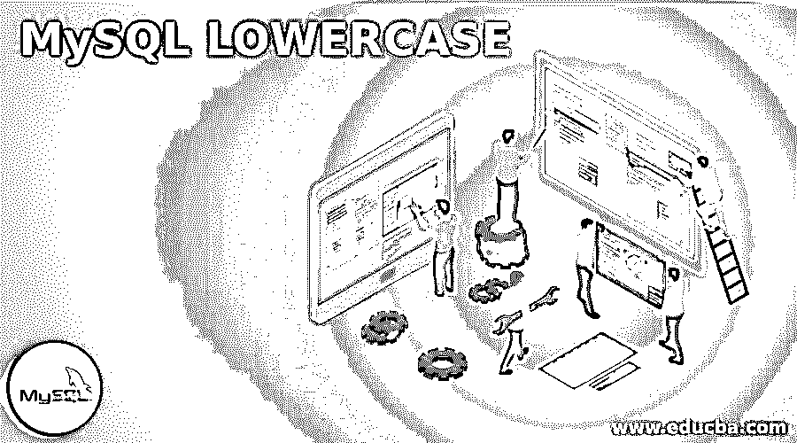
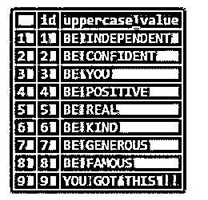
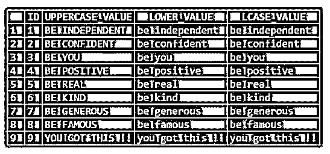
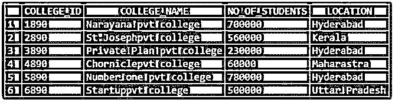
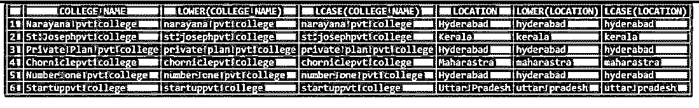

# MySQL 小写

> 原文：<https://www.educba.com/mysql-lowercase/>

## MySQL 小写简介

以下文章提供了 MySQL LOWERCASE 的概要。要将字符串转换成小写，我们可以使用 lower case 函数。小写有一个接受字符串并将其转换成小写的参数。用于上述功能的函数是 LOWER()或 LCASE()。Binary、BLOB 和 Varbinary 是二进制字符串数据，当应用于 LOWER()函数时，它们不是很有效。为了传递这样的数据，我们首先将字符串转换为非二进制字符串。

**语法:**

<small>Hadoop、数据科学、统计学&其他</small>

小写函数的语法如下:

`LOWER( <string> / <column_name> )`

或者

`LCASE (<string> / <column_name>)`

### MySQL 小写是如何工作的？

现在让我们来看看 LOWER()函数是如何在表格中单独工作的:

**代码:**

`SELECT LOWER ( 'HI . . . WORLD' ) AS MESSAGE;`

这里我们可以看到,<string>被称为“HI”。..世界”。上面我们使用了 LOWER 函数将“上串”转换为“下串”。</string>

**输出:**

**代码:**

`SELECT LCASE( 'HI . . . WORLD' ) AS MESSAGE;`

这里我们可以看到,<string>被称为“HI”。..世界”。上面我们使用 LCASE 函数将“上面的字符串”转换为“下面的字符串”。</string>

**输出:**

现在让我们创建一个表并应用 LOWER()函数:

**代码:**

`CREATE TABLE LOWERCASE_DEMO (
ID INT,
UPPERCASE_VALUE VARCHAR(15)
);`

现在让我们将数据插入表中:

**代码:**

`INSERT INTO LOWERCASE_DEMO VALUES ( 1, 'BE INDEPENDENT');
INSERT INTO LOWERCASE_DEMO VALUES ( 2, 'BE CONFIDENT');
INSERT INTO LOWERCASE_DEMO VALUES ( 3, 'BE YOU');
INSERT INTO LOWERCASE_DEMO VALUES ( 4, 'BE POSITIVE');
INSERT INTO LOWERCASE_DEMO VALUES ( 5, 'BE REAL');
INSERT INTO LOWERCASE_DEMO VALUES ( 6, 'BE KIND');
INSERT INTO LOWERCASE_DEMO VALUES ( 7, 'BE GENEROUS');
INSERT INTO LOWERCASE_DEMO VALUES ( 8, 'BE FAMOUS');
INSERT INTO LOWERCASE_DEMO VALUES ( 9, 'YOU GOT THIS !!');`

现在让我们在不应用 LOWER 函数的情况下从表中选择数据。输出如下所示。截图同。这里我们可以看到列“UPPERCASE_VALUE”的数据是大写的。我们使用 LOWER 函数和 LCASE 函数将字符转换成小写。

**代码:**

`select * from LOWERCASE_DEMO;`

**输出:**

现在让我们看看 LOWER 函数和 LCASE 函数:

**代码:**

`SELECT *, LOWER ( UPPERCASE_VALUE) AS LOWER_VALUE,
LCASE ( UPPERCASE_VALUE) AS LCASE_VALUE FROM LOWERCASE_DEMO;`

在上面的 select 语句中，我们可以看到我们指定了“列名”，而不是“字符串表达式”。这将把列值从大写转换成小写，如下所示。这是通过 LOWER 函数或 LCASE 函数实现的。

**输出:**

### MySQL 小写的例子

以下是 MySQL 小写字母的示例:

#### 示例#1

现在让我们来看看 LOWER()函数是如何在表中单独工作的。

使用 lower 函数时，一个字符串输出中的多个 case 会给出小写。

**代码:**

`SELECT LOWER( 'Hi . . . world QwErTy' ) AS MESSAGE;`

这里我们可以看到,<string>被称为“Hi”。..世界 QwErTy。它是大写字母和小写字母的组合。一旦我们使用 LOWER 函数将“上串”转换为“下串”。小写字符将被转换为大写，大写字母保持大写。</string>

**输出:**

*

* 

**代码:**

`SELECT LCASE ( 'Hi . . . world QwErTy' ) AS MESSAGE;`

这里我们可以看到<string>被称为 *'* 嗨。..*世界 QwErTy。*是大写和小写的组合。一旦我们使用 LCASE 函数将“上面的字符串”转换为“下面的字符串”。小写字符将被转换为大写，大写字母保持大写。</string>

**输出:**

#### 实施例 2

让我们看看另一个 LOWER 和 LCASE 函数的例子，如下所示。

**代码:**

`CREATE TABLE COLLEGEDATA
(
COLLEGE_ID INT,
COLLEGE_NAME VARCHAR(50),
NO_OF_STUDENTS INT,
LOCATION VARCHAR(20)
);`

下面的数据被插入到上表中:

**代码:**

`INSERT INTO COLLEGEDATA VALUES (1890, 'Narayana pvt college', 700000, 'Hyderabad');
INSERT INTO COLLEGEDATA VALUES (2890, 'St.Josephpvt college', 560000, 'Kerala');
INSERT INTO COLLEGEDATA VALUES (3890, 'Private Plan pvt college', 230000, 'Hyderabad');
INSERT INTO COLLEGEDATA VALUES (4890, 'Chorniclepvt college', 60000, 'Maharastra');
INSERT INTO COLLEGEDATA VALUES (5890, 'Number one pvt college', 780000, 'Hyderabad');
INSERT INTO COLLEGEDATA VALUES (6890, 'Startuppvt college', 500000, 'Uttar Pradesh');`

从上面的表和行中选择数据，如下所示:

**代码:**

`SELECT * FROM COLLEGEDATA;`

现在让我们在不应用 LOWER 函数的情况下从表中选择数据。

**输出:**

**<u>

</u>** 

让我们应用 LOWER 和 LCASE 函数:

**代码:**

`SELECT COLLEGE_NAME,LOWER(COLLEGE_NAME),LCASE(COLLEGE_NAME)
,LOCATION , LOWER(LOCATION) , LCASE(LOCATION)  FROM COLLEGEDATA;`

这里我们可以看到列“COLUMN_NAME”的数据是大写的。我们使用 LOWER 函数和 LCASE 函数将字符转换成小写。

 <u>**输出:**

### 结论

要将字符串转换成小写，我们可以使用小写函数。小写有一个接受字符串并将其转换成小写的参数。用于上述功能的函数是 LOWER()或 LCASE()。Binary、BLOB 和 Varbinary 是二进制字符串数据，当应用于 LOWER()函数时，它们不是很有效。为了传递这样的数据，我们首先将字符串转换为非二进制字符串。

### 推荐文章

这是一个 MySQL 小写的指南。这里我们讨论一下入门，MySQL 小写是如何工作的？并分别举例说明。您也可以看看以下文章，了解更多信息–

1.  [删除数据库 MySQL](https://www.educba.com/delete-database-mysql/)
2.  [MySQL 位](https://www.educba.com/mysql-bit/)
3.  [mysql_real_escape_string](https://www.educba.com/mysql_real_escape_string/)

</u>