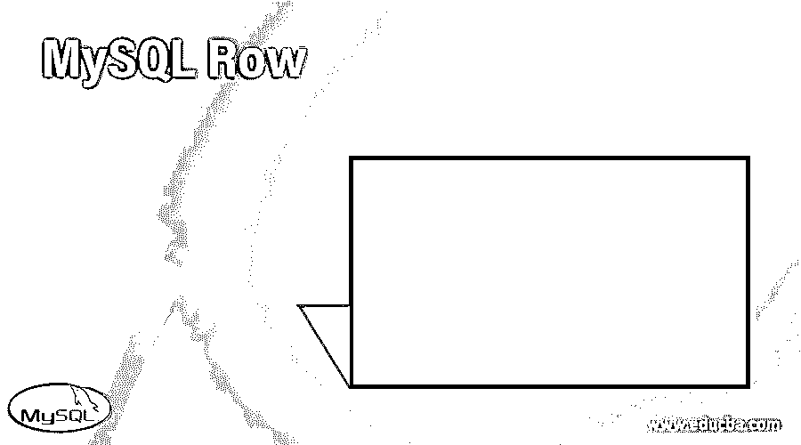
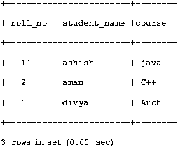
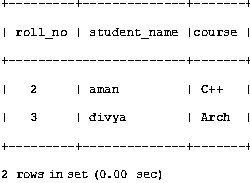
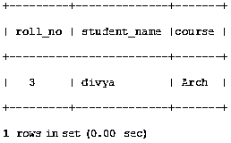
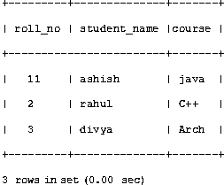

# MySQL 行

> 原文：<https://www.educba.com/mysql-row/>

## MySQL Row 简介

Mysql Row 函数用于从表中只提取一行。因此，每当我们想只选择一个单行值时，我们就在主查询语句中使用行子查询函数。除了单行值之外，它还返回一个或多个列值。

因为我们在子查询中使用行函数，所以需要逻辑运算符来比较语句并找到匹配的输出结果。下面是用于比较的逻辑运算符:

<small>Hadoop、数据科学、统计学&其他</small>

=，>， =，<=,<>，！=，<=>

**代码#1**

`select * from table1 where (column_1, column_2) = (select column_3, column_4 from table2 where id=5);
select * from table1 where ROW (column_1, column_2) = (select column_3, column_4 from table2 where id=5);`

对于上述两个查询，如果表 table2 包含只有一列的单行，即 id = 5，则子查询将返回单行。如果该表包含单行，但有不止一列，即 column_3 和 column_4 值等于 table1 中任何行的 column_1 和 column_2 值，则 where 表达式为 true，并且每个查询都返回 table1 中的那些行。如果 table2 行的 column_3 和 column_4 值不等于 table1 行的 column_1 和 column_2 值，则表达式为 false，查询将返回一个空结果集。如果子查询返回多行，将会发生错误，因为子查询中的行函数最多可以返回一行或不返回任何行，即几乎一行。

**行构造函数:**行构造函数用于与子查询进行比较，子查询输出两列或更多列作为结果。当任何子查询输出单个列时，它被视为标量值，而不被视为行值。

**代码#2**

`select * from table1 where row (1) = (select column_1 from table2);
select * from table1 where (column_1, column_2) = (1, 2);
select * from table2 where column_1 = 1 and column_2 =1;`

以上两个查询是等效的

### 个案研究

下面是我们将要学习的案例研究:

#### 案例 1–在表格中插入一行

插入命令用于在表格中插入新行

**语法:**

`Insert into <table_name> values (<value1>,<value2>,<value3>…..<valuen>);`

*   其中，table_name 是需要在其中插入行的表的名称。
*   Values= >表中每列的值。

**代码:**

`Insert into students values(1,’ashish’,’java’);
Insert into students values(2,’rahul’,’C++’);`

为了检查表的内容，我们将使用一个选择查询。

`select * from students,`

下面是查询的输出

#### 案例 2–从表中删除一行

Delete 命令用于从 mysql 表中删除行。它用于从外部数据库中删除临时数据。Delete 子句可以从表中删除多行。一旦行被 delete 子句从表中删除，就无法恢复。

**语法:**

`Delete from <table_name> where <condition>;`

在哪里，

*   table_name 是需要从中删除行的表的名称。
*   Where 子句是可选的，用于限制我们需要删除的行数。

首先，我们需要检查表中显示的所有数据。为此，我们将使用选择查询。

`select * from students;`

**输出:**

现在，我们将删除编号为 11 的学生的详细信息

`delete from students where roll_no=11;
select* from students;`

**输出:**

#### 案例 3–如何选择单行表格

Select 子句用于从表中选择数据。

**语法:**

`select column 1, column 2,….column n from table_name where [condition] select roll_no, student_name, course from students where roll_no=3;`

**输出:**

#### 案例 4——如何改变行

**语法:**

`update<table_name> set <column_name>=value where <condition>;
Table_name => The name of the table in which the value is to be changed.
condition => condition to get specified row`

**代码:**

`update students set roll_no=roll_no+10 where student_name=’ashish’;
select * from students;`

**输出:**

#### 案例 5——MYsql 约束

Mysql 约束用于定义应用于表中存储值的规则。

它们是:

*   **Not null:** 用于指定该列不能包含空值。
*   **唯一:**用于不在列中插入重复值。
*   **主键:**用于只接受每行的唯一值。
*   **外键:**用于通过两个表的公共列链接两个表。
*   **默认:**如果表格中没有插入值，那么默认设置值将被插入空白位置。

**语法:**

`create table<table_name>([column_name] [datatype] ([size])[column constraint]---[table constraint] ([column_name]))`

**代码:**

`create table students (roll_no int PRIMARY KEY, student_name varchar(150) NOT NULL,course varchar(100) NOT NULL UNIQUE);`

### 结论

在本文中，我们学习了 MySQL 行子查询函数，该函数用于在一个或多个列中一次只选择一行。在本文中，我们还讨论了在表的行中要做的简单操作，如插入、删除、更新。我们还了解了表格中可以应用的约束。在本文中，所有的查询都通过一个简单的例子进行了解释，并且提供了输出的截屏，以便读者更好地理解。

### 推荐文章

这是一个 MySQL Row 的指南。在这里我们讨论一个关于 MySQL 行的介绍，语法，它是如何与不同的案例一起详细研究的。您也可以浏览我们的其他相关文章，了解更多信息——

1.  [MySQL 检查约束](https://www.educba.com/mysql-check-constraint/)
2.  [MySQL 中的汇总](https://www.educba.com/rollup-in-mysql/?source=leftnav)
3.  [MySQL 根目录](https://www.educba.com/mysql-root/?source=leftnav)
4.  [MySQL 命令](https://www.educba.com/mysql-commands/?source=leftnav)

