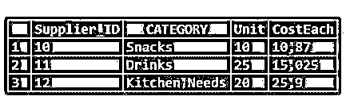
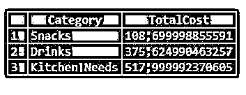

# MySQL CEIL

> 原文：<https://www.educba.com/mysql-ceil/>

## MySQL CEIL 简介

MySQL CEIL()函数与 MySQL CEILING()函数相同，它找出大于或等于一个数字的最小整数结果值。MySQL CEILING()和 CEIL()函数是同义词，可以互换使用，将数字作为输入返回各自的整数值。通常，在 MySQL 的数学函数中，MySQL CEIL()函数是一个用来产生作为函数参数的输入的最大值或相同值的数学函数。在应用 CEIL()函数时，我们可以提供正数和负数。

**语法:**

<small>Hadoop、数据科学、统计学&其他</small>

下面是在 MySQL 中使用 CEIL()函数的简单语法代码:

`CEIL(Numeric_Value)`

*   在上面的语法中，numeric_value 项定义了 CEIL 函数参数所需的输入。该值可以是一个加权到一个数字或精确数字的表达式。
*   根据作为输入提供的参数编号的类型，指定结果编号类型。输出的类型取决于 CEIL()查询中指定的输入类型。
*   假设，如果我们输入了一个类型为精确数值或浮点的数字，那么结果数值类型将同时与精确数值或浮点的类型完全相同。

### MySQL 中的 CEIL 函数是如何工作的？

让我们看看 MySQL 中 MySQL CEIL()函数的工作原理:

举例来说，我们使用 CEIL()函数编写一个查询，如下所示:

**代码:**

`SELECT CEIL(20.50);`

这里，MySQL SELECT 关键字语句将与 math 函数一起使用，通过计算类型为浮点的参数函数中提供的数字来显示结果值。

**输出:**

因此，很明显，CEIL()函数将生成大于或类似于 20.50 的最小值，输入值在上面的查询中指定为 21。

### MySQL CEIL 示例

我们将展示一个例子来说明这个数学函数在 MySQL 中的用法。

#### 示例#1

我们现在对函数参数中的正数应用 CEIL()函数。对于这个查询，我们将实现下面的查询语句。

**代码:**

`SELECT CEIL(2.43);`

**输出:**

在上面的例子中，我们知道产生的结果具有大于或等于作为输入给出的数字的最小整数，即 2.43。因此，CEIL()函数给出的结果是 3。

**代码:**

`SELECT CEIL(24);`

**输出:**

**代码:**

`SELECT CEIL(1.25);`

**输出:**

<u>

</u> 

**代码:**

`SELECT CEIL(0.56);`

**输出:**

**<u>

</u>** 

**代码:**

`SELECT CEIL(500.08);`

**输出:**

**<u>

</u>** 

**代码:**

`SELECT CEIL(0.0089);`

**输出:**

**<u>

</u>** 

**代码:**

`SELECT CEIL(11.90);`

**输出:**

**<u>

</u>** 

#### 实施例 2

让我们应用 CEIL()函数，其中我们提供一个负数作为输入，以产生如下所示的输出。

**代码:**

`SELECT CEIL(-2.43);`

**输出:**

**<u>

</u>** 

**代码:**

`SELECT CEIL(-24);`

**输出:**

**<u>

</u>** 

**代码:**

`SELECT CEIL(-1.25);`

**输出:**

**<u>

</u>** 

**代码:**

`SELECT CEIL(-0.56);`

**输出:**

**<u>

</u>** 

**代码:**

`SELECT CEIL(-500.08);`

**输出:**

**<u>

</u>** 

**代码:**

`SELECT CEIL(-0.0089);`

**输出:**

<u>

</u> 

**代码:**

`SELECT CEIL(-11.90);`

**输出:**

在这里，我们可以看到 MySQL CEIL()函数的输出给出的结果数字要么大于要么等于输入。CEIL()函数根据上述观察结果提供负数的结果。

#### 实施例 3

MySQL CEIL()函数在表中进行查询的例子。

假设，我们需要一个表来查询 CEIL()函数的列值，并显示它在数据库计算中的工作。为此，我们将使用下面的查询语句在数据库中创建表。

**代码:**

`CREATE TABLE Suppliers(Supplier_ID INT PRIMARY KEY AUTO_INCREMENT, CATEGORY VARCHAR(255) NOT NULL, Unit INT NOT NULL, CostEach FLOAT NOT NULL);`

此外，我们将插入一些演示记录，以便进一步处理查询。

**代码:**

`INSERT INTO Suppliers(Supplier_ID, Category, Unit, CostEach) VALUES
('10','Snacks','10','10.87'),
('11','Drinks','25','15.025'),
('12','Kitchen Needs','20','25.9');`

同样，下面我们将使用下面的 SQL 语句显示供应商表的内容。

**代码:**

`SELECT * FROM Suppliers;`

**输出:**

对于 CEIL()函数查询，我们将使用上面创建的表中的表列作为供应商来说明评估。ceil()函数查询，用于查找为供应商项目计算的总成本的 CEIL 值，实现查询代码如下。

**代码:**

`SELECT Category, CEIL(Unit * CostEach)TotalCost_CeilValue FROM Suppliers30 GROUP BY Category ORDER BY TotalCost_CeilValue;`

**输出:**

上述语句通过将单位列值乘以供应商表中关联的每个项目的成本价，提供了为每个供应商项目计算的成本的上限值。首先，在该查询中，计算每个供应商项目的总成本，然后将结果值用作 CEIL()函数的输入，然后显示大于或类似于输入值的最小整数值。

我们应该注意，在表中，名为 CostEach 的列包含浮点型值，因此，为每个供应商项目计算的结果和总成本将采用小数形式，即浮点型。使用 CEIL()函数后，这些浮点值将作为整数值的结果值生成，正如您在上面的输出中看到的那样。

但是让我们看看，如果我们不对前面的查询应用 CEIL()函数，那么输出会是什么。

为此，我们将如下更改查询。

**代码:**

`SELECT Category, Unit * CostEach TotalCost FROM Suppliers30 GROUP BY Category ORDER BY TotalCost;`

**输出:**

没有 CEIL()函数的查询代码的输出如下:

因此，像 MySQL CEILING()函数一样，MySQL CEIL()函数也可以工作。因此，CEIL()函数返回最小的整数值，但不小于查询函数中指定的输入数。

### 结论

MySQL CEIL()函数表现为一种数学技术，它将输入的数字从零向上舍入。实际上，它生成的结果整数值总是大于 CEIL()函数中给定的参数值。MySQL CEIL()函数给出不小于输入值的最小整数值。因此，在数据库中找出特定条件下任何表列值的上限值是很有用的。

### 推荐文章

这是一个 MySQL CEIL 的指南。这里我们讨论 MySQL CEIL 的介绍，如何使用 CEIL 函数以及查询示例。您也可以看看以下文章，了解更多信息–

1.  [MySQL 管理工具](https://www.educba.com/mysql-admin-tool/)
2.  [MySQL 替换](https://www.educba.com/mysql-replace/)
3.  [MySQL 重新索引](https://www.educba.com/mysql-reindex/)
4.  [MySQL 上的删除级联](https://www.educba.com/mysql-on-delete-cascade/)

