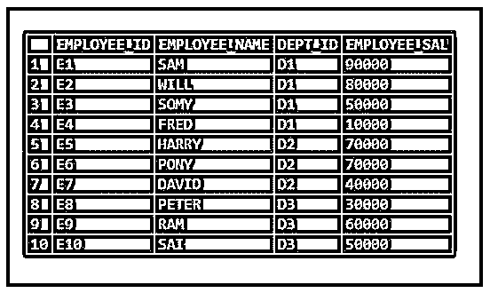

# MySQL 别名

> 原文：<https://www.educba.com/mysql-alias/>

## MySQL 别名介绍

当我们希望为列或表提供一个替代名称时，就使用 MySQL 别名。为列或表临时指定一个用户友好且易于理解的名称。别名主要用于列和表。列别名用于为列标题提供别名，便于最终用户理解。表别名是为表提供一个替代表，用于在连接时更容易阅读和使用。

**语法:**

<small>Hadoop、数据科学、统计学&其他</small>

下面给出了在列和表中如何使用 alias 的语法:

`<column_name>AS<Alias_name>;`

在上面的语法中，我们提供了希望替换的列名。“AS”是可选的。最后我们提供别名。

`<table_name>AS<Alias_name>;`

在上面的语法中，我们提供了希望替换的表名。“AS”是可选的。最后我们提供别名。

### MySQL 别名是如何工作的？

MySQL 别名的工作方式如下:

#### 1.列别名

现在让我们创建一个示例表，如下所示，并为列提供一个别名:

**代码:**

`CREATE TABLE EMPLOYEE_INFORMATION
(
EMPLOYEE_ID VARCHAR(10),
EMPLOYEE_NAME VARCHAR(20),
DEPT_ID VARCHAR(10),
EMPLOYEE_SAL INT
);`

现在让我们将数据插入上表:

**代码:**

`INSERT INTO EMPLOYEE_INFORMATION VALUES ('E1','SAM','D1', 90000);
INSERT INTO EMPLOYEE_INFORMATION VALUES ('E2','WILL','D1', 80000);
INSERT INTO EMPLOYEE_INFORMATION VALUES ('E3','SOMY','D1', 50000);
INSERT INTO EMPLOYEE_INFORMATION VALUES ('E4','FRED','D1', 10000);
INSERT INTO EMPLOYEE_INFORMATION VALUES ('E5','HARRY','D2', 70000);
INSERT INTO EMPLOYEE_INFORMATION VALUES ('E6','PONY','D2', 70000);
INSERT INTO EMPLOYEE_INFORMATION VALUES ('E7','DAVID','D2', 40000);
INSERT INTO EMPLOYEE_INFORMATION VALUES ('E8','PETER','D3', 30000);
INSERT INTO EMPLOYEE_INFORMATION VALUES ('E9','RAM','D3', 60000);
INSERT INTO EMPLOYEE_INFORMATION VALUES ('E10','SAI','D3', 50000);`

`select * from EMPLOYEE_INFORMATION;`

**输出:**

现在让我们为上面的每一列指定一个别名，列名中不带下划线。

下面是列别名的示例:

**代码:**

`SELECT EMPLOYEE_ID AS "EMPLOYEE ID",
EMPLOYEE_NAME AS "EMPLOYEE NAME",
DEPT_ID AS "DEPARTMENT_ID",
EMPLOYEE_SAL AS "EMPLOYEE SALARY"
FROM EMPLOYEE_INFORMATION;`

**输出:**

#### 2.表别名

表别名主要在我们对表执行连接时使用。

下面是带有示例数据的示例表，显示了如何执行别名。

**代码:**

`CREATE TABLE SAMPLE_A
(
COL_A INT,
COL_B INT
);`

将数据插入表格:

**代码:**

`INSERT INTO SAMPLE_A VALUES (1, 5);
INSERT INTO SAMPLE_A VALUES (2, 4);
INSERT INTO SAMPLE_A VALUES (3, 3);
INSERT INTO SAMPLE_A VALUES (4, 2);
INSERT INTO SAMPLE_A VALUES (5, 1);`

`select * from SAMPLE_A;`

**输出:**

现在让我们创建另一个表。

**代码:**

`CREATE TABLE SAMPLE_B
(
COL_A INT,
COL_B INT
);`

将数据插入表格:

**代码:**

`INSERT INTO SAMPLE_B VALUES (1, 5);
INSERT INTO SAMPLE_B VALUES (2, 4);
INSERT INTO SAMPLE_B VALUES (3, 3);
INSERT INTO SAMPLE_B VALUES (4, 2);
INSERT INTO SAMPLE_B VALUES (5, 1);`

`Select * from SAMPLE_B;`

**输出:**

现在让我们在上面执行连接并使用别名:

**a .无表别名**

**代码:**

`SELECT * FROM SAMPLE_A
JOIN SAMPLE_B
ON  SAMPLE_A.COL_A = SAMPLE_B.COL_A`

**输出:**

**b .具有表别名**

**代码:**

`SELECT * FROM SAMPLE_A A JOIN SAMPLE_B B
ON A.COL_A = B.COL_A`

**输出:**

### MySQL 别名示例

下面是一些例子:

#### 示例 1–列别名

现在，让我们根据之前创建的上表，找出每个部门的最高和最低工资。

**代码:**

`SELECT DEPT_ID AS "DEPARTMENT ID",
MAX(EMPLOYEE_SAL)AS "MAXIMUM EMPLOYEE SALARY",
MIN(EMPLOYEE_SAL)AS "MINIMUN EMPLOYEE SALARY"
FROM EMPLOYEE_INFORMATION
GROUP BY DEPT_ID;`

**输出:**

#### 示例 2–表格别名

如果我们考虑一个表，给这个表取一个替换名叫做表别名。

**a .无表别名**

**代码:**

`SELECT * FROM SAMPLE_A
JOIN SAMPLE_B
ON SAMPLE_A.COL_A = SAMPLE_B.COL_A`

**输出:**

在这里，每次在连接条件中提到整个表名都会很困难。

**b .具有表别名**

**代码:**

`SELECT * FROM SAMPLE_A A JOIN SAMPLE_B B ON A.COL_A = B.COL_A`

**输出:**

在这里，每次在连接条件中提到整个表名都会很困难。因此，我们提到了表的别名。SAMPLE_A 的别名为“A”。而 SAMPLE_B 表有“B”别名。

我们可以看到，在提到别名时，没有写“AS”。

我们也可以在下面提到别名:

**代码:**

`SELECT * FROM SAMPLE_A AS A JOIN SAMPLE_B AS B ON A.COL_A = B.COL_A`

**输出:**

### 结论

关于 MySQL 别名，需要记住的是，如果您希望在 alias_name 中提供空格，那么我们必须用引号将 alias_name 括起来。当我们在列名中定义时，接受空格。但是，在表名别名中使用空格不是好的做法。alias_name 仅在 SQL 语句的范围内有效。

### 推荐文章

这是一个 MySQL 别名的指南。在这里，我们讨论 MySQL 别名的介绍以及工作和各自的例子。您也可以看看以下文章，了解更多信息–

1.  [MySQL 中的运算符](https://www.educba.com/mysql-in-operator/)
2.  [MySQL 子查询](https://www.educba.com/mysql-subquery/)
3.  [MySQL 约束](https://www.educba.com/mysql-constraints/)
4.  [MySQL MAX()函数](https://www.educba.com/mysql-max-function/)

