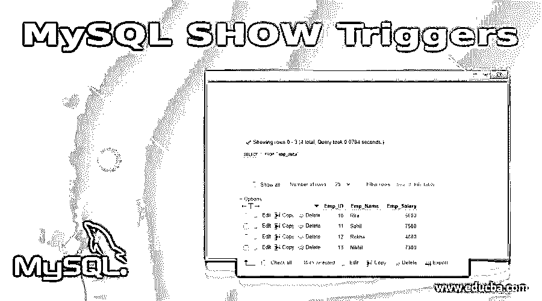
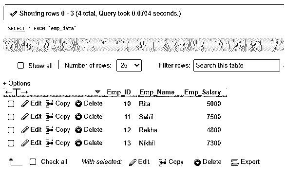
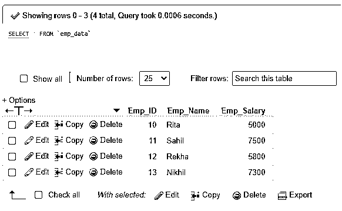
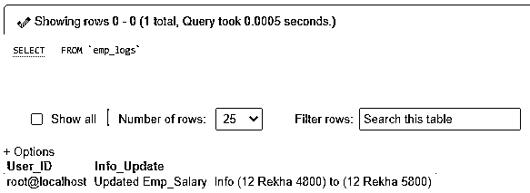
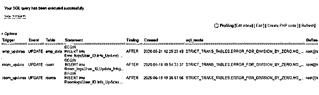
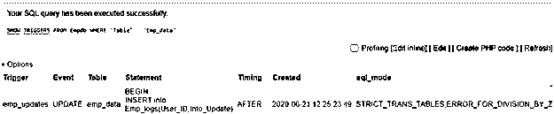

# MySQL 显示触发器

> 原文：<https://www.educba.com/mysql-show-triggers/>

## MySQL 显示触发器简介

MySQL SHOW Triggers 是一个 MySQL 语句，执行该语句可以显示服务器表中的所有触发器。当我们创建不同的触发器时，这些触发器是在事件执行期间调用的存储程序，或者当特定的查询在服务器中运行时。因此，要保留为其创建触发器的链接表执行的 SQL 命令的日志记录。要创建、删除或显示 triggers 语句，我们需要 MySQL Triggers 超级权限，以便可以在创建或删除与触发器相关的表中的相应日志记录时执行触发器。显示触发器有助于查看 MySQL 表中的现有触发器，以及为相关表创建的触发器的命令代码和类型。

**语法:**

<small>Hadoop、数据科学、统计学&其他</small>

我们有 MySQL SHOW Triggers 语句查询的后续基本语法结构:

`SHOW TRIGGERS [(IN | FROM) DatabaseName] [LIKE ‘Specified_Pattern’ | WHERE Expr_Cond];`

这里，在上面的语法中，使用的最后两个 MySQL 子句定义了我们希望从中显示相关触发器的数据库。如果没有提到这些，那么带有 SHOW Triggers 的查询将返回当前服务器中每个数据库中可用的每个触发器。

`SHOW TRIGGERS;`

如果我们想要查看不同数据库中的所有触发器，那么我们需要在 FROM 或 in 关键字后提供 MySQL 数据库的名称:

`SHOW TRIGGERS FROM DatabaseName;`

或者，

`SHOW TRIGGERS IN DatabaseName;`

假设我们搜索一个具有特定模式的触发器，该模式将与 SHOW TRIGGER 查询中指定的模式相匹配，然后我们将如下实现 MySQL LIKE 子句:

`SHOW TRIGGERS LIKE ‘Specified_Pattern’;`

甚至我们可以在服务器中使用以下带有 SHOW TRIGGERS 命令的查询语句:

`SHOW TRIGGERS FROM DatabaseName LIKE ‘Specified_Pattern’;`

这里，LIKE 子句的意义与 MySQL SELECT 语句中使用的相同。同样，为了使用特定的表达式条件列出触发器来搜索特定的触发器，我们将使用 MySQL WHERE 子句。为此，我们将有以下查询语句:

`SHOW TRIGGERS WHERE Expr_Cond;`

此外，我们将使用这个:

`SHOW TRIGGERS FROM DatabaseName WHERE Expr_Cond;`

### MySQL 中的 SHOW Triggers 语句是如何工作的？

MySQL 触发器的工作与创建或删除数据库中的任何触发器元素有关。当我们在 MySQL 中执行 SHOW TRIGGERS 时，我们将查看为数据库表定义的可用触发器列表。如果没有提到数据库，那么将使用默认数据库，除非我们使用 FROM 子句包含了该数据库。

我们还可以将 LIKE 子句与 SHOW TRIGGERS 结合使用，以指示匹配的表的名称，从而使服务器输出与这些表相关的触发器。为了添加任何条件语句，我们可以使用一个选项，即带有显示触发器的 WHERE 子句来实现查询和输出触发器行。

在 MySQL 中，包含后续列的结果集将在 SHOW TRIGGERS 语句后作为输出返回:

*   **触发器:**提供触发器的名称。
*   **事件:**用于调用指定触发器的事件。它可以执行插入、删除或更新查询。
*   **表:**表示附加了创建的触发器的数据库表。
*   **语句:**用代码定义触发器体。
*   **计时:**表示触发的时间。它可以发生在一个事件之后或之前。
*   **创建:**给出触发的创建时间。
*   **Sql_mode:** 显示触发器被调用时的 Sql_mode。
*   **定义者:**定义了实现了触发器的用户的账号。
*   **Character_set_client:** 确定客户端提供报表所使用的字符集。当在 character_set_client 系统类型的变量中创建触发器时，它会设置会话值。
*   **Collation_connection:** 这对于文字字符串的计算很重要，但是列有自己提供的具有更高优先级的排序规则。
*   **数据库排序:**定义规则组，对 MySQL 中的字符串进行比较和排序。它表示服务器中与触发器相关的数据库的排序规则。

需要注意的是，为了执行 SHOW TRIGGER 查询，我们需要在 MySQL 中拥有超级权限。

### 实现 MySQL 显示触发器的示例

让我们借助以下示例来解释 MySQL SHOW 触发器，以便更好地理解:

假设我们有一个名为“empdb”的数据库，它包含一些在现有表中使用的触发器。让我们为 empdb 数据库中的 Emp_data 表创建一个触发器，该表具有字段 Emp_ID、Emp_Name & Emp_Salary，并插入了一些记录，如下所示:

**1。**创建表格 Emp_data。

**查询:**

`CREATE TABLE Emp_data (
Emp_ID INT NOT NULL,
Emp_Name VARCHAR(30) NOT NULL,
Emp_Salary VARCHAR(30) NOT NULL,
PRIMARY KEY (Emp_ID)
);`

**2。**将值插入表 Emp_data。

**查询:**

`INSERT INTO Emp_data (Emp_ID, Emp_Name, Emp_Salary)
VALUES(10, 'Rita','5000'),
(11, 'Sahil','7500'),
(12, 'Rekha','4800'),
(13, 'Nikhil','7300');`

**3。**选择表 Emp_data。

**查询:**

`SELECT * FROM Emp_data;`

**输出:**

**4。**我们还将创建另一个表来保存查询事件调用触发器时的日志。

**查询:**

`CREATE TABLE Emp_logs ( User_ID VARCHAR(255), Info_Update VARCHAR(255));`

同样，让我们先创建一个触发器，使用下面的查询来显示触发过程:

**查询:**

`DELIMITER $$
CREATE TRIGGER emp_updates
AFTER UPDATE ON Emp_data FOR EACH ROW
BEGIN
INSERT into Emp_logs(User_ID,Info_Update) VALUES (user(), CONCAT('Updated Emp_Salary  Info (',OLD.Emp_ID,' ',OLD.Emp_Name,' ',OLD.Emp_Salary,') to (',NEW.Emp_ID,' ',NEW.Emp_Name,' ',NEW.Emp_Salary,')'));
END$$
DELIMITER ;`

产生 emp_updates 触发器后，每当为 emp_data 表中的每一行查询更新事件时，通常都会触发该触发器。

具体来说，当您更新 Emp_Salary 列中的任何值时，emp_logs 表中将会插入一个新行来列出完成的更改。

**查询:**

`UPDATE Emp_data SET Emp_Salary = Emp_Salary + 1000 WHERE Emp_Salary<5000;`

**查询:**

`select * from Emp_data;`

**输出:**

**5。**再次使用下面的查询，查看 Emp_logs 表并检查 AFTER UPDATE 触发器的转换效果。

**查询:**

`SELECT * FROM Emp_logs;`

**输出:**

最后，是时候查看 empdb 数据库上的所有触发器了，包括上面在名为 Emp_data 的表上刚刚创建的触发器:

**查询:**

`SHOW TRIGGERS;`

**输出:**

或者，在 WHERE 子句中使用数据库和表:

**查询:**

`SHOW TRIGGERS FROM Empdb WHERE `Table` = 'Emp_data'`

**输出:**

### 结论

我们已经了解了 MySQL SHOW Trigger 命令，它负责显示特定数据库中存在的触发事件。除此之外，我们还可以查看事件计时，如果需要的话，还可以查找与任何信息收集的触发器相关联的任何特定表。

### 推荐文章

这是一个 MySQL 显示触发器的指南，在这里我们讨论 MySQL 显示触发器的介绍，实际例子和不同的子查询表达式。您也可以浏览我们推荐的文章，了解更多信息——

1.  [MySQL 操作符介绍](https://www.educba.com/mysql-operators/)
2.  [前 23 个 MySQL 字符串函数](https://www.educba.com/mysql-string-functions/)
3.  [MySQL 与 SQLite | 14 大对比](https://www.educba.com/mysql-vs-sqlite/)
4.  [MySQL 时间戳指南](https://www.educba.com/mysql-timestamp/)

