# MySQL 更新触发器

> 原文：<https://www.educba.com/mysql-update-trigger/>

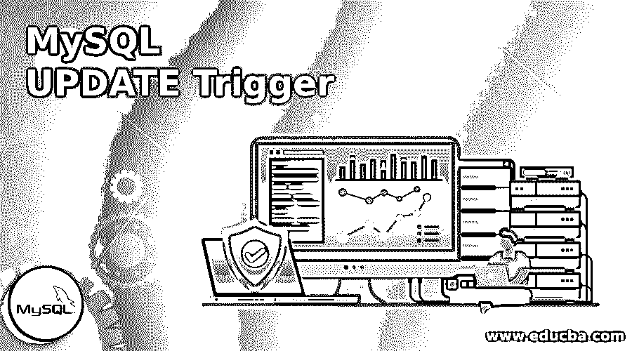

## MySQL 更新触发器介绍

MySQL UPDATE_TRIGGER 是在指定表上启用更新操作的触发器之一。一般来说，触发器可以定义为在指定的表上自动执行预期的更改操作的一组指令或步骤。可能的更改操作可以是插入、更新或删除。触发器的概念类似于存储过程，执行有助于节省编写查询的时间和精力。触发器是与表相关联的显式定义的数据库对象，是使用“CREATE TRIGGER”语句定义的。我们将详细讨论 CREATE TRIGGER 和 UPDATE TRIGGER 语句的细节。

### 句法

就像任何其他语句集一样，触发器也可以根据需要创建和删除。创建触发器的语法如下:

<small>Hadoop、数据科学、统计学&其他</small>

`CREATE
[DEFINER = user] TRIGGER trigger_name
trigger_time trigger_event
ON tbl_name FOR EACH ROW
[trigger_order] trigger_body`

**说明:**

**定义者:**定义者是被授权执行触发操作的用户。

**trigger _ name:**trigger _ name 是触发指令的名称。这是用户定义的字段。

**trigger _ time:**trigger _ time 是将要发起触发的时刻。它位于“之前”或“之后”,指示是在每行之前还是之后执行触发操作。

**trigger _ event:**trigger _ event 是引用的变更操作。插入、更新或删除操作用作触发器。

**trigger_order:** 触发器顺序指定触发器是在后面还是前面

**trigger _ body:**trigger _ body 定义了触发动作。如果要提到一个以上的语句，最好使用 BEGIN END 块，并更改默认分隔符。

所以语法可以表示为:

`DELIMITER $$
CREATE TRIGGER trigger_name
trigger_time trigger_event
ON table_name FOR EACH ROW
BEGIN
-- statements
END $$
DELIMITER;`

### MySQL 中的更新触发函数是如何工作的

从上面的讨论中，我们知道可以有两个更新触发器，更新前或更新后。这些触发器工作方式的不同之处在于，在更新前或更新后对每一行执行操作。

#### 更新后触发器

让我们考虑两个表来详细理解更新触发器。第一个表是 InitialSales，第二个表是 SalesUpdates。下面给出了表格中列的概念。

**初始销售表:**

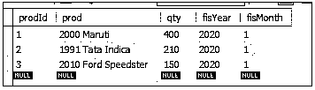

销售更新表定义为:

**代码:**

`CREATE TABLE SalesUpdates (
prodId INT AUTO_INCREMENT PRIMARY KEY,
sales_Id INT,
InitialQuantitiy INT,
UpdatedQuantity INT,
UpdatedOn TIMESTAMP NOT NULL DEFAULT CURRENT_TIMESTAMP
);`

让我们将触发器定义如下:

**代码:**

`DELIMITER $$
CREATE TRIGGER Updated_Sales_Data
AFTER UPDATE
ON InitialSales FOR EACH ROW
BEGIN
IF OLD.qty<>new.qty THEN
INSERT INTO SalesUpdates(sales_Id,InitialQuantity, UpdatedQuantity)
VALUES(old.prodId, old.qty, new.qty);
END IF;
END $$
DELIMITER;`

**输出:**

**说明:**触发器名称为 Updated_Sales_Data。trigger_event 为“更新”，trigger_time 为“之后”。触发器将作用于表“InitialSales”。根据查询，如果 InitialSales 表中的*【数量】*列有任何更新，SalesUpdatetable 中将添加一个新条目，旧值和“数量”列的新值。对 InitialSales 表的任何更新都将自动启动触发器。不需要每次都显式执行触发器。

为了进一步检查 TRIGGER 的工作情况，让我们对 InitialSales 表进行两种类型的更新。

首先，我们将看到只对一个“prodId”的“qty”列进行了更新。

考虑如下初始销售表:

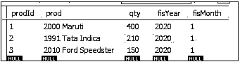

**代码:**

`UPDATE InitialSales
SET qty = 500
WHERE prodId = 3;
Query will update the column ‘qty’ of prodId ‘3’, from ‘150’ to ‘500’.`

**输出:**

让我们看看两个表 InitialSales 和 SalesUpdates:

初始销售:

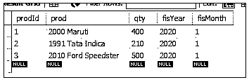

销售更新:

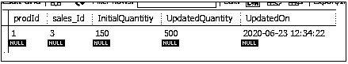

如果我们深入了解这一情景，我们可以理解以下事情:

1.  初始销售表中对数量列的更新正确反映
2.  SalesUpdates 表只包含 InitialSales 表中已更新行的数据，该行的 prodId = 3。
3.  更新触发器没有被显式调用，但是它自动更新了 SalesUpdate 表。
4.  SalesUpdates 表保存 qty 列的新旧值

在第二个场景中，让我们对 InitialSales 表的所有三行进行更新。

初始销售:

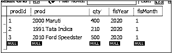

**代码:**

`UPDATE initialSales
SET qty = CAST(qty * 1.5 AS UNSIGNED);`

该查询将 InitialSales 表中所有三行的“qty”列的增量更新为 50%

**输出:**

初始销售:

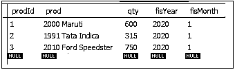

销售更新:

SalesUpdate 表的第一行是对 InitialSales 表的第一次更新(通过我们的第一个查询)。因此，我们可以看到 SalesUpdate 表保存了所有更新的历史记录以及时间戳。

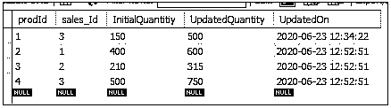

#### 更新触发器之前

因此，我们已经清楚地了解了 AFTER UPDATE 触发器。现在让我们试着熟悉一下更新前触发器。

对于更新前触发器，让我们考虑下表:

初始销售:

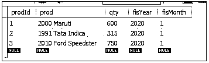

销售更新:

**代码:**

`CREATE TABLE SalesUpdates (
sales_Id INT AUTO_INCREMENT PRIMARY KEY,
prodId INT,
InitialQuantitiy INT,
UpdatedQuantity INT,
Updated On TIMESTAMP NOT NULL DEFAULT CURRENT_TIMESTAMP
);`

让我们将触发器定义如下:

**代码:**

`DELIMITER $$
CREATE TRIGGER Updated_Sales_Data
BEFORE UPDATE
ON InitialSales FOR EACH ROW
BEGIN
IF OLD.qty<>new.qtyTHEN
INSERT INTO SalesUpdates(sales_Id,InitialQuantity, UpdatedQuantity)
VALUES(old.prodId, old.qty, new.qty);
END IF;
END $$
DELIMITER;`

**输出:**

**说明:**触发器名称为 Updated_Sales_Data。trigger_event 为“更新”，trigger_time 为“之前”。触发器将作用于表“InitialSales”。根据查询，如果对 InitialSales 表中的“qty”列进行任何更新，SalesUpdatetable 中将添加一个新条目，其中包含“qty”列的旧值和新值。对 InitialSales 表的任何更新都将自动启动触发器。不需要每次都显式执行触发器。

我们的初步销售表如下:

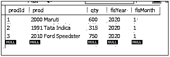

和 SalesUpdate 表如下:

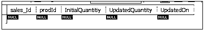

让我们执行一个查询来更新 InitialSales 表中的 qty 列。

**代码:**

`UPDATE InitialSales
SET qty = 500
WHERE prodId = 3;`

**输出:**

InitialSales 表:对于 prodId = 1，此表中的数量值从值“600”更新为“1000”。

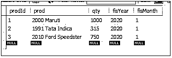

SalesUpdates 表:显示 qty 列的初始值和更新值，以及 update_timestamp。

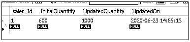

一般来说，我们可以说，更新前触发器用于在提交到数据库之前进行更新，而更新后触发器用于在数据库提交之后进行更新。

### 结论

在本节中，我们讨论了更新触发器。触发器可以是 BEFORE 触发器，也可以是 AFTER 触发器。在 CREATE trigger 语句中，我们将 trigger_event 定义为 UPDATE for UPDATE trigger、trigger _ time as BEFORE or AFTER as per requirements、trigger name、trigger body 以及要执行触发器的表。对于更新触发器，一旦突出显示的列面临任何更新，就会自动调用触发器并更新更新表。

### 推荐文章

这是一个 MySQL 更新触发器的指南。在这里，我们讨论了 MySQL 更新触发器的介绍，语法以及它如何与查询示例一起工作。您也可以浏览我们的其他相关文章，了解更多信息——

1.  [SQL 中的触发器](https://www.educba.com/triggers-in-sql/)
2.  [MySQL 触发器](https://www.educba.com/mysql-trigger/)
3.  [甲骨文触发器](https://www.educba.com/oracle-triggers/)
4.  [MySQL 中的光标](https://www.educba.com/cursor-in-mysql/)

