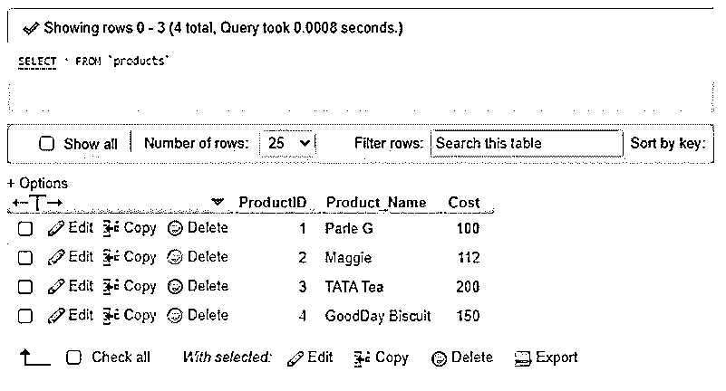
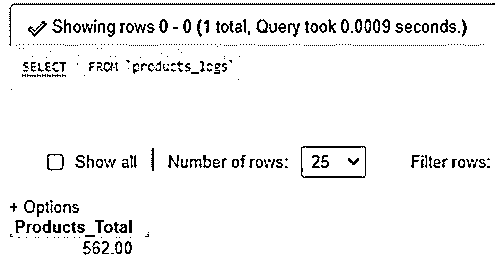
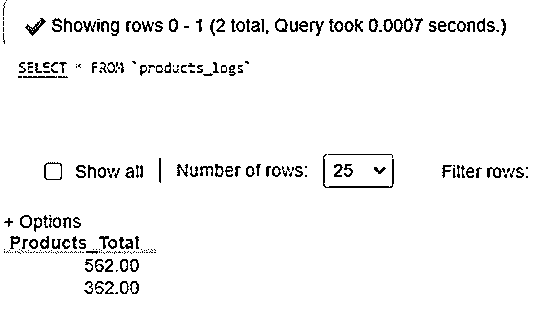
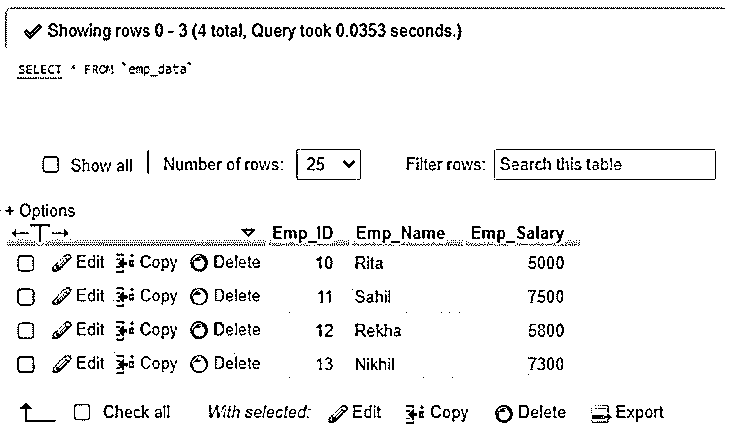
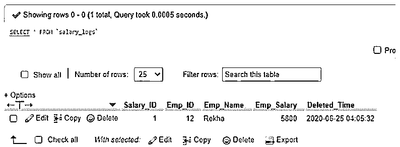

# MySQL 删除触发器

> 原文：<https://www.educba.com/mysql-delete-trigger/>

## MySQL 删除触发器简介

MySQL DELETE Trigger 是作为一个存储程序执行的，在对与之关联的特定数据库表执行任何特定查询之前或之后，都会调用该存储程序来调用事件。创建的触发器有助于维护相关 MySQL 操作的日志记录，比如插入、删除和更新。为此，日志表保存了触发器被链接或创建的相关表的摘要，以便我们可以知道用户对特定查询语句在数据库中可用或完成的任何更新。MySQL 触发器是在表中执行相关事件时自动响应的数据库对象。

### 删除触发器后的 MySQL

这个 MySQL 的 AFTER DELETE 触发器是在一个数据库表上形成的，用来保留与之相连的汇总表。通常，在表中完成 MySQL 删除查询事件后，会立即触发 AFTER DELETE 触发器。

<small>Hadoop、数据科学、统计学&其他</small>

探索通过连续的 SQL 命令使用该触发器的简单语法:

**代码:**

`CREATE TRIGGER TriggerName
AFTER DELETE ON TableName FOR EACH ROW
TriggerBody`

上述结构代码解释如下:

*   最初，为希望创建的触发器安排一个名称，就在作为 CREATE TRIGGER 提到的关键字之后。
*   此后，我们将增强 DELETE 后的子句，以实现在表中发生任何删除查询事件后立即执行的触发器。
*   然后在上面提到的关键字 on 之后，提到触发器要关联的表的名称。
*   最后，我们需要由一个或多个语句组成的触发器主体，当我们运行触发器时，这些语句对于丰富查询是必不可少的。

但是当我们在触发器主体中练习几个语句时，为了绑定语句，我们将应用 BEGIN END 块。因此，暂时必须转换默认分隔符，如下所示。

**代码:**

`DELIMITER $$
CREATE TRIGGER TriggerName
AFTER DELETE ON TableName FOR EACH ROW
BEGIN
>>>>statements
END$$
DELIMITER ;`

在这种触发器中，可以选择访问旧行，但不能改变它。此外，在 AFTER DELETE 触发器中，不会出现新行。

相信，我们将通过下面的例子来验证这一点。

创建一个演示表来展示名为 Products 的删除触发器后的过程。

**代码:**

`DROP TABLE IF EXISTS Products;
CREATE TABLE Products (ProductID INT PRIMARY KEY, Product_NameVARCHAR(255) NOT NULL, Cost INT NOT NULL);`

现在，在表中输入一些记录。

**代码:**

`INSERT INTO `products`(`ProductID`, `Product_Name`, `Cost`) VALUES ('01','Parle G','100');`

诸如此类。

查看记录。

**代码:**

`SELECT * FROM Products;`

**输出:**

让我们还创建另一个表来存储删除的成本金额。

**代码:**

`DROP TABLE IF EXISTS Products_logs;
CREATE TABLE Products_logs (Products_TotalDECIMAL(15,2) NOT NULL);`

我们将使用 SUM()函数计算 Products 表中的总成本，并将其输入 Products_logs。

**代码:**

`INSERT INTO Products_logs(Products_Total)
SELECT SUM(Cost) FROM Products;`

**输出:**

后续代码将在 Products 表中创建 AFTER DELETE 触发器。

**代码:**

`DELIMITER $$
CREATE TRIGGER after_cost
AFTER DELETE ON Products FOR EACH ROW
BEGIN
INSERT INTO Products_logs (Products_Total)
SELECT SUM(Cost) FROM Products;
END$$
DELIMITER ;`

现在，我们将通过从 Products 表中删除一行来检查触发器。

**代码:**

`DELETE FROM Products WHERE ProductID = 03;`

要查看更改，请查询下面的数据表单 Product_logs 表。

**代码:**

`SELECT * FROM Products_logs;`

**输出:**

您可以看到该表中有一个新行，显示了降低的总成本信息。

### 删除触发器前的 MySQL

这个 MySQL BEFORE DELETE 触发器是在一个数据库表上创建的，用于保存与之相关的 swift 表，该表包括基表中已删除的行。通常，在表中执行 MySQL 删除查询事件之前，会立即触发 BEFORE DELETE 触发器。

后续 SQL 命令使用此触发器的基本语法:

**代码:**

`CREATE TRIGGER TriggerName
BEFORE DELETE ON TableNameFOR EACH ROW
TriggerBody`

上述结构代码解释如下:

*   最初，为需要创建的触发器提供一个名称，就在作为 CREATE TRIGGER 提到的关键字之后。
*   此后，我们将在 DELETE 之前添加子句，以实现在表中发生任何删除查询事件之前触发的触发器。
*   然后在上面提到的关键字 ON 之后提供触发器要关联的表的名称。
*   最后，我们需要添加由一个或多个语句组成的触发器主体，当我们触发触发器时，这些语句是完成查询所必需的。

但是当我们在触发器主体中使用多个语句时，为了包装语句，我们需要应用 BEGIN END 块。因此，需要暂时修改默认分隔符，如下图所示。

**代码:**

`DELIMITER $$
CREATE TRIGGER TriggerName
BEFORE DELETE ON TableName FOR EACH ROW
BEGIN
>>>>statements
END$$
DELIMITER;`

在这种类型的触发器中，有机会访问旧行，但我们不能改变它。此外，在 BEFORE DELETE 触发器中，不存在新行。

**举例:**

让我们设置一个演示表来查看名为 Emp_data 的 BEFORE DELETE 触发器的使用，该触发器具有 id、姓名、薪金金额和其他字段。

**代码:**

`DROP TABLE IF EXISTS Emp_data;`

`CREATE TABLE Emp_data(Emp_ID INT PRIMARY KEY, Emp_NameVARCHAR(255) NOT NULL, Emp_SalaryINT NOT NULL DEFAULT 0);`

现在，使用下面的查询将一些记录插入到为引用而创建的表中。

**代码:**

`INSERT INTO `emp_data`(`Emp_ID`, `Emp_Name`, `Emp_Salary`) VALUES ('10', 'Rita', '5000');`

诸如此类。

查看记录。

**代码:**

`SELECT * FROM Emp_data;`

**输出:**

让我们还创建另一个表来存储删除的工资金额。

**代码:**

`DROP TABLE IF EXISTS Salary_logs;
CREATE TABLE Salary_logs (Salary_ID INT PRIMARY KEY AUTO_INCREMENT, Emp_ID INT, Emp_Name VARCHAR(255) NOT NULL, Emp_Salary INT NOT NULL, Deleted_Time TIMESTAMP DEFAULT NOW());`

在执行从 Emp_data 表中删除行的删除查询之前，后续的 BEFORE DELETE 触发器将在 Salary_logs 表中添加一个新行。

触发代码编写如下。

**代码:**

`DELIMITER $$
CREATE TRIGGER before_salary
BEFORE DELETE ON Emp_dataFOR EACH ROW
BEGIN
INSERT INTO Salary_logs(Emp_ID, Emp_Name, Emp_Salary)
VALUES (OLD.Emp_ID, OLD.Emp_Name, OLD.Emp_Salary);
END$$
DELIMITER;`

现在，我们将通过从 Emp _ 数据表中删除一行来检查触发器。

**代码:**

`DELETE FROM Emp_dataWHERE Emp_ID = 12;`

要查看更改，请从下面的 Salary_logs 表中查询数据。

**代码:**

`SELECT * FROM Salary_logs;`

**输出:**

您可以看到记录了带有时间戳的触发器信息的表。

### 结论

MySQL 触发器充当收集器，将插入到相关表的列中的所有值、删除的值或表的更新值相加。它存储了为同时执行的事件执行的操作列表。MySQL AFTER 或 BEFORE 触发器用于调用触发器，并将删除的记录添加到数据库的链接存档表中。

### 推荐文章

这是一个 MySQL 删除触发器的指南。这里我们讨论一下 MySQL 删除触发器的介绍，查询实例分别放在删除触发器之前、之后。您也可以看看以下文章，了解更多信息–

1.  [MySQL Datetime](https://www.educba.com/mysql-datetime/)
2.  [MySQL 检查约束](https://www.educba.com/mysql-check-constraint/)
3.  [MySQL 日期函数](https://www.educba.com/mysql-date-functions/)
4.  [MySQL 别名](https://www.educba.com/mysql-alias/)

