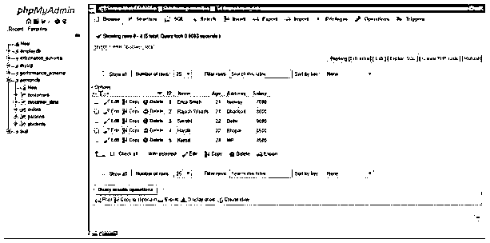
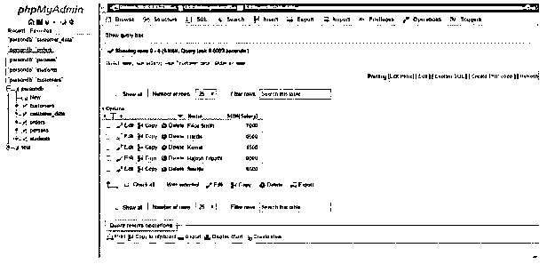
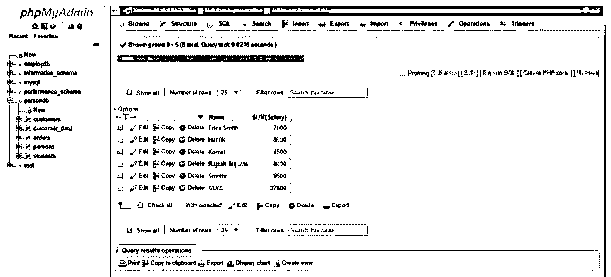
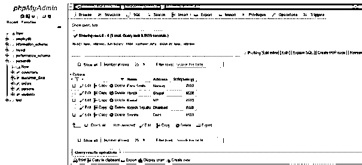
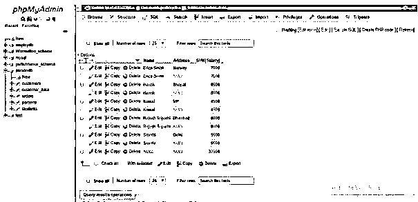

# MySQL 中的汇总

> 原文：<https://www.educba.com/rollup-in-mysql/>

## MySQL 中的 ROLLUP 介绍

MySQL ROLLUP 是一种 SQL 关键字，用在带有 GROUP BY 子句的语句中，有助于为作为汇总行的列结果集创建小计和总计。ROLLUP 运算符在 MySQL with GROUP BY 语句中用作扩展或高级功能，通过添加附加行来筛选一列或一组列的总和。

正如我们所知，GROUP BY 查询应用了 COUNT、MAX、MIN、SUM、AVG 等聚合函数，这些函数按单个或多个列对结果行进行分组。ROLLUP SQL 运算符是使用 GROUP BY 子句的一个选项，允许您包含表示小计的额外字段。这些小计行与总计行一起被称为超级汇总行。因此，我们可以在 MySQL 中使用包含 GROUP BY 子句和 ROLLUP 扩展的单个查询来创建集合行的多个分组。

<small>Hadoop、数据科学、统计学&其他</small>

**语法:**

受 SQL Server | Oracle | MS Access 支持

`SELECT r1, r2 AggregateFunction(r3) FROM TableName GROUP BY ROLLUP (r1,r2);`

对于 MySQL，我们使用的语法与上面略有不同:

`SELECT r1, r2 AggregateFunction(r3) FROM TableName GROUP BY r1, r2 WITH ROLLUP;`

因为 ROLLUP 遵循输入列的层次结构，所以根据上面的语法，当我们提供(r1，r2) then 时，它假定层次结构为 r1 > r2。ROLLUP 使用这种层次结构创建一组合理的列。因此，在 MySQL 中，为了生成报告，我们考虑使用 ROLLUP 子句来生成小计和总计。

### MySQL 中 ROLLUP 是如何工作的？

*   ROLLUP 运算符可以说是检索结果集的一个选项，该结果集带有根据使用 GROUP BY 分组的列计算的小计。这将根据 MYSQL 中提供给 ROLLUP 关键字的表列生成汇总金额。
*   因此，通过使用 ROLLUP 操作符形成的结果表从规范级别的列集合的分组中收集数据，并将它们汇总到主表中。
*   从逻辑上讲，我们可以证明 ROLLUP 操作符是一个 SQL 修饰符，当它与语句中的 GROUP BY 子句一起使用时。因此，它通过在表中包含决定高级即时操作的额外行来影响汇总输出。
*   您还可以同时添加 LIMIT 子句，以便用 ROLLUP 子句限制结果集中的行。
*   ROLLUP 不与 ORDER BY 一起使用。我们可以在 SQL 语句中使用 ROLLUP 运算符，在 GROUP BY 子句中使用 ASC 或 DESC 类型的排序。

### MySQL 中的汇总示例

以下是 MySQL 中的汇总示例:

例如，我们在这里使用了数据库 PersonDb 中带有列(ID、姓名、年龄、地址、薪水)的 Customer_Data 表。

**客户 _ 数据表**

#### 示例#1

包含一列的 MySQL 汇总。

我们正在执行下面的 SQL 查询，使用 GROUP BY 子句和 MySQL 中的 SQL SUM()聚合函数按客户名称获取总工资。

`SELECT Name, SUM(Salary) FROM `customer_data` GROUP BY Name;`

**输出:**

现在，让我们使用 ROLLUP 运算符查询下面的语句，以检索所有 salary 列中的总金额:

`SELECT Name, SUM(Salary) FROM `customer_data` GROUP BY Name WITH ROLLUP;`

**输出:**

在上面的结果集中，您可以看到总计行是由表中的空值列指定的。这里，ROLLUP 添加了一个额外的行，以显示表数据中所有薪资金额的总计超级汇总行。

因此，我们可以通过使用 SQL COALESCE()函数使结果汇总行向用户提供更多信息，该函数负责将列值 NULL 替换为我们想要的任何其他文本单词，假设这里我们使用了“所有客户”。

`SELECT COALESCE(Name, 'All Customers ') AS Name, SUM(Salary) FROM `customer_data` GROUP BY Name WITH ROLLUP;`

**输出:**

#### 实施例 2

多列 MySQL 汇总。

以下代码通过两列 Name 和 Address 计算 Customer_Data:

`SELECT Name, Address, SUM(Salary) FROM `customer_data` GROUP BY Name, Address;`

**输出:**

现在，将 ROLLUP 添加到上述 SQL GROUP BY 语句中:

`SELECT Name, Address, SUM(Salary) FROM `customer_data` GROUP BY Name, Address WITH ROLLUP;`

**输出:**

如果您看到结果表，它不仅包括单个级别的行的输出摘要，还包括带有 ROLLUP 的分析过程中的两个级别。

*   对于特定名称的每一组地址行，都有一个额外的汇总行显示 Customer_Data 薪金总额。因此，列中的这个地址值被定义为 NULL。
*   在结果表的末尾，会出现一个附加行，其中包含所有姓名和地址列的薪金总额，这些列的值都设置为 NULL。

#### 实施例 3

带有部分汇总的 MySQL 汇总。

我们还可以在 MySQL 中使用 ROLLUP 和 GROUP BY 子句以部分方式执行操作 rollup。这有助于减少计算的小计数量。

`SELECT DISTINCT Name, Address, SUM(Salary) FROM `customer_data` GROUP BY Address WITH ROLLUP;`

在这里，从结果集中，我们可以清楚地看到，仅使用 ROLLUP 子句计算了地址列的超级聚合总计，而没有计算姓名列的超级聚合总计。

因此，我们可以在 MySQL 中仅使用一个 SQL 查询来进行多级操作的分析。

### 结论

MySQL 中的 ROLLUP 操作符在表中用于生成多个要分组的列的分组集。由此，SQL ROLLUP 还可以形成列的总计，而不仅仅是小计。假设，当我们使用 ROLLUP 和 GROUP BY 子句使用多个列为一个表编写查询语句时，SQL ROLLUP 子句需要这些列之间的层次结构。因此，MySQL 中带有 GROUP BY 子句的 ROLLUP 子句有助于在每次新列发生变化时生成行的小计，并最终计算总计。

### 推荐文章

这是一个 MySQL 中的 ROLLUP 指南。这里我们讨论一下引言，ROLLUP 在 MySQL 中是如何工作的？还有例子。您也可以看看以下文章，了解更多信息–

1.  [甲骨文条款](https://www.educba.com/oracle-clauses/)
2.  [MySQL MAX()函数](https://www.educba.com/mysql-max-function/)
3.  [MySQL 中的 MIN()](https://www.educba.com/min-in-mysql/)
4.  [MySQL 中的左外连接](https://www.educba.com/left-outer-join-in-mysql/)
5.  [PostgreSQL 汇总|示例](https://www.educba.com/postgresql-rollup/)
6.  [MySQL 中运算符的例子](https://www.educba.com/mysql-in-operator/)

