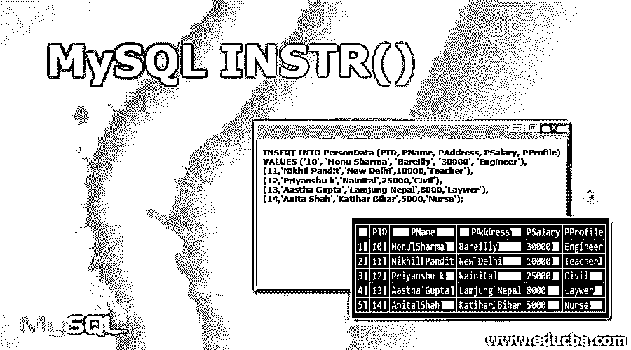

# MySQL INSTR()

> 原文：<https://www.educba.com/mysql-instr/>

## MySQL INSTR()函数介绍

INSTR() MySQL 函数被定义为一个 SQL 实用程序，当在 MySQL 服务器中执行时，它提供子字符串在主字符串中第一次出现的位置作为结果。通常，这个 INSTR()函数负责显示我们想要知道的某个字符串在数据库中某个表的记录下的位置。对于这种类型的搜索过程和显示结果数据，函数 INSTR()在 SQL 查询提供的表中实现不区分大小写的搜索。MySQL 中的 INSTR()是一个字符串内置函数，检查字符串中是否存在子串。在这种情况下，如果该事件不存在，则该函数返回零值或 FALSE。

**语法:**

<small>Hadoop、数据科学、统计学&其他</small>

我们来介绍一下 MySQL 中 INSTR()函数的基本语法:

`INSTR(string, string1)`

*   这里，语法有两个参数。一个是“string ”,它是一个必需的实体，表示要搜索的字符串。
*   另一个是“string1 ”,表示在第一个参数“string”中搜索所需的子字符串。
*   假设如果在搜索的字符串参数中没有找到 string1，那么使用 INSTR()函数的查询可能会得到零。
*   请注意，字符串中的第一个位置是 1，并且不执行区分大小写的搜索。该函数通过不区分大小写的搜索来完成查询。

### MySQL 中的 INSTR()函数是如何工作的？

MySQL 中的 INSTR()函数作为 SQL 关键字，帮助返回在另一个字符串中搜索的一个字符串的初始位置。INSTR()与 SELECT SQL 语句一起用于在 MySQL 中获取结果。

假设，我们举一个带有 SELECT SQL 关键字的 INSTR()的简单例子。

**查询:**

`SELECT INSTR('Educba.com', 'a')as INSTR_TABLE;`

在上面的查询中，我们将在字符串“educba.com”中搜索“a ”,结果将显示其位置。输出将是 6，因为子字符串“a”首先出现在主字符串中的第 6 个位置。

**输出:**

正如我们所知，INSTR()不区分大小写，所以如果您的子字符串传递任何小写、句子大小写、标题大小写、大写等都没有关系。，但该函数将返回相同的结果。

假设我们需要应用 INSTR()函数在一个非二进制的关键字字符串上用区分大小写的方法进行搜索，那么我们就可以用函数中的自变量或参数将二进制的 MySQL 运算符从一个非二进制的字符串自变量添加到一个二进制的字符串自变量中。

比如，如果我们使用下面的 MySQL 查询，那么结果将是一样的，因为这个函数不区分大小写。

**查询:**

`SELECT INSTR('Educba.com', 'A') AS Position;`

**输出:**

但是，如果我们按如下方式操作查询:

**查询:**

`SELECT INSTR('Educba.com', BINARY 'A') as Position;`

**输出:**

然后，结果会有所不同，因为带有二进制子串的 INSTR()函数具有区分大小写的属性。

### 实现 MySQL INSTR()函数的例子

让我们用下面的例子来说明 INSTR()函数的特征。名为 PersonData 的表被用作执行查询的示例表。

**创建人员数据表**

`CREATE TABLE PersonData ( PID int PRIMARY KEY, PName varchar(255) NOT NULL, PAddress varchar(255), PSalary int, PProfile varchar(255) );`

之后，我们将使用 SQL 语句插入一些值，如下所示:

`INSERT INTO PersonData (PID, PName, PAddress, PSalary, PProfile)
VALUES ('10', 'Monu Sharma', 'Bareilly', '30000', 'Engineer'),
(11,'Nikhil Pandit','New Delhi',10000,'Teacher'),
(12,'Priyanshu k','Nainital',25000,'Civil'),
(13,'Aastha Gupta','Lamjung Nepal',8000,'Laywer'),
(14,'Anita Shah','Katihar Bihar',5000,'Nurse');`

下面是包含查询的所有 PersonData 表数据的列表:

**查询:**

`select * from PersonData;`

**输出:**

#### 1.INSTR()函数类似于 MySQL 中的操作符

我们考虑了下面两条 SQL 语句，其中我们搜索包含字符串关键字“s”的人名:

**查询:**

`SELECT PName FROM PersonData WHERE INSTR(PName,'s');`

运筹学

`SELECT PName FROM PersonData WHERE PName LIKE '%S%';`

**输出:**

这里，在执行时，两者都用 PName 返回相同的列结果集。而 LIKE 操作符听起来很相似，但是当我们需要从数据库表的大量数据中查找时，它要快得多。在表格列中搜索特定类型的模式，并在存在这种字符串或字符串组排列的地方产生字符串集合。

#### 2.INSTR()函数以及 WHERE 子句

让我们考虑带有字段(PID、PName、PAddress、PSalary、PProfile)的 PersonData 上面的表。

**查询:**

`SELECT PProfile, INSTR(PProfile,'ne') FROM PersonData WHERE INSTR(PProfile,'ne') > 0;`

**输出:**

上面的 INSTR()查询返回结果集第一列中的配置文件列表，其中在 PersonData 表的配置文件名称中找到了子字符串关键字' en'。而在第二列中，您将获得一个整数值，它指示子字符串“en”在 person 的配置文件中的第一个出现位置。此外，在 WHERE 子句后应用了一个可选条件，确保 INSTR()只返回名称中的那些配置文件名，其中子字符串' en '在列中的位置大于零。

#### 3.带有比较运算符的 INSTR()

我们已经用 INSTR()函数和 WHERE 子句编写了一个 SQL 查询。下面的查询演示了列名 PAddress 作为函数的第一个参数，另一个参数带有子字符串，并使用了 MySQL 中的比较运算符大于(>)。

**查询:**

`SELECT PAddress, INSTR(PAddress,'l') AS RESULT FROM PersonData WHERE INSTR(PAddress,'l') > 0;`

**输出:**

此外，让我们通过下面的 SQL 语句尝试使用另一个等于比较运算符:

**查询:**

`SELECT PAddress, INSTR(PAddress,'l') AS RESULT FROM PersonData WHERE INSTR(PAddress,'l') = 0;`

**输出:**

INSTR()在 PersonData 表的 PAddress 列中搜索不到任何字符串的地方提供 0 位置的输出。

### 结论

*   INSTR() MySQL 函数帮助定位给定字符串中的子字符串，以检查它是否出现在字符串中。
*   假设如果我们将 INSTR()函数的第二个参数或参数值添加为 NULL，那么第一个参数字符串中出现的字符串也将为 NULL。
*   这个函数在执行表的全扫描和从表的给定字符串或列中找出字符串关键字的存在时很有用。

### 推荐文章

这是一个 MySQL INSTR()的指南。这里我们讨论 MySQL INSTR()函数的介绍以及实际例子和不同的子查询表达式。您也可以浏览我们推荐的文章，了解更多信息——

1.  [MySQL 操作符介绍](https://www.educba.com/mysql-operators/)
2.  [最大差异——吉拉 vs Github](https://www.educba.com/jira-vs-github/)
3.  [前 23 个 MySQL 字符串函数](https://www.educba.com/mysql-string-functions/)
4.  [MySQL 与 SQLite | 14 大对比](https://www.educba.com/mysql-vs-sqlite/)

