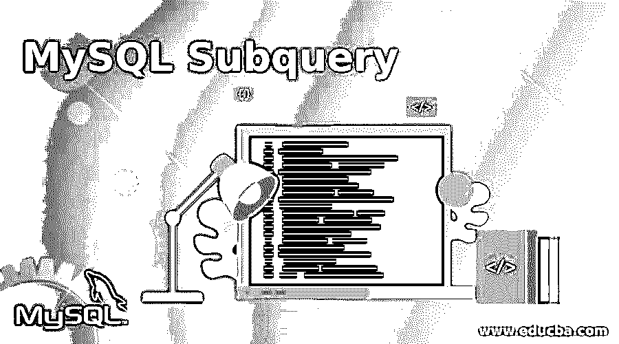
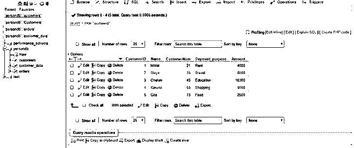
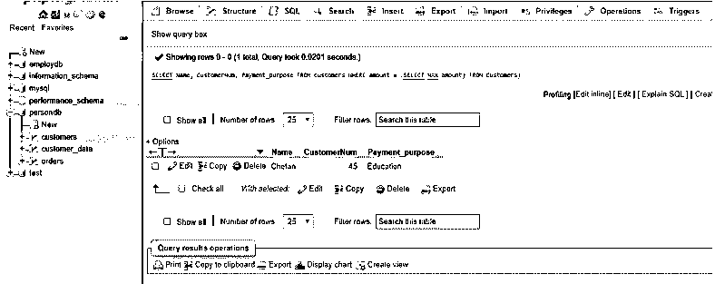
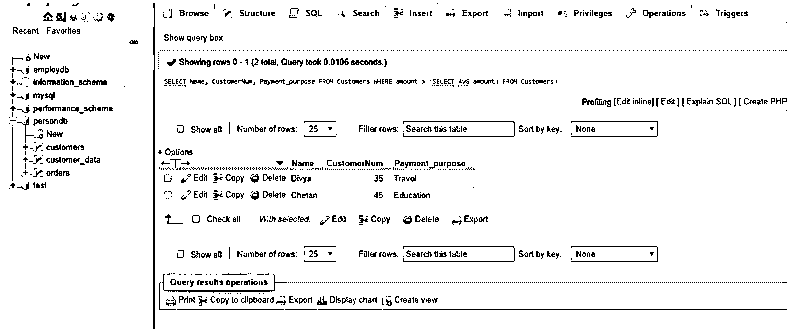
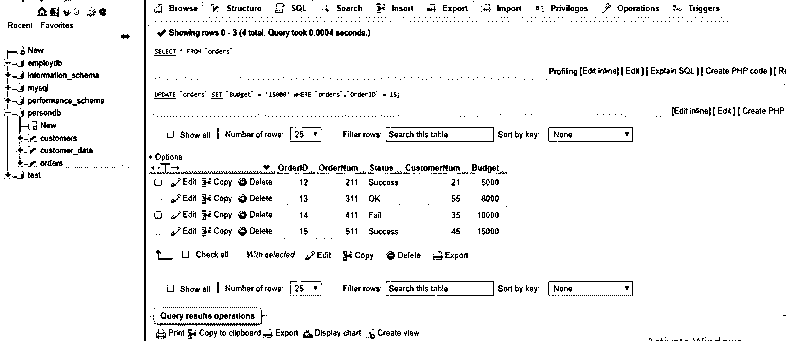
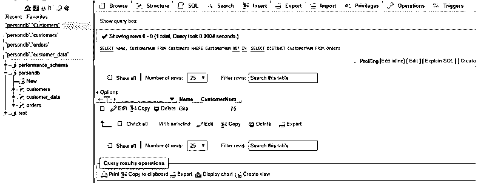
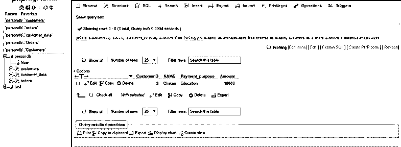
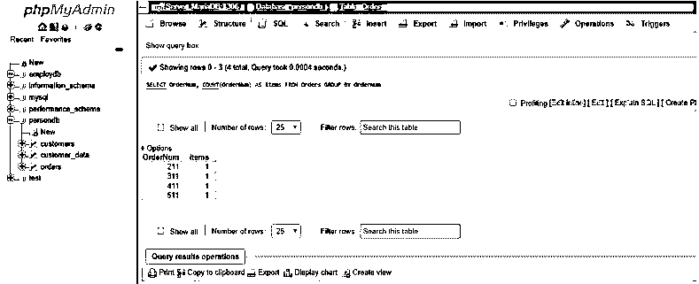
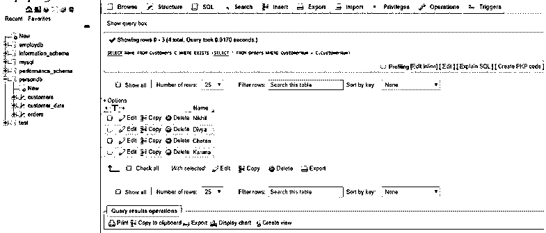

# MySQL 子查询

> 原文：<https://www.educba.com/mysql-subquery/>

## MySQL 子查询简介

在 MySQL 中，子查询被定义为一个 SELECT SQL 语句，在另一个 SQL 语句中用来计算外部查询的结果。简单地说，在 SQL 中，子查询是放置在外部 SQL 查询中的内部查询，使用不同的 SQL 子句，如 WHERE、FROM、HAVING 和 with 语句关键字，如 SELECT、INSERT、FROM、UPDATE、DELETE、SET 或 DO，并附带表达式运算符或逻辑运算符。

以下是各种类型的子查询及其相应的结果详细信息:

<small>Hadoop、数据科学、统计学&其他</small>

1.  **单行子查询**:返回零或单行
2.  **多行子查询**:返回表格的一行或多行
3.  **多列子查询**:返回一列或多列
4.  **相关子查询**:外部 SQL 查询中的一列或多列。

### MySQL 子查询的语法

我们可以说，子查询或内部查询是一种 SQL 查询，可用作外部主 SQL 查询的条件，有助于限制从嵌入在 WHERE 子句中的表中提取的数据行。此查询无法限制在集合函数中。

**例如:**

SELECT * FROM tablename 1 WHERE column 1 = ANY(SELECT column 1 FROM tablename 2 WHERE tablename 2 ......)。因此，这里 MySQL 在子查询外部查找，并在外部查询中找到 tablename1。

因此，像联接一样，子查询用于将不同表中的表数据组合成一个结果集。但是联接返回行，子查询返回单个值作为结果集或行集。因此，子查询的主要用途是为要执行的另一个查询计算即时值。

### MySQL 子查询的工作原理

让我们向您解释如何使用 MySQL 子查询来编写任何复合查询，并学习相关子查询的概念。

在 MySQL 中，我们可以在任何使用表达式 SQL query 的地方编写子查询，但是它要用括号括起来。

假设，我们有下面的 SQL 查询，它为我们提供了在德里的 IT 部门工作的人员。

`SELECT PersonName FROM PersonDb WHERE PersonID IN (SELECT PersonID FROM PersonIT WHERE City=’Delhi’);`

在上面的 SQL 语句中，首先，子查询返回位于德里市的 PersonIT 的所有 PersonID。然后外部查询从 PersonDb 表中选择所有在 PersonIT 工作的名字，其 PersonID 与内部查询的结果集相匹配。我们可以说，当我们运行这个查询时，outer 内部的查询首先执行，它返回的结果被用作外部查询的输入。

### MySQL 子查询的类型

以下是带有语法和示例的子查询类型:

#### 1.WHERE 子句上的 MySQL 子查询

让我们准备一个名为 Customer 的演示数据数据库表，其中包含关于客户和付款金额的信息。

该表具有字段客户 ID、名称、付款目的、客户编号、金额。

`CREATE TABLE Customers ( CustomerID int NOT NULL PRIMARY KEY, Name varchar(255), CustomerNum int, Payment_purpose varchar(255), Amount int );`

并插入一些数据样本如下:

`INSERT INTO Customers (CustomerID, Name, CustomerNum, Payment_purpose , Amount) VALUES ('1', 'Nikhil', '21', 'Rent', '4000');`

我们使用以下查询来获取所需的详细信息，使用带有比较运算符的子查询返回值，并在 WHERE 子句中使用表达式:

`SELECT Name, CustomerNum, Payment_purpose FROM Customers WHERE amount = (SELECT MAX(amount) FROM Customers);`

**输出:**

这个带有 WHERE 子句的子查询返回客户表中付款金额最大的客户详细信息。

除此之外，还可以使用等式运算符和其他比较(如大于(>)或小于(

例如，让我们使用子查询从表中找出付款额大于平均付款额的客户详细信息。

`SELECT Name, CustomerNum, Payment_purpose FROM Customers WHERE amount > (SELECT AVG(amount) FROM Customers);`

这里，我们在 SQL 内部查询语句中使用了 AVG 聚合函数，该函数通过外部查询生成以下结果。

**输出:**

#### 2.带有 IN 和 NOT IN 运算符的 MySQL 子查询

当子查询提供多个值时，可以使用 WHERE 子句添加其他运算符，如 IN 和 NOT IN。

我们有两个表，分别是“客户”(客户 ID、姓名、付款目的、客户编号、金额)和“订单”(订单 ID、订单编号、状态、客户编号)。

`CREATE TABLE Orders (OrderID int NOT NULL PRIMARY KEY, CustomerNum int, status varchar (255), OrderNum int, Budget int );`

我们将首先创建表格，然后插入一些演示数据。

现在，让我们使用带有 NOT IN 运算符的子查询来查找没有下任何订单的客户。

`SELECT Name, CustomerNum FROM Customers WHERE CustomerNum NOT IN (SELECT DISTINCT CustomerNum FROM Orders);`

**输出:**

#### 3.带有 FROM 子句的 MySQL 子查询

当我们在 FROM 子句中使用子查询时，返回的结果集被视为临时表行，这就是所谓的派生子查询或物化子查询。

我们也可以使用子查询从预算表中找到最小、最大和平均项目数。

`SELECT I.CustomerID, I.NAME, I.Payment_purpose, I.Amount FROM (select AVG(Budget) as averageBudget from Orders) as Budget, Customers as I WHERE I.Amount > Budget.averageBudget;`

**输出:**

#### 4.MySQL 相关子查询

如上所述，相关子查询是一个独立的查询。这意味着您可以将它用作独立的查询。它使用外部查询的结果集数据，并对每一行进行评估。

举个例子，

`SELECT OrderNum , COUNT(OrderNum) AS items FROM Orders GROUP BY OrderNum;`

**输出:**

#### 5.包含 EXISTS & NOT EXISTS 的 MySQL 子查询

在 SQL 子查询中使用 EXISTS 和 NOT EXISTS 运算符，布尔值将作为结果 TRUE 或 FALSE 返回。以下是在子查询中使用的语法:

`SELECT * (column1, …) FROM Tablename WHERE EXISTS (subquery);`

举个例子，

`SELECT Name FROM Customer C WHERE EXISTS (SELECT * FROM Orders WHERE CustomerNum = C.CustomerNum);`

**输出:**

EXISTS 和 NOT EXISTS 检查结果集中的行是否存在，并分别返回 TRUE 或 FALSE 值。

### 结论

在 MySQL 中，子查询嵌套在外部 SQL SELECT 语句的 WHERE 子句中。可以添加子查询，以使用比较运算符(如、=、IN 或 BETWEEN 等)进一步过滤结果集。

子查询在外部查询之前执行一次，以便将结果应用于外部查询以生成结果集。SQL 子查询可以在结果集行中返回标量、列、行和表子查询，这为外部查询提供了条件，并从 MySQL 中的表中给出了最终所需的结果。

### 推荐文章

这是一个 MySQL 子查询指南。这里我们讨论 5 种不同类型的 MySQL 子查询，以及相应的语法和例子。您也可以看看以下文章，了解更多信息–

1.  [MySQL 聚合函数](https://www.educba.com/mysql-aggregate-function/)
2.  [MySQL 中的光标](https://www.educba.com/cursor-in-mysql/)
3.  [SQL 子查询|示例](https://www.educba.com/sql-subquery/)
4.  [PostgreSQL 子查询|示例](https://www.educba.com/postgresql-subquery/)
5.  [MySQL 操作指南](https://www.educba.com/mysql-in-operator/)
6.  MySQL 时间戳|如何工作？
7.  [MySQL |中的 IF 语句如何工作？](https://www.educba.com/if-statement-in-mysql/)

