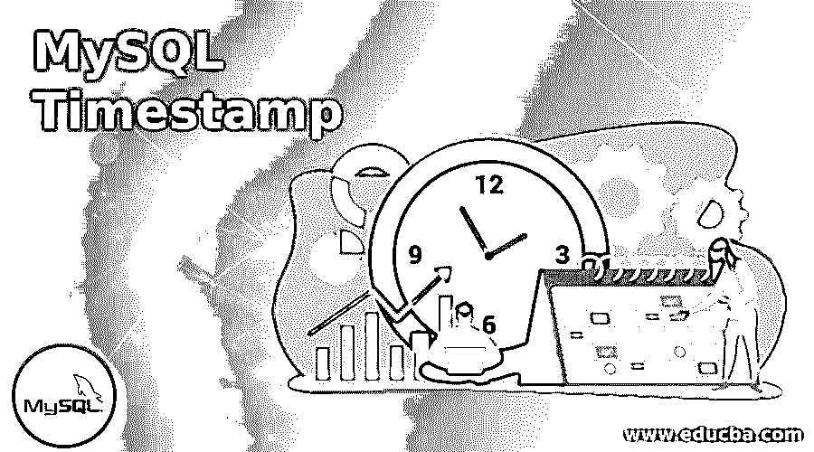

# MySQL 时间戳

> 原文：<https://www.educba.com/mysql-timestamp/>

## MySQL 时间戳简介

MySQL 时间戳可以定义为基于时间的 MySQL 数据类型，包含日期和时间。时间戳支持 MySQL 的通用协调时间(UTC)。时间戳的格式设置为 19 个字符:YYYY-MM-DD HH:MM: SS。Timestamp 数据类型的值范围是从 UTC 1970 年 1 月 1 日日到 UTC 2038 年 1 月 19 日日。在这里，UTC 指的是由国际计量局(BIPM)保存的协调时间表。此外，UTC 还被称为“Z 时间”或“祖鲁时间”。当 Timestamp 的值被插入到 MySQL 的表中时，在插入它之前，MySQL 会将它转换为 UTC 格式，该格式被设置为您的时区连接，以便该值可以存储在数据库表中。然而，如果我们执行一个查询来访问时间戳，那么服务器 MySQL 会将 UTC 时间戳值改为相应的时区连接。这对 outlook 的时间戳值很重要，这有助于了解时区格式。请记住，这种类型的转换只发生在 Timestamp 数据类型中，而不会发生在 DATETIME MySQL 数据类型中。默认情况下，时区连接与 MySQL 服务器的时区相同。假设当您连接到 MySQL 服务器时，您可以应用不同的时区。

### 句法

表示数据类型的 Timestamp()函数返回基于日期时间的值。

<small>Hadoop、数据科学、统计学&其他</small>

时间戳的基本语法如下:

`Timestamp (exp, time)`

这里，两个参数在语法中表示这两个值:

*   需要 exp，它表示具有日期或日期时间值的表达式。
*   time 是添加到上述语法中第一个参数表达式的可选时间值。

因为我们知道，MySQL 时间戳函数有一个 DateTime 值，如果有两个参数的话；该函数最初将第二个参数作为初始参数的补充。

**Note:** For this article, we have used the PostgreSQL server.

### MySQL 中时间戳数据类型是如何工作的？

根据 Timestamp 函数语法，函数 Timestamp 的两个参数来自日期时间值，并与 SELECT 子句一起使用来获取结果，如下所示:

`SELECT TIMESTAMP (“2020-03-26”, “10:15:11”);`

这里，该函数将表达式转换为日期时间值，此外还将时间间隔添加到该值中。结果将简单地采用时间戳格式，如下所示:

当您想要获取位于不同时区的不同位置的用户输入的任何时间戳 MySQL 值时，将检索的值将不会与数据库中的值相同。如果你不改变时区，那么类似的时间戳 MySQL 值将被获取，你已经存储。这是因为用于转换的时区不同。但是对于数据类型 DATETIME，该值保持不变。

### 实现 MySQL 时间戳的示例

让我们通过下面的例子来解释 Timestamp 关键字以及它如何处理这些值:

#### 示例#1

MySQL 时间戳时区:假设我们创建了一个名为 demo_timestamp 的表，其中包含一个时间戳数据类型为 asts1 的列。

**代码:**

`CREATE TABLE demo_timestamp(ts1 TIMESTAMP);`

现在，让我们在 demo_timestamp 表中输入一个时间戳 MySQL 值。

**代码:**

`INSERT INTO demo_timestamp(ts1) VALUES('2020-03-27 03:20:01');`

插入这个时间戳值后，您可以通过对表使用 SELECT SQL 语句来查看列值:

**代码:**

`SELECT ts1 FROM demo_timestamp;`

**输出:**

#### 实施例 2

自动初始化和更新时间戳列:

让我们来研究下面的例子，在这里我们创建了一个表' Employee ':

**代码:**

`CREATE TABLE Employee(Empid INT PRIMARY KEY, EmpName VARCHAR (255) NOT NULL, Creation_time TIMESTAMP DEFAULT CURRENT_TIMESTAMP);`

在创建的表中，我们设置了一个列 Creation _ time，它引用时间戳数据类型，其默认值表示 CURRENT_TIMESTAMP。

在这之后，让我们向 Employee 表中插入一条新记录，但是我们不会为列 Timestampi(即 Creation_time)指定任何值

**代码:**

`INSERT INTO Employee (Empid,EmpName) VALUES ('1','ABC');`

现在，我们将通过使用以下 SQL 查询来查看表记录，并查看时间戳列中存储了什么值:

**代码:**

`SELECT * FROM Employee;`

**输出:**

我们看到，当插入行时，该列已经由当前时间戳自动初始化。这种特性被称为自动初始化。

#### 实施例 3

我们将在表中添加下一列“更新时间”:

**代码:**

`ALTER TABLE Employee ADD COLUMN Update_time TIMESTAMP DEFAULT CURRENT_TIMESTAMP ON UPDATE CURRENT_TIMESTAMP;`

这里的 ON UPDATE 关键字是一个子句，当列值中有任何修改时，它将更新时间。

假设，插入一条新记录:

**代码:**

`INSERT INTO Employee (Empid,EmpName) VALUES('2','XYZ');`

现在，查看记录:

**代码:**

`SELECT * FROM Employee;`

**输出:**

#### 实施例 4

对于这一次，两个时间戳值是相同的，但是当我们进行任何更新时，如:

**代码:**

`UPDATE Employee SET EmpName = 'JKL' WHERE Empid = 2;`

再次从表中选择全部以查看更改:

**代码:**

`SELECT * FROM Employee;`

**输出:**

**说明:**您可以看到，当更新列值时，Update_time_at 列的值更改为日期和时间，而 Creation_time 设置为不变，显示插入时间值。这个特性在 MySQL 中被称为时间戳功能的自动更新。记住，如果我们用相同的值再次更新，那么 Update_time 列的时间戳值将不会改变。

### 在 MySQL 中使用时间戳的优势

*   Timestamp 函数将数据和时间列添加到表中，以管理与作为日志的任何值的插入、删除或更新相关的所有活动。
*   Timestamp 为 MySQL 维护通用协调时间(UTC ),以便将数据和时间值存储在一起，并且可以根据客户端的区域设置进行更改。
*   时间戳只需要 4 个字节的存储容量，并包含一个长达微秒的尾随小数秒部分，即 6 位数字的准确性。

### 结论

MySQL 中的时间戳返回由日期和时间部分组成的值。它有助于了解向表中插入任何值或进行任何更改的日期和时间。MySQL 时间戳数据类型列具有自动初始化和更新的特性。CURRENT_TIMESTAMP 函数然后，我们得到执行 SQL 的服务器的任何操作系统的当前日期和时间。

### 推荐文章

这是一个 MySQL 时间戳的指南。这里我们讨论 MySQL 时间戳的介绍，语法，它是如何工作的，例子和优点。您也可以浏览我们的其他相关文章，了解更多信息——

1.  [SQL 数据类型](https://www.educba.com/sql-data-types/)
2.  [MySQL 数据库修复指南](https://www.educba.com/mysql-database-repair/)
3.  [SQL While 循环指南](https://www.educba.com/sql-while-loop/)
4.  MySQL 中的 IF 语句

