# MySQL 模式()

> 原文：<https://www.educba.com/mysql-mod/>

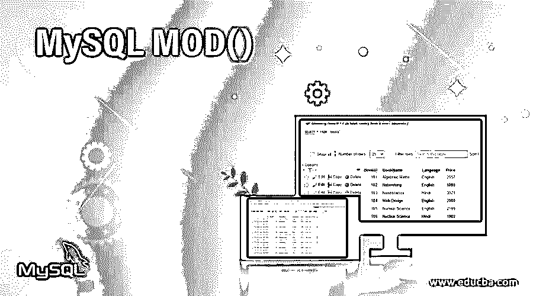

## MySQL MOD 介绍()

MySQL MOD()函数允许我们将一个文字数字除以另一个数值表达式来返回它的余数。MOD()将数值作为函数的参数来执行并产生结果。参数可以表示为被除数和除数，就像在数学中处理分数数值以输出精确的余数一样。万一，如果除数或者说 MySQL MOD()函数的第二个参数被设置为 0(零)那么，结果将是 NULL。此函数可以安全地用于 BIGINT 数据类型值，但主要用于小数部分，以执行除法并显示逻辑计算后的余数。

### 句法

以下语法代码介绍了在 MySQL 中应用数学函数 MOD()的结构:

<small>Hadoop、数据科学、统计学&其他</small>

**语法#1**

`MOD(a,b)`

**语法#2**

`a MOD b`

**语法#3**

`a % b`

我们有以上三种语法来在 MySQL 的查询中使用 MOD()函数。

*   这里,“a”和“b”参数是必需的数值，可以是小数部分或 BIGINT 数据类型值，在它们的帮助下，MOD()函数的除法过程发生。在完成命令查询之后，返回值是在数学计算问题中平衡的余数。
*   此外，我们可以将第一个参数值(a)定义为被除数，将另一个一秒钟的参数(b)定义为 MOD()计算的除数，以产生除法结果。
*   因此，对于文字数字，MOD()函数返回除法的余数，如果除数像 MOD(dividend，0)一样为零，那么结果将为空。

### MySQL MOD()函数是如何工作的？

按照上面的语法，当我们用一个数字表达式除以另一个数字时，结果将是 MySQL 中 MOD()函数的余数。

这与我们使用逻辑和基本概念手动计算数学中的模数计算执行相同的工作。此外，我们还使用 SELECT 查询语句来补充 MOD()函数在 MySQL 中的使用，所以我们使用 MOD()函数为:

`SELECT MOD(a,b);`

MOD()函数的工作原理可以借助下面演示的一些例子来详细解释:

**Code:** 让我们使用 MySQL 的 MOD()函数进行查询，以说明可以以三种形式执行的函数语法

`SELECT MOD(152, 3);
Or,
SELECT 152 % 3;
Or,
SELECT 152 MOD 3;`

**输出:**

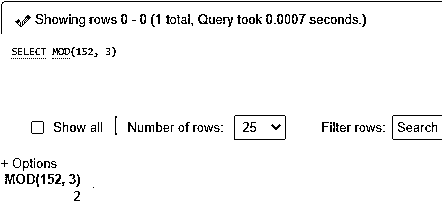

**解释:**正如您所看到的，结果显示了在服务器上执行的每个查询表单的剩余部分。因此，像这样的数学函数实现逻辑来产生模数处理结果。

### 在 MySQL 中实现 MOD()函数的例子

让我们借助以下示例来说明 MySQLMOD()函数，并显示同时生成的执行结果:

#### 1.MySQL 中使用 MOD()函数的一些简单例子

**代码#1**

`SELECT MOD(21,2);`

**输出:**

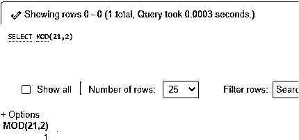

可以注意到，MySQL 允许使用模数运算符，即%，它可以被视为 MOD()函数的同义词，以给出如下结果:

**代码#2**

`SELECT 21 % 2;`

**输出:**

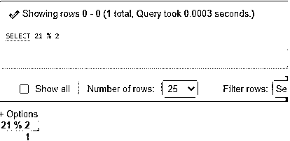

另外，看看使用 MOD()函数得到的结果，该函数接受小数元素来返回除法过程的余数。对此的查询如下所示:

**代码#3**

`SELECT MOD(15.8, 3);`

**输出:**

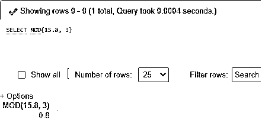

同样，使用具有小数值的被除数和除数，结果可以如下所示生成:

**代码#4**

`SQL statement:
SELECT MOD(8.452, 2.14);`

**输出:**

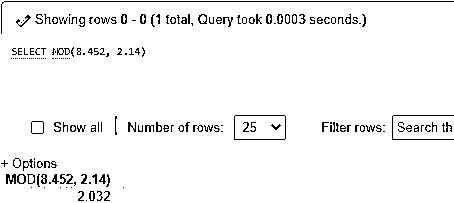

结果或余数也是小数值。此外，查看下面的查询，其中除数仅为小数值:

**代码#5**

`SELECT 25 MOD 2.3;`

**输出:**

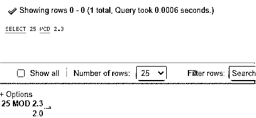

#### 2.对零除数值使用 MOD()函数

假设，我们已经像任何文字数字表达式一样将除数和被除数设置为 0，那么应用于它的 MOD()函数将产生以下结果作为余数:

**代码#1**

`SQL Statement:
SELECT MOD(17,0);`

**输出:**

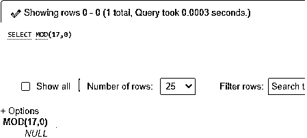

您可以看到，在 MySQL 服务器上执行时，上述除数值为 0 的查询的剩余部分为 NULL。

让我们在 MySQL 中试验一下 MOD()函数的结果，当我们为被除数和非零值设置零值，或者使用下面的查询说出除数的任何文字数字时:

**代码#2**

`SELECT 0 % 5;`

**输出:**

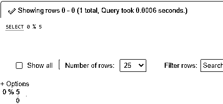

因此，请记住，如果我们将 0 值除以任何数值表达式，那么从数学上讲，结果将是 0，相反，如果我们在除数为零且被除数不为零时反转语句值，那么输出将为空。

#### 3.对数据库表字段使用 MOD()函数

假设，我们已经创建了一个名为“Books”的表，我们将在 MySQL 中实现 MOD()函数。为此，要使用的表创建代码是 BookID、BookName、Langauge 和 Price 字段的后续代码:

`CREATE TABLE Orders(BookID INT PRIMARY KEY AUTO_INCREMENT, BookNameVarchar(255) NOT NULL, LanguageVarchar(255) NOT NULL, Price INT NOT NULL);`

让我们使用以下 SQL 查询在表帐簿中输入一些数据记录:

**代码#1**

`INSERT INTO TABLE (BookID, BookName, Language, Price) VALUES(‘101’,’Algebraic Maths’,’English’,’2057’);`

诸如此类。

**输出:**在此查看表格:

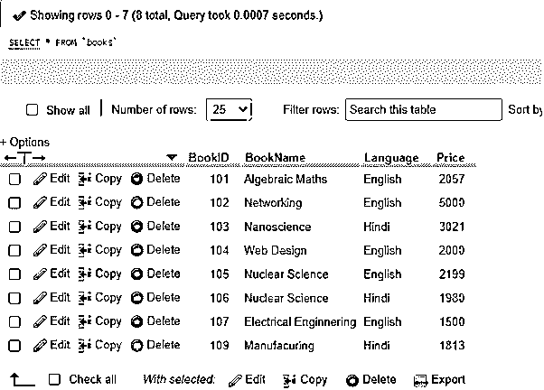

现在，我们将使用 MySQL MOD()查询表列“Price”来检查值是偶数还是奇数:

**代码#2**

`SELECT BookID, BookName, Language, Price,
IF (MOD(Price,2), 'Odd_Price','Even_Price') AS Odd_Even_Prices
FROM Books GROUP BY BookID ORDER BY BookID;`

**输出:**

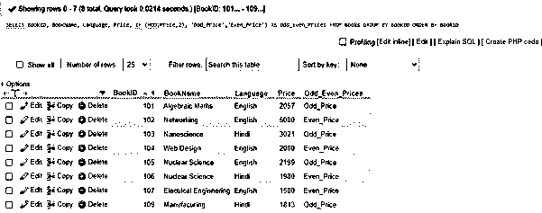

在此图中:

*   这里，price '列用于获取它的值来执行 MOD()即数值。
*   同样，当我们添加 MOD()函数时，Price 列的值将除以 2 作为除数，以获取余数作为结果。该查询将根据 0 或 1 中产生的结果计算奇数或偶数。
*   最后，我们应用了 IF()函数，该函数在执行时将根据 MOD()操作的结果显示奇数和偶数价格字符串。

### 结论

*   MOD()是 MySQL 中提供的一个数学函数，它对给定值进行求值，生成指定参数相除后的余数。
*   因此，MySQL MOD()在调用函数时实现了一个模运算，以通过除法提供函数中传递的两个数值的余数。

### 推荐文章

这是一个 MySQL MOD()的指南。在这里，我们讨论它是如何通过示例实现正确的输出的。您也可以浏览我们的其他相关文章，了解更多信息——

1.  [MySQL 自我加入](https://www.educba.com/mysql-self-join/)
2.  [MySQL 时间戳](https://www.educba.com/mysql-timestamp/)
3.  [MySQL 中的任何一个](https://www.educba.com/any-in-mysql/)
4.  [MySQL 数据库修复](https://www.educba.com/mysql-database-repair/)

