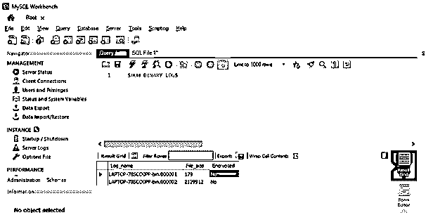
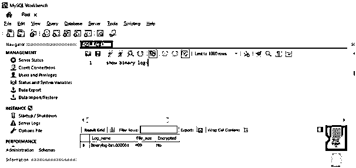
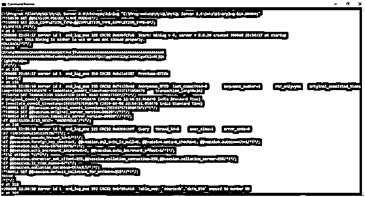
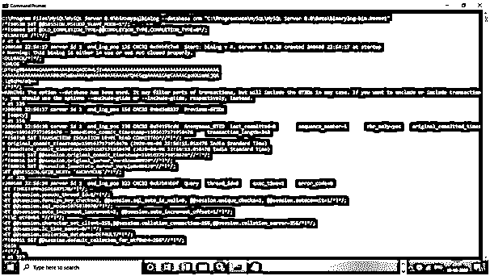

# MySQL Binlog

> 原文：<https://www.educba.com/mysql-binlog/>

## MySQL Binlog 简介

MySQL Binlog 是一个二进制日志，由数据库中发生的所有修改组成。所有的细节都以二进制格式写在服务器里。为了读取文件中的内容，我们使用“mysqlbinlog”实用程序。二进制日志在 MySQL 复制中非常有用，在 MySQL 复制中，主服务器会将二进制日志中的数据发送到远程服务器。基本上，当我们执行创建表或更新现有表中的数据等操作时，这些事件的详细信息存储在二进制日志中。

在本节中，我们将详细了解二进制日志及其在 MySQL 中的工作原理。

<small>Hadoop、数据科学、统计学&其他</small>

**语法:**

我们使用下面的语法，来查看所有的二进制日志:-

`SHOW BINARY LOGS;/* - - here we are updating the row - - */`

下面是我们用来读取二进制日志内容的语法。

`mysqlbinlog [options] <log_file_name>`

### MySQL 二进制日志

以下是几个选项:

*   **调试:**该选项用于写调试日志。
*   **调试-检查:**该选项用于程序退出时打印调试信息。
*   **Start-DateTime:** 该选项用于读取二进制日志。当时间戳等于或晚于命令中指定的 DateTime 参数时获取数据。
*   **起始位置:**该选项用于解码二进制日志。从位置等于或大于命令中指定的参数的第一个事件开始解码。
*   **Stop-DateTime:** 该选项用于停止读取二进制日志。从时间戳等于或大于命令中指定的 datetime 参数的第一个事件开始停止读取。
*   **Stop-Never:** 该选项用于在读取最后一个二进制日志文件后保持与服务器的连接。
*   **Stop-Never-Slave-Server-Id:**该选项用于使从服务器 Id 在连接到服务器时进行报告。
*   **Stop-Position:** 该选项用于在位置等于或大于命令中指定参数的第一个事件处停止解码二进制日志。
*   **To-Last-Log:** 当您不想在 MySQL 服务器请求的二进制日志的末尾停止，而是继续打印到最后一个二进制日志的末尾时，可以使用此选项。
*   **用户:**该选项用于检查连接服务器所使用的 MySQL 用户名。
*   **Verbose:** 将行事件重建为 SQL 语句
*   **验证二进制日志校验和:**该选项用于验证二进制日志的校验和。
*   **版本:**该选项用于显示版本信息并退出。

### MySQL 二进制日志是如何工作的？

让我们使用以下语法查看服务器中现有的日志文件:

**查询:**

`Show BINARY LOGS`

**输出:**

现在让我们创建一个表，并对该表执行更新，查看服务器中的二进制日志创建。

**查询:**

`create table Data_034
(
id int,
name varchar(20),
location varchar(20)
);`

**将数据插入表格:**

**查询:**

`INSERT INTO DATA_034 VALUES (1, 'Rose', 'United Kingdom' );
INSERT INTO DATA_034 VALUES (2, 'Jack', 'United states') ;
INSERT INTO DATA_034 VALUES (3, 'Will', 'Britain');
INSERT INTO DATA_034 VALUES (4, 'Bentley', ‘USA’);
INSERT INTO DATA_034 VALUES (5, 'Sam', 'Rome');
INSERT INTO DATA_034 VALUES (6, 'Hammington', 'Italy');`

更新表格行，如下所示:

**查询:**

`update data_034 set location='Rome' where id=6;/* - - here we are updating the row - - */`

现在，我们已经更改了二进制日志名称，该名称在

“c:\ program data \ MySQL \ MySQL Server 8.0 \ my . ini”到“Binarylog-bin.000001”

**查询:**

`SHOW BINARY LOGS; /* - - to show all the binary logs files - - */`

**输出:**

**

** 

让我们阅读二进制日志并查看输出:-

为了阅读，我们使用 mysqlbinlog 实用程序:-

打开命令提示符->转到“mysqlbinlog”bin 的路径为“C:\ Program Files \ MySQL \ MySQL Server 8.0 \ bin”。

**输入:**

`mysqlbinlog "C:\ProgramData\MySQL\MySQL Server 8.0\Data\Binarylog-bin.000001"
C:\Program Files\MySQL\MySQL Server 8.0\bin>mysqlbinlog "C:\ProgramData\MySQL\MySQL Server 8.0\Data\Binarylog-bin.000001"`

**输出:**

**举例:**

该表由以下几行组成:–

| **id** | **名称** | **地点** |
| One | 玫瑰 | 联合王国 |
| Two | 杰克 | 印度 |
| Three | 威尔(男子名) | 不列颠，英国 |
| Four | 本特利 | 美利坚合众国 |
| Five | 萨姆（男子名） | 罗马 |
| Sixty-seven | 哈明顿 | 罗马 |

在此更新表格如下:-

**查询:**

`update data_034 set id=67 where id=6; /* - - here we are updating the row - - */`

下面让我们得到上一次执行的日志，因为在上面我们无法读取二进制日志:-

**输入:**

`C:\Program Files\MySQL\MySQL Server 8.0\bin>mysqlbinlog  -v "C:\ProgramData\MySQL\MySQL Server 8.0\Data\Binarylog-bin.000001"
/* - - to view the logs in the readable format - - */`

**输出:**

以下是更新后表格中的数据:-

| **id** | **名称** | **地点** |
| One | 玫瑰 | 联合王国 |
| Two | 杰克 | 印度 |
| Three | 威尔(男子名) | 不列颠，英国 |
| Four | 本特利 | 美利坚合众国 |
| Five | 萨姆（男子名） | 罗马 |
| Six | 哈明顿 | 罗马 |

**以用户友好的方式显示内容:**

**查询:**

`mysqlbinlog <binary_log_file_name>`

例子

`mysqlbinlog “C:\ProgramData\MySQL\MySQL Server 8.0\Data\Binarylog-bin.000001”`

**截图同:**

**显示特定数据库中发生的事件:**

**查询:**

`mysqlbinlog -d crm<binary_log_file_name>`
或
`mysqlbinlog --databasecrm<binary_log_file_name>`

例子

`mysqlbinlog-d crm“C:\ProgramData\MySQL\MySQL Server 8.0\Data\Binarylog-bin.000001”`
或
`mysqlbinlog -databasecrm“C:\ProgramData\MySQL\MySQL Server 8.0\Data\Binarylog-bin.000001”`

**截图同:**

**控制 Binlog 输出:**

可以根据所提供的可能值来控制输出。他们是:-

*   从不
*   总是
*   解码-行
*   自动(默认)

**从不:**

这将在“row_level”中没有事件发生时起作用。

`mysqlbinlog --base64-output=never "C:\ProgramData\MySQL\MySQL Server 8.0\Data\Binarylog-bin.000001"`

**始终:**

这将尽可能只显示 BINLOG 条目。

`mysqlbinlog --base64-output=always "C:\ProgramData\MySQL\MySQL Server 8.0\Data\Binarylog-bin.000001"`

**解码行数:**

此选项会将基于行的事件解码为带注释的 SQL 语句。

`mysqlbinlog --base64-output=decode-rows "C:\ProgramData\MySQL\MySQL Server 8.0\Data\Binarylog-bin.000001"`

**自动:**

`mysqlbinlog --base64-output=auto"C:\ProgramData\MySQL\MySQL Server 8.0\Data\Binarylog-bin.000001"`

### 结论–MySQL Binlog

MySQL Binlog 是一个二进制日志，由数据库中发生的所有修改组成。所有的细节都以二进制格式写在服务器里。为了读取文件中的内容，我们使用“mysqlbinlog”实用程序。二进制日志在 MySQL 复制中非常有用，在 MySQL 复制中，主服务器会将二进制日志中的数据发送到远程服务器。基本上，当我们执行创建表或更新现有表中的数据等操作时，这些事件的详细信息存储在二进制日志中。

### 推荐文章

这是一个 MySQL Binlog 的指南。这里我们讨论 MySQL Binlog 的介绍和实际例子以及不同的子查询表达式。您也可以浏览我们推荐的文章，了解更多信息——

1.  [MySQL 操作符介绍](https://www.educba.com/mysql-operators/)
2.  [前 23 个 MySQL 字符串函数](https://www.educba.com/mysql-string-functions/)
3.  [MySQL vs SQLite](https://www.educba.com/mysql-vs-sqlite/)
4.  [MySQL 时间戳指南](https://www.educba.com/mysql-timestamp/)

