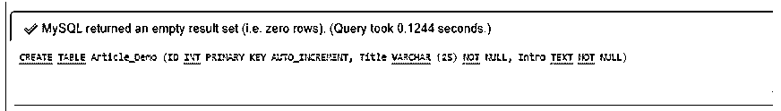
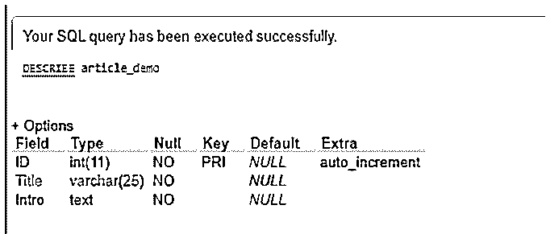
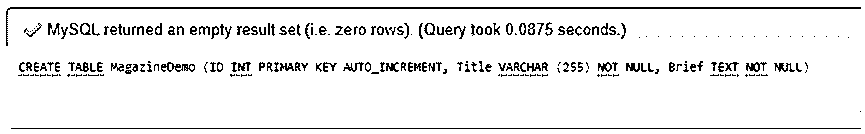
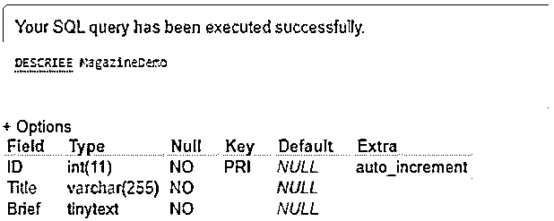
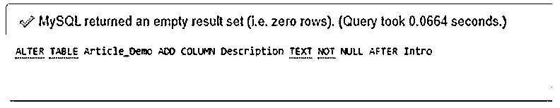
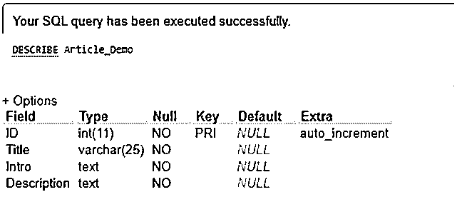

# MySQL 文本

> 原文：<https://www.educba.com/mysql-text/>

## MySQL 文本的定义

通常，在 MySQL 中，数据类型定义了表列可以包含的值的类别。它可以是整数、浮点数、日期、varchar、时间、字符、货币、二进制等。在这里，我们可以将 MySQL 文本数据类型解释为一个数据库对象，它负责将长格式的文本字符串存储到表记录中。从本质上讲，MySQL 文本可以被认为是一个表列类型家族，它提供了在 MySQL 中存储 1 字节到 4GB 的字符的更高能力。

除了字符数据类型 VARCHAR 和 CHAR 之外，MySQL 还支持文本类型，它增加了更多前面提到的结构所没有的结构。这对于在广播相关网站中保持文章主体或者在任何电子商务网站中保持产品说明也是有用的。

<small>Hadoop、数据科学、统计学&其他</small>

### MySQL 文本的语法

mysql 文本的语法如下所示:

我们介绍了一个基本的语法代码，成功地说明了 MySQL 中的文本数据类型。在使用以下查询结构创建表格时，我们可以使用文本:

`CREATE TABLE TableName (ID INT PRIMARY KEY AUTO_INCREMENT, Title VARCHAR (255) NOT NULL, Description TEXT[forms]NOT NULL);`

这里，我们添加了一些具有文本和其他数据类型的列，其中“forms”表示您可以添加其他形式的文本，这些文本将在后面的表中解释，其名称为 TableName(根据需要提供表名)。

同样，下面的查询语法使用带有 ALTER 关键字的文本:

`ALTER TABLE TableName
ADD COLUMN ColName TEXT NOT NULL AFTER Description;`

在上面的代码中，当执行时，它将添加一个数据类型为 TEXT 的新列 ColName(根据需要指定任何列名),但是在前面的查询在创建表时创建的名为 Description 的列之后。

### MySQL 中的文本数据类型是如何工作的？

MySQL TEXT 是一种标准的数据类型，用于存储具有最大大小或已定义的特殊字符串。在其字符集的排序上，建立了求值和排序。实际上，列的文本数据类型由四个类别组成。它们是小文本、文本、中文本、长文本。所有这些类型的文本都是相同的，但有一点不同，那就是每种文本都有最大的容量或数据量。

这种数据类型 TEXT 可以说就像 MySQL VARCHAR 一样，但是前一列没有作为后续列的默认值。对于 info，CHAR 包含从 0 到 255 定义的固定长度的字符串，VARCHAR 包含从 0 到 65535 定义的灵活长度的字符串。

*   这里，TINYTEXT 是最小的文本类型，它定义了与 MySQL VARCHAR 类型相同的字符长度。它拥有最大 255 个字符长度的字符串，支持建立小信息字符串存储资源。
*   文本数据类型的字符串字符大小最大为 65，535 字节，用于管理文本的经典长格式内容。
*   MEDIUMTEXT 的字符串字符大小最大为 16，777，215，这有助于存储较长的文本字符串，如书籍、代码备份和白皮书。
*   LONGTEXT 的大小定义最大为 4，294，967，295 个字符，用于存储最大长度的文本字符串。它在应用程序和计算机程序中受到支持。

与 VARCHAR 和 CHAR 类型不同，对于具有 TEXT 数据类型的列，您不需要声明使用它的字符串字符长度。此外，与 VARCHAR 和 CHAR 不同，当我们插入或提取包含文本数据值的列时，MySQL 不会删除或交换空间。应该注意的是，MYSQL 文本数据并没有保存在数据库服务器的内存中。因此，每当我们查询或执行文本数据时，MySQL 将不得不从磁盘中叙述它。这样在评估过程中就轻松多了。

在 MySQL 中使用文本列进行搜索和选择查询时，性能会受到影响，因为服务器将单独调用这些对象，并且在执行查询时需要扫描这些对象。为此，我们可以使用存储在服务器内存中的分页数据作为替代。如果我们启用严格的 SQL，那么它会将字符长度限制到最大值，并删除任何超出这些限制的插入数据。

但是您会发现 VARCHAR 和 TEXT 之间的一个巨大差异，即 VARCHAR 列可以被索引，而 TEXT 列不能。MySQL 文本类型有助于存储计算数据，还可以显示大量材料，用于搜索列、排序等任务，可能还用于管理大型开发中基于较小配置的选择。

### MySQL 文本示例

让我们使用下面解释的有效示例来演示 MySQL 中 MySQL 文本数据类型的一些工作方式:

#### 示例#1

将数据库表中的列声明显示为文本的示例:

我们实现了下面的 CREATE query 语句，该语句包含一个文本数据类型列:

`CREATE TABLE Article_Demo (ID INT PRIMARY KEY AUTO_INCREMENT, Title VARCHAR (25) NOT NULL, Intro TEXT NOT NULL);`

**输出:**

现在，使用 DESCRIBE 关键字，我们将按如下方式查看表信息:

`DESCRIBE Article_Demo;`

**输出:**

#### 实施例 2

创建 TINYTEXT 类型的表列的示例:

`CREATE TABLE MagazineDemo (ID INT PRIMARY KEY AUTO_INCREMENT, Title VARCHAR (255) NOT NULL, BriefTINY TEXT NOT NULL);`

**输出:**

还有，

`DESCRIBE MagazineDemo;`

**输出:**

#### 实施例 3

使用 ALTER 语句添加文本类型的新列的示例:

假设我们将长内容作为主体添加到上面创建的表 Article_Demo 中。因此，我们需要通过在服务器中应用后续查询来补充一个名为 Description 的文本数据类型的列:

`ALTER TABLE Article_Demo
ADD COLUMN Description TEXT NOT NULL AFTER Intro;`

**输出:**

还有，

`DESCRIBE Article_Demo;`

**输出:**

同样，对于书籍等大型文本存储，我们可以在 MySQL 中分别实现 MEDIUMTEXT 和 LONGTEXT。

### 结论

在 MySQL 中，表中定义的每一列都需要一个唯一的名称及其数据类型，这代表了数据库理解在列中指定什么类型的数据来执行任何查询命令或操作的准则。因此，这里我们已经了解了一个重要的数据类型 MySQL TEXT，它保存一个具有相应容量或长度的字符串。

### 推荐文章

这是一个 MySQL 文本指南。在这里，我们还将讨论文本数据类型的定义以及它在 mysql 中是如何工作的？连同示例及其代码实现一起完成。您也可以看看以下文章，了解更多信息–

1.  [MySQL 索引](https://www.educba.com/mysql-index/)
2.  [MySQL 日期函数](https://www.educba.com/mysql-date-functions/)
3.  MySQL 中的 IF 语句
4.  [MySQL 触发器](https://www.educba.com/mysql-trigger/)

