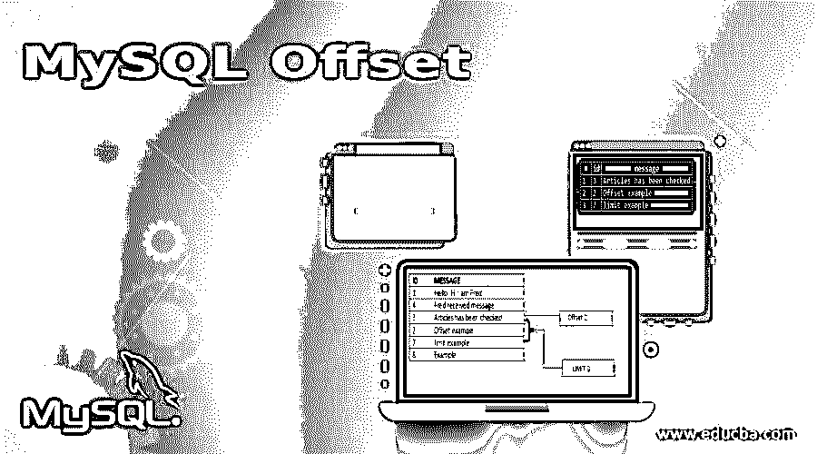
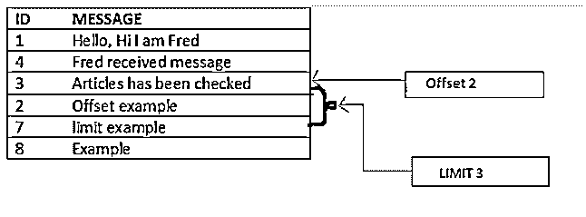
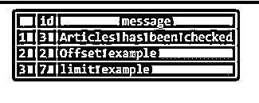
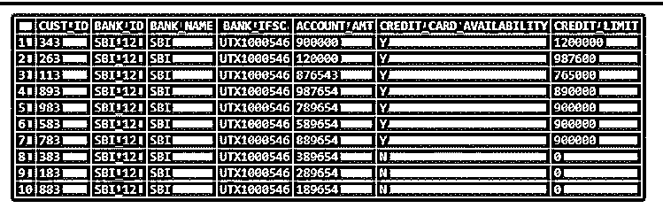
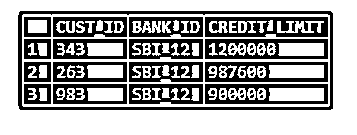
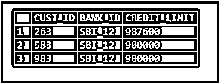
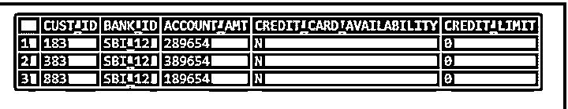

# MySQL 偏移量

> 原文：<https://www.educba.com/mysql-offset/>

## MySQL 偏移量介绍

MySQL Offset 用于指定我们希望从哪一行检索数据。准确地说，指定从哪一行开始检索。偏移与限制一起使用。这里，LIMIT 只是限制输出中的行数。在 combine 中，当您将 limit 与 offset 一起使用时，这意味着我们正在尝试从给定的 offset 到 LIMIT 值检索数据。我们可以将它与 SELECT、UPDATE 或 DELETE 命令一起使用。

**语法:**

<small>Hadoop、数据科学、统计学&其他</small>

`select * from <table_name> limit [row_count] offset [offset_value];`

或者

`select * from <table_name> limit [offset_value,] [row_count];`

在此语法中:

*   [offset_value]指定要返回的第一行的偏移量。第一行的偏移量是 0，而不是 1。
*   [row_count]指定要返回的最大行数。

### MySQL Offset 是如何工作的？

现在让我们看看极限和偏移量在 MySQL 中是如何工作的，并给出一个例子:

`create table Test(id integer, message varchar(100));
insert into Test(id, message) values(1, "Hello, Hi I am Fred");
insert into Test(id, message) values(4, "Fred received message");
insert into Test(id, message) values(3, "Articles has been checked");
insert into Test(id, message) values(2, "Offset example");
insert into Test(id, message) values(7, "limit example");
insert into Test(id, message) values(8, "Example");
select * from Test;`

**输出:**

`select * from Test limit 3 offset 2;`

上面的查询是从偏移值“2”中获取数据，并将数据限制在 LIMIT 的指定“2”行值内。

上面查询的输出可以在图表中看到:

### MySQL 偏移量的例子

现在让我们看看实时示例，并应用极限和偏移。

创建如下表格:

`CREATE TABLE BANK_CUST_DATA
(
CUST_ID INT,
BANK_ID VARCHAR(10),
BANK_NAME VARCHAR(10),
BANK_IFSC VARCHAR(20),
ACCOUNT_AMT INT,
CREDIT_CARD_AVAILABILITY VARCHAR(2),
CREDIT_LIMIT INT
);`

将数据插入表格:

`INSERT INTO BANK_CUST_DATA VALUES (343,'SBI_12','SBI','UTX1000546', 900000,'Y',1200000 );
INSERT INTO BANK_CUST_DATA VALUES (263,'SBI_12','SBI','UTX1000546', 120000,'Y',987600 );
INSERT INTO BANK_CUST_DATA VALUES (113,'SBI_12','SBI','UTX1000546', 876543,'Y',765000 );
INSERT INTO BANK_CUST_DATA VALUES (893,'SBI_12','SBI','UTX1000546', 987654,'Y',890000 );
INSERT INTO BANK_CUST_DATA VALUES (983,'SBI_12','SBI','UTX1000546', 789654,'Y',900000 );
INSERT INTO BANK_CUST_DATA VALUES (583,'SBI_12','SBI','UTX1000546', 589654,'Y',900000 );
INSERT INTO BANK_CUST_DATA VALUES (783,'SBI_12','SBI','UTX1000546', 889654,'Y',900000 );
INSERT INTO BANK_CUST_DATA VALUES (383,'SBI_12','SBI','UTX1000546', 389654,'N',0 );
INSERT INTO BANK_CUST_DATA VALUES (183,'SBI_12','SBI','UTX1000546', 289654,'N',0 );
INSERT INTO BANK_CUST_DATA VALUES (883,'SBI_12','SBI','UTX1000546', 189654,'N',0 );`

`select * from BANK_CUST_DATA;`

**输出:**

现在，让我们使用限额和补偿来查找具有最高 credit_limit 的前 3 个客户 id。

`SELECT
CUST_ID,
BANK_ID,
CREDIT_LIMIT
FROM
BANK_CUST_DATA
ORDER BY CREDIT_LIMIT DESC
LIMIT 0, 3;`

**输出:**

在本例中，您可以看到第三个值是“900000”，这是我们对多个“cust_id”的信用限额。因为我们已经将限制设置为 3，所以我们只有三行。“900000”的行可以在每次执行查询时被随机化，以限制我们可以在这里对表应用 RANK 函数并获取数据。

现在，让我们从第二高的“credit_limit”开始，使用限额和偏移量来查找 3 个客户 id。

`SELECT
CUST_ID,
BANK_ID,
CREDIT_LIMIT
FROM
BANK_CUST_DATA
ORDER BY CREDIT_LIMIT DESC
LIMIT 1, 3;`

**输出:**

这里我们得到了第二高的“credit_limit ”,限制为 3；

现在，让我们使用限额和补偿来查找具有最低“信用限额”的 3 个客户 id。

`SELECT
CUST_ID,
BANK_ID,
ACCOUNT_AMT,
CREDIT_CARD_AVAILABILITY,
CREDIT_LIMIT
FROM
BANK_CUST_DATA
ORDER BY CREDIT_LIMIT ASC
LIMIT 0, 3;`

**输出:**

现在，让我们使用限额和补偿，只查找具有最高“credit_limit”的第一个客户 id。

`SELECT
CUST_ID,
BANK_ID,
ACCOUNT_AMT,
CREDIT_CARD_AVAILABILITY,
CREDIT_LIMIT
FROM
BANK_CUST_DATA
ORDER BY CREDIT_LIMIT DESC
LIMIT 0, 1;`

**输出:**

现在，让我们使用限额和补偿，仅查找具有最低“credit_limit”的第一个客户 id。

`SELECT
CUST_ID,
BANK_ID,
ACCOUNT_AMT,
CREDIT_CARD_AVAILABILITY,
CREDIT_LIMIT
FROM
BANK_CUST_DATA
ORDER BY CREDIT_LIMIT ASC
LIMIT 0, 1;`

**输出:**

### 结论

MySQL Offset 用于指定我们希望从哪一行检索数据。准确地说，指定从哪一行开始检索。偏移与限制一起使用。这里，LIMIT 只是限制输出中的行数。在 combine 中，当您将 limit 与 offset 一起使用时，这意味着我们正在尝试从给定的 offset 到 LIMIT 值检索数据。我们可以将它与 SELECT、UPDATE 或 DELETE 命令一起使用。偏移值从 0 开始(起始值)。

### 推荐文章

这是一个 MySQL 偏移量的指南。这里我们也讨论一下简介和 mysql offset 是如何工作的？以及不同的示例及其代码实现。您也可以看看以下文章，了解更多信息–

1.  [MySQL GROUP_CONCAT()](https://www.educba.com/mysql-group_concat/)
2.  [MySQL CTE](https://www.educba.com/mysql-cte/)
3.  [MySQL 限制](https://www.educba.com/mysql-limit/)
4.  [MySQL 检查约束](https://www.educba.com/mysql-check-constraint/)

