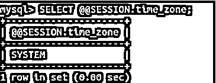
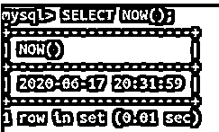
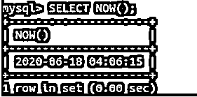

# MySQL 时区

> 原文：<https://www.educba.com/mysql-timezone/>

## MySQL 时区介绍

MySQL 支持时区以及管理和操作日期和时间相关字段的不同设置，以便存储和检索时区相关时间。默认情况下，每当在机器上安装 MySQL 时，都会设置 timezone 变量，以便引用在作为机器操作系统的系统中设置的时区。我们可以进一步根据我们在 MySQL 中存储和操作日期和时间值的方便性和必要性来更改和操作这些变量。我们可以通过从 UTC 中增加或减去所需的小时和分钟时间，或者通过按照地区和时区以指定的格式指定时区来更改时区值。

在本文中，我们将研究 MySQL 中时区的工作方式，研究一些相关的变量，以及如何获取和设置这些变量的值来操作时区。此外，我们将看到如何在 MySQL 中手动加载时区相关的表，还将看到一些与时区相关的示例。

<small>Hadoop、数据科学、统计学&其他</small>

### MySQL 时区的功能

*   每当 MySQL 启动时，它都会搜索为系统设置的时区，并将名为 system_time_zone 的系统变量的值设置为从主机检索的时区值。一旦在服务器启动期间完成此操作，此变量的值将保持不变。
*   我们可以在服务器启动时更改系统的时区，方法是在运行 mysqld 命令之前设置名为 TZ 的环境变量的值。
*   除此之外，还有一种设置系统时区的方法，如果您的服务器使用 mysqld_safe 模式，您可以设置–time zone 选项的值。
*   允许设置为 TZ 变量或–time zone 选项的值取决于您使用的操作系统。有关可接受时区值的更多详细信息，请参考您的操作系统文档。
*   MySQL 服务器使用的时区由 time_zone 系统变量的当前值和全局值决定。默认情况下，time_zone 变量开头的值是 SYSTEM，这意味着 MySQL 使用主机操作系统的时区。
*   只有当我们使用 SET GLOBAL time_zone 命令分配了超级权限或 SYSTEM_VARIABLE_ADMIN 权限时，才能设置 time_zone 全局变量的值。
*   正在使用的每个客户端会话的会话变量可以使用 SET time_zone 命令将设置为系统或全局时区的时区值覆盖为该特定会话所需的时区值。
*   所有区分区域的值都受会话级别设置的时区影响。Now()和 CURTIME()函数显示的值以及数据类型为 TIMESTAMP 的列在存储和检索这些值时会受到影响。
*   在数据类型为 DATE、TIME 或 DATETIME 的列中存储和检索的值不受会话时区设置的影响。与此同时，UTC_TIMESTAMP()等函数也不受影响。
*   时区可以在全局级别或会话级别以两种格式中的任何一种进行设置，这两种格式以小时和分钟格式 hh: mm 的字符串格式定义与 UTC 的偏移量，方法是添加“-5:30”、“5:30”等，或减去该值或命名时区，如 America 或 New_York 表示美国，或 Asia/Kolkata 表示印度标准时间，即 UTC+05:30。
*   在命名格式中指定时区的第二种格式需要在 MySQL 服务器中加载和填充与时区相关的信息表。

### 填充与时区相关的信息表

每当在您的机器上安装 MySQL 时，就会创建与时区相关的各种表，用于在名为 MySQL 的模式中存储时区相关信息。但是，在安装过程中，只创建这样的表，而对于使用指定时区和许多类似的工具，加载和填充这些表是很重要的。

我们可以手动加载时区表。在一些操作系统中，如 macOS、Solaris、Linux 和 FreeBSD，它们有自己的数据库来存储区域信息。在这种情况下，我们可以使用这个文件将相同的信息存储到 MySQL 模式的区域表中。您最常找到该文件的路径是/usr/share/zoneinfo 目录。我们可以使用 mysql_tzinfo_to_sql 程序，通过以下命令从系统区域信息数据库中填充区域表:

`mysql_tzinfo_to_sql /usr/share/zoneinfo | mysql -u username -p password`

它认为您正在使用用户名为用户名、密码为密码的帐户，并且对 MySQL 的 MySQL 模式具有写权限。对于没有这种区域信息的操作系统，您可以使用可下载的软件包。

### MySQL 时区示例

要获得全球时区值，可以使用下面的查询语句。

`SELECT @@GLOBAL.time_zone;`

上述查询语句的执行给出了以下输出，其中 SYSTEM 作为值，指定 MySQL 全局时区与操作系统的时区相同。

要获得会话时区值，可以使用以下查询语句。

`SELECT @@SESSION.time_zone;`

上述查询语句的执行给出了以下输出，其中 SYSTEM 作为指定 MySQL 时区与操作系统时区相同的值。

让我们使用 NOW()函数检索当前日期和时间，该函数给出以下输出:

`SELECT NOW();`

让我们使用以下命令更改当前会话的时区:

`SET time_zone = '+13:00';`

这给出了以下输出:

让我们再次执行相同的命令来检索当前日期和时间:

`SELECT NOW();`

这给出了以下输出:

### 结论

MySQL 为我们提供了各种变量，帮助我们维护和管理 MySQL 中的时区相关信息。我们可以通过在全局、会话级或配置文件中更改时区的值来获取和设置时区的值。

### 推荐文章

这是一个 MySQL 时区的指南。在这里，我们还讨论了 mysql 时区的介绍和工作方式，以及不同的示例和代码实现。您也可以看看以下文章，了解更多信息–

1.  [MySQL 撤销](https://www.educba.com/mysql-revoke/)
2.  [MySQL 集群](https://www.educba.com/mysql-cluster/)
3.  [MySQL 窗口函数](https://www.educba.com/mysql-window-functions/)
4.  [MySQL 用户](https://www.educba.com/mysql-users/)

