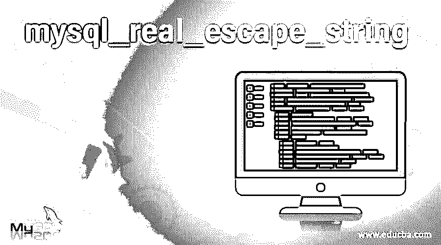

# mysql _ 实数 _ 转义 _ 字符串

> 原文：<https://www.educba.com/mysql_real_escape_string/>

## mysql_real_escape_string 简介

mysql_real_escape_string()用于在将查询发送到 mysql 服务器之前，对查询字符串中的特殊字符进行转义，如' \ '、' \n '等。给定的 unescaped_string 被编码并返回一个转义的 sql 字符串作为输出。mysql_real_escape_string()函数返回编码或转义的 sqlstring 的长度。这个 mysql_real_escape_string()函数用于转义字符串中的特殊字符，如\，\n 这些字符可以在 sql 语句中进一步使用。

**语法和参数**

<small>Hadoop、数据科学、统计学&其他</small>

下面是 mysql_real_escape_string()函数的语法:

`String mysql_real_escape_string(string unescaped_string,resource link_identifier= =NULL);`

这个函数包含两个参数，第一个是 unescaped_string，第二个是链接标识符。

mysql_real_escape_string 调用函数，该函数在下列特殊字符前添加一个反斜杠:\x00，\n，\，'，"和\x1a。当数据发生任何异常行为时，该函数必须始终通过异常来编写，并在向 mysql 发送查询之前保存数据。

**参数**

**unescaped_string:** 给定的字符串需要进行转义或编码。

**link_identifier:** 用于指定建立连接的链路。如果没有说明链接标识符，则假定是 mysql_connect 打开的最后一个链接。如果没有建立链接，它将使用 mysql_connect 函数创建一个链接，不传递任何参数。最后，在完成所有这些之后，如果我们无法建立与链接的连接，它将在控制台中显示一条 e-warning 错误消息。

**返回值**:如果一切正常，它将返回一个转义字符串作为输出，否则它将在输出控制台中显示一条错误消息或返回 FALSE 标志。

**错误/异常:**如果我们执行 mysql_real_escape_string 函数，而没有建立函数与 mysql 服务器的连接，那么它将抛出一条 E_warning 消息。mysql_real_escape_string()函数只有在与 mysql 服务器建立完全连接时才会被执行。在没有 mysql 连接的情况下执行这个函数也将通过 E_warning 作为错误消息。仅在存在有效 mysql 连接的情况下执行该函数。函数能够对字符串进行转义是非常重要的，否则查询容易受到 sqlinjection (sqli)攻击。

**Sql 注入:**它是一种机制，允许攻击者或黑客查看不容易检索到的数据。这包括其他用户的数据或只有应用程序自己访问的数据。

mysql_real_escape_string 函数不能转义的特殊字符有%(百分比)和 _(下划线)。如果这两个字符和一个像 grant，revoke，like 这样的子句结合在一起，这些在 MySQL 中被称为通配符。_(下划线匹配字符串中的单个字符)

**%:** 匹配字符串中任意数量的字符或零数量的字符。

它在给定字符串中的每个特殊字符前添加一个反斜杠。mysql_real_escape_string 可以编码的特殊字符列表如下所示:

`0x00 (null)
Newline (\n)
Carriage return (\r)
Double quotes (")
Backslash (\)
0x1A (Ctrl+Z)`

在使用 mysql_real_escape_string()函数对数字参数进行编码时，我们应该非常小心，因为它们通常被写在不带引号的查询中。下面的示例代码显示，如果 mysql_real_escape _string 没有正确实现，可能会导致 sql 注入。

### mysql_real_escape_string 的例子

下面是一些例子:

#### 示例#1

假设，数字用户输入是

`500 OR 1=1`

净化输入

`$prod_id = mysql_real_escape_string($_GET['id']);`

下面是生成的查询:

`select prod_name from product where id=500 OR 1=1`

上述查询将导致 sql 注入，因为 id 参数没有用引号括起来。

**注意:**为了避免 SQL 注入(sqli)，函数中传递的参数必须用引号括起来。

查询中为避免 sql 注入而进行的更正如下所示。

`select prod_name from products where id=500 OR 1=1'`

由于上述查询中的 id 参数在引号内，因此不会导致 sql 注入。

**喜欢运算符**

该函数不转义 LIKE 运算符的 SQL 通配符。因为这些字符不能被转义，所以 LIKE 操作符将它们视为经典的通配符:为了防止这种错误，我们将在通配符 LIKE 操作符之前使用反斜杠。

#### 实施例 2

`User_input
Xyz’spq_`

**转义所有字符:**

`$value=mysql_real_esape_string($_GET[‘p’]);
$value=str_replace(“%”,”%”,$val);
$value=str_replace(“_”,”_”,$val);`

**查询**

`select * from employee where name LIKE ‘%Xyz\’s pq\_%’;`

##### 该功能的缺点

毫无疑问，mysql_real_escape_string 函数是避免 sql 注入的最佳方式。但是它也有一些缺点，比如如果我们调用这个函数太多次，数据库服务器会变慢。然而，如果我们错误地对相同的数据调用该函数两次，我们将在数据库中得到不正确的信息或数据。由于所有这些提到的原因，我们可以实现替代解决方案，例如参数化语句方法或存储过程。

无符号长型 MySQL _ real _ escape _ string(MySQL * MySQL，char * to，const char * from，无符号长型)；

*   **MySQL:**MySQL link，以前由 mysql_init()或 mysql_real_connect()连接。
*   **to:** 编码后的字符串。在最坏的情况下，字符串中的每个字符都需要转义。此外，将附加一个 0 字符。
*   **from:** 需要函数编码的给定字符串。
*   **long:** 给定字符串的长度。

#### 实施例 3

`//establish connection with the mysql server
$link=mysql_connect(‘mysql_host’,’mysql_user’,’mysql_password’);
//sql query
$query=print(“select * from employee where user_name=’%s’ and pass-word=’’%s”,mysql_real_escape_string($user_name),mysql_real_escape_string($pass_word));
select * from employee where user_name=”%ta” and pass_word=”_123”`

该查询将使用员工用户名登录系统，用户名以“ta”结尾，以任意数量的字符开头，密码为任意单个字母加 123。

### 结论

在本文中，我们学习了如何使用 mysql_real_escape_string()函数。我们还学会了使用函数来避免 sql 注入。我们还学习了这个函数可以转义的特殊字符。为了用户更好的理解，用各种例子解释了该功能。

### 推荐文章

这是一个 mysql_real_escape_string 的指南。这里我们也讨论语法和参数，以及不同的例子和代码实现。您也可以看看以下文章，了解更多信息–

1.  [MySQL 撤销](https://www.educba.com/mysql-revoke/)
2.  [MySQL DML](https://www.educba.com/mysql-dml/)
3.  [MySQL 窗口函数](https://www.educba.com/mysql-window-functions/)
4.  [MySQL 外键](https://www.educba.com/mysql-foreign-key/)

