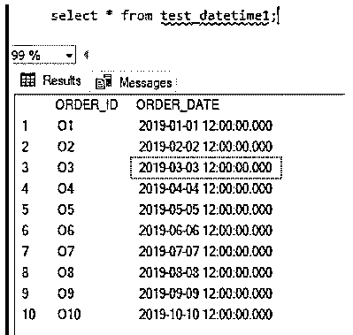
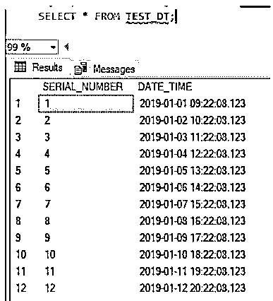
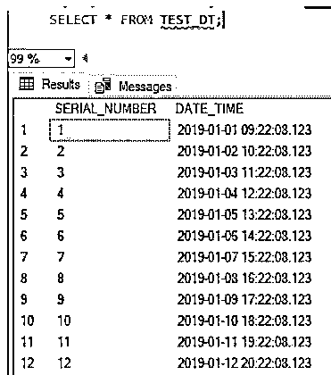
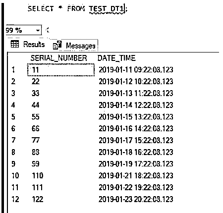

# MySQL Datetime

> 原文：<https://www.educba.com/mysql-datetime/>

## MySQL 日期时间简介

以下文章提供了 MySQL Datetime 的概要。如果我们想存储一个包含日期和时间的 date 值。然后我们使用日期时间格式。日期时间以年、月、日、小时、分钟和秒的格式存储数据。Datetime 使用 5 个字节进行存储。我们也可以存储分数，但是存储分数会增加存储量。如果我们考虑精度并想存储精度分数(0)-需要 0 个存储字节。If for fraction (1，2)需要 1 个字节。分数(3，4)占用 2 个字节，分数(5，6)占用 3 个字节的存储空间。总共 3 个字节将需要额外的分数存储。

**语法:**

<small>Hadoop、数据科学、统计学&其他</small>

`<column_name>datetime;`

要将列定义为日期时间类型，我们的定义如上。

### MySQL Datetime 是如何工作的？

现在让我们创建一个列数据类型为 datetime 的表，并获得结果。

**代码:**

`CREATE TABLE TEST_DATETIME1
(
ORDER_ID VARCHAR(10),
ORDER_DATE DATETIME
);`

让我们将数据插入表中:

**代码:**

`INSERT INTO TEST_DATETIME1 VALUES ('O1','2019-01-01 12:00:00');
INSERT INTO TEST_DATETIME1 VALUES ('O2','2019-02-02 12:00:00');
INSERT INTO TEST_DATETIME1 VALUES ('O3','2019-03-03 12:00:00');
INSERT INTO TEST_DATETIME1 VALUES ('O4','2019-04-04 12:00:00');
INSERT INTO TEST_DATETIME1 VALUES ('O5','2019-05-05 12:00:00');
INSERT INTO TEST_DATETIME1 VALUES ('O6','2019-06-06 12:00:00');
INSERT INTO TEST_DATETIME1 VALUES ('O7','2019-07-07 12:00:00');
INSERT INTO TEST_DATETIME1 VALUES ('O8','2019-08-08 12:00:00');
INSERT INTO TEST_DATETIME1 VALUES ('O9','2019-09-09 12:00:00');
INSERT INTO TEST_DATETIME1 VALUES ('O10','2019-10-10 12:00:00');`

`select * from test_datetime1;`

**输出:**

在这里，我们检查“order_date”的数据，我们可以看到该列占用的存储空间是 7 个字节，因为它保存了(3，4)的精度分数。

**如果我们看到“日期时间”的值:**

2019-01-01 12:00.00.000

**下面给出的是上述数据的格式:**

yyyy-mm-ddhh:mm:ss:ff

*   YYYY:是 2019 年
*   MM:月份是–01 吗
*   DD:是日期-01
*   小时:12 点
*   毫米:月–00
*   SS:秒–00
*   FF:分数秒–000

**根据上面的例子:**

‘2019-01-01 12:00.00.000’

**代码:**

`CREATE TABLE TEST_DT
(
SERIAL_NUMBER INT,
DATE_TIME DATETIME
);`

现在让我们在表格中插入当前日期:

**代码:**

`INSERT INTO TEST_DT VALUES (1,'2019-01-01 09:22:08:123');
INSERT INTO TEST_DT VALUES (2,'2019-01-02 10:22:08:123');
INSERT INTO TEST_DT VALUES (3,'2019-01-03 11:22:08:123');
INSERT INTO TEST_DT VALUES (4,'2019-01-04 12:22:08:123');
INSERT INTO TEST_DT VALUES (5,'2019-01-05 13:22:08:123');
INSERT INTO TEST_DT VALUES (6,'2019-01-06 14:22:08:123');
INSERT INTO TEST_DT VALUES (7,'2019-01-07 15:22:08:123');
INSERT INTO TEST_DT VALUES (8,'2019-01-08 16:22:08:123');
INSERT INTO TEST_DT VALUES (9,'2019-01-09 17:22:08:123');
INSERT INTO TEST_DT VALUES (10,'2019-01-10 18:22:08:123');
INSERT INTO TEST_DT VALUES (11,'2019-01-11 19:22:08:123');
INSERT INTO TEST_DT VALUES (12,'2019-01-12 20:22:08:123');`

`select * from TEST_DT`

**输出:**

在这里，我们检查“order_date”的数据，我们可以看到该列占用的存储空间是 7 个字节，因为它保存了(3，4)的精度分数。

**如果我们看到“日期时间”的值:**

2019-01-01 09:22.08.123

**下面给出的是上述数据的格式:**

yyyy-mm-ddhh:mm:ss:ff

*   YYYY:是 2019 年
*   MM:月份是–01 吗
*   DD:是日期–01
*   小时:09 分
*   月份–22
*   SS:秒–08
*   FF:分数秒-123

**输出:**

### MySQL 日期时间示例

下面是提到的例子:

**代码:**

`CREATE TABLE TEST_DT1
(
SERIAL_NUMBER INT,
DATE_TIME DATETIME
);`

现在让我们在表格中插入当前日期:

**代码:**

`INSERT INTO TEST_DT1 VALUES (11,'2019-01-11 09:22:08:123');
INSERT INTO TEST_DT1 VALUES (22,'2019-01-12 10:22:08:123');
INSERT INTO TEST_DT1 VALUES (33,'2019-01-13 11:22:08:123');
INSERT INTO TEST_DT1 VALUES (44,'2019-01-14 12:22:08:123');
INSERT INTO TEST_DT1 VALUES (55,'2019-01-15 13:22:08:123');
INSERT INTO TEST_DT1 VALUES (66,'2019-01-16 14:22:08:123');
INSERT INTO TEST_DT1 VALUES (77,'2019-01-17 15:22:08:123');
INSERT INTO TEST_DT1 VALUES (88,'2019-01-18 16:22:08:123');
INSERT INTO TEST_DT1 VALUES (99,'2019-01-19 17:22:08:123');
INSERT INTO TEST_DT1 VALUES (110,'2019-01-21 18:22:08:123');
INSERT INTO TEST_DT1 VALUES (111,'2019-01-22 19:22:08:123');
INSERT INTO TEST_DT1 VALUES (122,'2019-01-23 20:22:08:123');` 

`Select * from TEST_DT1;`

**输出:**

在这里，如果我们检查“Date_time”的数据，我们可以看到该列占用的存储空间是 7 个字节，因为它保存了(3，4)的精度分数。

**如果我们看到“日期时间”的值:**

2019-01-11 09:22.08.123

**下面给出的是上述数据的格式:**

yyyy-mm-ddhh:mm:ss:ff

*   YYYY:是 2019 年
*   MM:月份是–01 吗
*   日期是 11 号吗
*   小时:09 分
*   月份–22
*   SS:秒–08
*   FF:分数秒–123

### 结论

如果我们想存储一个包含日期和时间的 date 值，那么我们使用 Datetime 格式。日期时间以年、月、日、小时、分钟和秒的格式存储数据。Datetime 使用 5 个字节进行存储。我们也可以存储分数，但是存储分数会增加存储量。如果我们考虑精度并想存储精度分数(0)-需要 0 个存储字节。If for fraction (1，2)需要 1 个字节。分数(3，4)占用 2 个字节，分数(5，6)占用 3 个字节的存储空间。总共 3 个字节将需要额外的分数存储。

### 推荐文章

这是一个 MySQL 日期时间的指南。这里我们分别讨论 MySQL Datetime 的介绍，它是如何工作的例子。您也可以看看以下文章，了解更多信息–

1.  [MySQL 中的运算符](https://www.educba.com/mysql-in-operator/)
2.  [MySQL 子查询](https://www.educba.com/mysql-subquery/)
3.  [MySQL 中的任何一个](https://www.educba.com/any-in-mysql/)
4.  [MySQL 自我加入](https://www.educba.com/mysql-self-join/)

