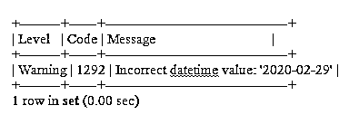
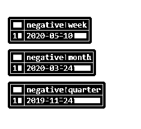
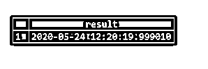

# MySQL DATE_SUB()

> 原文：<https://www.educba.com/mysql-date_sub/>

## MySQL DATE_SUB()的定义

date_sub()是 MySQL 数据库服务器的内置函数，用于计算时间或日期值与日期或日期时间值的差值，并将结果输出为日期或日期时间。该函数接受两个参数，传递的第一个参数是起始日期或初始日期，第二个参数是时间间隔，减去该参数后生成输出。该函数可以输出各种单位的结果。这个单位应该传入我们希望输出的函数中。

**语法:**

<small>Hadoop、数据科学、统计学&其他</small>

下面是 MySQL Date_sub()的语法:

`DATE_SUB (start_date,time expression unit)`

从数学上讲，Date_sub 函数也可以写成如下形式:

`Date_sub=difference(start_date,time interval)`

上面的 date_sub()语法有两个参数。它们是:

*   start_date 是初始日期或日期时间值或开始日期。
*   时间表达式是一个字符串，它是要从 startdate 值中减去的时间值。单位是时间单位，例如年、月、日等。
*   单位可以是微秒、秒、分钟、小时、周、月、年、季度、秒 _ 微秒、分钟 _ 秒、小时 _ 微秒、小时 _ 秒、小时 _ 分钟、日 _ 微秒、日 _ 秒、日 _ 分钟、日 _ 分钟、日 _ 小时、年 _ 月等。

以下语句使用 date_sub()函数从 2020 年 5 月 24 日减去 2 天:

下面是从 2020 年 5 月 24 日减去 2 天的查询:

### MySQL DATE_SUB()的例子

为了更好地理解，下面提到了几个例子:

#### 示例#1

`Select date_sub('2020-05-24',interval 2 day) AS result;`

**输出:**

在上面的示例中，开始日期是 2020-05-24，以 yyyy-mm-dd 格式书写。第二个参数是 2 天间隔。date_sub()函数在控制台中的输出是 2020-05-22。

#### 实施例 2

以下是时间间隔为 5 小时的查询:

`Select date_sub('2020-05-24',interval 5 hour) AS result;`

**输出:**

由于时间间隔为 5 小时，如果函数是日期时间值，则输出。

### 具有负间隔的查询

间隔或第二个参数中的时间表达式可以是正数或负数。我们可以处理正的和负的时间间隔，它在 date_sub()函数中作为第二个参数传递。如果时间间隔为负，则 date_sub()函数的工作方式类似于 date_add()函数，如以下查询所示:

#### 实施例 3

`Select date_sub('2020-05-24',interval -2 day) AS result;`

**输出:**

在上面的查询中，我们传递了负的 2 天间隔作为第二个参数。因此，在输出中，在起始日或初始日添加了 2 天。

#### 实施例 4

`Select date_sub('2020-02-29',interval -2 day) AS result;`

**输出:**

在上面的查询中，开始日期是 2020-02-29，第二个参数即 interval 是 2 天的负间隔。从技术上讲，查询的输出必须是 2020-02-30，这是一个无效的日期，因为二月中没有第 30 天。因此，查询的输出是 2020 年 3 月 2 日。

### 无效或异常日期的查询

#### 实施例 5

`Select date_sub('2020-02-35',interval -2 Day) AS result;0`

**输出:**

在下面的示例中，2020-02-35 是无效的日期；因此，它将输出作为 NULL，并在输出控制台中显示一条警告消息。

#### 实施例 6

`Show warnings;`

**输出:**

#### 实施例 7

`Select date_sub(null,interval 1 Day) AS result;`

**输出:**

因为在上面的查询中，我们在初始日期值中传递了一个空值作为第一个参数，所以无论我们在第二个参数中给出什么样的间隔，都将输出一个空值

### 自动调整日的查询

如果我们从一个日期中减去一个月、年或年 _ 月的时间间隔，得到的日期的天数大于新月份的最大天数，则该天将被调整为新月份的最大天数。

下面的查询以一种简单的方式解释了自动调整日的概念。

#### 实施例 8

`Select date_sub('2020-05-30',interval 1 month) as result;`

**输出:**

在这个例子中，我们从 2020 年 5 月 24 日减去 1 个月，所以结果是 4 月 30 日。

#### 实施例 9

`Select Date_sub('2020-05-24',interval 2 week) AS 'negative week';
Select Date_sub('2020-05-24', interval 2 month) AS 'negative month';
Select Date_sub('2020-05-24',interval 2 quarter) AS 'negative quarter';`

**输出:**

#### 实施例#10

`Select date_sub('2020-05-24 11:00:00', interval 6 hour) As result;`

**输出:**

#### 实施例 11

`Select date_sub(curdate(), interval 6 hour) AS result`

**输出:**

#### 实施例#12

`select date_sub(curdate(), interval -2 day) result;`

**输出:**

#### 实施例#13

`Select date_sub('2020-05-24 12:20:20.000010',interval 1000 microsecond) As result;`

**输出:**

#### 实施例#14

`Select date_sub('2020-05-24 12:20:20.000010',interval 750 microsecond)As result;`

**输出:**

**注:**

*   如果我们指定的时间间隔值对于我们已经指定的单位来说太小，DATE_SUB()将假定间隔值的最左边部分不是由用户提供的。
*   参数为负值的 DATE_SUB 函数与使用 DATE_ADD 函数的效果相同。

下面提到的 MySQL 版本中使用了 DATE_SUB 函数:

*   MySQL 5.7，MySQL 5.6，MySQL 5.5，MySQL 5.1，MySQL 5.0，MySQL 4.1，MySQL 4.0，MySQL 3.23

### 结论–MySQL DATE _ SUB()

在本文中，我们学习了如何使用 MySQL date_sub()函数从不同单位的日期或日期时间值中减去时间。在本文中，我们试图用一种简单的方式解释 date_sub()函数的每个方面，使用几乎所有的单位(如微秒、天、月、年、周、季度等)进行查询，并提供输出控制台的屏幕截图，以便读者更好地理解。在本文中，我们还了解了 date_sub()函数的负面日期时间概念。

### 推荐文章

这是 MySQL DATE_SUB()的使用指南。这里我们讨论 MySQL DATE_SUB()的定义以及实际例子和不同的子查询表达式。您也可以浏览我们推荐的文章来了解更多信息-

1.  [MySQL 数据库修复](https://www.educba.com/mysql-database-repair/)
2.  [MySQL 时间戳](https://www.educba.com/mysql-timestamp/)
3.  [MySQL 中的运算符](https://www.educba.com/mysql-in-operator/)
4.  [MySQL 子查询](https://www.educba.com/mysql-subquery/)

