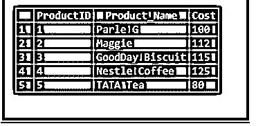
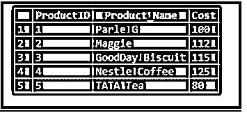

# MySQL Merge

> 原文：<https://www.educba.com/mysql-merge/>

## MySQL 合并的定义

MySQL Merge 是一个 MySQL 语句，它允许我们根据与另一个数据库表匹配的值来更新特定表中的记录。MySQL Merge query 命令负责同时执行三个主要的查询操作。假设，当我们在数据库查询中应用诸如 INSERT、DELETE 和 UPDATE 之类的 CRUD 操作命令时，我们必须构建三个不同的 MySQL 语句，以便可以使用数据库源表中的相应行来修改目标表中的数据。

为此，用户应该对要映射到合并表的数据库表拥有选择、插入、删除和更新权限。

<small>Hadoop、数据科学、统计学&其他</small>

### MySQL 合并的语法

结构的后续代码定义了 MySQL Merge 语句查询的基本语法:

`Merge TargetTableName USING SourceTableName
ON Merging_Condition
WHEN MATCHED
THEN Update_Query
WHEN NOT MATCHED
THEN Insert_Query
WHEN NOT MATCHED BY SOURCE
THEN DELETE;`

让我们按如下方式讨论语法:

*   最初，我们将在 MERGE 子句查询中定义目标和源数据库表。
*   然后，我们将添加合并条件，该条件决定表源中的表行如何匹配表目标中的表行。这可以说类似于 JOIN 子句中使用的连接条件。通常，为了匹配，我们将应用既可以是唯一键也可以是主键的键列。
*   之后，该合并条件提供了三种简单的状态进行查询，如下所示:
    *   **Matched** :它定义了匹配合并条件的表格行，为此我们需要用来自表格源的值来改变表格目标中的表格行和表格列。我们在这里使用 UPDATE 语句。
    *   **不匹配**:表示源表中的表行在目标表中没有任何对等的行。在这种情况下，我们应该将源表中的行补充到定义的目标表中。请记住,“不匹配”也可以表示为“目标不匹配”。我们将在这里使用插入查询。
    *   **与源**不匹配:定义给定目标表中的表行，这些表行在特定的源表中没有任何等效的行。如果我们想要将目标表与源表中的记录进行协调，我们必须应用匹配条件来从给定的目标表中移除或删除行。我们将在这里使用删除查询。

### MySQL 中的 Merge 是如何工作的？

假设我们有两个数据库表，称为源表和目标表。使用这些表，我们需要对源表中的值进行匹配，并更新目标表。它提供了三种不同的情况，描述如下:

*   源表可能包含目标表中不存在的几行。因此，在这种情况下，我们可以使用 INSERT 命令将源表中的行输入到目标表中。
*   目标表可能包含源表中不存在的几行。因此，在这种情况下，我们可以使用 DELETE 命令从目标表中删除在源表中找不到的行。
*   在这种情况下，我们会发现源表中的一些表行包含与目标表行相似的键。但是，在非键表列中，这些表行包含不同的值。这里，我们将用来自源表的接近值更新目标表中的表行。

在数据库中，合并表也被认为是一个 anMRG _ MyISAM 表，它表示可以作为单个表使用的 comparableMyISAM 表的集合。我们只能对这组表执行选择、更新和删除过程。但是假设我们想要删除合并表，那么在删除之后，只有合并规范会被发布。这里，创建的表由相同的表列和键的信息组成，因为对于反向打包的列或具有另一种顺序的键，我们不能对该表应用 MERGE。在 MySQL 中，merge 可以通过 UNION、INSERT 来执行，甚至可以使用两个或更多表上的 JOINS 来根据惟一键或主键组合数据值。

### MySQL 合并的例子

我们将在数据库中创建两个名为 Products 和 Products_Info 的表，其中包含产品的信息。

`CREATE TABLE Products (ProductID INT PRIMARY KEY, Product_Name VARCHAR(255) NOT NULL, Cost INT NOT NULL);`

将一些项目插入为:

`INSERT INTO Products(ProductID, Product_Name, Cost) VALUES
(1,'Parle G',100),
(2, 'Maggie', 112),
(3, 'GoodDay Biscuit', 150);`

查看餐桌产品:

`SELECT * FROM Products;`

**输出:**

**T2】**

 **再说一遍，

`CREATE TABLE Products_Info (ProductID INT PRIMARY KEY, Product_Name VARCHAR(255) NOT NULL, Cost INT NOT NULL);`

将一些项目插入为:

`INSERT INTO Products_Info(ProductID, Product_Name, Cost) VALUES
(1,'Parle G', 100),
(2, 'Maggie', 112),
(3, 'GoodDay Biscuit', 115),
(4, 'Nestle Coffee', 125),
(5, 'TATA Tea', 80);`

查看餐桌产品:

`SELECT * FROM Products_Info;`

**输出:**

现在，使用作为源表的 Products_Info 表中的值，通过使用 MERGE 语句将数据更新到作为目标表的 Products 表中，我们将在 SQL 中使用下面的查询，因为 MySQL 版本可能不支持 MERGE，所以我们将为其编写代码来演示:

`MERGE Products t
USING Products_Info s
ON (s.ProductID = t.ProductID)
WHEN MATCHED
THEN UPDATE SET
t.Product_Name = s.Product_Name,
t.Cost = s.Cost
WHEN NOT MATCHED BY TARGET
THEN INSERT (ProductID, Product_Name,Cost)
VALUES(s.ProductID,s.Product_Name,s.Cost)
WHEN NOT MATCHED BY SOURCE
THEN DELETE;`

**输出:**

**T2】**

 **在 MySQL 中，不支持合并，我们应用插入…..在重复键更新中，MySQL 根据新表值对旧表值进行更新。因此，对于 MySQL，我们可以按照下面的查询来合并两个表:

`INSERT IGNORE INTO Products SELECT * FROM Products_Info;`

**输出:**

`SELECT * FROM Products UNION DISTINCT SELECT * FROM Products_Info;`

**输出:**

**T2】**

 **`SELECT * FROM Products INNER JOIN Products_Info ON Products.ProductID = Products_Info.ProductID;`

**输出:**

**T2】**

 **### 结论

*   MySQL Merge 解决了很多问题，例如它有助于轻松管理日志表集，提供额外的速度，可以熟练地进行搜索和修复操作，等等。
*   MySQL Merge 有助于将各种文件立即映射到单个文件，并实现额外的文件描述符。但是在合并表中，不能使用替换查询。

### 推荐文章

这是一个 MySQL 合并指南。在这里，我们还将讨论 mysql 中 merge 的定义和工作原理。以及不同的示例及其代码实现。您也可以看看以下文章，了解更多信息–

1.  [MySQL 拥有](https://www.educba.com/mysql-having/)
2.  [MySQL BLOB](https://www.educba.com/mysql-blob/)
3.  [MySQL today()](https://www.educba.com/mysql-today/)
4.  [MySQL 创建函数](https://www.educba.com/mysql-create-function/)

********