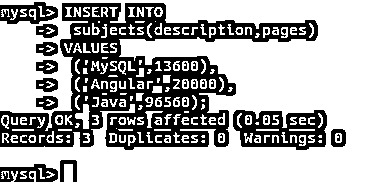
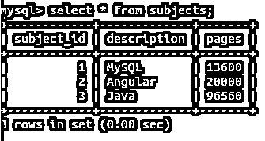
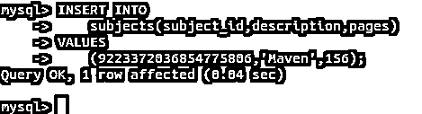
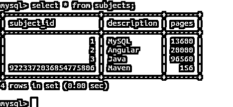
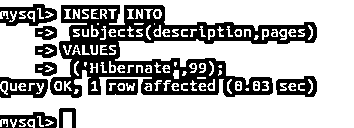
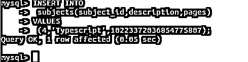
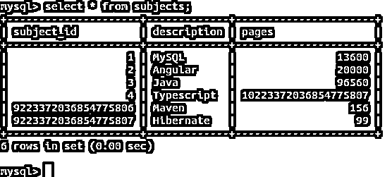
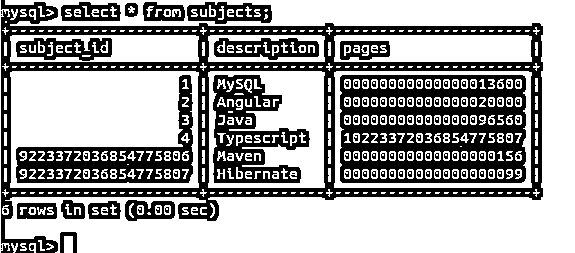

# MySQL BigInt

> 原文：<https://www.educba.com/mysql-bigint/>

## MySQL BigInt 简介

BIGINT 是 MySQL 数据类型，可以分配给我们想要存储整数的表的列，我们知道我们将存储在该列中的数字的范围将是巨大的，并且不会超过 BIGINT 数据类型的范围。在本文中，我们将了解 MySQL 的 BIGINT 数据类型、其范围和存储大小，还将了解与 BIGINT 数据类型相关的某些属性，如有符号、无符号、auto_increment、ZEROFILL 和显示宽度。我们还将讨论 BIGINT 数据类型最常用的场合和场景。

### MySQL 中 BigInt 数据类型的范围和存储空间

BIGINT 数据类型是标准 SQL 整数类型的扩展。MySQL 的每个整型数据类型都可以声明为有符号或无符号。有符号数据类型指定负整数值也可以存储在该列中，而无符号数据类型总是包含正整数值。默认情况下，MySQL 中任何整数性质的数据类型都被视为有符号数据类型。BIGINT 数据类型也是如此，默认情况下，它在功能上是带符号的 BIGINT。存储 BIGINT 数据类型的值需要 8 个字节。有符号 BIGINT 数据类型的范围从最小值到最大值是-9223372036854775808 到 9223372036854775807，包括近 20 个字符！而对于无符号 BIGINT 数据类型，它是 0 到 18446744073709551615。

<small>Hadoop、数据科学、统计学&其他</small>

### BigInt 数据类型的用法

这种数据类型最常用于存储过大的整数值。BIGINT 数据类型的另一种用法是声明存储自动增量值的表的主键，该表将包含许多记录，甚至比 INT 的范围还要多，即 4294967295，并且您确定存储在该列中的值的范围不会超过 BIGINT 数据类型的范围。这意味着，如果您的表将只包含太多的记录，并且您想要声明一个 INTEGER 列来存储自动递增的整数，那么不使用 MySQL INT 或 INTEGER 数据类型，而是将该列的数据类型声明为 BIGINT。

### 例子

让我们创建一个表，该表包含作为 BIGINT 数据类型的列，该列将作为主键，还包含一个属于 BIGINT 数据类型但不是主键的列。例如，我们将在我的数据库服务器上的 educba 数据库中创建一个名为 subjects 的表。首先，我们必须使用 educba 数据库，为此我们将执行以下查询

`use educba;`

这将产生以下输出

此外，我们将创建名为 subjects 的表，该表将包含 subject_id 作为 BIGINT 数据类型的主键列，还包含一个名为 pages 的无符号 BIGINT 列，该列包含以下查询

`CREATE TABLE subjects (
subject_id BIGINT AUTO_INCREMENT PRIMARY KEY,
description VARCHAR(255),
pages BIGINT UNSIGNED
);`

这给出了以下输出–

每当将空值或零值放入 auto_increment 列时，为其维护的序列会自动插入从最后插入的最大值开始递增 1 的值。它从插入 1 个值开始。在这种情况下，如果在 auto_increment value 中插入了一个非空和非零值，则该值被接受并插入到该列中，序列的值被设置为该值+1 以供进一步参考。

让我们使用以下查询在表 subjects 中插入一些值

`INSERT INTO
subjects(description,pages)
VALUES
('MySQL',13600),
('Angular',20000),
('Java',96560);`

这给出了以下输出–

让我们通过发出以下命令来检查插入的记录

`select * from subjects;`

这将产生以下输出–

我们可以看到 subject_id 列的默认自动增量值为 1、2 和 3。让我们插入一条提到 subject_id 列值的记录，如下所示

`INSERT INTO
subjects(subject_id,description,pages)
VALUES
(9223372036854775806,'Maven',156);`

这将产生以下输出–

让我们通过使用相同的 select 查询来检查 subjects 表的记录，该查询给出以下输出——

`select * from subjects;`

我们可以看到，在 subject_id 列中插入了 9223372036854775806 值。现在，当我们在没有提及 subject_id 值的情况下输入记录时，它会将 9223372036854775807 视为其下一个值，因为在插入 subject_id 的 9223372036854775806 值列后，序列被设置为该值。执行以下命令–

`INSERT INTO
subjects(description,pages)
VALUES
('Hibernate',99);`

给出以下输出

并且在选择表格的记录后，它显示以下内容--

`select * from subjects;`

在没有 subject_id 规范的 subjects 表中插入记录后，如下所示

`INSERT INTO subjects(description,pages) VALUES ('javascipt',105);`

给出错误，指出 9223372036854775807 id 是重复的，因为默认情况下，有符号类型的 BIGINT 数据类型的范围超过了，并且输出如下

让我们看看，如果使用下面的插入查询将无符号 BIGINT 类型的 pages 列的值指定为大于 9223372036854775807，比如 10223372036854775807，会发生什么情况

`INSERT INTO
subjects(subject_id,description,pages)
VALUES
(4,'Typescript',10223372036854775807);`

这将产生以下输出–

并且工作完全正常，因为无符号 BIGINT 的范围是 255，而有符号的范围是 127。

选择记录后，我们会看到以下输出

`select * from subjects;`

**显示宽度和零填充属性-**

Mysql 允许指定列的显示宽度，方法是在数据类型中指定显示宽度，后跟()括号，在括号中可以指定宽度的整数值。这并不表示存储大小，而是表示用于显示值的格式。当对列使用 ZEROFILL 属性时，由显示宽度指定的格式中的所有空格都用零填充，并显示数字。例如，如果我们使用以下命令将 subjects 表的 pages 列更改为 ZEROFILL 属性，并将显示宽度指定为 20

`ALTER TABLE subjects MODIFY COLUMN pages BIGINT(20) ZEROFILL;`

这给出了以下输出–

默认情况下，当一个列被赋予 ZEROFILL 属性时，它会被自动视为无符号列。现在让我们选择 subject 表的记录，并观察 pages 列值的显示格式，它应该是 20 位格式，空格替换为 0。

选择查询给出以下输出–

`select * from subjects;`

### 结论

BIGINT 数据类型最常用于存储过大的整数值。可以为其分配 AUTO_INCREMENT、ZEROFILL 属性，并且可以使用()括号指定其显示宽度。

### 推荐文章

这是一个 MySQL BigInt 的指南。在这里，我们讨论了 BigInt 数据类型的介绍、用法以及代码实现的例子。您也可以浏览我们的其他相关文章，了解更多信息——

1.  [MySQL 拥有](https://www.educba.com/mysql-having/)
2.  [MySQL BLOB](https://www.educba.com/mysql-blob/)
3.  [MySQL encode()](https://www.educba.com/mysql-encode/)
4.  [MySQL today()](https://www.educba.com/mysql-today/)

