# MySQL 回合

> 原文：<https://www.educba.com/mysql-round/>

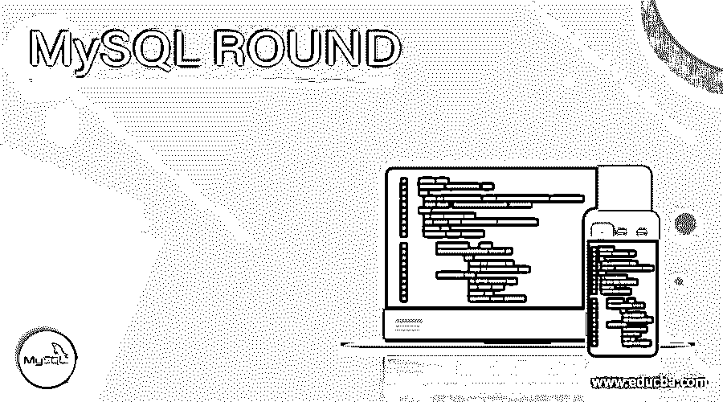

## MySQL ROUND 简介

MySQL 中的 round 函数用于将数据库中的数值四舍五入到一定的小数位数。每当我们对某些数值执行任何聚合函数时，例如平均值、除法或数字的乘积，则结果值可能包含在格式中指定的数字，该格式包含小数点后许多位数的值，以保持精度。很多时候，需要将这样的数值显示到小数点后的某些特定位数，甚至需要将数值四舍五入到整数。在这种情况下，我们可以使用 MySQL 的 round 函数来检索所需格式的数值，直到所需的小数点，并适当地舍入该值。

在本文中，我们将学习 round 函数的语法，以及一些帮助我们了解如何使用 round 函数的例子。

<small>Hadoop、数据科学、统计学&其他</small>

**语法:**

`ROUND(number,[decimal]);`

在上面的 ROUND 语法中，function number 代表可以是任何表达式的数值，是您希望舍入的常数值的列值。Decimal 是表示要舍入到的小数位数的数字。小数是整数值，可以是正数，也可以是负数。当指定为负值时，小数点前的位数将为零，该数字将在左侧流中四舍五入。让我们借助一个例子来理解正负十进制参数值的工作原理。

让我们构建一个查询语句，它将在 decimal 参数中指定正整数值

`SELECT ROUND(454.1234,2);`

执行上述查询会得到以下输出–

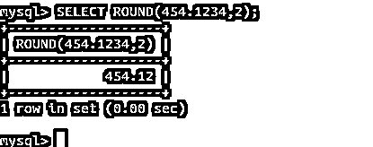

现在，让我们使用下面的查询来研究负整数值作为十进制参数的输出

`SELECT ROUND(454.1234,-2);`

执行上述查询会得到以下输出–

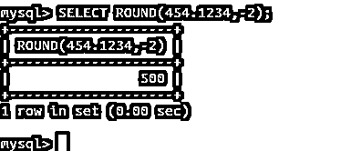

我们可以从输出中看到，该值在小数点左边四舍五入。因为我们必须四舍五入到的小数位数是-2，所以左起的两位数为零，而第三位取决于第二位的值。如果第二个 git 的值大于或等于 5，则第三位的值增加 1，否则保持不变。

让我们通过使用以下查询语句来考虑 round 函数的 decimal 参数中负整数值的另一个示例

`SELECT ROUND(444.1234,-2);`

执行上述查询会得到以下输出–

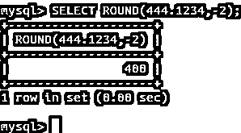

我们可以从输出中观察到，左起第三个数字的值即使在负向舍入到 2 位后仍保持不变，因为第二位包含小于 5 的值 4。

未指定时，十进制参数的值被视为零。让我们举一个例子

`SELECT ROUND(646.136,0);`

执行上述查询会得到以下输出–

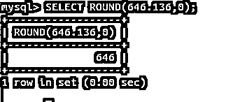

`SELECT ROUND(646.136);`

执行上述查询会得到以下输出–

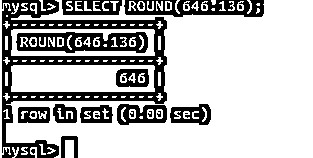

### 精确值数字舍入

精确数值舍入使用舍入到最近的规则，即当小数部分由要舍入到的数字之后的数字 5 或更大的数字组成时，如果该数字是正数，则将该值向上舍入到下一个整数值，如果是负数，则将该值向下舍入。类似地，如果舍入后的小数部分小于 5，则正数向下舍入，负数向上舍入。

考虑一个例子来阐明这个概念。

如果舍入值后的数字大于或等于 5-

正数向上取整–

`SELECT ROUND(26.5);`

执行上述查询会得到以下输出–

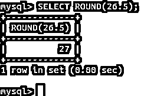

负数向下舍入–

`SELECT ROUND(-26.5);`

执行上述查询会得到以下输出–

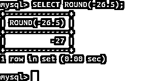

如果四舍五入后的数字小于 5-

正数向下舍入–

`SELECT ROUND(26.4);`

执行上述查询会得到以下输出–

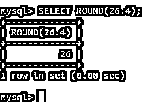

负数向上取整–

`SELECT ROUND(-26.4);`

执行上述查询会得到以下输出–

### 近似值数字舍入

近似值数字的舍入遵循舍入到最接近的偶数规则，它也依赖于 C 库。在舍入到最接近的偶数规则中，数字被精确地分成两半，然后根据最接近的偶数整数值，该数字被舍入。

**列值和表达式的舍入函数示例—**

让我们创建一个名为 educba_writers 的表，它将包含 create table 查询中提到的下列各列

`CREATE TABLE `educba_writers` (
`id` int(11) NOT NULL,
`firstName` varchar(10) COLLATE latin1_danish_ci NOT NULL,
`rate` decimal(5,4) DEFAULT NULL,
`joining_date` date DEFAULT NULL,
`article_count` INTEGER DEFAULT 0,
`gst_percent` DECIMAL(5,2) DEFAULT 0
) ENGINE=InnoDB DEFAULT CHARSET=latin1 COLLATE=latin1_danish_ci;`

这将产生以下输出–

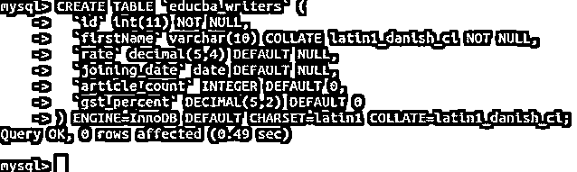

让我们在其中插入一些记录

`INSERT INTO `educba_writers` (`id`, `firstName`, `rate`, `joining_date`, `article_count`, `gst_percent`) VALUES
(1, 'Payal', '5.598', '2020-05-01',51,1.35),
(2, 'Vyankatesh', '7.6858', '2020-01-01',65,1.75),
(3, 'Omprakash', '6.6898', '2020-02-01',72,1.55),
(4, 'sakshi', '2.6559', '2020-06-01',49,1.95),
(5, 'prerna', '5.6858', '2020-02-01',72,1.55),
(6, 'preeti', '5.6258', '2020-06-01',49,1.95),
(7, 'sanjana', '4.5498', '2020-02-01',72,1.55),
(8, 'omkar', '4.6528', '2020-06-01',49,1.95),
(9, 'sohail', '6.6518', '2020-02-01',72,1.55),
(10, 'soniya', '8.5298', '2020-06-01',49,1.95),
(11, 'supriya', '7.1659', '2020-02-01',72,1.55),
(12, 'saniya', '7.5198', '2020-06-01',49,1.95),
(13, 'omkar', '4.6358', '2020-02-01',72,1.55),
(14, 'akshay', '9.6458', '2020-06-01',49,1.95),
(15, 'akash', '7.6948', '2020-02-01',72,1.55),
(16, 'siddharth', '8.4659', '2020-06-01',49,1.95);`

这在执行后给出了以下输出–

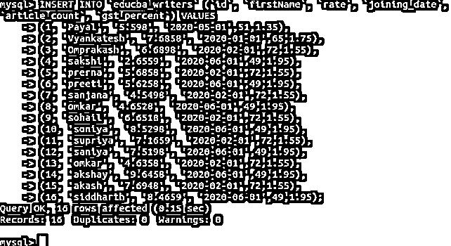

现在，我们必须计算每个作家的支付中要扣除的 GST 金额。为此，我们必须计算税率和商品数量的乘积，即商品的支付金额，此外，要扣除的商品及服务税可以通过税率、商品数量和商品及服务税百分比的乘积来计算。因此，我们的查询如下

`SELECT firstName,(rate * article_count * gst_percent) as gst_deducted FROM educba_writers;`

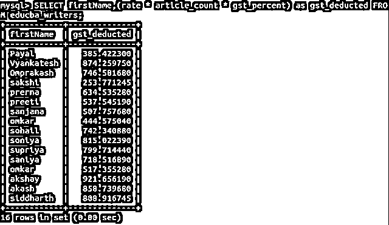

现在，我们必须将商品及服务税金额四舍五入到两位。因此，查询将是

`SELECT firstName,ROUND((rate * article_count * gst_percent),2) as gst_deducted FROM educba_writers;`

这将产生以下输出–

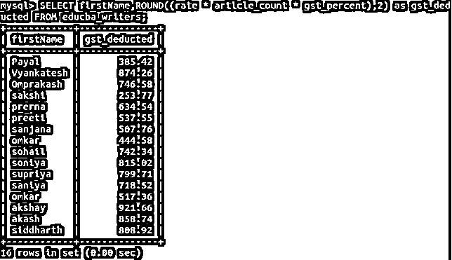

### 结论

ROUND()函数是一个数学函数，可以在 MySQL 中用来舍入表达式的数值或列值。

### 推荐文章

这是一个 MySQL ROUND 的指南。这里我们讨论介绍、语法和代码实现的例子。您也可以浏览我们的其他相关文章，了解更多信息——

1.  [MySQL 拥有](https://www.educba.com/mysql-having/)
2.  [MySQL 数据类型](https://www.educba.com/mysql-data-type/)
3.  [MySQL 导出数据库](https://www.educba.com/mysql-export-database/)
4.  [MySQL today()](https://www.educba.com/mysql-today/)

