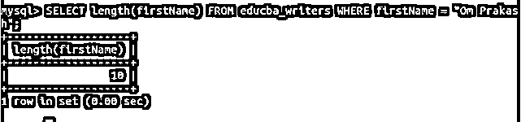
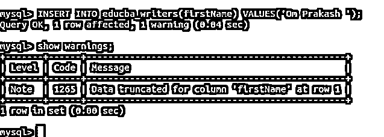

# MySQL VARCHAR

> 原文：<https://www.educba.com/mysql-varchar/>

## MySQL VARCHAR 简介

MySQL 中使用 Varchar 数据类型来存储可以包含任何字母、整数或特殊符号的字符或字符串。在使用 varchar 数据类型时，您应该了解一些情况，以便您可以正确、适当和最佳地使用该变量并定义它们，这将由 MySQL 数据库的限制和约束以及您将列声明为 varchar 的目的和您希望在该字段中存储的内容来证明。在本文中，我们将了解 varchar 数据类型以及如何存储、操作和使用该值。

### MySQL VARCHAR 数据类型的存储

varchar 数据类型列的最大长度可以是 65535。这个数据类型帮助我们在数据库中存储字符串值。除了我们为 varchar 数据类型存储定义的长度之外，MySQL 还额外占用 1 或 2 个字节的空间来存储与该列相关的前缀值。前缀值需要的空间取决于我们为 varchar 列声明的长度。如果列的长度被声明为小于 255 个字节，那么将需要 1 个字节的数据来存储前缀值。类似地，如果声明的 varchar 列需要超过 255 个字节的数据，则需要 2 个字节的空间来存储前缀值。

<small>Hadoop、数据科学、统计学&其他</small>

在表中使用 varchar 列时，我们还需要遵循一条规则。该规则指定表中的最大行大小应限制为 65535。这就是为什么我们需要指定列的大小，考虑到所有列的大小之和不应超过 65535。

### 例子

让我们首先交叉检查前面指定的行大小规则。我们将尝试创建一个名为 educba_varchar 的表，其中包含三列，每列的长度为 21843。这意味着每列将需要 2 个额外的字节来存储前缀值。因此，构成行大小的列的总长度将是 21843 + 2 + 21843 + 2 + 21843 + 2 = 65535。这是最大行大小限制。让我们检查将用于创建该表的查询语句的输出，该表是

`CREATE TABLE IF NOT EXISTS educba_varchar (
column1 VARCHAR(21843) NOT NULL,
column2 VARCHAR(21843) NOT NULL,
column3 VARCHAR(21843) NOT NULL
) CHARACTER SET 'latin1' COLLATE LATIN1_DANISH_CI;`

该查询的执行给出了以下输出–

因此，我们可以看到我们的表已经成功创建。现在，我们将尝试将其中一列的长度仅增加一个字节。这将导致表的总行大小为 21844 + 2 + 21843 + 2 + 21843 + 2 = 65536，超过了 MySQL 的限制。让我们通过执行以下查询语句来观察结果

`CREATE TABLE IF NOT EXISTS educba_varchar2 (
column1 VARCHAR(21844) NOT NULL,
column2 VARCHAR(21843) NOT NULL,
column3 VARCHAR(21843) NOT NULL
) CHARACTER SET 'latin1' COLLATE LATIN1_DANISH_CI;`

这将产生以下输出–

我们可以观察到，当行大小的限制超过 65535 时，我们会得到错误消息，说行大小太大。所用表类型的最大行大小(不包括 BLOBs)是 65535。这包括存储开销，请查看手册。您必须将一些列更改为文本或 BLOBs。

*   #### Insert the value

    in the varchar column.

让我们使用下面的语句创建一个名为 educba_writers 的表

`CREATE TABLE IF NOT EXISTS educba_writers (
id INTEGER NOT NULL PRIMARY KEY AUTO_INCREMENT,
firstName VARCHAR(10) NOT NULL
) CHARACTER SET 'latin1' COLLATE LATIN1_DANISH_CI;`

现在，我们将在表中插入如下值:

`INSERT INTO educba_writers(firstName)
VALUES('Payal');`

这将产生以下输出–

让我们尝试使用下面的查询语句插入记录，该查询语句将包含 10 个字符的名字

`INSERT INTO educba_writers(firstName)
VALUES('Vyankatesh');`

这将产生以下输出–

现在，我们将尝试使用以下查询插入长度大于 10 的名称

`INSERT INTO educba_writers(firstName)
VALUES('Siddhivinayak');`

当单词 siddhivinayak 包含 13 个字符时，它会发出错误。即使对于包含 11 个字符的单词，它也会给出以下输出，并给出错误消息，指出数据对于名字列来说太长，因为列的大小或长度被指定为 10–

`INSERT INTO educba_writers(firstName)
VALUES('Yudhishteer');`

*   #### Space

    in VARCHAR column

每当我们用 varchar 列存储表中的值时，空格也被考虑并存储在列 value 中。

例如，每当我们使用下面的查询语句在上表中存储值 Om prakash 时

`INSERT INTO educba_writers(firstName)
VALUES('Om Prakash');`

它被成功插入，当我们使用下面的 select 查询检索列的长度时

`SELECT length(firstName) FROM educba_writers WHERE firstName = “Om Prakash”;`

执行上述查询会得到以下输出–

这意味着 9 个字符和 1 个空格合起来的长度被认为是 10。

无论何时提到尾随空格，它们都包含并存储在 varchar 数据类型列中。但是，如果列的大小受到限制，则尾部空格将被忽略，剩余的值将存储在列中，并且当该列的数据由于尾部空格而被截断时，将发出警告。例如，当我们尝试在 Om prakash 名称中插入带有尾随空格的值时，如查询语句中所示-

`SELECT length(firstName) FROM educba_writers WHERE firstName = "Om Prakash ";`

它给出了以下输出–

### 结论

我们可以利用 varchar 数据类型来存储字符串。在设计数据库和给列指定大小时，我们需要记住一些事情。行大小不应超过 65535 字节。此外，在添加 varchar 数据或字符串值时会考虑空格。

### 推荐文章

这是一个 MySQL VARCHAR 的指南。这里我们分别讨论 MySQL VARCHAR 数据类型的介绍、存储以及代码实现的例子。您也可以看看以下文章，了解更多信息–

1.  [MySQL DATE_ADD()](https://www.educba.com/mysql-date_add/)
2.  [MySQL 拥有](https://www.educba.com/mysql-having/)
3.  [MySQL BLOB](https://www.educba.com/mysql-blob/)
4.  [MySQL today()](https://www.educba.com/mysql-today/)

