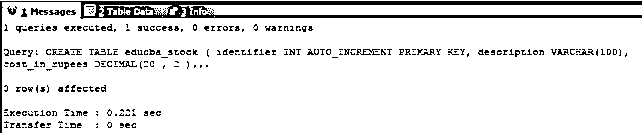
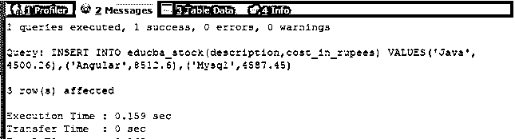
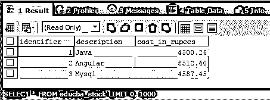
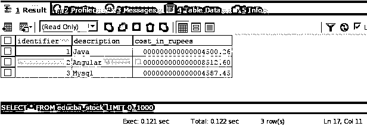

# MySQL Decimal

> 原文：<https://www.educba.com/mysql-decimal/>

## MySQL 十进制简介

为了存储数值，我们可以在 MySQL 中使用 integer 数据类型。但是，当我们必须保持数值的精度时，我们必须使用 decimal 数据类型，它允许我们指定十进制数的精度和小数位数，该十进制数的值中将包含一个小数点。这种数据类型最常用于存储需要保持精度和准确度的数量和重量值。

在本文中，我们将了解 decimal 数据类型、它的声明、它所支持的属性、decimal 数据类型的替代同义词、存储 decimal 数量所需的存储空间，以及如何在数据库中高效地使用 decimal 数据类型。

<small>Hadoop、数据科学、统计学&其他</small>

**语法:**

MySQL 表列中 decimal 数据类型的声明语法如下

`nameOfColumn DECIMAL(Precision,Scale);`

其中 nameOf Column 是要以 decimal 数据类型存储数据的列名。

*   decimal 是声明不区分大小写的 DECIMAL 数据类型的关键字。
*   Precision 是要存储的十进制数的总位数。该值可以在 1 到 65 之间。
*   小数位数是指定小数位数的参数，即小数点后可以存储的位数。该值应介于 0 到 30 之间，并且应始终小于精度值，即小数位数

DECIMAL 数据类型的同义词有 NUMERIC、FIXED 和 DEC，它们可以替代 DECIMAL 关键字使用。

**属性:**

与具有无符号属性和零填充属性的整数数据类型一样。类似地，DECIMAL 数据类型也有可以分配给小数值的无符号和零填充属性。UNSIGNED 属性在分配给 DECIMAL data，typed 列时，有助于我们限制负十进制数的存储，并确保在该列中只存储正十进制值。

分配给 decimal 数据类型列的 ZEROFILL 属性将始终显示十进制值，方法是将零填充到为该列声明的十进制数的宽度。

**行为:**

考虑一个例子，其中列的数据类型以如下方式定义

DECIMAL(5，3)将允许我们存储范围从 99.999 到 99.999 的值，因为小数位数是 3，小数点后的小数位数最多可达 3 位，精度是 5，因此，5-3=2 将允许在该列的十进制值中存储两位数。因为没有指定任何属性，所以作为有符号值的负值也可以存储在该字段中。

再考虑一个例子，其中我们没有指定小数位数，DECIMAL(3)。在这种情况下，小数位数的默认值被认为是 0，包含小数点的数值不能存储在此列中。只能存储范围在-999 到 999 之间的整数。

让我们再举一个例子，在这个例子中，我们既没有指定参数值，也没有指定精度或小数位数，而是将列的数据类型声明为 DECIMAL。在这种情况下，精度的默认值将被视为 10，对于比例参数，将被视为零值。因此，要存储在该列中的值的允许范围将从-9999999999 到 999999999。

因此，可以得出结论，精度和比例参数值对于规范是完全可选的，比例的默认值为 0，而精度参数的默认值为 10。

### MySQL 中的十进制数据类型存储

在 MYSQL 中，十进制值(小数点前后的值)的小数部分和整数部分的值被分别分配给存储空间。由于二进制格式用于在 MYSQL 中存储十进制数据类型的值，因此需要 4 个字节的内存来存储 9 位数字。对于小数点前后 9 位数字的每个包，需要 4 字节的存储空间。对于用于存储的剩余数位，它们需要以下方式的存储空间——

1 或 2 个剩余数字占用 1 字节存储空间，3 或 4 个剩余数字占用 2 字节存储空间，5 或 6 个剩余数字占用 3 字节存储空间，7 或 9 个剩余数字占用 4 字节存储空间。

考虑一个例子，DECIMAL(20，8)数据类型将需要 4 字节的存储空间，用于小数点后的 8 位数字和剩余的 20-8=12，即 12 位数字将被一分为二。在 12 个数字中，9 个数字需要 4 个字节，剩余的 12-9 个数字，即 3 个数字需要 2 个字节。因此，总共需要 4+4+2 =10 字节的存储空间来存储这种类型的十进制值。

### 例子

让我们创建一个包含十进制数据类型列的表。这里，我将使用下面的创建查询创建一个名为 educba_stock 的表，其中包含十进制数据类型的列 cost _ in _ 卢比，精度为 20，小数位数为 2

`CREATE TABLE educba_stock (
identifier INT AUTO_INCREMENT PRIMARY KEY,
description VARCHAR(100),
cost_in_rupees DECIMAL(20 , 2 ) NOT NULL
);`

这会产生以下输出–

让我们通过执行以下命令在其中插入一些记录

`INSERT INTO educba_stock(description,cost_in_rupees)
VALUES('Java', 4500.26),('Angular',8512.6),('Mysql',4587.45);`

这在 sqlyog 编辑器中给出了以下输出–

现在让我们使用下面的选择查询来检索存储在 educba_stock 表中的数据

`SELECT * FROM educba_stock;`

这会产生以下输出–

让我们更改列 cost _ in _ 卢比，并使用以下更改查询将属性 ZEROFILL 设置为该列

`ALTER TABLE educba_stock
MODIFY cost_in_rupees DECIMAL(20,2) ZEROFILL;`

这将产生以下输出

请注意，每当 ZEROFILL 属性被赋予 DECIMAL 数据类型时，MYSQL 会自动在内部为其添加无符号属性。

让我们从表中检索值，并检查在使用以下选择查询将 ZEROFILL 属性分配给 cost _ in _ 卢比列的 decimal 数据类型后，这些值是如何显示的

`SELECT * FROM educba_stock;`

这会产生以下输出–

可以看到，对于该列的最大显示宽度，零被附加和前置。

### 结论

decimal 数据类型用于存储需要保持精度和准确度的数值，以及需要存储小数点后的值。ZEROFILL 和 UNSIGNED 属性可用于为剩余数字填充零，并限制有符号负值存储在 decimal 数据类型的列中。

### 推荐文章

这是一个 MySQL 十进制的指南。这里我们讨论 MySQL 中的定义、语法、属性、十进制数据类型存储，以及代码实现的例子。您也可以看看以下文章，了解更多信息–

1.  [MySQL 回合](https://www.educba.com/mysql-round/)
2.  [MySQL BigInt](https://www.educba.com/mysql-bigint/)
3.  [MySQL 更新集](https://www.educba.com/mysql-update-set/)
4.  [MySQL Merge](https://www.educba.com/mysql-merge/)

