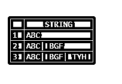
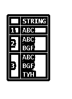
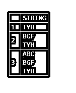
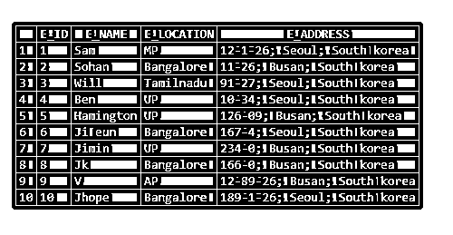
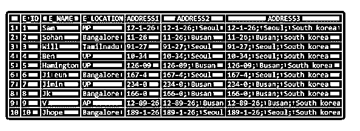
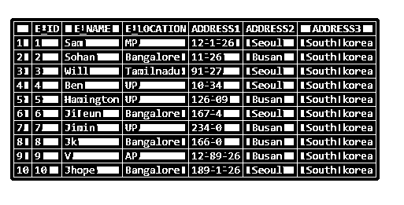

# MySQL 拆分

> 原文：<https://www.educba.com/mysql-split/>

## MySQL Split 简介

MySQL 的拆分概念是拆分字符串相关的数据。例如，我们有时可能愿意分隔由分隔符组成的列值。对于这种情况，我们使用分割概念。如果你打算拆分字符串，MySQL 的拆分概念就出现了。在 MySQL 中，我们使用 SUBSTRING_INDEX()来拆分字符串。它通常由三个参数组成，即字符串、分隔符和位置。字符串值将根据位置进行拆分。它从出现次数返回字符串的子字符串

在本节课中，我们将通过提及拆分位置和示例来了解如何拆分字符串。

<small>Hadoop、数据科学、统计学&其他</small>

**语法:**

以下是 SUBSTRING_INDEX()的语法:–

`SUBSTRING_INDEX( <STRING>, <DELIMITER>, <OCCURRENCE_COUNT> );`

这里我们指定了字符串、分隔符和计数。根据出现的计数，将返回子字符串。如果计数为负值，则返回从右边到最后一个分隔符的值。如果计数值为正，则返回从左边到最后一个分隔符的值。

### MySQL Split 是如何工作的？

现在让我们看看如何使用 SUBSTRING_INDEX()来拆分列。

`select substring_index ("ABC| BGF| TYH ",'|',1) AS STRING
UNION
select substring_index ("ABC| BGF| TYH ",'|',2) AS STRING
UNION
select substring_index ("ABC| BGF| TYH ",'|',3) AS STRING ;`

**输出:**

在上面的例子中，分隔符是“|”。

`select substring_index ("ABC
BGF
TYH ",'\n',1) AS STRING
UNION
select substring_index ("ABC
BGF
TYH ",'\n',2) AS STRING
UNION
select substring_index ("ABC
BGF
TYH ",'\n',3) AS STRING ;`

**输出:**

**负值:**

`select substring_index ("ABC| BGF| TYH ",'|', -1) AS STRING
UNION
select substring_index ("ABC| BGF| TYH ",'|', -2) AS STRING
UNION
select substring_index ("ABC| BGF| TYH ",'|', -3) AS STRING ;`

**输出:**

**T2】**

 **`select substring_index ("ABC
BGF
TYH ",'\n', -1) AS STRING
UNION
select substring_index ("ABC
BGF
TYH ",'\n', -2) AS STRING
UNION
select substring_index ("ABC
BGF
TYH ",'\n', -3) AS STRING ;`

**输出:**

### 例子

现在让我们创建表，并通过应用 SUBSTRING_INDEX()来拆分字符串。让我们创建下表:

`create table Employee_Address
(
E_ID int,
E_NAME varchar(20),
E_LOCATION varchar(20),
E_ADDRESS varchar(100)
);
Insert the below data into the table: -
insert into EMPLOYEE_ADDRESS values (1, 'Sam', 'MP', '12-1-26; Seoul; South korea');
insert into EMPLOYEE_ADDRESS values (2, 'Sohan', 'Bangalore', '11-26; Busan; South korea' );
insert into EMPLOYEE_ADDRESS values (3, 'Will', 'Tamilnadu', '91-27; Seoul; South korea' );
insert into EMPLOYEE_ADDRESS values (4, 'Ben', 'UP', '10-34; Seoul; South korea');
insert into EMPLOYEE_ADDRESS values (5, 'Hamington', 'UP', '126-09; Busan; South korea');
insert into EMPLOYEE_ADDRESS values (6, 'Ji eun', 'Bangalore', '167-4; Seoul; South korea');
insert into EMPLOYEE_ADDRESS values (7, 'Jimin', 'UP', '234-0; Busan; South korea');
insert into EMPLOYEE_ADDRESS values (8, 'Jk', 'Bangalore', '166-0; Busan; South korea');
insert into EMPLOYEE_ADDRESS values (9, 'V', 'AP', '12-89-26; Busan; South korea');
insert into EMPLOYEE_ADDRESS values (10, 'Jhope', 'Bangalore', '189-1-26; Seoul; South korea');`

上表的输出如下:–

`select * from EMPLOYEE_ADDRESS;`

**输出:**

现在让我们使用 SUBSTRING_INDEX()拆分“E_ADDRESS”的列值；

`SELECT E_ID,
E_NAME,
E_LOCATION,
SUBSTRING_INDEX(E_ADDRESS,';',1) AS ADDRESS1, /* -- substring declare-*/
SUBSTRING_INDEX(E_ADDRESS,';',2) AS ADDRESS2, /* -- substring declare-*/
SUBSTRING_INDEX(E_ADDRESS,';',3) AS ADDRESS3/* -- substring declare-*/
FROM EMPLOYEE_ADDRESS;`

**输出:**

现在我们可以分裂成一个个体来代替上面的输出；

`SELECT E_ID,
E_NAME,
E_LOCATION,
SUBSTRING_INDEX((SUBSTRING_INDEX(E_ADDRESS,';',1)),';',-1) AS ADDRESS1,
/* -- nested substring declare-*/
SUBSTRING_INDEX((SUBSTRING_INDEX(E_ADDRESS,';',2)),';',-1) AS ADDRESS2,
/* -- nested substring declare-*/
SUBSTRING_INDEX((SUBSTRING_INDEX(E_ADDRESS,';',3)),';',-1) AS ADDRESS3
/* -- nested substring declare-*/
FROM EMPLOYEE_ADDRESS;`

**输出:**

### 结论

*   MySQL 的拆分概念是拆分字符串相关的数据。例如，我们有时可能愿意分隔由分隔符组成的列值。
*   对于这种情况，我们使用分割概念。如果你打算拆分字符串，MySQL 的拆分概念就出现了。在 MySQL 中，我们使用 SUBSTRING_INDEX()来拆分字符串。
*   它通常由三个参数组成，即字符串、分隔符和位置。字符串值将根据位置进行拆分。

### 推荐文章

这是一个 MySQL 拆分的指南。这里我们讨论一下入门，MySQL Split 是如何工作的？和示例。您也可以看看以下文章，了解更多信息–

1.  [MySQL 存在](https://www.educba.com/mysql-exists/)
2.  [MySQL 锁表](https://www.educba.com/mysql-lock-table/)
3.  [MySQL 主键](https://www.educba.com/mysql-primary-key/)
4.  [MySQL 显示用户](https://www.educba.com/mysql-show-users/)

**